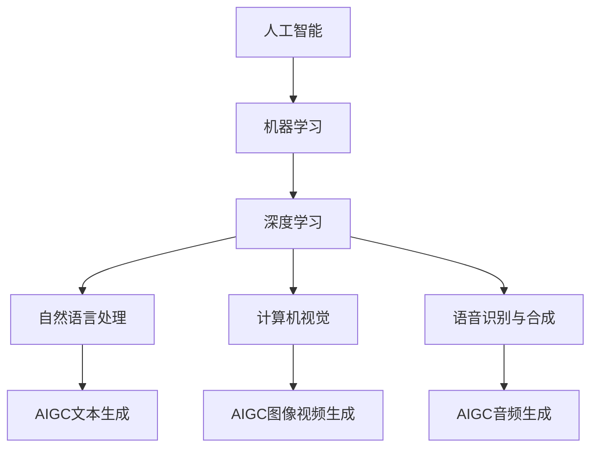

# AIGC从入门到实战：人工智能应用发展较快的领域

## 1.背景介绍
人工智能生成内容(AIGC)是人工智能(AI)技术在内容创作领域的应用,通过算法和模型自动生成文本、图像、音频、视频等多种形式的内容。AIGC技术的快速发展,正在重塑内容创作的方式,为各行各业带来革命性的变化。

近年来,AIGC在多个领域取得了显著进展,成为人工智能应用发展最快的方向之一。本文将重点探讨AIGC在文本生成、图像生成、音频合成、视频生成等方面的最新进展,剖析其核心技术原理,展望未来发展趋势,为读者提供全面深入的认识和实践指导。

### 1.1 AIGC的兴起与发展
#### 1.1.1 人工智能的发展历程
#### 1.1.2 AIGC的起源与演进
#### 1.1.3 AIGC的应用现状

### 1.2 AIGC的社会价值与影响
#### 1.2.1 提升内容创作效率
#### 1.2.2 催生新的商业模式
#### 1.2.3 改变传统内容消费习惯

## 2.核心概念与联系
要理解AIGC技术,首先需要掌握一些核心概念:

### 2.1 机器学习与深度学习
机器学习是人工智能的核心,它让计算机具备从数据中自主学习的能力。深度学习是机器学习的一个分支,通过模拟人脑的神经网络结构,构建多层次的学习模型。深度学习是AIGC的理论基础。

### 2.2 自然语言处理
自然语言处理(NLP)是人工智能的一个重要方向,旨在让计算机理解、生成和处理人类语言。NLP技术如语言模型、文本分类、机器翻译等,是实现文本生成的关键。

### 2.3 计算机视觉
计算机视觉让机器能够"看懂"图像和视频,进行物体识别、图像分割等任务。生成对抗网络(GAN)、扩散模型等计算机视觉技术,是图像生成和视频生成的核心。

### 2.4 语音识别与合成
语音识别可以将语音转换为文本,语音合成则是将文本转化为语音。语音识别和语音合成技术,是实现AIGC音频内容生成的基础。

下图展示了AIGC的核心概念及其相互联系:



## 3.核心算法原理具体操作步骤
AIGC的实现离不开前沿的人工智能算法。以下详细介绍几种关键算法的原理和操作步骤。

### 3.1 Transformer与GPT
Transformer是一种基于注意力机制的神经网络结构,擅长处理序列数据。GPT(Generative Pre-trained Transformer)是基于Transformer的语言模型,通过自监督预训练掌握了强大的语言理解和生成能力。

GPT的训练和推理步骤如下:
1. 准备大规模无标注文本数据集
2. 构建Transformer网络结构
3. 使用自回归任务进行预训练,让模型学习文本的统计规律
4. 在下游任务上进行微调,如对话生成、文章写作等
5. 使用训练好的模型进行推理,生成相应的文本内容

### 3.2 DALL·E与扩散模型
DALL·E是一个基于扩散模型的图像生成系统,能根据文本提示生成逼真的图像。扩散模型通过迭代去噪的过程,逐步将随机噪声转化为目标图像。

DALL·E的训练和生成步骤如下:
1. 准备大规模文本-图像对数据集
2. 构建扩散模型网络结构
3. 训练文本编码器和图像解码器,建立文本到图像的映射关系
4. 给定文本提示,使用文本编码器将其转化为隐空间表示
5. 从随机噪声开始,使用图像解码器迭代去噪,生成目标图像

### 3.3 WaveNet与音频合成
WaveNet是一种基于卷积神经网络的音频生成模型,能够合成高质量的语音和音乐。WaveNet通过自回归建模音频信号的概率分布,实现逼真的音频合成。

WaveNet的训练和合成步骤如下:
1. 准备大规模音频数据集
2. 构建WaveNet网络结构,使用因果卷积和扩张卷积
3. 训练模型学习音频信号的概率分布
4. 给定条件信息如文本或音符,使用训练好的模型进行采样合成
5. 对合成的音频进行后处理,提升音质

## 4.数学模型和公式详细讲解举例说明
AIGC中的许多算法都有着深厚的数学基础,下面以Transformer和扩散模型为例,对其中的数学原理进行讲解。

### 4.1 Transformer的注意力机制
Transformer的核心是注意力机制(Attention),可以学习序列中元素之间的依赖关系。注意力分数的计算公式为:

$$
Attention(Q,K,V) = softmax(\frac{QK^T}{\sqrt{d_k}})V
$$

其中,$Q$是查询向量,$K$是键向量,$V$是值向量,$d_k$是向量维度。这个公式可以理解为:每个查询向量$Q$与所有键向量$K$计算相似度,经过softmax归一化后得到注意力分布,然后加权求和值向量$V$。

举例说明:假设有一个句子"I love AIGC"。经过词嵌入后,每个词都被转化为一个向量。对于词"AIGC",注意力机制可以学习到它与"I"和"love"的依赖关系,得到一个注意力分布[0.1,0.7,0.2],表示"AIGC"分别与三个词的相关程度。最终的表示向量就是三个词向量的加权和。

### 4.2 扩散模型的去噪过程
扩散模型通过迭代去噪将高斯噪声转化为目标数据。去噪过程可以用下面的公式表示:

$$
x_t = \sqrt{\alpha_t} x_{t-1} + \sqrt{1-\alpha_t} \epsilon_t
$$

其中,$x_t$是$t$时刻的中间状态,$x_{t-1}$是上一时刻的状态,$\epsilon_t$是高斯噪声,$\alpha_t$是一个标量系数。这个公式描述了从$x_{t-1}$到$x_t$的去噪过程,每一步都在原有基础上去除一些噪声,同时加入一些新的噪声。

举例说明:假设要生成一张猫的图像。我们从一张纯高斯噪声图像$x_T$开始,不断迭代去噪。随着$t$的减小,$x_t$逐渐从噪声过渡到目标图像。在去噪的每一步,模型都会预测噪声$\epsilon_t$,用真实图像减去噪声就得到了去噪后的图像。

## 5.项目实践：代码实例和详细解释说明
下面以PyTorch为例,给出AIGC中几个经典模型的代码实现。

### 5.1 GPT文本生成
```python
import torch
import torch.nn as nn

class GPT(nn.Module):
    def __init__(self, vocab_size, d_model, nhead, num_layers):
        super().__init__()
        self.embedding = nn.Embedding(vocab_size, d_model)
        self.transformer = nn.Transformer(d_model, nhead, num_layers)
        self.fc = nn.Linear(d_model, vocab_size)

    def forward(self, x):
        x = self.embedding(x)
        x = self.transformer(x)
        x = self.fc(x)
        return x

# 实例化模型
model = GPT(vocab_size=10000, d_model=512, nhead=8, num_layers=6)

# 训练
criterion = nn.CrossEntropyLoss()
optimizer = torch.optim.Adam(model.parameters(), lr=1e-4)
for epoch in range(10):
    for x, y in data_loader:
        pred = model(x)
        loss = criterion(pred, y)
        optimizer.zero_grad()
        loss.backward()
        optimizer.step()

# 推理生成
input_text = "AIGC is"
input_ids = tokenizer.encode(input_text)
output = model.generate(input_ids, max_length=100)
print(tokenizer.decode(output))
```

这个代码实现了一个基于Transformer的GPT模型。模型主要由三部分组成:词嵌入层、Transformer层和输出层。前向传播时,输入文本先经过词嵌入,然后通过Transformer层捕捉序列依赖,最后输出下一个词的概率分布。训练时使用交叉熵损失函数和Adam优化器。推理时,给定输入文本,模型可以自回归地生成后续文本。

### 5.2 DALL·E图像生成
```python
import torch
import torch.nn as nn

class DALLE(nn.Module):
    def __init__(self, text_vocab_size, image_vocab_size, d_model):
        super().__init__()
        self.text_embedding = nn.Embedding(text_vocab_size, d_model)
        self.image_embedding = nn.Embedding(image_vocab_size, d_model)
        self.text_encoder = nn.Transformer(d_model)
        self.diffusion = DiffusionModel(d_model)
        self.image_decoder = nn.Sequential(
            nn.ConvTranspose2d(d_model, 128, 4, 2, 1),
            nn.ReLU(),
            nn.ConvTranspose2d(128, 64, 4, 2, 1),
            nn.ReLU(),
            nn.ConvTranspose2d(64, 3, 4, 2, 1),
            nn.Tanh()
        )

    def forward(self, text, noise):
        text_emb = self.text_embedding(text)
        text_feat = self.text_encoder(text_emb)

        image_feat = self.diffusion(noise, text_feat)
        image = self.image_decoder(image_feat)
        return image

# 实例化模型
model = DALLE(text_vocab_size=10000, image_vocab_size=1024, d_model=512)

# 训练
criterion = nn.MSELoss()
optimizer = torch.optim.Adam(model.parameters(), lr=1e-4)
for epoch in range(10):
    for text, image in data_loader:
        noise = torch.randn(image.shape)
        pred = model(text, noise)
        loss = criterion(pred, image)
        optimizer.zero_grad()
        loss.backward()
        optimizer.step()

# 推理生成
text = "a cat sitting on a bench"
text_ids = tokenizer.encode(text)
noise = torch.randn(1, 3, 256, 256)
with torch.no_grad():
    image = model(text_ids, noise)
```

这个代码实现了一个简化版的DALL·E模型。模型包含文本编码器、扩散模型和图像解码器三个部分。给定文本描述和随机噪声,文本编码器提取文本特征,扩散模型迭代去噪生成图像特征,图像解码器将特征转化为最终的图像。训练时使用均方误差损失函数。推理时,给定文本描述和随机噪声,模型可以生成对应的图像。

## 6.实际应用场景
AIGC技术在各行各业都有广泛的应用前景,下面列举一些具体的应用场景。

### 6.1 智能写作助手
使用GPT等大语言模型,可以开发智能写作助手,辅助人类进行文案、文章、小说等的创作。用户只需给定题目、关键词、提纲等,AI就能自动生成相应的文字内容,大大提高写作效率。

### 6.2 虚拟主播与数字人
利用语音合成、图像生成、视频生成等AIGC技术,可以创建出逼真的虚拟主播和数字人。他们能够自动生成新闻播报、产品介绍、客服对话等各种内容,为企业和平台提供全天候的智能服务。

### 6.3 游戏与元宇宙
在游戏和元宇宙场景中,AIGC可以自动生成海量的虚拟世界内容,包括地形地貌、建筑物、NPC等,极大丰富游戏世界的多样性。此外,AIGC还能根据玩家的行为和反馈,动态调整游戏内容和难度,提供个性化的游戏体验。

### 6.4 智能教育
AIGC可以用于开发智