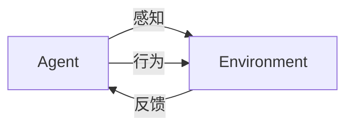

# AI人工智能 Agent：零售业中智能体的应用

## 1.背景介绍

### 1.1 零售业的重要性

零售业是现代经济的重要支柱,在促进商品流通、满足消费者需求、推动经济增长等方面发挥着关键作用。随着电子商务的兴起,零售业也面临着前所未有的挑战和机遇。传统零售模式难以适应日益多样化的消费者需求,而新兴技术如人工智能(AI)、大数据分析等为零售业带来了全新的发展契机。

### 1.2 人工智能在零售业中的应用

人工智能技术在零售业中的应用可以分为以下几个主要领域:

- 智能客户服务
- 个性化推荐系统
- 需求预测与供应链优化
- 无人零售与自动化
- 欺诈检测与风险管理

其中,智能客户服务和个性化推荐系统是人工智能代理(AI Agent)在零售业中最为突出的应用场景。

## 2.核心概念与联系

### 2.1 人工智能代理(AI Agent)

人工智能代理是指能够感知环境,并根据感知做出决策从而影响环境的智能系统。在零售场景中,AI Agent可以是:

- 智能客服系统
- 推荐引擎
- 库存管理系统
- 定价决策系统
- 等等

这些系统通过获取相关数据(如用户行为数据、商品信息等),并运行机器学习算法进行决策,从而实现自动化的智能服务。

### 2.2 智能体(Agent)与环境(Environment)

AI Agent与其所处的环境是一个相互作用的过程:



Agent通过感知器获取环境信息,通过执行器对环境施加影响。环境则根据Agent的行为产生新的状态,并将反馈传递给Agent,形成一个闭环系统。

### 2.3 强化学习(Reinforcement Learning)

强化学习是训练AI Agent的一种重要范式,其核心思想是:

$$
\begin{aligned}
\text{Agent与环境进行交互} \\
\text{Agent获得奖励信号,调整策略} \\
\text{最大化预期的长期累积奖励}
\end{aligned}
$$

在零售场景中,奖励信号可以是销售额、客户满意度等,Agent通过不断尝试并根据反馈调整策略,最终获得最优的决策模型。

## 3.核心算法原理具体操作步骤

### 3.1 马尔可夫决策过程(MDP)

马尔可夫决策过程是强化学习的数学基础模型,由以下5个要素组成:

- 状态集合 $\mathcal{S}$
- 行为集合 $\mathcal{A}$
- 转移概率 $\mathcal{P}_{ss'}^a = \Pr(s' \,|\, s, a)$
- 奖励函数 $\mathcal{R}_s^a$
- 折扣因子 $\gamma \in [0, 1)$

Agent的目标是找到一个策略 $\pi: \mathcal{S} \rightarrow \mathcal{A}$,使得预期的长期累积奖励最大化:

$$
\max_\pi \mathbb{E}_\pi \left[ \sum_{t=0}^\infty \gamma^t r_t \right]
$$

### 3.2 Q-Learning算法

Q-Learning是解决MDP问题的一种经典算法,其核心思想是学习状态-行为对的价值函数 $Q(s, a)$,表示在状态 $s$ 执行行为 $a$ 后的预期长期回报。

算法步骤如下:

1. 初始化 $Q(s, a)$ 为任意值
2. 对每个episode:
    - 初始化状态 $s$
    - 对每个时间步:
        - 选择行为 $a = \underset{a'}{\arg\max} Q(s, a')$
        - 执行行为 $a$,获得奖励 $r$,转移到新状态 $s'$
        - 更新 $Q(s, a) \leftarrow Q(s, a) + \alpha \left[ r + \gamma \max_{a'} Q(s', a') - Q(s, a) \right]$
        - $s \leftarrow s'$

其中 $\alpha$ 是学习率。算法通过不断尝试和更新,最终收敛到最优的 $Q^*$ 函数。

### 3.3 Deep Q-Network (DQN)

传统的Q-Learning算法在状态空间和行为空间较大时,查表存储和计算 $Q(s, a)$ 变得不现实。Deep Q-Network通过使用神经网络来拟合 $Q(s, a)$ 函数,从而解决了这一问题。

DQN的核心思想是:

1. 使用一个卷积神经网络 $Q(s, a; \theta)$ 来拟合 $Q(s, a)$ 函数,其中 $\theta$ 为网络参数
2. 在每个时间步,选择 $a = \underset{a'}{\arg\max} Q(s, a'; \theta)$
3. 计算目标值 $y = r + \gamma \max_{a'} Q(s', a'; \theta^-)$
4. 使用均方差损失函数 $L = \mathbb{E}_{(s, a, r, s')} \left[ \left( y - Q(s, a; \theta) \right)^2 \right]$
5. 通过梯度下降算法,优化网络参数 $\theta$

其中 $\theta^-$ 是目标网络的参数,用于估计 $\max_{a'} Q(s', a')$,以提高训练稳定性。

```mermaid
graph TD
    A[Agent] -->|状态s| B(Q网络)
    B -->|Q(s,a)| C{选择行为a}
    C -->|行为a| D[环境]
    D -->|奖励r,新状态s'| E[目标Q值计算]
    E -->|y| F[损失函数]
    F -->|梯度下降| G[更新Q网络]
    G --> B
```

## 4.数学模型和公式详细讲解举例说明

在零售场景中,AI Agent常常需要处理序列数据,如用户的浏览记录、购买历史等。对于这种序列决策问题,我们可以使用马尔可夫决策过程的变体——部分可观测马尔可夫决策过程(Partially Observable Markov Decision Process, POMDP)来建模。

### 4.1 POMDP模型

POMDP由以下6个要素组成:

- 状态集合 $\mathcal{S}$
- 行为集合 $\mathcal{A}$
- 观测集合 $\mathcal{O}$
- 转移概率 $\mathcal{P}_{ss'}^a = \Pr(s' \,|\, s, a)$
- 观测概率 $\mathcal{P}_o^{s'} = \Pr(o \,|\, s')$
- 奖励函数 $\mathcal{R}_s^a$

与MDP不同的是,在POMDP中Agent无法直接获取环境的真实状态,只能通过观测 $o$ 来间接感知状态。因此,Agent需要维护一个belief状态 $b(s)$,表示对当前状态的置信度分布。

在每个时间步,Agent根据当前的belief状态 $b(s)$ 选择行为 $a$,执行后获得奖励 $r$ 和新的观测 $o'$,然后根据 $a, o'$ 更新belief状态为 $b'(s')$:

$$
b'(s') = \eta \mathcal{P}_o^{s'} \sum_{s \in \mathcal{S}} \mathcal{P}_{ss'}^a b(s)
$$

其中 $\eta$ 为归一化常数。Agent的目标是找到一个策略 $\pi: b \rightarrow a$,使得预期的长期累积奖励最大化。

### 4.2 POMDP在推荐系统中的应用

在个性化推荐场景中,我们可以将用户的兴趣视为一个潜在的马尔可夫状态,用户的行为(如浏览、购买等)作为观测,推荐列表则是Agent的行为决策。

具体来说,系统维护一个用户兴趣的belief状态 $b(u)$,根据用户的历史行为持续更新 $b(u)$。在每个时间步,系统根据 $b(u)$ 生成一个推荐列表 $a$,用户对推荐的反馈(如点击、购买)作为奖励 $r$ 和新的观测 $o'$,系统据此更新 $b'(u)$,并在下一时间步生成新的推荐列表。该过程可以建模为一个POMDP,Agent的目标是最大化用户的长期累积购买率(或其他指标)。

我们可以使用基于深度学习的算法(如Deep Recurrent Q-Network)来求解该POMDP问题,实现个性化的智能推荐系统。

## 5.项目实践:代码实例和详细解释说明

以下是一个使用Python和PyTorch实现的简单DQN代理的示例代码,用于解决一个简单的网格世界(GridWorld)游戏。

```python
import torch
import torch.nn as nn
import numpy as np

# 定义Q网络
class QNetwork(nn.Module):
    def __init__(self, state_dim, action_dim):
        super(QNetwork, self).__init__()
        self.fc1 = nn.Linear(state_dim, 64)
        self.fc2 = nn.Linear(64, action_dim)

    def forward(self, x):
        x = torch.relu(self.fc1(x))
        return self.fc2(x)

# 定义DQN Agent
class DQNAgent:
    def __init__(self, state_dim, action_dim):
        self.q_net = QNetwork(state_dim, action_dim)
        self.target_q_net = QNetwork(state_dim, action_dim)
        self.optimizer = torch.optim.Adam(self.q_net.parameters(), lr=0.001)
        self.loss_fn = nn.MSELoss()
        self.replay_buffer = []
        self.buffer_size = 10000
        self.batch_size = 64
        self.gamma = 0.99

    def get_action(self, state, epsilon):
        if np.random.rand() < epsilon:
            return np.random.randint(action_dim)
        else:
            state = torch.tensor(state, dtype=torch.float32)
            q_values = self.q_net(state)
            return torch.argmax(q_values).item()

    def update(self):
        if len(self.replay_buffer) < self.batch_size:
            return

        transitions = random.sample(self.replay_buffer, self.batch_size)
        state_batch, action_batch, reward_batch, next_state_batch = zip(*transitions)

        state_batch = torch.tensor(state_batch, dtype=torch.float32)
        action_batch = torch.tensor(action_batch, dtype=torch.int64)
        reward_batch = torch.tensor(reward_batch, dtype=torch.float32)
        next_state_batch = torch.tensor(next_state_batch, dtype=torch.float32)

        q_values = self.q_net(state_batch).gather(1, action_batch.unsqueeze(1)).squeeze()
        next_q_values = self.target_q_net(next_state_batch).max(1)[0]
        expected_q_values = reward_batch + self.gamma * next_q_values

        loss = self.loss_fn(q_values, expected_q_values)
        self.optimizer.zero_grad()
        loss.backward()
        self.optimizer.step()

        if len(self.replay_buffer) > self.buffer_size:
            self.replay_buffer.pop(0)

        # 更新目标网络
        if episode % 10 == 0:
            self.target_q_net.load_state_dict(self.q_net.state_dict())

# 训练循环
env = GridWorld()
agent = DQNAgent(state_dim, action_dim)
for episode in range(num_episodes):
    state = env.reset()
    done = False
    while not done:
        action = agent.get_action(state, epsilon)
        next_state, reward, done = env.step(action)
        agent.replay_buffer.append((state, action, reward, next_state))
        agent.update()
        state = next_state
    epsilon = max(epsilon * 0.995, 0.01)
```

上述代码定义了一个简单的Q网络和DQN Agent,并实现了经验回放和目标网络更新等技术。在训练循环中,Agent与环境进行交互,存储transition到经验回放池中,并周期性地从回放池中采样数据进行网络参数更新。

通过不断训练,DQN Agent可以学习到一个较好的Q函数近似,从而在测试时做出明智的行为决策。

该示例代码仅为入门级别,在实际应用中需要根据具体问题进行修改和优化,如使用双重Q学习、优先经验回放等技术来提高训练效率和性能。

## 6.实际应用场景

### 6.1 智能客服系统

传统的客服系统通常依赖人工服务,效率和服务质量参差不齐。通过部署基于自然语言处理(NLP)的AI客