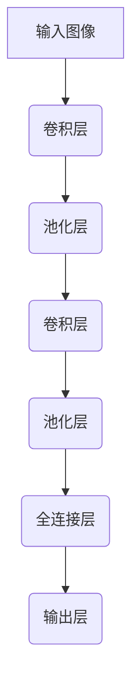

# AI人工智能深度学习算法：在缺陷检测中的应用

## 1.背景介绍

### 1.1 缺陷检测的重要性

在制造业中,产品质量是关键因素之一。缺陷检测是确保产品质量的重要环节,旨在及时发现并排除产品中的任何缺陷或异常。传统的人工目视检测方法不仅效率低下,而且容易出现疲劳导致的错误。因此,开发高效、准确的自动化缺陷检测系统已成为当务之急。

### 1.2 人工智能在缺陷检测中的作用

随着深度学习技术的不断发展,人工智能(AI)已成为解决缺陷检测问题的有力工具。深度学习算法能够从大量数据中自动学习特征表示,并对复杂的视觉模式进行建模,从而实现高精度的缺陷检测。

## 2.核心概念与联系

### 2.1 深度学习概述

深度学习是机器学习的一个新兴领域,其灵感来源于人类大脑的生物神经网络结构。它通过构建多层非线性变换网络,自动从数据中学习层次化的特征表示,从而解决复杂的任务。

### 2.2 卷积神经网络

卷积神经网络(Convolutional Neural Networks, CNN)是深度学习中最成功的模型之一,在计算机视觉领域有着广泛的应用。CNN通过交替使用卷积层和池化层,能够高效地从图像中提取局部特征和全局特征,非常适合于缺陷检测任务。



### 2.3 迁移学习

由于获取大量标注数据的成本很高,迁移学习在缺陷检测中扮演着重要角色。迁移学习利用在大型数据集(如ImageNet)上预训练的模型作为起点,然后在目标数据集上进行微调,从而加速模型收敛并提高性能。

## 3.核心算法原理具体操作步骤

### 3.1 数据预处理

- 数据收集:从实际生产线中收集足够多的缺陷和正常图像样本。
- 数据标注:由专家对图像进行缺陷标注,标记出缺陷类型和位置。
- 数据增强:通过旋转、翻转、缩放等方式对数据进行增强,提高模型的泛化能力。

### 3.2 模型选择和训练

- 模型选择:根据任务复杂度和数据量选择合适的CNN模型,如AlexNet、VGGNet、ResNet等。
- 迁移学习:利用在大型数据集上预训练的模型进行初始化,加快收敛速度。
- 模型训练:使用标注好的数据集训练模型,通过调整超参数优化模型性能。
- 模型评估:在验证集上评估模型的准确性、精确率、召回率等指标。

### 3.3 模型部署和在线检测

- 模型优化:通过模型压缩、量化等技术优化模型大小和推理速度。
- 系统集成:将训练好的模型集成到实际的检测系统中。
- 在线检测:实时获取产品图像,输入到模型中进行缺陷检测和分类。
- 结果输出:将检测结果输出到监控系统或自动控制系统。

## 4.数学模型和公式详细讲解举例说明

### 4.1 卷积运算

卷积运算是CNN的核心操作,它通过在输入数据上滑动卷积核来提取局部特征。卷积运算的数学表达式如下:

$$
S(i, j) = (I * K)(i, j) = \sum_{m}\sum_{n}I(i+m, j+n)K(m, n)
$$

其中,$I$表示输入数据,$K$表示卷积核,$m$和$n$是卷积核的维度。卷积运算能够有效地捕获输入数据的空间和结构信息。

### 4.2 池化运算

池化运算用于降低特征图的维度,减少计算量和防止过拟合。常见的池化方法有最大池化和平均池化。最大池化的数学表达式如下:

$$
y_{i,j} = \max\limits_{(m,n) \in R_{i,j}} x_{m,n}
$$

其中,$x$是输入特征图,$y$是输出特征图,$R_{i,j}$是输入特征图上的池化区域。最大池化能够保留区域内最显著的特征,提高模型的鲁棒性。

### 4.3 损失函数

在训练过程中,我们需要定义一个损失函数来衡量模型预测和真实标签之间的差异。对于缺陷检测任务,常用的损失函数包括交叉熵损失和Focal Loss等。交叉熵损失的数学表达式如下:

$$
L = -\frac{1}{N}\sum_{i=1}^{N}\sum_{c=1}^{C}y_{i,c}\log(p_{i,c})
$$

其中,$N$是样本数量,$C$是类别数,$y_{i,c}$是真实标签,$p_{i,c}$是模型预测的概率。交叉熵损失能够有效地衡量模型的分类性能。

## 5.项目实践:代码实例和详细解释说明

在这一部分,我们将提供一个基于PyTorch的缺陷检测项目实例,并详细解释代码的实现细节。

### 5.1 数据加载

```python
import torch
from torchvision import transforms, datasets

# 定义数据预处理
data_transforms = transforms.Compose([
    transforms.Resize((224, 224)),
    transforms.ToTensor(),
    transforms.Normalize([0.485, 0.456, 0.406], [0.229, 0.224, 0.225])
])

# 加载数据集
train_dataset = datasets.ImageFolder('data/train', transform=data_transforms)
val_dataset = datasets.ImageFolder('data/val', transform=data_transforms)

# 创建数据加载器
train_loader = torch.utils.data.DataLoader(train_dataset, batch_size=32, shuffle=True)
val_loader = torch.utils.data.DataLoader(val_dataset, batch_size=32, shuffle=False)
```

在这段代码中,我们首先定义了数据预处理操作,包括调整图像大小、转换为张量和标准化。然后,我们使用PyTorch内置的`ImageFolder`类加载训练集和验证集。最后,我们创建数据加载器,用于在训练和评估过程中批量加载数据。

### 5.2 模型定义

```python
import torchvision.models as models

# 加载预训练模型
model = models.resnet50(pretrained=True)

# 修改最后一层全连接层
num_ftrs = model.fc.in_features
model.fc = nn.Linear(num_ftrs, 2)  # 2表示有缺陷和无缺陷两个类别
```

在这段代码中,我们加载了预训练的ResNet-50模型,并修改了最后一层全连接层,使其输出维度为2,对应于缺陷检测任务的两个类别(有缺陷和无缺陷)。

### 5.3 模型训练

```python
import torch.optim as optim
import torch.nn as nn

# 定义损失函数和优化器
criterion = nn.CrossEntropyLoss()
optimizer = optim.SGD(model.parameters(), lr=0.001, momentum=0.9)

# 训练循环
for epoch in range(num_epochs):
    running_loss = 0.0
    for inputs, labels in train_loader:
        # 前向传播
        outputs = model(inputs)
        loss = criterion(outputs, labels)

        # 反向传播和优化
        optimizer.zero_grad()
        loss.backward()
        optimizer.step()

        # 统计损失
        running_loss += loss.item()

    # 打印epoch损失
    epoch_loss = running_loss / len(train_loader)
    print(f'Epoch {epoch+1} loss: {epoch_loss:.4f}')
```

在这段代码中,我们定义了交叉熵损失函数和SGD优化器。然后,我们进入训练循环,在每个epoch中,我们遍历训练数据加载器,计算模型输出和真实标签之间的损失,并执行反向传播和优化。最后,我们打印每个epoch的平均损失。

### 5.4 模型评估

```python
import torch.nn.functional as F

# 评估函数
def evaluate(model, data_loader):
    model.eval()
    correct = 0
    total = 0
    with torch.no_grad():
        for inputs, labels in data_loader:
            outputs = model(inputs)
            _, predicted = torch.max(outputs.data, 1)
            total += labels.size(0)
            correct += (predicted == labels).sum().item()

    accuracy = 100 * correct / total
    return accuracy

# 在验证集上评估模型
val_accuracy = evaluate(model, val_loader)
print(f'Validation accuracy: {val_accuracy:.2f}%')
```

在这段代码中,我们定义了一个`evaluate`函数,用于在验证集上评估模型的准确率。我们将模型设置为评估模式,然后遍历验证数据加载器,计算模型预测和真实标签之间的准确率。最后,我们打印验证集上的准确率。

## 6.实际应用场景

深度学习在缺陷检测领域有着广泛的应用,包括但不限于以下场景:

- 电子元器件制造:检测印刷电路板、芯片等电子元器件上的缺陷。
- 钢铁制造:检测钢材表面的裂纹、划痕等缺陷。
- 纺织品制造:检测布料上的污渍、破洞等缺陷。
- 食品加工:检测食品包装上的污渍、漏洞等缺陷。
- 汽车制造:检测汽车零部件表面的划痕、凹陷等缺陷。

通过应用深度学习算法,制造商能够提高缺陷检测的准确性和效率,从而降低成本,提高产品质量,并最终提升竞争力。

## 7.工具和资源推荐

在实现缺陷检测系统时,可以利用以下工具和资源:

- **深度学习框架**:PyTorch、TensorFlow、Keras等深度学习框架,提供了丰富的模型和工具。
- **计算机视觉库**:OpenCV、scikit-image等计算机视觉库,提供了图像处理和分析功能。
- **数据增强库**:Albumentations、imgaug等数据增强库,帮助扩充训练数据。
- **模型优化工具**:TensorRT、ONNX等模型优化工具,用于加速模型推理。
- **开源项目**:GitHub上有许多优秀的开源缺陷检测项目,可供参考和学习。
- **在线课程**:Coursera、edX等平台上有许多优质的深度学习和计算机视觉课程。
- **技术社区**:Stack Overflow、Reddit等技术社区,可以寻求帮助和交流经验。

## 8.总结:未来发展趋势与挑战

### 8.1 未来发展趋势

- **少样本学习**:减少对大量标注数据的依赖,提高模型在小数据集上的性能。
- **弱监督学习**:利用弱标注或无标注数据进行训练,降低人工标注成本。
- **多模态融合**:融合图像、声音、温度等多种模态数据,提高缺陷检测的鲁棒性。
- **在线学习**:在生产线上持续学习新的缺陷类型,不断提高模型的适应性。
- **可解释性**:提高模型的可解释性,让用户更好地理解模型的决策过程。

### 8.2 挑战与展望

- **数据质量**:获取高质量、多样化的训练数据是一大挑战。
- **实时性能**:在保证准确性的同时,提高模型的推理速度和实时性。
- **鲁棒性**:提高模型对噪声、光照变化等环境因素的鲁棒性。
- **标准化**:制定统一的评估标准和benchmark数据集,促进不同方法的比较和发展。
- **人机协作**:将人工智能与人工智能相结合,发挥各自的优势,提高缺陷检测的整体效率。

未来,随着深度学习技术的不断进步,缺陷检测系统将变得更加智能、准确和高效,为制造业的质量控制带来革命性的变化。

## 9.附录:常见问题与解答

### 9.1 什么是深度学习?

深度学习是机器学习的一个新兴领域,它通过构建多层非线性变换网络,自动从数据中学习层次化的特征表示,从而解决复