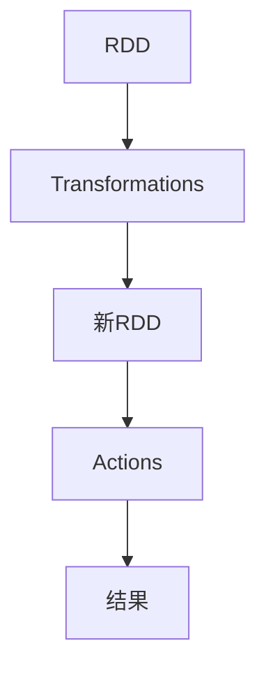
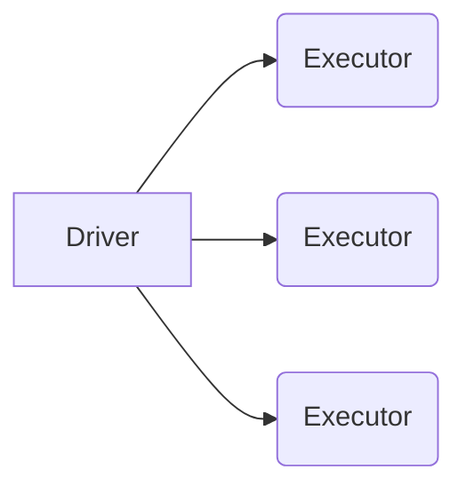
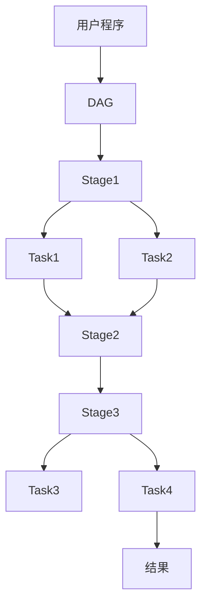

# AI系统Spark原理与代码实战案例讲解

## 1.背景介绍

### 1.1 什么是Spark?

Apache Spark是一种开源的、快速的、通用的用于大规模数据处理的集群计算系统。它最初由加州大学伯克利分校的AMPLab所开发,后被捐赠给Apache软件基金会。Spark基于内存计算,能够显著提高大数据处理的效率。

Spark不仅支持批处理,还支持流式计算,并且支持SQL查询、机器学习、图计算等多种数据分析方式。它可以运行于Hadoop集群之上,也可以独立运行。Spark具有如下主要特点:

- **速度快**:Spark基于内存计算,运行速度比Hadoop的MapReduce要快100倍以上。
- **易用**:Spark支持多种编程语言(Scala、Java、Python、R),并且提供了丰富的高级API,大大简化了编程复杂度。
- **通用**:Spark不仅支持批处理,还支持流计算、机器学习、图计算等多种计算模型。
- **容错**:Spark的RDD(Resilient Distributed Dataset)是一种分布式内存数据集,具有容错能力。

### 1.2 Spark生态圈

Spark拥有庞大的生态圈,包括多个紧密集成的组件,用于满足不同的数据处理需求:

- **Spark Core**:实现了Spark的基本功能,包括作业调度、内存管理、容错、安全等。
- **Spark SQL**:为Spark提供了结构化数据处理能力。
- **Spark Streaming**:用于流式数据的实时处理。
- **MLlib**:提供了机器学习算法库。
- **GraphX**:用于图形数据处理和并行图计算。
- **SparkR**:为R语言提供了分布式数据框架。

## 2.核心概念与联系

### 2.1 RDD(Resilient Distributed Dataset)

RDD是Spark最基本的数据抽象,表示一个不可变、分区的记录集合。RDD支持两种操作:Transformations(从其他RDD转换而来)和Actions(对RDD进行计算并返回值)。

RDD具有以下特点:

- **不可变**:RDD是只读的,不能直接修改。
- **分区**:RDD数据集被划分为多个分区,分布在集群的不同节点。
- **容错**:每个RDD都会自动记录如何从其他RDD衍生而来的血统关系,以便容错恢复。
- **延迟计算**:Spark采用延迟计算策略,只有在Action操作触发时,才会执行实际计算。



### 2.2 Spark运行架构

Spark采用了主从架构,由一个Driver和多个Executor组成:

- **Driver**:运行Application的main函数,负责作业的调度和Executor的协调。
- **Executor**:运行在Worker节点上,负责实际的任务计算。



### 2.3 Spark应用程序执行流程

1. 用户通过Driver程序向Spark集群提交应用程序。
2. Driver构建Spark应用的运行环境,包括DAG(Directed Acyclic Graph)的构建。
3. Spark Web UI展示了作业的运行信息和运行进度。
4. Driver根据RDD的操作指令,将任务分发给各个Executor执行。
5. Executor负责运行任务,并将结果返回给Driver。
6. 最后Driver收集所有Executor的结果,并返回给用户程序。

## 3.核心算法原理具体操作步骤

### 3.1 RDD的创建

RDD可以通过两种方式创建:

1. **从集群外部存储系统(如HDFS)创建**:通过`SparkContext.textFile`等API读取外部数据源创建。

```scala
val lines = sc.textFile("hdfs://...")
```

2. **通过驱动器程序中的集合创建**:使用`SparkContext.parallelize`将本地集合并行化为RDD。

```scala
val data = Array(1, 2, 3, 4, 5)
val distData = sc.parallelize(data)
```

### 3.2 RDD的转换操作

RDD支持丰富的转换操作,例如`map`、`filter`、`flatMap`、`union`等。这些操作都是延迟计算的,只有在Action操作触发时才会真正执行。

```scala
val lines = sc.textFile("...")
val words = lines.flatMap(line => line.split(" "))
val pairs = words.map(word => (word, 1))
val counts = pairs.reduceByKey((a, b) => a + b)
```

### 3.3 RDD的Action操作

Action操作会触发实际的计算任务,并返回结果。常见的Action操作有`reduce`、`collect`、`count`、`foreach`等。

```scala
val output = counts.collect()
```

### 3.4 Spark作业的执行流程

1. 用户程序构建RDD血统关系图(DAG)。
2. Spark根据DAG划分出多个Stage,每个Stage由多个Task组成。
3. Task被分发到Executor上执行,每个Task计算一个数据分区。
4. 每个Stage的结果被保存在内存或磁盘中,供下一个Stage使用。
5. 最终结果被Action操作返回给用户程序。



## 4.数学模型和公式详细讲解举例说明

### 4.1 PageRank算法原理

PageRank是一种用于评估网页重要性的算法,它是Google搜索引擎的核心算法之一。PageRank的基本思想是:一个网页的重要性不仅取决于它被多少其他网页链接,还取决于链接它的网页的重要性。

PageRank算法可以用如下公式表示:

$$PR(p) = (1-d) + d\sum_{q\in M(p)}\frac{PR(q)}{L(q)}$$

其中:

- $PR(p)$表示网页$p$的PageRank值
- $M(p)$是所有链接到$p$的网页集合
- $L(q)$是网页$q$的外链数量
- $d$是一个阻尼系数,通常取值0.85

该公式的含义是:一个网页的PageRank值由两部分组成。第一部分是所有网页的初始PageRank值$(1-d)$。第二部分是其他网页传递过来的PageRank值之和,这部分取决于链接该网页的其他网页的PageRank值和外链数量。

PageRank算法通过迭代计算,直到PageRank值收敛为止。在Spark中,我们可以使用GraphX来实现PageRank算法。

### 4.2 协同过滤算法

协同过滤算法是推荐系统中常用的一种算法,它根据用户之间的相似度或者物品之间的相似度来预测用户对物品的评分。

协同过滤算法主要分为两大类:

1. **基于用户的协同过滤**:给定一个用户,找到与该用户兴趣相似的其他用户,然后根据这些用户对物品的评分来预测该用户对物品的评分。

2. **基于物品的协同过滤**:给定一个物品,找到与该物品相似的其他物品,然后根据用户对这些相似物品的评分来预测该用户对该物品的评分。

协同过滤算法的核心是计算用户或物品之间的相似度。常用的相似度计算方法有:

- **皮尔逊相关系数**:

$$w_{x,y} = \frac{\sum_{i\in I}(r_{x,i} - \overline{r_x})(r_{y,i} - \overline{r_y})}{\sqrt{\sum_{i\in I}(r_{x,i} - \overline{r_x})^2}\sqrt{\sum_{i\in I}(r_{y,i} - \overline{r_y})^2}}$$

其中$r_{x,i}$表示用户$x$对物品$i$的评分,$\overline{r_x}$表示用户$x$的平均评分。

- **余弦相似度**:

$$w_{x,y} = \cos(\overrightarrow{r_x},\overrightarrow{r_y}) = \frac{\overrightarrow{r_x}\cdot\overrightarrow{r_y}}{\|\overrightarrow{r_x}\|\|\overrightarrow{r_y}\|}$$

其中$\overrightarrow{r_x}$和$\overrightarrow{r_y}$分别表示用户$x$和$y$的评分向量。

在Spark MLlib中,提供了协同过滤算法的实现,可以方便地构建推荐系统。

## 5.项目实践:代码实例和详细解释说明

### 5.1 WordCount示例

WordCount是一个经典的大数据处理示例,它统计给定文本文件中每个单词出现的次数。以下是使用Spark实现WordCount的代码:

```scala
import org.apache.spark.SparkContext
import org.apache.spark.SparkConf

object WordCount {
  def main(args: Array[String]) {
    // 创建SparkContext
    val conf = new SparkConf().setAppName("WordCount")
    val sc = new SparkContext(conf)

    // 读取输入文件
    val input = sc.textFile("hdfs://input/file.txt")

    // 分词并统计单词数
    val counts = input.flatMap(line => line.split(" "))
                      .map(word => (word, 1))
                      .reduceByKey(_ + _)

    // 保存结果
    counts.saveAsTextFile("hdfs://output/wordcount")
  }
}
```

代码解释:

1. 创建`SparkConf`和`SparkContext`对象,用于初始化Spark应用程序。
2. 使用`sc.textFile`从HDFS读取输入文件。
3. 对输入文件进行`flatMap`操作,将每一行拆分为单词。
4. 使用`map`操作,将每个单词映射为`(word, 1)`的键值对。
5. 使用`reduceByKey`操作,统计每个单词出现的次数。
6. 最后,使用`saveAsTextFile`将结果保存到HDFS。

### 5.2 机器学习示例:逻辑回归

逻辑回归是一种常用的机器学习算法,用于二分类问题。以下是使用Spark MLlib实现逻辑回归的代码示例:

```scala
import org.apache.spark.ml.Pipeline
import org.apache.spark.ml.classification.LogisticRegression
import org.apache.spark.ml.feature.{HashingTF, Tokenizer}
import org.apache.spark.sql.SparkSession

object LogisticRegressionExample {
  def main(args: Array[String]): Unit = {
    val spark = SparkSession.builder()
      .appName("LogisticRegressionExample")
      .getOrCreate()

    // 加载训练数据
    val training = spark.read.format("libsvm")
      .load("data/mllib/sample_libsvm_data.txt")

    // 准备Pipeline
    val tokenizer = new Tokenizer()
      .setInputCol("value")
      .setOutputCol("words")
    val hashingTF = new HashingTF()
      .setNumFeatures(1000)
      .setInputCol("words")
      .setOutputCol("features")
    val lr = new LogisticRegression()
      .setMaxIter(10)
      .setRegParam(0.001)
    val pipeline = new Pipeline()
      .setStages(Array(tokenizer, hashingTF, lr))

    // 训练模型
    val model = pipeline.fit(training)

    // 进行预测
    val test = spark.createDataFrame(Seq(
      (1.0, "This is a great product"),
      (0.0, "I don't like this product")
    )).toDF("label", "value")
    val predictions = model.transform(test)
    predictions.show()
  }
}
```

代码解释:

1. 创建`SparkSession`对象,用于初始化Spark应用程序。
2. 加载训练数据,这里使用了`libsvm`格式的示例数据。
3. 构建`Pipeline`,包括`Tokenizer`(分词)、`HashingTF`(特征哈希)和`LogisticRegression`(逻辑回归算法)三个阶段。
4. 使用`pipeline.fit`方法在训练数据上训练模型。
5. 创建测试数据,并使用训练好的模型进行预测。
6. 打印预测结果。

在这个示例中,我们使用了Spark MLlib提供的`Pipeline`API,可以方便地组合多个数据处理和机器学习算法,构建完整的机器学习工作流。

## 6.实际应用场景

Spark由于其高性能、通用性和易用性,在多个领域都有广泛的应用:

### 6.1 大数据处理

Spark可以高效地处