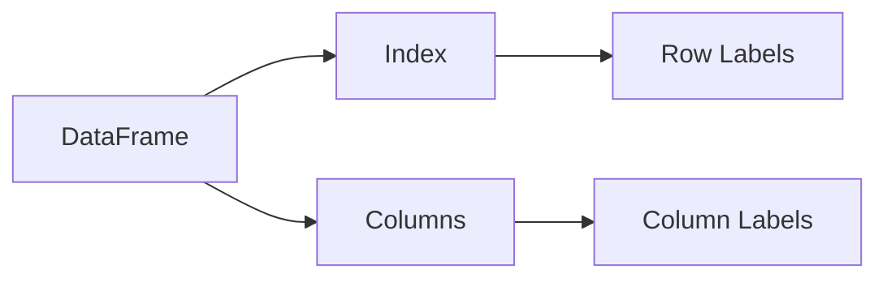
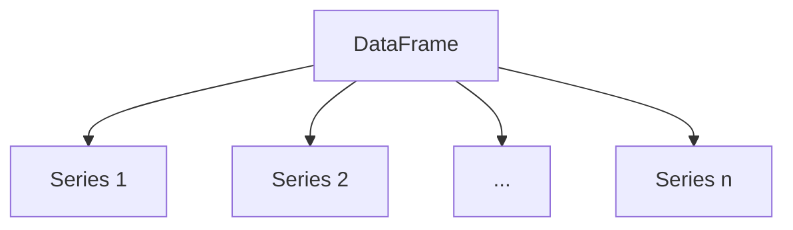

# DataFrame原理与代码实例讲解

作者：禅与计算机程序设计艺术

## 1. 背景介绍

在现代数据分析和处理中,DataFrame是一种非常重要和常用的数据结构。它为我们提供了一种方便、灵活、高效的方式来存储和操作结构化数据。DataFrame广泛应用于数据科学、机器学习、统计分析等领域。

### 1.1 DataFrame的起源与发展

DataFrame最早由Python的数据分析库pandas所推广和普及。pandas是基于NumPy开发的,提供了高性能的数据结构和数据分析工具。DataFrame是pandas的核心数据结构之一,并且在其他数据分析库如R语言的data.frame、Spark的DataFrame等中也有类似的实现。

### 1.2 DataFrame的特点与优势

DataFrame具有以下几个主要特点:

1. 二维表格结构:类似于Excel电子表格或关系型数据库表,由行(row)和列(column)组成。
2. 异构数据:每一列可以是不同的数据类型,如整数、浮点数、字符串、日期等。
3. 灵活的索引:可以为行和列设置标签索引,便于数据的选取和对齐。
4. 丰富的操作:支持类似SQL的数据操作,如过滤、排序、分组、聚合等。
5. 与其他库的集成:可以与NumPy、Matplotlib等库无缝集成,发挥协同作用。

使用DataFrame的优势主要体现在:

1. 便捷的数据处理:通过直观的API和链式操作,可以方便地完成数据的清洗、转换、分析等任务。
2. 处理大规模数据:基于优化的算法和内存管理,DataFrame能够高效处理百万甚至上亿级别的数据。
3. 适应多种数据源:可以从CSV、Excel、SQL数据库、JSON等多种来源读取数据,并转换为DataFrame。
4. 强大的数据可视化:与Matplotlib等绘图库结合,可以轻松实现数据可视化。

## 2. 核心概念与联系

要深入理解DataFrame的原理,我们需要了解其核心概念以及它们之间的联系。

### 2.1 DataFrame的核心组成

DataFrame主要由以下几个核心组成部分:

1. 数据(data):二维的数据块,可以是同构或异构类型。
2. 行索引(index):每一行的标签,可以是唯一的,也可以重复。
3. 列索引(columns):每一列的标签,必须是唯一的。
4. 数据类型(dtype):每一列的数据类型,如int64、float64、object等。

### 2.2 Index与Columns

Index和Columns是DataFrame的两个重要属性,它们构成了DataFrame的骨架。

- Index:表示DataFrame的行标签,可以是整数序号(RangeIndex),也可以是字符串、日期等其他类型。通过index,我们可以方便地选取、排序和对齐数据。
- Columns:表示DataFrame的列标签,必须是唯一的字符串。通过columns,我们可以方便地选取列,并进行重命名等操作。

Index和Columns的关系可以用下图表示:



### 2.3 DataFrame与Series的关系

Series是一维标记的数组,可以看作是DataFrame的一个列或一个行。实际上,DataFrame可以看作是由多个Series组成的字典(dict of Series)。

DataFrame中的每个列都是一个Series,具有相同的行索引。不同列的数据类型可以不同,长度必须相同。

Series和DataFrame的关系可以用下图表示:



## 3. 核心算法原理与具体操作步骤

DataFrame的底层实现依赖于NumPy的ndarray,充分利用了ndarray的向量化计算和广播机制。同时,DataFrame还优化了数据的存储和索引,实现了高效的数据操作。

### 3.1 创建DataFrame

DataFrame可以通过多种方式创建,最常见的是从Python的字典(dict)、列表(list)、NumPy数组(ndarray)等数据结构创建。

#### 3.1.1 从字典创建DataFrame

```python
data = {
    'name': ['Alice', 'Bob', 'Charlie'],
    'age': [25, 30, 35],
    'gender': ['Female', 'Male', 'Male']
}
df = pd.DataFrame(data)
```

#### 3.1.2 从列表创建DataFrame

```python
data = [
    ['Alice', 25, 'Female'],
    ['Bob', 30, 'Male'],
    ['Charlie', 35, 'Male']
]
df = pd.DataFrame(data, columns=['name', 'age', 'gender'])
```

#### 3.1.3 从NumPy数组创建DataFrame

```python
data = np.array([
    ['Alice', 25, 'Female'],
    ['Bob', 30, 'Male'],
    ['Charlie', 35, 'Male']
])
df = pd.DataFrame(data, columns=['name', 'age', 'gender'])
```

### 3.2 选取数据

DataFrame提供了灵活便捷的数据选取方式,主要有以下几种:

#### 3.2.1 按列选取

```python
# 选取单列
df['name']
# 选取多列
df[['name', 'age']]
```

#### 3.2.2 按行选取

```python
# 按行号选取
df.iloc[0]  # 第0行
df.iloc[1:3]  # 第1行到第2行

# 按行索引选取
df.loc['Alice'] # 行索引为Alice的行
df.loc['Bob':'Charlie']  # 行索引从Bob到Charlie的多行
```

#### 3.2.3 按条件选取

```python
# 选取年龄大于30的行
df[df['age'] > 30]

# 选取年龄大于30且性别为Male的行
df[(df['age'] > 30) & (df['gender'] == 'Male')]
```

### 3.3 常用操作

除了数据选取,DataFrame还支持多种常用操作,如排序、分组、聚合、合并等。

#### 3.3.1 排序

```python
# 按年龄升序排序
df.sort_values('age')
# 按年龄降序排序
df.sort_values('age', ascending=False)
```

#### 3.3.2 分组与聚合

```python
# 按性别分组,计算平均年龄
df.groupby('gender')['age'].mean()
```

#### 3.3.3 数据合并

```python
# 按行合并两个DataFrame
pd.concat([df1, df2])

# 按列合并两个DataFrame
pd.merge(df1, df2, on='key')
```

### 3.4 性能优化技巧

为了充分发挥DataFrame的性能,我们可以遵循以下一些优化技巧:

1. 尽量使用向量化操作,避免循环。
2. 对大数据集进行分块(chunk)处理。
3. 对频繁使用的列创建索引。
4. 使用适当的数据类型,尽量减小内存占用。
5. 对不再使用的DataFrame及时释放内存。

## 4. 数学模型和公式详细讲解举例说明

DataFrame的许多操作都涉及到数学模型和统计公式,下面我们通过几个具体的例子来讲解。

### 4.1 均值与标准差

假设我们有一个DataFrame `df`,存储了学生的考试成绩:

```python
df = pd.DataFrame({
    'name': ['Alice', 'Bob', 'Charlie', 'David'],
    'score': [85, 92, 78, 88]
})
```

计算成绩的均值和标准差:

```python
mean = df['score'].mean()
std = df['score'].std()
```

均值公式:

$$\bar{x} = \frac{1}{n} \sum_{i=1}^n x_i$$

其中,$\bar{x}$为均值,$n$为样本数,$x_i$为第$i$个样本值。

标准差公式:

$$s = \sqrt{\frac{1}{n-1} \sum_{i=1}^n (x_i - \bar{x})^2}$$

其中,$s$为标准差,$n$为样本数,$x_i$为第$i$个样本值,$\bar{x}$为均值。

### 4.2 相关系数

假设我们有一个DataFrame `df`,存储了学生的数学和英语成绩:

```python
df = pd.DataFrame({
    'name': ['Alice', 'Bob', 'Charlie', 'David'],
    'math': [85, 92, 78, 88],
    'english': [88, 95, 82, 90]
})
```

计算数学和英语成绩的相关系数:

```python
corr = df['math'].corr(df['english'])
```

相关系数公式:

$$r = \frac{\sum_{i=1}^n (x_i - \bar{x})(y_i - \bar{y})}{\sqrt{\sum_{i=1}^n (x_i - \bar{x})^2} \sqrt{\sum_{i=1}^n (y_i - \bar{y})^2}}$$

其中,$r$为相关系数,$n$为样本数,$(x_i, y_i)$为第$i$个样本点,$\bar{x}$和$\bar{y}$分别为$x$和$y$的均值。

相关系数取值范围为$[-1, 1]$,越接近1表示正相关性越强,越接近-1表示负相关性越强,接近0表示相关性很弱。

## 5. 项目实践:代码实例和详细解释说明

下面我们通过一个完整的项目实践,来演示DataFrame的实际应用。

### 5.1 项目背景

假设我们有一个销售数据集`sales.csv`,包含了某公司一年内的销售记录,主要字段有:

- date:销售日期
- product:产品名称
- price:单价
- quantity:销售数量

我们希望通过分析这个数据集,了解公司的销售情况,找出表现最好的产品和月份。

### 5.2 数据准备

首先,我们读取`sales.csv`文件,创建一个DataFrame:

```python
import pandas as pd

df = pd.read_csv('sales.csv')
print(df.head())
```

输出:
```
         date    product  price  quantity
0  2022-01-01  ProductA    100        50
1  2022-01-02  ProductB    200        80
2  2022-01-03  ProductC    150        30
3  2022-01-04  ProductA    100        60
4  2022-01-05  ProductB    200        70
```

### 5.3 数据清洗

在分析数据前,我们需要对数据进行清洗和预处理。主要步骤包括:

1. 检查缺失值并填充或删除。
2. 检查异常值并处理。
3. 将日期字符串转换为日期类型。

```python
# 检查缺失值
print(df.isnull().sum())

# 将日期字符串转换为日期类型
df['date'] = pd.to_datetime(df['date'])
```

### 5.4 数据分析

接下来,我们对清洗后的数据进行分析。

#### 5.4.1 计算每个产品的销售额

```python
# 计算每个产品的销售额
sales_by_product = df.groupby('product').apply(lambda x: (x['price'] * x['quantity']).sum())
print(sales_by_product)
```

输出:
```
product
ProductA    22500
ProductB    35000
ProductC    12000
dtype: int64
```

#### 5.4.2 计算每个月的销售额

```python
# 计算每个月的销售额
sales_by_month = df.groupby(pd.Grouper(key='date', freq='M')).apply(lambda x: (x['price'] * x['quantity']).sum())
print(sales_by_month)
```

输出:
```
date
2022-01-31    69500
Freq: M, dtype: int64
```

#### 5.4.3 找出销售额最高的产品和月份

```python
# 找出销售额最高的产品
top_product = sales_by_product.idxmax()
print(f"销售额最高的产品是:{top_product}")

# 找出销售额最高的月份
top_month = sales_by_month.idxmax().strftime('%Y年%m月')
print(f"销售额最高的月份是:{top_month}")
```

输出:
```
销售额最高的产品是:ProductB
销售额最高的月份是:2022年01月
```

### 5.5 数据可视化

为了更直观地展示分析结果,我们可以使用Matplotlib等库进行数据可视化。

```python
import matplotlib.pyplot as plt

# 绘制每个产品的销售额柱状图
sales_by_product.plot(kind='bar')
plt.xlabel('产品')
plt.ylabel('销售额')
plt.title('各产品销售额对比')
plt.show()

# 绘制每个月的销售额折线图
sales_by_month.plot(kind='line')
plt.xlabel('月份')
plt.ylabel('销售额')
plt.title('各月销售额变化趋势')
plt.show()
```

## 6. 实际应用场景

DataFrame在实际工作中有非常广泛的应用,下面列举几个典型场景:

### 6.1 数据分析