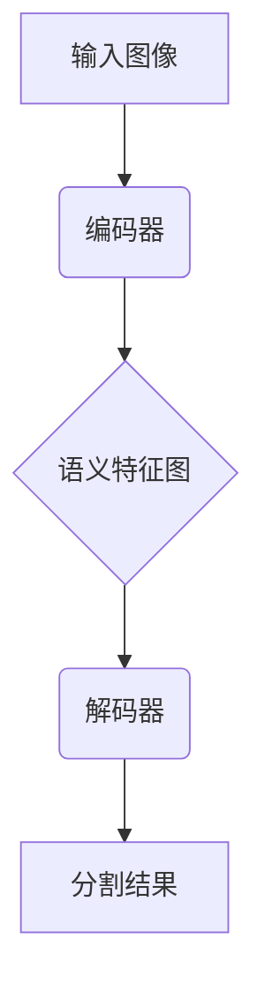
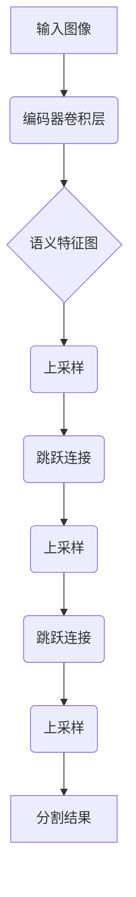

# FCN原理与代码实例讲解

## 1.背景介绍

### 1.1 语义分割的重要性

在计算机视觉领域,语义分割是一项关键的基础任务。它的目标是对输入图像中的每个像素进行分类,将图像像素级别地划分为不同的语义类别,例如人、汽车、树木等。语义分割广泛应用于无人驾驶、增强现实、医学图像分析等领域,对于机器理解复杂场景至关重要。

### 1.2 传统方法的局限性

早期的语义分割方法主要基于手工设计的特征和传统机器学习算法,如随机森林、支持向量机等。这些方法需要大量的人工参与,并且难以处理复杂的视觉场景。随着深度学习技术的兴起,基于卷积神经网络(CNN)的语义分割方法取得了巨大的进展。

### 1.3 全卷积网络(FCN)的里程碑意义

2014年,Jonathan Long等人在论文"Fully Convolutional Networks for Semantic Segmentation"中提出了全卷积网络(Fully Convolutional Networks,FCN)。FCN是第一个端到端的、学习像素到像素映射的卷积神经网络模型,它彻底改变了语义分割的范式,成为后续大多数语义分割模型的基础。FCN的提出标志着深度学习在语义分割领域的里程碑式突破。

## 2.核心概念与联系

### 2.1 全卷积网络的核心思想

传统的卷积神经网络是为图像分类任务设计的,包含全连接层,输出是一个固定长度的特征向量。而全卷积网络完全抛弃了全连接层,使用全卷积层替代,从而可以接受任意尺寸的输入图像,输出与输入图像等尺寸的特征映射。

### 2.2 编码器-解码器架构

FCN采用了编码器-解码器的架构思想。编码器部分是一个标准的卷积神经网络,如VGG16或ResNet,用于提取图像的高级语义特征。解码器部分则通过上采样和跳跃连接,将低分辨率的语义特征映射回原始输入图像的分辨率和尺寸。



### 2.3 跳跃连接

FCN引入了跳跃连接(Skip Connection)的概念,将编码器不同阶段的特征图与解码器对应层的特征图进行融合。这种设计有两个主要优点:

1. 保留了底层特征的细节信息,有助于生成高分辨率、细粒度的分割结果。
2. 加强了不同层次特征之间的信息流动,提高了网络的表达能力。

### 2.4 上采样操作

由于卷积操作和池化操作会导致特征图分辨率下降,因此解码器需要通过上采样操作将低分辨率的语义特征图还原到输入图像的原始分辨率。FCN提出了反卷积(Deconvolution)和双线性插值(Bilinear Interpolation)两种上采样方式。

## 3.核心算法原理具体操作步骤

### 3.1 FCN网络结构

FCN的核心思想是将标准的卷积网络转换为全卷积网络。具体步骤如下:

1. 将分类网络(如VGG16、ResNet等)的全连接层移除。
2. 将剩余的卷积层当作编码器,提取图像的高级语义特征。
3. 构建解码器,通过上采样和跳跃连接将低分辨率的语义特征映射回原始图像尺寸。



### 3.2 跳跃连接的实现

跳跃连接是FCN的关键创新之一。具体实现步骤如下:

1. 在编码器不同阶段,提取不同尺度的特征图。
2. 对于解码器的每一层,将对应尺度的编码器特征图与当前特征图进行元素wise相加,实现特征融合。
3. 跳跃连接可以有效地传递底层特征的细节信息,并加强不同层次特征之间的信息流动。

### 3.3 上采样操作的实现

FCN提出了两种上采样方式:反卷积和双线性插值。

1. **反卷积(Deconvolution)**:反卷积是卷积操作的逆过程,通过学习卷积核参数,实现特征图的上采样。
2. **双线性插值(Bilinear Interpolation)**:双线性插值是一种传统的图像插值方法,通过对相邻像素的加权平均,实现特征图的上采样。

在实践中,双线性插值由于计算简单、无需学习参数,往往表现更加出色。

## 4.数学模型和公式详细讲解举例说明

### 4.1 卷积操作

卷积操作是卷积神经网络的核心,它通过滤波器(卷积核)在输入特征图上滑动,提取局部特征。卷积操作的数学表达式如下:

$$
y_{ij} = \sum_{m}\sum_{n}w_{mn}x_{i+m,j+n} + b
$$

其中:
- $y_{ij}$是输出特征图的元素
- $x_{i+m,j+n}$是输入特征图的局部区域
- $w_{mn}$是卷积核的权重参数
- $b$是偏置项

### 4.2 反卷积操作

反卷积操作是卷积操作的逆过程,用于特征图的上采样。它的数学表达式如下:

$$
y_{ij} = \sum_{m}\sum_{n}w_{mn}x_{i-m,j-n}
$$

与卷积操作不同,反卷积在每个输出位置对应输入特征图的多个值,实现了从低分辨率到高分辨率的映射。

### 4.3 跳跃连接的融合

跳跃连接通过元素wise相加,将不同尺度的特征图进行融合。设$X$和$Y$分别表示两个特征图,则融合后的特征图$Z$可表示为:

$$
Z = X + Y
$$

这种简单的相加操作可以有效地传递底层特征的细节信息,并加强不同层次特征之间的信息流动。

### 4.4 损失函数

FCN采用像素级别的交叉熵损失函数进行训练。设$y_{ij}$表示像素$(i,j)$的真实标签,$\hat{y}_{ij}$表示模型预测的概率分布,则像素$(i,j)$的交叉熵损失为:

$$
L_{ij} = -\sum_{c}y_{ij}^{c}\log(\hat{y}_{ij}^{c})
$$

其中$c$表示类别索引。整个图像的损失函数是所有像素损失的平均值。

## 5.项目实践:代码实例和详细解释说明

以下是一个使用PyTorch实现的FCN模型示例,基于VGG16编码器:

```python
import torch
import torch.nn as nn
import torchvision

# 加载预训练的VGG16模型
vgg = torchvision.models.vgg16(pretrained=True)

class FCN(nn.Module):
    def __init__(self, num_classes):
        super(FCN, self).__init__()

        # 编码器:VGG16卷积层
        self.encoder = nn.Sequential(*list(vgg.features.children())[:30])

        # 解码器
        self.decoder = nn.Sequential(
            nn.Conv2d(512, 256, kernel_size=3, padding=1),
            nn.ReLU(inplace=True),
            nn.Conv2d(256, 256, kernel_size=3, padding=1),
            nn.ReLU(inplace=True),
            nn.Conv2d(256, num_classes, kernel_size=1)
        )

        # 跳跃连接
        self.skip = nn.Conv2d(512, num_classes, kernel_size=1)

    def forward(self, x):
        # 编码
        encoder_output = self.encoder(x)

        # 跳跃连接
        skip_output = self.skip(encoder_output)

        # 解码
        decoder_output = self.decoder(encoder_output)

        # 融合跳跃连接和解码器输出
        output = decoder_output + nn.functional.interpolate(skip_output, decoder_output.size()[2:], mode='bilinear', align_corners=True)

        return output
```

代码解释:

1. 初始化时加载预训练的VGG16模型,将其卷积层作为编码器。
2. 定义解码器,包含三个卷积层,最后一层输出通道数等于分类类别数。
3. 定义跳跃连接层,将编码器输出映射到分类空间。
4. 在`forward`函数中,首先通过编码器提取高级语义特征。
5. 对编码器输出进行跳跃连接,获得跳跃连接输出。
6. 将编码器输出送入解码器,获得解码器输出。
7. 将跳跃连接输出进行双线性插值,与解码器输出相加,实现特征融合。

该示例实现了FCN的核心思想,包括编码器-解码器架构、跳跃连接和上采样操作。你可以根据需求进行进一步修改和扩展。

## 6.实际应用场景

FCN及其变体在以下领域有广泛的应用:

### 6.1 无人驾驶

在无人驾驶系统中,语义分割用于识别道路、行人、车辆等关键目标,为决策和规划提供重要依据。FCN可以实时、准确地分割复杂的城市场景。

### 6.2 增强现实

语义分割在增强现实(AR)应用中扮演着重要角色。通过对真实场景进行分割,可以准确地定位和识别感兴趣的目标,从而实现虚拟物体的无缝融合。

### 6.3 医学图像分析

FCN在医学图像分割方面也有广泛应用,如肿瘤分割、器官分割等。准确的分割结果可以为医生提供更多诊断信息,提高诊断和治疗的精度。

### 6.4 遥感图像处理

在遥感领域,FCN可用于对卫星图像或无人机图像进行语义分割,识别建筑物、道路、植被等目标,为城市规划、环境监测等提供支持。

### 6.5 机器人视觉

机器人视觉系统需要准确理解周围环境,语义分割可以帮助机器人识别不同的物体和障碍物,实现更智能、更安全的导航和操作。

## 7.工具和资源推荐

### 7.1 深度学习框架

- **PyTorch**: 提供了强大的张量计算能力和动态计算图,是实现FCN及其变体的理想选择。
- **TensorFlow**: 另一个流行的深度学习框架,提供了丰富的工具和资源。
- **Keras**: 基于TensorFlow的高级API,可以快速构建和训练FCN模型。

### 7.2 预训练模型

- **torchvision.models**: PyTorch提供了多种预训练的卷积神经网络模型,如VGG、ResNet等,可直接用作FCN的编码器。
- **TensorFlow Hub**: TensorFlow提供了一个预训练模型库,包括用于语义分割的模型。

### 7.3 数据集

- **Pascal VOC**: 一个广泛使用的通用目标检测和语义分割数据集。
- **Cityscapes**: 专门用于城市场景语义分割的大型数据集。
- **COCO Stuff**: 基于COCO数据集,提供了丰富的场景和物体标注。

### 7.4 开源项目和教程

- **pytorch-fcn**: PyTorch实现的FCN及其变体,包括训练和评估代码。
- **TensorFlow Models**: TensorFlow官方提供的多种模型实现,包括FCN。
- **语义分割教程合集**: 包含多个深度学习框架的语义分割教程和示例代码。

## 8.总结:未来发展趋势与挑战

### 8.1 发展趋势

- **模型精度和效率的进一步提升**:通过新颖的网络架构设计和训练策略,提高语义分割的精度和效率。
- **弱监督和半监督学习**:减少对大量标注数据的依赖,利用少量或无标注数据进行训练。
- **多任务和多模