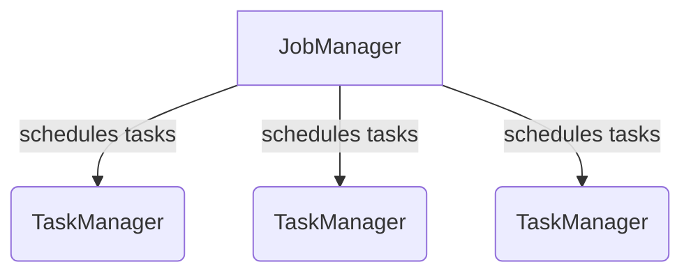

# Flink 流处理框架原理与代码实例讲解

## 1.背景介绍

### 1.1 什么是流处理?

在当今数据驱动的世界中,数据正以前所未有的速度和规模产生。传统的批处理系统无法满足对实时数据处理的需求。流处理应运而生,旨在持续处理无限制的数据流。与批处理系统周期性地处理有限数据集不同,流处理系统可以持续地处理无限制的数据流,并实时生成结果。

### 1.2 流处理的应用场景

流处理广泛应用于诸多领域,例如:

- 金融服务: 实时检测欺诈行为、交易监控
- 物联网(IoT): 传感器数据分析、预测性维护
- 电子商务: 实时推荐系统、用户行为分析
- 社交网络: 新闻推送、社交媒体分析
- 游戏行业: 实时玩家行为分析、反作弊系统

### 1.3 Flink 简介

Apache Flink 是一个开源的分布式流处理框架,具有低延迟、高吞吐、精确一次语义等特点。Flink 不仅支持纯流处理,还支持批处理,让用户可以用同一个引擎无缝地组合流和批处理workload。

## 2.核心概念与联系

### 2.1 Flink 架构概览

Flink 采用主从架构,由一个 JobManager(主节点)和多个 TaskManager(从节点)组成。



- JobManager 负责协调分布式执行,调度 task、checkpoint 等。
- TaskManager 在执行层运行实际的流处理任务。

### 2.2 数据流编程模型

Flink 提供了 DataStream 和 DataSet API,支持有向无环流数据流图(streaming dataflows)的构建。


- Source 从文件、socket、Kafka 等获取输入数据
- Transformation 对数据进行转换/过滤等操作
- Sink 将结果输出到文件、socket、数据库等

### 2.3 时间语义

Flink 支持三种时间语义:

- Event Time: 基于数据中的时间戳
- Ingestion Time: 基于数据进入 Flink 的时间
- Processing Time: 基于机器的系统时间

### 2.4 状态管理

Flink 提供了 Fault-Tolerant State 机制,支持:

- 有状态流处理应用
- 一致性检查点(Checkpointing)
- 状态恢复

## 3.核心算法原理具体操作步骤

### 3.1 流执行模型

Flink 采用链式任务执行模型,将算子链接在一起形成 Task 链,减少线程切换和缓冲区复制,提高整体吞吐量。


### 3.2 数据分区策略

Flink 支持以下数据分区策略:

- Rebalance: 将数据均匀分布到下游分区
- Rescale: 分区个数不变,重新分布数据
- Broadcast: 将数据复制到下游所有分区
- Shuffle: 随机分发数据到下游分区
- ...

### 3.3 窗口模型

Flink 支持时间窗口(如滚动、滑动、会话等)和计数窗口,用于对无限数据流进行切分。窗口操作包括窗口分配器(WindowAssigner)和触发器(Trigger)。


### 3.4 状态一致性算法

Flink 使用异步快照机制实现状态一致性,包括以下步骤:

1. 屏障(Barrier)注入
2. 输出缓冲区(Buffer)
3. 同步快照(Snapshot)
4. 通知作业管理器
5. 确认完成

## 4.数学模型和公式详细讲解举例说明

### 4.1 窗口模型数学表示

设无限数据流为 $S = \{s_1, s_2, s_3, ...\}$,窗口函数为 $W$,窗口长度为 $w$,滑动步长为 $s$,则滚动窗口可表示为:

$$
W(S, w, s) = \{w_1, w_2, w_3, ...\}\
w_i = \{s_j | j \in [(i-1)s+1, (i-1)s+w]\}
$$

滑动窗口可表示为:

$$
W(S, w, s) = \{w_1, w_2, w_3, ...\} \
w_i = \{s_j | j \in [i, i+w-1]\}
$$

### 4.2 窗口触发器(Trigger)

触发器定义了窗口的计算时机,Flink 提供多种内置触发器:

- EventTimeTrigger: 基于事件时间的触发器
- ProcessingTimeTrigger: 基于处理时间的触发器
- CountTrigger: 基于记录计数的触发器
- ...

用户也可以自定义触发器,假设定义一个 $\Delta$触发器,当窗口元素时间戳差值超过 $\Delta$ 时触发计算:

$$
\text{Trigger}(w) = \begin{cases}
    \textbf{true} & \text{if } \exists s_i, s_j \in w, |ts(s_i) - ts(s_j)| > \Delta\
    \textbf{false} & \text{otherwise}
\end{cases}
$$

其中 $ts(s)$ 表示元素 $s$ 的时间戳。

## 5.项目实践:代码实例和详细解释说明

### 5.1 项目概览

我们将构建一个简单的电商用户行为分析应用,从 Kafka 消费用户行为事件流,并基于一段时间窗口统计每个商品的浏览量(view counts)。

### 5.2 环境准备

```xml
<!-- Flink 依赖 -->
<dependency>
    <groupId>org.apache.flink</groupId>
    <artifactId>flink-java</artifactId>
    <version>1.13.0</version>
</dependency>
<dependency>
    <groupId>org.apache.flink</groupId>
    <artifictId>flink-streaming-java_2.11</artifictId>
    <version>1.13.0</version>
</dependency>
<dependency>
    <groupId>org.apache.flink</groupId>
    <artifactId>flink-connector-kafka_2.11</artifactId>
    <version>1.13.0</version>
</dependency>
```

### 5.3 Flink 作业代码

```java
import org.apache.flink.api.common.eventtime.WatermarkStrategy;
import org.apache.flink.api.java.utils.ParameterTool;
import org.apache.flink.connector.kafka.source.KafkaSource;
import org.apache.flink.streaming.api.datastream.DataStream;
import org.apache.flink.streaming.api.environment.StreamExecutionEnvironment;
import org.apache.flink.streaming.api.windowing.assigners.TumblingEventTimeWindows;
import org.apache.flink.streaming.api.windowing.time.Time;

import java.time.Duration;
import java.util.Properties;

public class ViewCountsJob {

    public static void main(String[] args) throws Exception {
        // 1. 创建执行环境
        StreamExecutionEnvironment env = StreamExecutionEnvironment.getExecutionEnvironment();

        // 2. 从命令行参数中读取 Kafka 配置
        ParameterTool parameterTool = ParameterTool.fromArgs(args);
        String bootstrapServers = parameterTool.getRequired("bootstrap.servers");
        String inputTopic = parameterTool.getRequired("input.topic");

        // 3. 从 Kafka 消费数据
        Properties props = new Properties();
        props.setProperty("bootstrap.servers", bootstrapServers);
        props.setProperty("group.id", "flink-view-counts");

        KafkaSource<ViewEvent> source = KafkaSource.<ViewEvent>builder()
                .setTopics(inputTopic)
                .setStartingOffsets(OffsetsInitializer.earliest())
                .setValueOnlyDeserializer(new ViewEventDeserializer())
                .setProperties(props)
                .build();

        DataStream<ViewEvent> viewEvents = env.fromSource(source, WatermarkStrategy.noWatermarks(), "Kafka Source");

        // 4. 按事件时间窗口统计 PV
        DataStream<ViewCount> viewCounts = viewEvents
                .keyBy(ViewEvent::getProductId)
                .window(TumblingEventTimeWindows.of(Time.seconds(10)))
                .aggregate(new ViewCountAggregator(), new ViewCountWindowFunction());

        // 5. 输出结果到 Kafka
        viewCounts.addSink(...);

        // 6. 执行作业
        env.execute("View Counts Job");
    }

    // 其他辅助类...
}
```

### 5.4 关键类解释

- `ViewEvent`: 用户浏览事件的数据模型类
- `ViewEventDeserializer`: 从 Kafka 反序列化 `ViewEvent`
- `ViewCountAggregator`: 实现窗口聚合逻辑
- `ViewCountWindowFunction`: 实现窗口函数,输出 `ViewCount`
- `ViewCount`: 窗口聚合结果,包含产品 ID 和浏览量

## 6.实际应用场景

### 6.1 电商行业

- 用户行为分析: 浏览、加购、下单等行为分析
- 广告投放: 根据用户实时浏览行为做个性化推广
- 库存监控: 根据实时销售情况动态调整库存

### 6.2 物联网(IoT)

- 实时车辆跟踪: 分析车辆GPS数据流,实现车辆实时定位
- 智能家居: 分析家电传感器数据,实现智能控制
- 预测性维护: 分析工业设备数据,提前发现故障隐患

### 6.3 金融服务

- 交易监控: 实时检测可疑交易活动
- 欺诈检测: 分析交易数据流,识别欺诈行为
- 风险分析: 评估客户贷款风险等级

## 7.工具和资源推荐

### 7.1 Flink 官方资源

- 官网: https://flink.apache.org/
- 文档: https://nightlies.apache.org/flink/flink-docs-release-1.13/
- 教程: https://nightlies.apache.org/flink/flink-docs-release-1.13/try-flink/datastream_api.html
- 示例: https://github.com/apache/flink/tree/master/flink-examples

### 7.2 第三方资源

- 《Stream Processing with Apache Flink》: https://www.confluent.io/ebook/stream-processing-with-apache-flink/
- Apache Flink 中文视频教程: https://www.bilibili.com/video/BV1Jt411Y7Uu
- Flink Forward: https://ff.cts.events/

## 8.总结:未来发展趋势与挑战

### 8.1 流处理的未来趋势

- 流批一体: 统一流和批处理范式
- 流式机器学习: 支持在流数据上训练模型
- 流式 SQL: 使用 SQL 查询流数据
- 云原生: 与云计算服务深度集成

### 8.2 流处理面临的挑战

- 低延迟要求: 毫秒级延迟对系统稳定性挑战很大
- 状态管理: 有状态应用的状态管理是一大难题
- 资源管理: 需要高效利用资源,满足高吞吐需求
- 运维监控: 分布式系统的运维监控极为复杂

## 9.附录:常见问题与解答

### 9.1 Flink 与 Spark Streaming 的区别?

Flink 是纯流式处理,数据以流的形式持续处理;Spark Streaming 则是小批量处理,将流数据切分成小批量进行处理。Flink 一次性持久化状态,支持准确一次语义;Spark 依赖 RDD 重新计算,无法保证精确一次语义。

### 9.2 Flink 如何实现容错?

Flink 通过 checkpoint 机制实现容错,定期为有状态的算子做状态快照,出错时从最近一次快照恢复。这保证了精确一次(Exactly-Once)语义。

### 9.3 Flink 如何实现反压(Back Pressure)?

Flink 采用本地策略和分布式策略相结合的反压机制。本地策略通过异步 I/O 和缓存池控制反压;分布式策略通过信号反馈,上游节点根据下游节点的反压信号调节发送速率。

### 9.4 Flink 中的 Window 有哪些类型?

Flink 支持时间窗口和计数窗口。时间窗口包括滚动