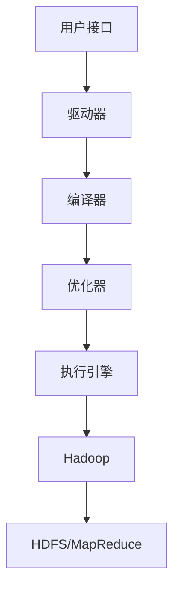

# Hive原理与代码实例讲解

## 1. 背景介绍

### 1.1 大数据时代的到来

随着互联网、物联网和移动互联网的快速发展,数据呈现出爆炸式增长。传统的关系型数据库管理系统(RDBMS)在存储和处理大规模数据集时遇到了巨大挑战。为了解决这一问题,大数据技术应运而生,其中Apache Hive作为一种基于Hadoop的数据仓库工具,为结构化数据的存储、查询和分析提供了强大的支持。

### 1.2 Hive的重要性

Hive允许用户使用类似SQL的语言(HiveQL)来处理存储在Hadoop分布式文件系统(HDFS)中的大规模数据集。它将HiveQL查询转换为一系列MapReduce作业,并在Hadoop集群上执行这些作业。Hive的出现极大地降低了大数据处理的门槛,使得数据分析师和业务分析人员无需掌握复杂的MapReduce编程,即可轻松地处理海量数据。

## 2. 核心概念与联系

### 2.1 Hive架构概览

Hive的核心架构如下所示:



1. **用户接口**: 包括CLI(命令行界面)、JDBC/ODBC和Web UI等,用于提交HiveQL查询。
2. **驱动器**: 负责处理用户请求,协调各个组件的工作。
3. **编译器**: 将HiveQL查询转换为抽象语法树(AST)。
4. **优化器**: 对AST进行逻辑优化和物理优化,生成优化后的执行计划。
5. **执行引擎**: 根据优化后的执行计划,生成一个或多个MapReduce作业,并提交到Hadoop集群执行。
6. **Hadoop**: Hive底层依赖Hadoop,利用HDFS存储数据,利用MapReduce进行并行计算。

### 2.2 Hive数据模型

Hive中的数据模型与传统的关系数据库类似,包括数据库(Database)、表(Table)、视图(View)和分区(Partition)等概念。表由行和列组成,每一列都有相应的数据类型。Hive支持多种文件格式,如TextFile、SequenceFile、RCFile和ORC等。

## 3. 核心算法原理具体操作步骤

### 3.1 Hive查询执行流程

当用户提交一个HiveQL查询时,Hive会经历以下步骤执行该查询:

1. **语法解析**: 驱动器接收查询,并将其传递给编译器进行语法解析,生成抽象语法树(AST)。

2. **逻辑优化**: 优化器对AST进行逻辑优化,如投影剪裁、谓词下推等,以减少计算量。

3. **类型检查**: 对AST进行类型检查,确保操作符和函数的参数类型正确。

4. **物理优化**: 优化器对逻辑优化后的AST进行物理优化,如选择合适的Join算法、确定分区策略等,生成优化后的执行计划。

5. **执行**: 执行引擎根据优化后的执行计划,生成一个或多个MapReduce作业,并提交到Hadoop集群执行。

6. **获取结果**: 执行引擎从Hadoop集群获取执行结果,并将其返回给用户。

### 3.2 MapReduce执行原理

Hive查询在Hadoop集群上的执行,实际上是通过一系列MapReduce作业来完成的。MapReduce是一种并行计算模型,由Map和Reduce两个阶段组成:

1. **Map阶段**: 将输入数据划分为多个数据块,并为每个数据块启动一个Map任务进行处理,生成中间结果。

2. **Reduce阶段**: 对Map阶段的中间结果进行合并和处理,生成最终结果。

在执行过程中,Hive会根据查询的复杂度,生成一个或多个MapReduce作业。每个作业都会经历以上两个阶段,直到完成整个查询的计算。

## 4. 数学模型和公式详细讲解举例说明

在大数据处理中,常常需要对数据进行统计和分析,涉及到一些数学模型和公式。以下是一些常见的数学模型和公式在Hive中的应用:

### 4.1 统计函数

Hive提供了丰富的内置统计函数,用于对数据进行统计分析。例如:

- $count(col)$: 计算指定列的非空值的个数。
- $sum(col)$: 计算指定列的所有值的总和。
- $avg(col)$: 计算指定列的平均值。
- $variance(col)$: 计算指定列的方差。
- $stddev(col)$: 计算指定列的标准差。

### 4.2 窗口函数

窗口函数用于对某些范围内的数据进行计算,是Hive中一种强大的分析工具。常用的窗口函数包括:

- $rank()$: 计算分区内的排名,并赋予相同值相同的排名。
- $dense_rank()$: 计算分区内的排名,并赋予相同值连续的排名。
- $row_number()$: 计算分区内的行号,不存在相同的行号。
- $lead(col, n, default)$: 获取当前行的后n行的值,如果不存在则返回默认值。
- $lag(col, n, default)$: 获取当前行的前n行的值,如果不存在则返回默认值。

例如,计算每个部门员工的薪资排名:

```sql
SELECT
    dept_id,
    emp_name,
    salary,
    rank() OVER (PARTITION BY dept_id ORDER BY salary DESC) AS salary_rank
FROM employees;
```

### 4.3 用户自定义函数(UDF)

Hive允许用户编写自定义函数(UDF)来扩展其功能。UDF可以使用Java、Python或其他语言编写,并在Hive查询中像内置函数一样使用。

例如,实现一个计算两个数的最大公约数的UDF:

```java
import org.apache.hadoop.hive.ql.exec.UDF;

public class GCDUtil extends UDF {
    public int evaluate(int a, int b) {
        return gcd(a, b);
    }

    private int gcd(int a, int b) {
        if (b == 0) {
            return a;
        }
        return gcd(b, a % b);
    }
}
```

在Hive查询中使用:

```sql
SELECT gcd_util(24, 18) FROM ...;
```

## 5. 项目实践: 代码实例和详细解释说明

为了更好地理解Hive的使用,我们将通过一个实际项目案例来进行说明。假设我们有一个电商网站的订单数据,需要对订单数据进行分析,以了解用户购买行为和商品销售情况。

### 5.1 数据准备

首先,我们需要在HDFS上创建一个数据文件`orders.txt`,内容如下:

```
1001,2023-05-01,100.0,P001,C001
1002,2023-05-02,80.0,P002,C002
1003,2023-05-03,120.0,P001,C003
1004,2023-05-01,90.0,P003,C001
1005,2023-05-02,75.0,P002,C002
```

每一行表示一个订单记录,包括订单ID、下单日期、订单金额、产品ID和客户ID。

### 5.2 创建表

在Hive中创建一个表来存储订单数据:

```sql
CREATE TABLE orders (
    order_id INT,
    order_date DATE,
    order_amount DECIMAL(10,2),
    product_id STRING,
    customer_id STRING
)
ROW FORMAT DELIMITED
FIELDS TERMINATED BY ','
STORED AS TEXTFILE;
```

### 5.3 加载数据

将HDFS上的`orders.txt`文件加载到Hive表中:

```sql
LOAD DATA INPATH '/path/to/orders.txt' INTO TABLE orders;
```

### 5.4 数据分析

#### 5.4.1 统计订单总金额

```sql
SELECT SUM(order_amount) AS total_revenue FROM orders;
```

#### 5.4.2 按产品统计销售额

```sql
SELECT
    product_id,
    SUM(order_amount) AS product_revenue
FROM orders
GROUP BY product_id;
```

#### 5.4.3 按客户统计订单数

```sql
SELECT
    customer_id,
    COUNT(*) AS order_count
FROM orders
GROUP BY customer_id;
```

#### 5.4.4 查找最大订单金额

```sql
SELECT MAX(order_amount) AS max_order_amount FROM orders;
```

#### 5.4.5 按月统计订单金额

```sql
SELECT
    MONTH(order_date) AS order_month,
    SUM(order_amount) AS monthly_revenue
FROM orders
GROUP BY MONTH(order_date);
```

#### 5.4.6 使用窗口函数计算每个客户的订单排名

```sql
SELECT
    customer_id,
    order_id,
    order_amount,
    RANK() OVER (PARTITION BY customer_id ORDER BY order_amount DESC) AS order_rank
FROM orders;
```

通过上述示例,我们可以看到Hive提供了丰富的数据分析功能,可以方便地对大规模数据进行统计和分析。

## 6. 实际应用场景

Hive作为一种大数据处理工具,在多个领域都有广泛的应用,包括但不限于:

### 6.1 电子商务

在电子商务领域,Hive可以用于分析用户购买行为、商品销售情况、营销活动效果等,为企业提供决策支持。

### 6.2 网络日志分析

对于互联网公司,分析网站访问日志、用户行为日志等是非常重要的任务。Hive可以高效地处理这些海量日志数据,帮助企业了解用户需求,优化网站性能。

### 6.3 金融风险控制

在金融领域,Hive可以用于分析交易数据、客户信息等,识别潜在的风险,并制定相应的风控策略。

### 6.4 生物信息学

生物信息学研究中常常需要处理大量的基因组数据,Hive可以帮助研究人员高效地存储和分析这些数据,加快研究进程。

## 7. 工具和资源推荐

在使用Hive进行大数据处理时,有一些工具和资源可以为我们提供帮助:

### 7.1 Hive Web UI

Hive Web UI是一个基于Web的可视化界面,可以方便地查看Hive元数据、监控作业执行情况等。

### 7.2 Hive元数据工具

Hive元数据工具,如Apache Atlas和Cloudera Navigator,可以帮助我们管理和探索Hive元数据,提高数据治理能力。

### 7.3 Hive性能优化工具

Hive性能优化工具,如Tez和Spark,可以显著提高Hive查询的执行效率。

### 7.4 Hive学习资源

- Apache Hive官方文档: https://hive.apache.org/
- Hive编程指南(Programming Hive)
- Hive性能优化最佳实践(Hive Performance Tuning)

## 8. 总结: 未来发展趋势与挑战

### 8.1 Hive的发展趋势

#### 8.1.1 与其他大数据框架的集成

未来,Hive将与其他大数据框架(如Spark、Flink等)更加紧密地集成,提供更强大的数据处理能力。

#### 8.1.2 支持更多数据格式

随着新的数据格式不断出现,Hive需要支持更多种类的数据格式,以满足不同场景的需求。

#### 8.1.3 优化查询性能

持续优化Hive的查询性能是一个永恒的话题,包括查询优化算法、执行引擎优化等方面。

#### 8.1.4 提升可用性和可维护性

提高Hive的可用性和可维护性,使其更加稳定、易于管理和扩展,是未来的重要发展方向。

### 8.2 Hive面临的挑战

#### 8.2.1 大数据安全性

随着大数据的广泛应用,如何确保数据的安全性和隐私性将是一个巨大的挑战。

#### 8.2.2 实时数据处理

虽然Hive已经有了一定的实时查询能力,但与专门的流式处理框架相比,还有待提高。

#### 8.2.3 数据质量管理

海量数据的质量管理是一个棘手的问题,需要更加智能的数据质量控制机制。

#### 8.2.4 人才短缺

大数据领域的人才短缺一直是一个挑战,培