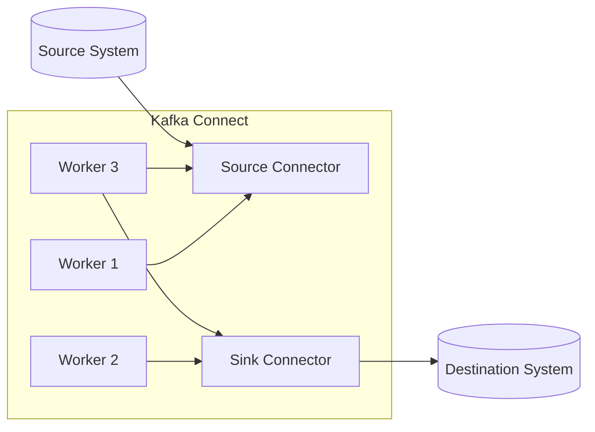

# KafkaConnect：配置管理深度解析

## 1.背景介绍

### 1.1 Kafka简介

Apache Kafka是一个分布式流处理平台，它被广泛应用于大数据领域。Kafka具有高吞吐量、低延迟、高可伸缩性和持久性等优点,因此被视为构建实时数据管道的理想选择。

### 1.2 Kafka Connect介绍

Kafka Connect是Kafka的一个组件,旨在简化将数据从外部系统导入和导出Kafka的过程。它提供了一个可扩展的框架,允许开发人员创建和运行Connectors,这些Connectors充当Kafka和其他系统(如关系数据库、键值存储、文件系统等)之间的桥梁。

Kafka Connect的主要优势包括:

- **简化数据集成**: 通过使用预构建的Connectors,无需编写大量代码即可将数据导入和导出Kafka。
- **可扩展性**: Connect支持动态扩展和缩减工作节点,以满足不断变化的工作负载需求。
- **容错和恢复能力**: Connect可以自动从故障中恢复,并在必要时重新平衡工作负载。

### 1.3 配置管理的重要性

在使用Kafka Connect时,正确配置Connectors至关重要。配置管理确保Connectors按预期运行,并提供了控制数据流、优化性能和简化管理的途径。本文将深入探讨Kafka Connect的配置管理,包括配置选项、最佳实践和常见挑战。

## 2.核心概念与联系

### 2.1 Kafka Connect架构

Kafka Connect由两个核心组件组成:Worker和Connector。

- **Worker**: 负责执行连接器任务的进程,可以在独立模式或分布式模式下运行。
- **Connector**: 实现将数据从源系统导入或导出到目标系统的逻辑。



### 2.2 配置管理概念

配置管理是指定义和管理Connectors所需的各种设置。主要概念包括:

- **Connector配置**: 控制Connector的行为和属性,如连接详细信息、转换规则等。
- **Worker配置**: 控制Worker进程的行为,如线程数、日志记录级别等。
- **集群配置**: 在分布式模式下,控制Kafka Connect集群的行为,如工作重新平衡策略、错误处理等。

## 3.核心算法原理具体操作步骤

### 3.1 配置文件

Kafka Connect使用属性文件(如`connect-distributed.properties`)来指定配置。这些文件遵循标准的Java属性文件格式,每行包含一个`key=value`对。

```properties
# Worker配置
bootstrap.servers=localhost:9092
key.converter=org.apache.kafka.connect.json.JsonConverter
value.converter=org.apache.kafka.connect.json.JsonConverter

# 集群配置
group.id=connect-cluster
offset.storage.topic=connect-offsets
config.storage.topic=connect-configs
status.storage.topic=connect-status

# Connector配置
connector.class=com.example.MySinkConnector
tasks.max=3
topics=test-topic
```

### 3.2 配置提供者

Kafka Connect支持多种配置提供者,用于存储和检索配置。常用的提供者包括:

1. **文件配置提供者**: 从本地文件系统加载配置。
2. **Kafka配置提供者**: 将配置存储在Kafka主题中,支持集中式管理和动态更新。

### 3.3 配置管理REST API

Kafka Connect提供了RESTful API,用于管理Connectors和相关配置。常用的API操作包括:

- 列出活动Connectors
- 创建新Connector
- 获取/更新Connector配置
- 重启Connector任务
- 删除Connector

```bash
# 列出活动Connectors
GET /connectors

# 创建新Connector
POST /connectors
{
    "name": "mysql-source",
    "config": {
        "connector.class": "io.confluent.connect.jdbc.JdbcSourceConnector",
        "tasks.max": "2",
        ...
    }
}

# 获取Connector配置
GET /connectors/mysql-source/config

# 重启Connector任务
POST /connectors/mysql-source/restart
```

## 4.数学模型和公式详细讲解举例说明

在Kafka Connect中,配置管理通常不涉及复杂的数学模型或公式。然而,在某些特定场景下,可能需要使用一些数学概念来优化配置。

### 4.1 吞吐量和延迟计算

在设置Connector任务数量(`tasks.max`)时,需要权衡吞吐量和延迟。增加任务数可提高吞吐量,但也会增加延迟和开销。

假设每个任务的平均吞吐量为$T_t$,平均延迟为$L_t$,则总吞吐量$T$和平均延迟$L$可表示为:

$$
T = n \times T_t \\
L = \frac{1}{n} \sum_{i=1}^{n} L_t
$$

其中$n$是任务数量。通过调整$n$,可以在吞吐量和延迟之间进行权衡。

### 4.2 批量大小优化

许多Connectors支持批量处理,以提高效率。批量大小的选择会影响吞吐量和延迟。

假设每个批次的平均处理时间为$T_b$,平均记录数为$N_b$,则吞吐量$R$可表示为:

$$
R = \frac{N_b}{T_b}
$$

通过调整批量大小$N_b$,可以优化吞吐量。但是,过大的批量可能会增加延迟。

## 5.项目实践：代码实例和详细解释说明

本节将提供一个示例项目,演示如何配置和运行Kafka Connect Connector。

### 5.1 示例项目概述

我们将构建一个简单的数据管道,从MySQL数据库中读取数据,并将其写入Kafka主题。我们将使用Confluent Hub上的JDBC Source Connector和JDBC Sink Connector。

### 5.2 设置Kafka环境

1. 下载并解压Kafka发行版。
2. 启动Zookeeper和Kafka Broker。

```bash
# 启动Zookeeper
bin/zookeeper-server-start.sh config/zookeeper.properties

# 启动Kafka Broker
bin/kafka-server-start.sh config/server.properties
```

### 5.3 配置和运行Source Connector

1. 创建Connector配置文件`mysql-source.properties`。

```properties
name=mysql-source
connector.class=io.confluent.connect.jdbc.JdbcSourceConnector
tasks.max=1
connection.url=jdbc:mysql://localhost:3306/test
mode=incrementing
incrementing.column.name=id
topic.prefix=mysql-
```

2. 使用REST API创建Source Connector。

```bash
curl -X POST -H "Content-Type: application/json" \
     --data '@mysql-source.properties' \
     http://localhost:8083/connectors
```

### 5.4 配置和运行Sink Connector

1. 创建Connector配置文件`kafka-sink.properties`。

```properties
name=kafka-sink
connector.class=io.confluent.connect.jdbc.JdbcSinkConnector
tasks.max=1
topics=mysql-test.users
connection.url=jdbc:mysql://localhost:3306/target
auto.create=true
auto.evolve=true
insert.mode=upsert
pk.fields=id
```

2. 使用REST API创建Sink Connector。

```bash
curl -X POST -H "Content-Type: application/json" \
     --data '@kafka-sink.properties' \
     http://localhost:8083/connectors
```

现在,数据将从MySQL源数据库流向Kafka主题`mysql-test.users`,然后由Sink Connector写入目标数据库。

## 6.实际应用场景

Kafka Connect广泛应用于各种场景,包括但不限于:

1. **数据湖构建**: 从各种源系统(如数据库、文件系统、流处理系统等)收集数据,并将其加载到数据湖中,以支持后续的分析和处理。
2. **数据同步和复制**: 在异构系统之间同步和复制数据,确保数据一致性和可用性。
3. **事件驱动架构**: 将外部系统的事件数据引入Kafka,支持实时处理和响应。
4. **数据仓库加载**: 从各种源系统提取数据,并将其加载到数据仓库中,以支持商业智能和分析。
5. **物联网(IoT)数据采集**: 从各种IoT设备和传感器收集数据,并将其引入Kafka进行实时处理和分析。

## 7.工具和资源推荐

### 7.1 Confluent Control Center

Confluent Control Center是一个基于Web的可视化界面,用于管理和监控Kafka环境,包括Kafka Connect。它提供了对Connectors的配置、部署和监控功能,使管理变得更加简单。

### 7.2 Kafka Connect REST API

如前所述,Kafka Connect提供了RESTful API用于管理Connectors和配置。使用这些API可以实现自动化和编程式管理。

### 7.3 Confluent Hub

Confluent Hub是一个中央存储库,提供了许多预构建的Connectors,供用户下载和使用。它简化了Connector的发现和部署过程。

### 7.4 Kafka Connect文档

Apache Kafka官方文档提供了详细的Kafka Connect指南,包括配置选项、最佳实践和故障排除建议。这是学习和参考的宝贵资源。

## 8.总结：未来发展趋势与挑战

### 8.1 发展趋势

Kafka Connect将继续扩展其生态系统,支持更多的数据源和目标系统。预计将有更多的第三方Connectors出现,以满足特定领域的需求。

另外,Kafka Connect可能会进一步集成机器学习和人工智能功能,以实现更智能的数据处理和转换。

### 8.2 挑战

虽然Kafka Connect大大简化了数据集成过程,但仍然存在一些挑战需要解决:

1. **性能优化**: 在高吞吐量和低延迟场景下,需要进一步优化Connectors的性能。
2. **安全性和隐私**: 确保数据在传输和存储过程中的安全性和隐私性至关重要。
3. **可观察性和监控**: 需要改进对Connectors的监控和故障排除能力,以确保可靠运行。
4. **云原生支持**: 随着云计算的普及,Kafka Connect需要更好地支持云原生环境和容器化部署。

## 9.附录：常见问题与解答

### 9.1 如何监控Connector的运行状态?

可以使用Kafka Connect REST API的`/connectors/{name}/status`端点获取Connector的运行状态,包括任务状态、记录处理速率等信息。还可以使用Confluent Control Center等可视化工具进行监控。

### 9.2 如何动态更新Connector配置?

可以使用Kafka Connect REST API的`/connectors/{name}/config`端点更新Connector配置。更新后,Connector将自动重新启动并应用新配置。

### 9.3 如何处理Connector任务失败?

Kafka Connect具有自动恢复和重新平衡功能。如果某个任务失败,Connect会自动重新启动该任务。如果工作节点失败,Connect会在其他节点上重新分配任务。

### 9.4 如何确定合适的任务数量?

合适的任务数量取决于数据量、吞吐量要求和硬件资源。通常,可以从较小的任务数量开始,然后根据监控数据进行调整。

### 9.5 如何保证数据一致性?

Kafka Connect支持多种一致性模式,如`at_least_once`和`exactly_once`。选择合适的模式可以确保数据在传输过程中不会丢失或重复。

作者: 禅与计算机程序设计艺术 / Zen and the Art of Computer Programming