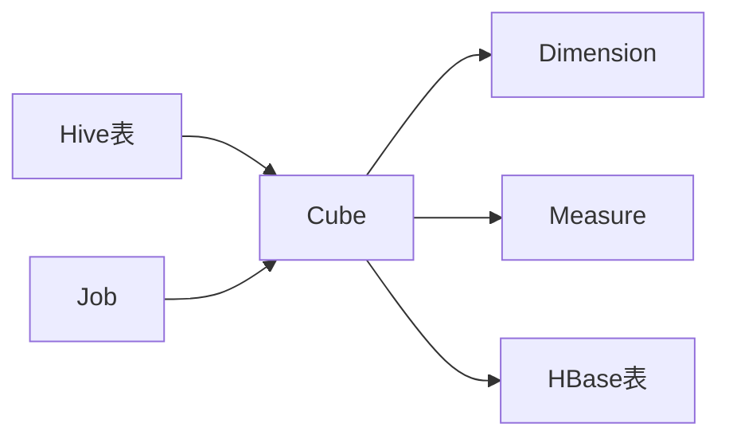

# Kylin原理与代码实例讲解

## 1.背景介绍

Apache Kylin是一个开源的分布式分析引擎，提供Hadoop/Spark之上的SQL查询接口及多维分析（OLAP）能力以支持超大规模数据。它最初由eBay Inc.开发并贡献至开源社区。经过几年的发展，目前已经成为Apache顶级项目，被全球越来越多的企业应用在大数据分析领域。

### 1.1 Kylin的诞生背景

随着大数据时代的到来，企业积累了海量的数据，传统的数据仓库已经无法满足海量数据的多维分析需求。Kylin应运而生，它利用预计算，将一些常见的聚合运算提前计算好并存储，从而大幅提升查询的响应速度。

### 1.2 Kylin的发展历程

- 2014年，eBay将Kylin贡献给Apache社区并成为孵化项目
- 2015年，Kylin毕业成为Apache顶级项目
- 2016年，Kylin 1.5发布，引入智能索引推荐等特性
- 2018年，Kylin 2.0发布，引入实时 OLAP、智能 Cubing 等特性
- 2019年，Kylin 3.0发布，引入新架构、新存储格式等特性
- 2021年，Kylin 4.0发布，引入云原生、向量化执行等特性

### 1.3 Kylin的应用现状

目前，Kylin 已经被Apple、Cisco、eBay、华为、小米、滴滴、美团等众多知名企业使用，应用场景涵盖广告分析、用户行为分析、运营指标分析等多个领域。

## 2.核心概念与联系

要理解Kylin的工作原理，需要先了解几个核心概念：

### 2.1 数据立方体（Cube）

数据立方体是Kylin的核心概念，它是一个多维数据集，类似于多维数组。一个Cube包含维度（Dimension）和度量（Measure）两部分。维度是观察数据的角度，如时间、地点、产品类型等；度量是quantitative的值，如销售额、利润等。

### 2.2 维度（Dimension）

维度定义了Cube的分析角度，常见的维度有时间、地点、产品等。Kylin支持多种维度，包括普通维度、层级维度、衍生维度等。

### 2.3 度量（Measure）

度量是Cube的quantitative指标，支持SUM、COUNT、MAX、MIN等聚合计算。Kylin会预先计算Cube的度量值并持久化存储，从而大幅提升查询性能。

### 2.4 Hive表

Kylin的数据源是Hive表。在构建Cube之前，需要先在Hive中创建事实表和维度表。事实表存储原始的明细数据，维度表存储维度相关信息。

### 2.5 HBase表

为了加速查询，Kylin会把预计算的Cube数据存储在HBase中。HBase是一个分布式的、面向列的存储系统，提供了快速的随机读写访问。

### 2.6 Job

Kylin通过一系列的Job来完成Cube的构建，包括创建中间表、计算Cube、合并Cube等。Job是构建Cube的基本单元。

下图展示了这些核心概念之间的关系：



## 3.核心算法原理具体操作步骤

Kylin的核心是预计算，即提前计算多维Cube，将常见的聚合运算结果持久化存储，从而避免查询时的实时计算。下面详细介绍Cube构建的具体步骤。

### 3.1 Cube设计

首先需要根据业务需求，设计Cube的维度和度量。这一步需要对业务有深入的理解，选择合适的维度组合和度量。一个设计良好的Cube可以大幅提升查询性能。

### 3.2 数据ETL

Kylin的数据来源于Hive表，因此需要先进行数据清洗、转换和加载（ETL）。这一步可以使用Hive、Spark等工具完成。ETL的目标是生成Cube构建所需的事实表和维度表。

### 3.3 Cube构建

有了事实表和维度表，就可以开始构建Cube了。Cube构建分为以下几个步骤：

#### 3.3.1 创建中间表

Kylin首先会根据Cube的定义，在Hive中创建一系列的中间表。这些中间表用于存储预计算的结果，包括各种维度组合的聚合值。

#### 3.3.2 计算Cube

接下来，Kylin会启动一系列的MapReduce Job来计算Cube。每个Job负责计算Cube的一部分，例如某个维度组合的聚合值。Job的输出会写入中间表。

#### 3.3.3 合并Cube

当所有Job完成后，Kylin会启动一个合并Job，将中间表的数据合并写入HBase。这样，Cube就构建完成了，可以供查询使用。

### 3.4 查询优化

面对复杂的OLAP查询，Kylin采用了一系列查询优化技术，包括：

#### 3.4.1 基于Cube的查询改写

Kylin会分析用户的查询语句，判断是否可以利用预计算的Cube来加速查询。如果可以，Kylin会将查询改写为针对Cube的查询。

#### 3.4.2 智能Cube匹配

如果用户的查询无法完全匹配某个Cube，Kylin会自动选择多个Cube组合，生成一个逻辑上的Cube来匹配查询。这种智能Cube匹配可以大幅提升Cube的复用率。

#### 3.4.3 基于代价的查询优化

对于复杂查询，Kylin会生成多个查询计划，并估算每个计划的代价。然后选择代价最小的查询计划来执行。

## 4.数学模型和公式详细讲解举例说明

Kylin的预计算涉及一些基本的数学模型和公式，主要用于Cube的度量计算。下面以一个简单的例子来说明。

假设我们有一个销售数据Cube，包含以下维度和度量：
- 维度：时间（年、月、日）、地区、产品
- 度量：销售额、销量

销售额和销量的计算公式如下：

$$ 销售额 = \sum_{i=1}^{n} (价格_i * 数量_i) $$

$$ 销量 = \sum_{i=1}^{n} 数量_i $$

其中，$n$表示汇总的原始记录数，$价格_i$和$数量_i$分别表示第$i$条记录的价格和数量。

假设我们要计算2023年1月华东地区iPhone的销售额和销量。Kylin会首先定位到匹配的Cube段，然后读取预计算的结果。如果Cube中存在完全匹配的维度组合，那么就直接返回结果；否则，Kylin会读取多个Cube段，然后在内存中进行聚合计算。

例如，如果Cube中存在"2023年1月/华东地区/iPhone"这个维度组合，那么查询可以直接返回结果。如果Cube中只存在"2023年1月/华东地区"和"2023年1月/iPhone"这两个维度组合，那么Kylin会读取这两个Cube段，然后在内存中进行聚合计算。

这种预计算+聚合计算的方式，可以大幅减少查询时需要扫描的数据量，从而显著提升查询性能。

## 5.项目实践：代码实例和详细解释说明

下面通过一个简单的例子，演示如何使用Kylin进行多维分析。

### 5.1 数据准备

首先，我们需要在Hive中创建事实表和维度表。

```sql
-- 事实表
CREATE TABLE IF NOT EXISTS sales (
  time_id bigint,
  product_id bigint,
  region_id bigint,
  price decimal(10,2),
  quantity int
)
ROW FORMAT DELIMITED FIELDS TERMINATED BY ',';

-- 时间维度表
CREATE TABLE IF NOT EXISTS time_dim (
  time_id bigint,
  year int,
  month int,
  day int
)
ROW FORMAT DELIMITED FIELDS TERMINATED BY ',';

-- 产品维度表
CREATE TABLE IF NOT EXISTS product_dim (
  product_id bigint,
  product_name string,
  category string
)
ROW FORMAT DELIMITED FIELDS TERMINATED BY ',';

-- 地区维度表
CREATE TABLE IF NOT EXISTS region_dim (
  region_id bigint,
  region_name string,
  province string
)
ROW FORMAT DELIMITED FIELDS TERMINATED BY ',';
```

接下来，我们导入一些样本数据。

```sql
-- 导入事实数据
LOAD DATA LOCAL INPATH 'path/to/sales.csv' OVERWRITE INTO TABLE sales;

-- 导入维度数据
LOAD DATA LOCAL INPATH 'path/to/time_dim.csv' OVERWRITE INTO TABLE time_dim;
LOAD DATA LOCAL INPATH 'path/to/product_dim.csv' OVERWRITE INTO TABLE product_dim;
LOAD DATA LOCAL INPATH 'path/to/region_dim.csv' OVERWRITE INTO TABLE region_dim;
```

### 5.2 Cube设计

有了事实表和维度表，我们就可以设计Cube了。在Kylin的Web UI中，创建一个新的Cube，设置事实表为`sales`，然后添加以下维度和度量：

- 维度：
  - `time_dim`: `year`, `month`, `day`
  - `product_dim`: `product_name`, `category`
  - `region_dim`: `region_name`, `province`
- 度量：
  - `sales_amount`: `SUM(price * quantity)`
  - `sales_volume`: `SUM(quantity)`

### 5.3 构建Cube

Cube设计完成后，我们可以启动构建任务。Kylin会自动生成并执行一系列的MapReduce Job来计算Cube，并将结果写入HBase。

### 5.4 查询Cube

Cube构建完成后，我们就可以通过SQL进行多维分析了。例如，以下查询可以计算2023年1月华东地区iPhone的销售额和销量：

```sql
SELECT
  t.year,
  t.month,
  r.region_name,
  p.product_name,
  SUM(s.price * s.quantity) AS sales_amount,
  SUM(s.quantity) AS sales_volume
FROM sales s
  JOIN time_dim t ON s.time_id = t.time_id
  JOIN product_dim p ON s.product_id = p.product_id
  JOIN region_dim r ON s.region_id = r.region_id
WHERE
  t.year = 2023 AND
  t.month = 1 AND
  r.region_name = '华东' AND
  p.product_name = 'iPhone'
GROUP BY
  t.year,
  t.month,
  r.region_name,
  p.product_name;
```

Kylin会自动将该查询改写为针对Cube的HBase查询，从而避免大量的实时计算。

## 6.实际应用场景

Kylin广泛应用于各种OLAP场景，包括：

### 6.1 销售分析

通过Kylin，可以快速分析销售数据，了解不同时间、地区、产品的销售情况，发现趋势和异常。常见的分析维度包括时间、地区、产品、渠道等。

### 6.2 用户行为分析

Kylin可以帮助分析用户的行为数据，如注册、登录、购买等，理解用户的使用模式和偏好。常见的分析维度包括用户属性、行为类型、时间等。

### 6.3 运营指标监控

Kylin可以实时监控各种运营指标，如GMV、转化率等，帮助企业及时发现问题和机会。通过设置合适的维度和度量，可以构建一套完整的指标监控体系。

### 6.4 Ad-hoc分析

Kylin支持灵活的Ad-hoc分析。用户可以根据需要，自由组合维度和度量，探索数据中的规律和洞察。Kylin的亚秒级响应使得交互式分析成为可能。

## 7.工具和资源推荐

### 7.1 Kylin官网

Kylin的官网 http://kylin.apache.org/ 提供了丰富的文档和资源，包括快速入门、用户手册、开发指南等。

### 7.2 Kylin社区

Kylin的官方社区 https://kylin.apache.org/community/ 是一个活跃的交流平台，用户可以在此提问、报告Bug、提交特性需求等。

### 7.3 Kylin Github

Kylin的源码托管在Github上：https://github.com/apache/kylin 。用户可以下载源码，了解Kylin的内部实现，并参与到Kylin的开发中来。

### 7.4 Kylin Mailing Lists

Kylin的邮件列表是社区交流的主要渠道，包括用户邮件列表和开发邮件列表。