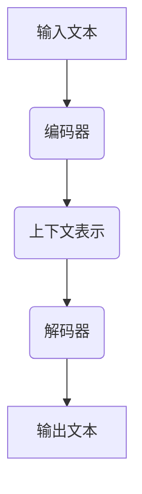
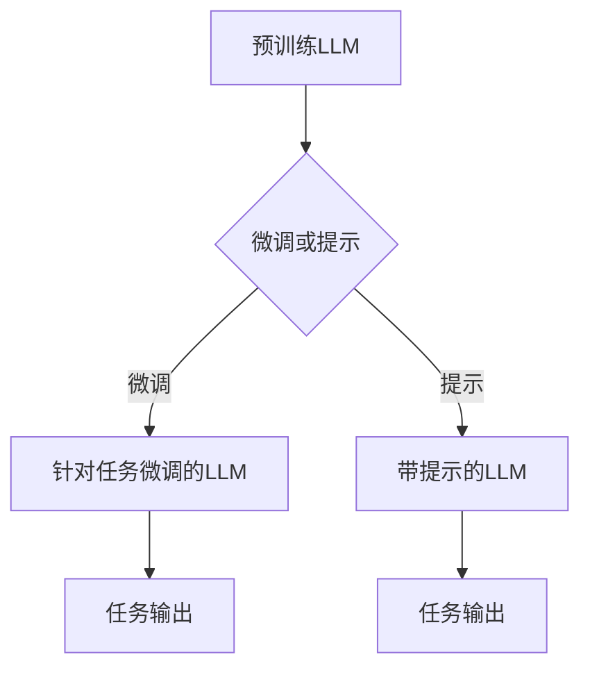
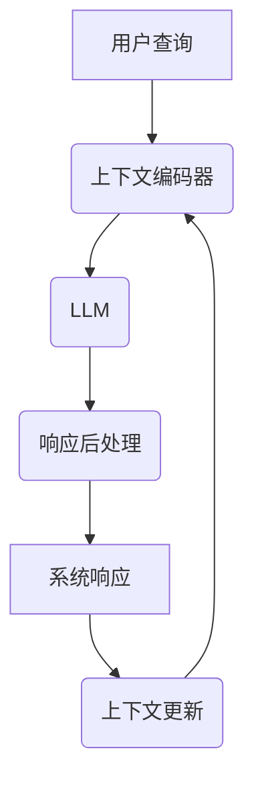

# LLM-based Chatbot System Implementation

## 1. 背景介绍

### 1.1 什么是聊天机器人?

聊天机器人(Chatbot)是一种基于人工智能技术的计算机程序,旨在模拟人类与人类之间的对话。它们被设计用于自动回答问题、提供信息和执行各种任务。随着自然语言处理(NLP)和机器学习(ML)技术的不断进步,聊天机器人已经成为各行业中不可或缺的工具。

### 1.2 聊天机器人的发展历程

聊天机器人的概念可以追溯到20世纪60年代,当时它们主要基于规则和模式匹配。随着时间的推移,统计模型和机器学习算法被引入,使聊天机器人能够从数据中学习并提高性能。近年来,大型语言模型(LLM)的出现彻底改变了聊天机器人的发展轨迹,使它们能够生成更加自然和上下文相关的响应。

### 1.3 LLM驱动的聊天机器人优势

与传统的基于规则或检索的方法相比,基于LLM的聊天机器人具有以下优势:

- **生成性能力**: LLM可以生成上下文相关和流畅的响应,而不仅仅是检索预定义的答案。
- **多功能性**: LLM可以应用于各种任务,如问答、对话、文本生成和总结。
- **可扩展性**: LLM可以通过微调或提示技术快速适应新的领域和任务。
- **持续学习**: LLM可以持续从新数据中学习并改进性能。

## 2. 核心概念与联系

### 2.1 大型语言模型(LLM)

大型语言模型是一种基于自然语言的机器学习模型,通过从大量文本数据中学习,获得对语言的深入理解。LLM旨在捕捉语言的统计规律和语义关系,并能够生成看似人类编写的自然语言。

LLM通常采用transformer架构,由编码器和解码器组成。编码器将输入序列(如文本)转换为上下文表示,解码器则根据上下文生成输出序列。

一些著名的LLM包括GPT-3、BERT、XLNet和T5等。



### 2.2 微调和提示技术

尽管LLM在预训练期间学习了大量知识,但它们通常需要针对特定任务进行微调或提示,以获得更好的性能。

- **微调(Fine-tuning)**: 在预训练LLM的基础上,使用与目标任务相关的数据进行进一步训练,以使模型更好地适应该任务。
- **提示(Prompting)**: 通过设计合适的提示(prompt),指导LLM生成所需的输出,而无需进行额外的训练。提示可以是自然语言指令、少量示例或特定格式的输入。



### 2.3 对话管理

对话管理是聊天机器人系统中的关键组件,负责控制对话流程、上下文跟踪和响应生成。在基于LLM的聊天机器人中,对话管理通常包括以下步骤:

1. **上下文编码**: 将当前对话历史和用户查询编码为LLM可理解的表示形式。
2. **LLM推理**: 将编码后的上下文输入LLM,生成响应。
3. **响应后处理**: 对LLM生成的响应进行过滤、重新排列或其他必要的后处理。
4. **上下文更新**: 将生成的响应添加到对话历史中,为下一轮对话做准备。



## 3. 核心算法原理具体操作步骤

### 3.1 LLM预训练

LLM通常采用自监督学习方式进行预训练,从大量未标记的文本数据中学习语言模式和知识。常见的预训练目标包括:

1. **掩码语言模型(Masked Language Modeling, MLM)**: 随机掩蔽部分输入词,模型需要预测被掩蔽的词。
2. **下一句预测(Next Sentence Prediction, NSP)**: 给定两个句子,模型需要预测它们是否连续出现。
3. **因果语言模型(Causal Language Modeling, CLM)**: 给定前文,模型需要预测下一个词或序列。

预训练算法通常采用自回归(auto-regressive)方式,使用交叉熵损失函数优化模型参数。

$$\mathcal{L}=-\sum_{t=1}^{T} \log P\left(x_{t} | x_{<t}\right)$$

其中$x_t$是目标词,$x_{<t}$是前文上下文。

### 3.2 LLM微调

微调是将预训练的LLM进一步调整以适应特定任务的过程。常见的微调方法包括:

1. **序列到序列微调**: 将任务数据转换为序列对的形式,然后使用与预训练相同的目标函数(如MLM或CLM)进行微调。
2. **前缀微调**: 在输入序列前添加一个任务特定的前缀,引导LLM生成所需的输出。
3. **提示微调**: 使用少量任务示例作为提示,并将提示与输入序列连接,引导LLM生成所需的输出。

微调过程通常采用较小的学习率和少量训练步骤,以避免过度微调导致灾难性遗忘。

### 3.3 生成式对话管理

在生成式对话管理中,LLM根据当前对话历史生成响应。常见的操作步骤包括:

1. **上下文编码**: 将对话历史和用户查询编码为LLM可理解的表示形式,例如将它们连接成单个序列。
2. **LLM推理**: 将编码后的上下文输入LLM,使用贪婪搜索或束搜索等解码策略生成响应。
3. **响应后处理**: 对LLM生成的响应进行过滤、重新排列或其他必要的后处理,以提高响应质量和相关性。
4. **上下文更新**: 将生成的响应添加到对话历史中,为下一轮对话做准备。

此外,还可以采用一些特殊技术来提高对话质量,如注意力掩码、知识增强和反馈优化等。

## 4. 数学模型和公式详细讲解举例说明 

### 4.1 Transformer架构

Transformer是LLM中广泛采用的架构,它完全基于注意力机制,不需要递归或卷积操作。Transformer由编码器和解码器组成,其中编码器将输入序列映射为上下文表示,解码器则根据上下文生成输出序列。

编码器和解码器都由多个相同的层组成,每层包含多头自注意力(Multi-Head Attention)和前馈网络(Feed-Forward Network)子层。

#### 4.1.1 缩放点积注意力

缩放点积注意力是Transformer中的核心机制,它计算查询(Query)和键(Key)之间的相似性,并根据相似性分配值(Value)的权重。具体计算公式如下:

$$\operatorname{Attention}(Q, K, V)=\operatorname{softmax}\left(\frac{Q K^{\top}}{\sqrt{d_{k}}}\right) V$$

其中$Q$、$K$和$V$分别代表查询、键和值,$d_k$是缩放因子,用于防止内积值过大导致梯度消失。

#### 4.1.2 多头注意力

多头注意力允许模型从不同的表示子空间捕获不同的相关性,提高了模型的表达能力。它将查询、键和值线性投影到不同的子空间,并在每个子空间中计算缩放点积注意力,最后将结果连接起来。

$$\begin{aligned}
\operatorname{MultiHead}(Q, K, V) &=\operatorname{Concat}\left(\operatorname{head}_{1}, \ldots, \operatorname{head}_{h}\right) W^{O} \
\text { where } \operatorname{head}_{i} &=\operatorname{Attention}\left(Q W_{i}^{Q}, K W_{i}^{K}, V W_{i}^{V}\right)
\end{aligned}$$

其中$W_i^Q$、$W_i^K$和$W_i^V$是线性投影矩阵,$W^O$是输出线性变换矩阵。

### 4.2 交叉熵损失函数

交叉熵损失函数广泛用于LLM的预训练和微调。对于语言模型任务,交叉熵损失函数可以衡量模型预测的概率分布与真实分布之间的差异。

对于单个词$x_t$,交叉熵损失函数定义如下:

$$\mathcal{L}\left(x_{t}\right)=-\log P\left(x_{t} | x_{<t}\right)$$

其中$P(x_t|x_{<t})$是模型根据上下文$x_{<t}$预测词$x_t$的概率。

对于整个序列,交叉熵损失函数是所有词的损失之和:

$$\mathcal{L}=-\sum_{t=1}^{T} \log P\left(x_{t} | x_{<t}\right)$$

在训练过程中,模型参数通过最小化交叉熵损失函数来优化。

## 5. 项目实践: 代码实例和详细解释说明

在本节中,我们将介绍如何使用Hugging Face的Transformers库构建一个基于LLM的聊天机器人系统。代码示例使用Python编写,并利用PyTorch作为深度学习框架。

### 5.1 安装依赖项

首先,我们需要安装必要的Python包:

```bash
pip install transformers torch
```

### 5.2 加载预训练LLM

我们将使用Hugging Face提供的预训练LLM模型。以下代码加载`gpt2`模型:

```python
from transformers import AutoModelForCausalLM, AutoTokenizer

model_name = "gpt2"
tokenizer = AutoTokenizer.from_pretrained(model_name)
model = AutoModelForCausalLM.from_pretrained(model_name)
```

### 5.3 对话生成函数

下面是一个简单的对话生成函数,它将用户查询和对话历史作为输入,并使用LLM生成响应:

```python
import torch

def generate_response(query, history, max_length=100, num_beams=5, early_stopping=True):
    input_ids = tokenizer.encode(history + query, return_tensors="pt")
    output_ids = model.generate(
        input_ids,
        max_length=max_length,
        num_beams=num_beams,
        early_stopping=early_stopping,
    )
    response = tokenizer.decode(output_ids[0], skip_special_tokens=True)
    return response
```

这个函数使用`model.generate()`方法生成响应,可以指定以下参数:

- `max_length`: 生成序列的最大长度
- `num_beams`: 束搜索宽度
- `early_stopping`: 是否提前停止生成

### 5.4 聊天机器人交互

最后,我们可以构建一个简单的命令行界面,让用户与聊天机器人进行交互:

```python
history = ""
while True:
    query = input("User: ")
    response = generate_response(query, history)
    print("ChatBot:", response)
    history += f"User: {query}\nChatBot: {response}\n"
```

在这个示例中,我们维护一个`history`变量来存储对话历史。每次用户输入查询后,我们调用`generate_response()`函数生成响应,并将响应添加到对话历史中。

## 6. 实际应用场景

基于LLM的聊天机器人系统在各个领域都有广泛的应用前景,包括但不限于:

### 6.1 客户服务

聊天机器人可以提供24/7的客户支持,快速回答常见问题,减轻人工客服的工作负担。它们还可以根据客户的具体需求提供个性化的建议和解决方案。

### 6.2 电子商务

在电子商务领域,聊天机器人可以作为虚拟助手,帮助用户浏览产品、进行购买决策和完成订单。它们还可以提供个性化的产品推荐和营销策略。

### 6.3 医