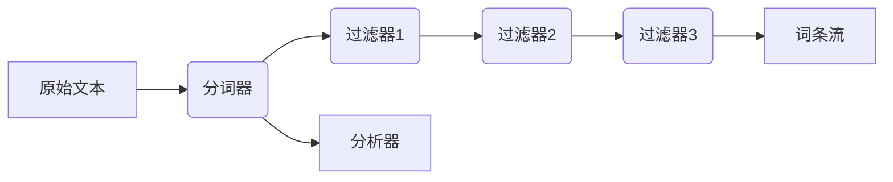

# Lucene分词原理与代码实例讲解

## 1.背景介绍

### 1.1 什么是分词

在自然语言处理和信息检索领域中,分词(Tokenization)是一个基础且关键的过程。它将连续的字符串(如句子或段落)分割成多个单词(Token),这些单词通常被称为词条(Term)。分词是文本数据处理的第一步,为后续的文本挖掘、自然语言处理等任务奠定基础。

### 1.2 分词的重要性

分词在许多领域都扮演着重要角色,例如:

- 全文搜索引擎(如Lucene/Solr、Elasticsearch)
- 自然语言处理(如文本分类、情感分析)
- 文本挖掘
- 垃圾邮件过滤
- 词频统计

由于不同语言的特性,分词的难度也不尽相同。英语等西方语言由于单词之间有明确的空格分隔,分词相对简单。而汉语、日语等东亚语言由于没有明确的单词分隔符,分词就变得更具有挑战性。

### 1.3 Lucene简介

Lucene是一个高性能、全功能的搜索引擎库,由Apache软件基金会的Jakarta项目开发。Lucene提供了完整的查询引擎和索引引擎,支持数十种语言的分词器和词干分析器。它被广泛应用于全文搜索和文本分析领域,是构建全文搜索应用程序的核心组件。

## 2.核心概念与联系

### 2.1 词条(Term)

词条(Term)是指经过分词后的最小单位,通常是一个单词。在Lucene中,词条是不可分割的最小索引单元,用于构建反向索引。

### 2.2 分词器(Tokenizer)

分词器(Tokenizer)是将原始文本流分割成一系列词条(Token)的组件。它是Lucene分词过程的第一步,负责识别词条边界并产生词条流。Lucene提供了多种分词器,如标准分词器(StandardTokenizer)、字母数字分词器(LetterTokenizer)等。

### 2.3 过滤器(Filter)

过滤器(Filter)是对分词器输出的词条流进行进一步加工的组件,用于去除无用词条、标准化词条等。Lucene提供了丰富的过滤器,如小写过滤器(LowerCaseFilter)、停用词过滤器(StopFilter)等。分词器和一系列过滤器共同组成了分词链(Analyzer),完成分词的全过程。

### 2.4 分析器(Analyzer)

分析器(Analyzer)由一个分词器和多个过滤器组成,负责将全文本转换为一个个词条(Term),供索引和查询使用。Lucene提供了多种内置分析器,如标准分析器(StandardAnalyzer)、简单分析器(SimpleAnalyzer)等,也支持自定义分析器。

分词器、过滤器和分析器的关系可用下图表示:



## 3.核心算法原理具体操作步骤

Lucene的分词过程主要包括以下几个步骤:

### 3.1 字符流转换

首先,Lucene将原始文本转换为字符流(Reader),以便后续的分词处理。

### 3.2 分词器执行分词

分词器(Tokenizer)从字符流中读取字符,识别词条边界,生成初始的词条对象(Token)。

不同语言的分词器采用不同的分词策略,例如:

- 对于英语等西方语言,通常以空格、标点符号等作为分隔符。
- 对于汉语、日语等东亚语言,需要使用更复杂的算法,如字典分词、统计分词等。

### 3.3 过滤器链处理

分词器输出的初始词条对象将被送入一系列过滤器(Filter)进行加工,如去除无用词条、大小写转换、词形还原等。

常见的过滤器包括:

- 小写过滤器(LowerCaseFilter):将所有词条转换为小写。
- 停用词过滤器(StopFilter):移除常用无意义词条,如"the"、"and"等。
- 词干过滤器(PorterStemFilter):将词条规范到词根形式,如"running"转换为"run"。

过滤器按照预定义的顺序依次执行,形成过滤器链。

### 3.4 输出词条流

经过分词器和一系列过滤器处理后,最终输出词条(Term)流,供索引和查询使用。

## 4.数学模型和公式详细讲解举例说明

虽然Lucene的分词算法主要基于规则和词典,但在某些场景下也会使用一些数学模型,例如:

### 4.1 词条频率-逆向文档频率(TF-IDF)

TF-IDF是一种常用的词条统计模型,用于评估一个词条对于文档集或语料库的重要程度。它由两部分组成:

1. 词条频率(Term Frequency, TF): 词条在文档中出现的频率。

$$TF(t,d)=\frac{n_{t,d}}{\sum_{t'\in d}n_{t',d}}$$

其中$n_{t,d}$表示词条$t$在文档$d$中出现的次数。

2. 逆向文档频率(Inverse Document Frequency, IDF): 衡量词条在整个文档集中的重要程度。

$$IDF(t,D)=\log\frac{|D|}{|\{d\in D:t\in d\}|}$$

其中$|D|$表示文档集$D$中文档的总数,$|\{d\in D:t\in d\}|$表示包含词条$t$的文档数量。

最终的TF-IDF公式为:

$$\mathrm{TFIDF}(t,d,D)=\mathrm{TF}(t,d)\times\mathrm{IDF}(t,D)$$

TF-IDF可以用于文本相似度计算、关键词提取等任务。在Lucene中,TF-IDF常用于评估查询词条的重要程度,为文档排序提供依据。

### 4.2 语言模型(Language Model)

语言模型是一种统计模型,用于估计一个句子或文档的概率。在分词领域,语言模型可用于无监督分词、新词发现等任务。

假设一个句子$S$由$n$个词条$w_1,w_2,...,w_n$组成,语言模型的目标是计算该句子出现的概率$P(S)=P(w_1,w_2,...,w_n)$。根据链式法则,可将其分解为:

$$P(S)=P(w_1,w_2,...,w_n)=\prod_{i=1}^{n}P(w_i|w_1,...,w_{i-1})$$

由于计算上述概率的复杂度很高,通常会引入马尔可夫假设,即一个词条的出现只与前面的$n-1$个词条相关,这样可以近似为:

$$P(S)\approx\prod_{i=1}^{n}P(w_i|w_{i-n+1},...,w_{i-1})$$

其中$n$被称为马尔可夫阶数。当$n=3$时,即只考虑前两个词条的影响,称为三元语言模型(Trigram Language Model)。

语言模型可以通过对大规模语料库进行统计来估计各种条件概率,然后应用于分词、词性标注等任务。

## 5.项目实践:代码实例和详细解释说明

下面通过一个简单的Java示例,演示如何使用Lucene进行分词。

### 5.1 创建分析器

```java
// 创建标准分析器
Analyzer analyzer = new StandardAnalyzer();
```

Lucene提供了多种内置分析器,也支持自定义分析器。这里使用StandardAnalyzer作为示例。

### 5.2 获取TokenStream

```java
// 构造分析器TokenStream
String text = "The quick brown fox jumps over the lazy dog";
TokenStream tokenStream = analyzer.tokenStream(null, new StringReader(text));
```

通过调用analyzer.tokenStream()方法,将原始文本转换为TokenStream,以供分词。

### 5.3 打印词条

```java
// 获取并打印词条
TermToBytesRefAttribute termAtt = tokenStream.addAttribute(CharTermAttribute.class);
tokenStream.reset();
while (tokenStream.incrementToken()) {
    System.out.println(termAtt.getBytesRef().utf8ToString());
}
tokenStream.close();
```

使用TokenStream的incrementToken()方法迭代获取每个词条,并通过TermToBytesRefAttribute将其打印出来。

输出结果:

```
The
quick
brown
fox
jumps
over
the
lazy
dog
```

可以看到,标准分析器(StandardAnalyzer)已经成功地将原始文本分割成了9个单词。

### 5.4 使用自定义分析器

如果需要针对特定语言或场景进行分词,可以自定义分析器。下面是一个简单的示例,使用空格作为分隔符构建自定义分析器:

```java
// 自定义分析器
Analyzer analyzer = new AnalyzerWrapper(
    new SimpleAnalyzer(new CharArraySet(Collections.emptySet(), true)),
    new WhitespaceTokenizer());

String text = "Hello World!How are you?";
TokenStream tokenStream = analyzer.tokenStream(null, new StringReader(text));

TermToBytesRefAttribute termAtt = tokenStream.addAttribute(CharTermAttribute.class);
tokenStream.reset();
while (tokenStream.incrementToken()) {
    System.out.println(termAtt.getBytesRef().utf8ToString());
}
tokenStream.close();
```

输出结果:

```
Hello
World!How
are
you?
```

可以看到,自定义分析器使用空格作为分隔符,将文本正确地分割成了4个词条。

通过上述示例,你应该对如何使用Lucene进行分词有了基本的了解。根据实际需求,你可以选择合适的内置分析器,或者自定义分析器以满足特定的分词需求。

## 6.实际应用场景

Lucene分词器在许多领域都有广泛的应用,下面列举了一些典型场景:

### 6.1 全文搜索引擎

全文搜索引擎是Lucene最主要的应用场景。在构建反向索引时,需要先对文档进行分词,将其拆分为多个词条,然后为每个词条创建索引条目。查询时也需要先对查询语句分词,再与索引中的词条进行匹配。

Lucene/Solr、Elasticsearch等开源搜索引擎都使用了Lucene的分词组件。

### 6.2 自然语言处理

自然语言处理任务通常需要先对文本进行分词,例如:

- 文本分类: 将文档拆分为词条,以构建特征向量。
- 命名实体识别: 识别出文本中的人名、地名、组织机构名等实体。
- 情感分析: 将文本拆分为词条,分析每个词条的情感倾向。

### 6.3 文本挖掘

文本挖掘需要从海量文本数据中提取有价值的信息和知识。分词是文本挖掘的基础步骤,可以帮助提取关键词、发现主题等。

### 6.4 垃圾邮件过滤

垃圾邮件过滤系统需要对邮件正文进行分词,提取特征词条,再基于机器学习模型判断是否为垃圾邮件。

### 6.5 词频统计

对文本进行分词后,可以统计每个词条的出现频率,用于词频分析、关键词提取等应用。

## 7.工具和资源推荐

### 7.1 Lucene

Lucene是Apache开源的全文搜索引擎库,提供了强大的分词功能,支持多种语言。它是构建搜索应用的核心组件。

官网: https://lucene.apache.org/

### 7.2 Solr/Elasticsearch

Solr和Elasticsearch都是基于Lucene构建的开源搜索服务器,提供了分词等全套搜索功能,可用于快速部署搜索应用。

Solr官网: https://solr.apache.org/
Elasticsearch官网: https://www.elastic.co/elasticsearch/

### 7.3 NLPIR

NLPIR是一款由北京理工大学开发的优秀中文分词系统,提供了多种分词模式和词性标注功能。

官网: https://github.com/NLPIR-team/NLPIR

### 7.4 HanLP

HanLP是一款高性能的自然语言处理包,提供了中文分词、词性标注、命名实体识别等功能。

官网: https://github.com/hankcs/HanLP

### 7.5 语料库

训练语言模型、构建词典等任务需要大量语料库作为数据源。常用的语料库包