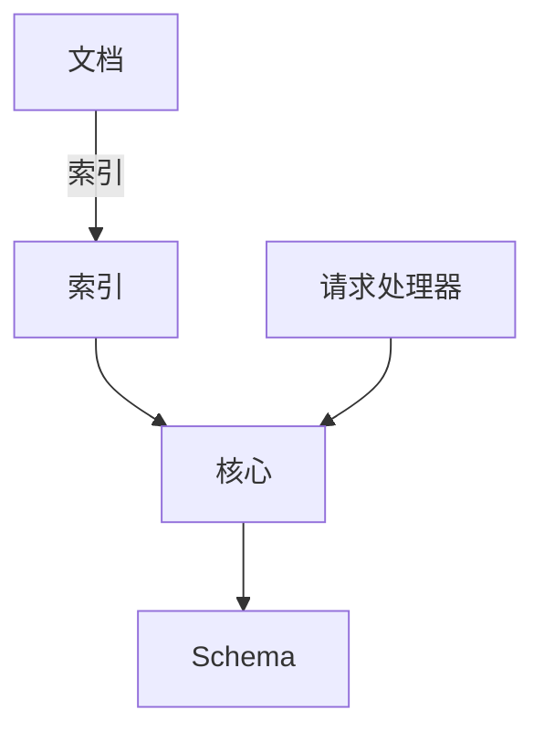
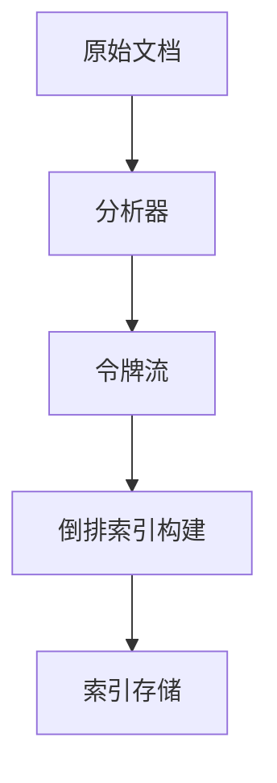
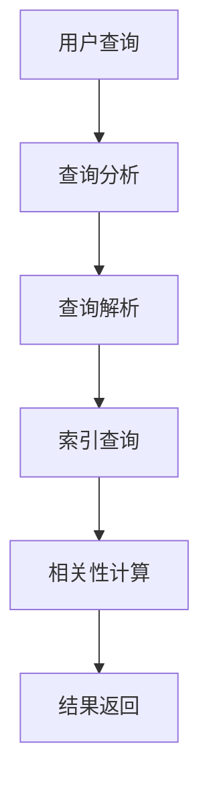

# Solr原理与代码实例讲解

## 1.背景介绍

### 1.1 什么是Solr

Solr是一个开源的搜索平台,它基于Apache Lucene构建,提供了强大的全文搜索、命中标示、分面搜索、动态聚类、数据库集成和丰富的文档处理等功能。Solr可以高度扩展,提供了分布式搜索和索引复制等特性,适用于大规模的搜索应用程序。

### 1.2 Solr的应用场景

Solr被广泛应用于各种领域,包括网站搜索、文档搜索、商品搜索、日志分析等。以下是一些典型的应用场景:

- 电子商务网站商品搜索
- 门户网站内容搜索
- 企业知识库搜索
- 日志分析和监控
- 社交网络数据分析

### 1.3 Solr与传统数据库的区别

与传统的关系型数据库相比,Solr具有以下优势:

- 全文搜索能力强大,支持模糊查询、同义词查询等高级搜索功能
- 搜索速度快,基于倒排索引实现高效检索
- 支持分面搜索,帮助用户快速缩小结果范围
- 可扩展性强,支持分布式部署和索引分片

## 2.核心概念与联系

### 2.1 核心概念

以下是Solr中一些重要的核心概念:

#### 2.1.1 索引(Index)

索引是Solr中存储和组织数据的核心结构。Solr将文档数据转换为倒排索引,以便快速检索。

#### 2.1.2 文档(Document)

文档是Solr中表示数据的基本单元,由一组键值对(field-value)组成。文档可以是任何类型的结构化或非结构化数据。

#### 2.1.3 核心(Core)

核心是Solr中的一个独立的索引和配置环境,每个核心都有自己的索引、配置和数据。一个Solr实例可以包含多个核心。

#### 2.1.4 Schema

Schema定义了文档的结构,包括字段类型、字段属性等。它决定了如何构建索引和处理查询。

#### 2.1.5 请求处理器(Request Handler)

请求处理器是Solr中处理查询请求的组件,不同的请求处理器用于不同的操作,如搜索、索引、更新等。

### 2.2 核心概念之间的关系

上述核心概念之间存在以下关系:

1. 文档被索引并存储在索引中。
2. 索引由一个或多个核心管理。
3. 每个核心都有自己的Schema,定义了文档的结构。
4. 请求处理器负责处理不同类型的请求,如搜索、索引等。

这些概念相互关联,共同构建了Solr的搜索和索引功能。



## 3.核心算法原理具体操作步骤

### 3.1 索引创建过程

Solr的索引创建过程包括以下步骤:

1. **文档分析(Analysis)**: 将原始文档数据转换为可索引的令牌流(token stream)。这个过程包括字符过滤、分词、标准化等步骤。

2. **令牌化(Tokenization)**: 将文本分割成单独的词条或令牌。

3. **过滤(Filtering)**: 对令牌进行规范化处理,如小写、去除停用词、词干提取等。

4. **倒排索引构建(Inverted Index)**: 将处理后的令牌与文档ID映射,构建倒排索引结构。倒排索引是一种数据结构,它将词条与包含该词条的文档列表相关联。

5. **索引存储(Storage)**: 将构建好的倒排索引持久化存储到磁盘上。



### 3.2 搜索查询过程

Solr的搜索查询过程包括以下步骤:

1. **查询分析(Query Analysis)**: 将用户输入的查询字符串转换为查询对象。这个过程与索引创建时的文档分析类似,包括字符过滤、分词、标准化等步骤。

2. **查询解析(Query Parsing)**: 将分析后的查询对象解析为Solr内部的查询表示形式。

3. **索引查询(Index Search)**: 使用倒排索引快速查找与查询相关的文档。

4. **相关性计算(Relevance Scoring)**: 对匹配的文档进行相关性评分,根据评分对结果进行排序。

5. **结果返回(Result Rendering)**: 将排序后的结果转换为响应格式(如XML、JSON等)返回给客户端。



## 4.数学模型和公式详细讲解举例说明

### 4.1 TF-IDF算法

TF-IDF(Term Frequency-Inverse Document Frequency)是一种广泛使用的文本相关性评分算法。它结合了词条在文档中出现的频率(TF)和词条在整个文档集中的稀有程度(IDF),计算每个词条对文档的重要性。

TF-IDF的计算公式如下:

$$tfidf(t, d, D) = tf(t, d) \times idf(t, D)$$

其中:

- $t$ 表示词条
- $d$ 表示文档
- $D$ 表示文档集合

#### 4.1.1 词条频率(TF)

词条频率(Term Frequency)表示一个词条在文档中出现的次数,可以使用以下公式计算:

$$tf(t, d) = \frac{n_{t,d}}{\sum_{t' \in d} n_{t',d}}$$

其中:

- $n_{t,d}$ 表示词条 $t$ 在文档 $d$ 中出现的次数
- 分母表示文档 $d$ 中所有词条出现次数的总和

#### 4.1.2 逆向文档频率(IDF)

逆向文档频率(Inverse Document Frequency)表示一个词条在整个文档集合中的稀有程度。一个在所有文档中频繁出现的词条,其重要性较低;而一个在少数文档中出现的词条,其重要性较高。IDF的计算公式如下:

$$idf(t, D) = \log \frac{|D| + 1}{df(t, D) + 1}$$

其中:

- $|D|$ 表示文档集合 $D$ 中文档的总数
- $df(t, D)$ 表示包含词条 $t$ 的文档数量

通过将TF和IDF相乘,可以获得每个词条对文档的重要性评分。TF-IDF算法广泛应用于信息检索、文本挖掘和自然语言处理等领域。

### 4.2 BM25算法

BM25是一种著名的相关性评分算法,它是TF-IDF算法的改进版本,考虑了文档长度对评分的影响。BM25算法的公式如下:

$$score(d, q) = \sum_{t \in q} idf(t) \cdot \frac{tf(t, d) \cdot (k_1 + 1)}{tf(t, d) + k_1 \cdot (1 - b + b \cdot \frac{|d|}{avgdl})}$$

其中:

- $d$ 表示文档
- $q$ 表示查询
- $t$ 表示查询中的词条
- $tf(t, d)$ 表示词条 $t$ 在文档 $d$ 中出现的次数
- $idf(t)$ 表示词条 $t$ 的逆向文档频率
- $|d|$ 表示文档 $d$ 的长度
- $avgdl$ 表示文档集合中所有文档的平均长度
- $k_1$ 和 $b$ 是调节参数,用于控制词条频率和文档长度对评分的影响程度

BM25算法通过引入文档长度因子,解决了TF-IDF算法对长文档评分过高的问题。它在信息检索领域广泛应用,被认为是目前最有效的相关性评分算法之一。

## 5.项目实践:代码实例和详细解释说明

在本节中,我们将通过一个简单的Java示例程序,演示如何使用Solr进行索引和搜索操作。

### 5.1 环境准备

首先,我们需要安装和配置Solr。你可以从官方网站下载Solr的二进制包,解压后即可使用。

接下来,我们创建一个Maven项目,并在`pom.xml`文件中添加Solr客户端依赖:

```xml
<dependency>
    <groupId>org.apache.solr</groupId>
    <artifactId>solr-solrj</artifactId>
    <version>8.11.2</version>
</dependency>
```

### 5.2 索引操作

下面是一个简单的索引操作示例:

```java
import org.apache.solr.client.solrj.impl.HttpSolrClient;
import org.apache.solr.common.SolrInputDocument;

public class SolrIndexingExample {
    public static void main(String[] args) throws Exception {
        // 创建Solr客户端
        HttpSolrClient solrClient = new HttpSolrClient.Builder("http://localhost:8983/solr/mycore").build();

        // 创建文档对象
        SolrInputDocument document = new SolrInputDocument();
        document.addField("id", "1");
        document.addField("title", "Solr入门教程");
        document.addField("content", "本教程介绍了Solr的基本概念和使用方法。");

        // 添加文档到索引
        solrClient.add(document);
        solrClient.commit();

        // 关闭客户端
        solrClient.close();
    }
}
```

在这个示例中,我们首先创建了一个`HttpSolrClient`对象,用于与Solr服务器进行通信。然后,我们创建了一个`SolrInputDocument`对象,并设置了文档的字段值。最后,我们调用`add()`方法将文档添加到索引中,并调用`commit()`方法将更改提交到Solr服务器。

### 5.3 搜索操作

下面是一个简单的搜索操作示例:

```java
import org.apache.solr.client.solrj.impl.HttpSolrClient;
import org.apache.solr.client.solrj.response.QueryResponse;
import org.apache.solr.common.SolrDocumentList;

public class SolrSearchExample {
    public static void main(String[] args) throws Exception {
        // 创建Solr客户端
        HttpSolrClient solrClient = new HttpSolrClient.Builder("http://localhost:8983/solr/mycore").build();

        // 执行查询
        QueryResponse response = solrClient.query("title:Solr");

        // 获取结果
        SolrDocumentList documents = response.getResults();
        for (int i = 0; i < documents.size(); ++i) {
            System.out.println(documents.get(i));
        }

        // 关闭客户端
        solrClient.close();
    }
}
```

在这个示例中,我们首先创建了一个`HttpSolrClient`对象,用于与Solr服务器进行通信。然后,我们调用`query()`方法执行搜索查询,并获取查询结果。最后,我们遍历结果集,并打印出每个文档的内容。

## 6.实际应用场景

Solr在各种领域都有广泛的应用,以下是一些典型的应用场景:

### 6.1 电子商务网站商品搜索

在电子商务网站中,Solr可以用于构建高效的商品搜索功能。它支持全文搜索、分面搜索、动态聚类等特性,帮助用户快速找到所需的商品。同时,Solr还可以用于实现个性化推荐、相关商品推荐等功能。

### 6.2 门户网站内容搜索

门户网站通常包含大量的文章、新闻、博客等内容。使用Solr可以为这些内容构建高效的搜索功能,提供全文搜索、相关性排序等功能,提升用户体验。

### 6.3 企业知识库搜索

在企业内部,Solr可以用于构建知识库搜索系统,帮助员工快速查找所需的文档、手册、培训资料等内容。这有助于提高工作效率,促进知识共享。

### 6.4 日志分析和监控

Solr可以用于收集和分析各种日志数据,如应用程序日志、网络日志、安全日志等。通过对日志数据进行索