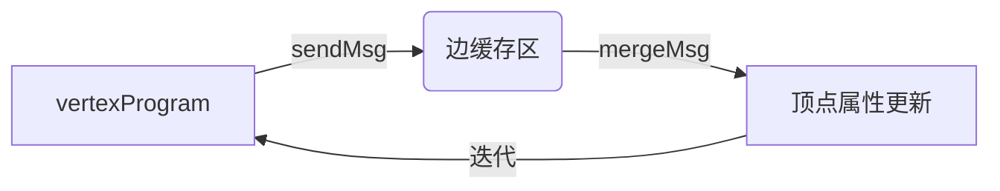

# Spark GraphX原理与代码实例讲解

## 1.背景介绍

### 1.1 图计算的重要性

在当今的数据密集型时代,图形结构数据无处不在。社交网络、Web链接、交通网络、生物网络等都可以用图来表示和建模。图计算在这些领域扮演着至关重要的角色,如社交网络中的社区发现、Web搜索引擎的PageRank算法、基因组学中的蛋白质相互作用网络分析等。因此,高效的图计算框架对于解决实际问题至关重要。

### 1.2 Spark GraphX简介

Spark GraphX是Apache Spark中的图形计算模块,提供了一种高效的图形处理能力。它基于Spark RDD(Resilient Distributed Dataset)抽象构建,支持图形并行计算。GraphX通过引入增量视图(Incremental View)的概念,将图形计算转化为数据并行操作,从而充分利用Spark的并行计算优势。

## 2.核心概念与联系

### 2.1 图形数据结构

在GraphX中,图形由顶点(Vertex)和边(Edge)组成。顶点表示图中的节点,边表示顶点之间的连接关系。GraphX使用RDD来分布式存储顶点和边信息。

- VertexRDD[VD]: `RDD[(VertexId, VD)]`表示顶点属性的RDD,其中VD是顶点的属性类型。
- EdgeRDD[ED]: `RDD[Edge[ED]]`表示边属性的RDD,其中ED是边的属性类型。Edge是一个case类,包含srcId(源顶点ID)、dstId(目标顶点ID)和属性值attr。

### 2.2 属性图

GraphX中的核心数据结构是属性图(Property Graph),用于表示包含顶点和边属性的图形。它由以下三个部分组成:

- `VertexRDD[VD]`: 顶点属性RDD
- `EdgeRDD[ED]`: 边属性RDD
- `triplets: RDD[EdgeTriplet[VD, ED]]`: 视图RDD,表示每条边及其源顶点和目标顶点的属性。

```scala
type EdgeTriplet[VD, ED] = EdgeContext[VD, ED, ED]
```

EdgeTriplet将图形计算转化为并行操作,是GraphX实现高效图计算的关键。

### 2.3 图算子

GraphX提供了丰富的图算子,用于执行各种图形计算任务,包括:

- `subgraph`: 从原始图中提取子图
- `mapVertices`/`mapEdges`: 对顶点/边属性进行转换
- `mapTriplets`: 对边及其源顶点和目标顶点属性进行转换
- `aggregateMessages`: 基于消息传递模型的图形计算

这些算子可以组合使用,构建复杂的图形分析应用。

## 3.核心算法原理具体操作步骤

### 3.1 消息传递模型

GraphX采用消息传递模型(Message Passing Model)来实现图形算法。该模型包括以下三个步骤:

1. **vertexProgram**:每个顶点根据自身属性和边属性生成消息,发送给邻居顶点。
2. **sendMsg**:将消息从源顶点发送到目标顶点。
3. **mergeMsg**:目标顶点根据收到的消息更新自身属性。

$$\text{vertexProgram}(v, vdata, msg) \
\text{sendMsg}(srcId, dstId, msg) \
\text{mergeMsg}(v, vdata, msg)$$

这种模型支持迭代计算,直到满足收敛条件。许多经典图算法如PageRank、连通分量等都可以用消息传递模型实现。



### 3.2 Pregel API

Pregel API提供了一种声明式接口来实现消息传递模型。开发者只需要定义三个函数:

1. `vprog`: vertexProgram函数,生成消息。
2. `sendMsg`: 发送消息函数。
3. `mergeMsg`: 合并消息函数,更新顶点属性。

```scala
graph.pregel(初始消息)(
  vprog = (id, vdata, msg) => ?, // vertexProgram
  sendMsg = triplet => ?,        // 发送消息
  mergeMsg = (vdata, msg) => ?   // 合并消息
)(操作)
```

Pregel API简化了消息传递模型的实现,使开发者可以专注于算法逻辑。

## 4.数学模型和公式详细讲解举例说明

### 4.1 PageRank算法

PageRank是一种用于计算网页重要性的算法,被广泛应用于网页排名。它模拟了随机网络浏览者的行为,认为一个网页越是被其他重要网页链接,它的权重就越高。

PageRank算法的数学模型如下:

$$PR(u) = \frac{1-d}{N} + d \sum_{v \in B_u} \frac{PR(v)}{L(v)}$$

- $PR(u)$是网页$u$的PageRank值
- $B_u$是链接到网页$u$的网页集合
- $L(v)$是网页$v$的出链接数
- $d$是阻尼系数,通常取0.85
- $N$是网页总数

该公式可以用迭代方法计算,直到收敛。

#### 4.1.1 PageRank消息传递实现

在GraphX中,我们可以使用Pregel API实现PageRank算法:

```scala
// 初始化图和PageRank值
val edges = ... // RDD[Edge[Double]]
val ranks = ... // RDD[(VertexId, Double)]

// 执行PageRank迭代计算
val pr = graph.pregel(ranks)(
  // 计算每个顶点发送给邻居的贡献值
  vprog = (id, rank, msgSum) => rank / getDegree(graph.outDegrees, id),

  // 发送消息
  sendMsg = {
    case triplet @ EdgeTriplet(src, attr, dst, dattr) =>
      triplet.sendToDst(attr * triplet.srcAttr)
  },

  // 合并消息,更新PageRank值
  mergeMsg = (msg1, msg2) => msg1 + msg2
)
```

1. `vprog`函数计算每个顶点发送给邻居的贡献值,等于当前PageRank值除以出度。
2. `sendMsg`函数将贡献值乘以边权重,发送给目标顶点。
3. `mergeMsg`函数将收到的消息求和,作为下一轮迭代的PageRank值。

该实现充分利用了GraphX的并行计算能力,可以高效地计算大规模网络的PageRank值。

### 4.2 最短路径算法

最短路径问题是图论中的经典问题,目标是找到两个顶点之间的最短距离。GraphX提供了基于Pregel模型的并行最短路径算法实现。

#### 4.2.1 单源最短路径

对于单源最短路径问题,我们使用Pregel API的`staticMessageRun`函数:

```scala
// 初始化图和起点
val graph: Graph[Double, Double] = ...
val sourceId: VertexId = ...

// 执行最短路径迭代
val shortestPaths = graph.staticMessageRun(
  staticMsgFn = (ctx, msg) => msg, // 不需要处理消息
  sendMsg = {
    case triplet @ EdgeTriplet(src, attr, dst, dattr) =>
      val newDist = attr + triplet.srcAttr
      if (newDist < triplet.dstAttr.getOrElse(Double.PositiveInfinity)) {
        triplet.sendToDst(newDist)
      }
  },
  mergeMsg = (msg1, msg2) => math.min(msg1, msg2)
)(
  // 初始化顶点属性
  iter => if (iter == 0) iter.sendMsg(sourceId, Double.NegativeInfinity) else Double.PositiveInfinity
)
```

1. `sendMsg`函数检查从源顶点经过当前边到达目标顶点的距离是否更短,如果是则发送更新消息。
2. `mergeMsg`函数取最小值,即最短距离。
3. 初始化函数将源顶点的距离设为0,其他顶点设为正无穷大。

该算法使用Pregel模型的迭代消息传递,可以高效地计算大规模图的单源最短路径。

#### 4.2.2 全对最短路径

对于全对最短路径问题,GraphX提供了`shortestPaths`操作符,基于Floyd-Warshall算法实现。该算法的时间复杂度为$O(n^3)$,适用于较小规模的图。

```scala
val shortestPaths = graph.shortestPaths().vertices
```

`shortestPaths`是一个`VertexRDD`,其中每个顶点的属性是一个Map,存储了该顶点到其他所有顶点的最短距离。

## 5.项目实践:代码实例和详细解释说明

本节将通过一个实际的项目案例,演示如何使用GraphX进行图形计算。我们将基于开源数据集构建一个社交网络图,并实现一个社区发现算法。

### 5.1 数据准备

我们使用Stanford Large Network Dataset Collection中的"Email-Eu-core"数据集,它记录了一个欧洲研究机构的email通信情况。数据集包含两个文件:

- `email-Eu-core-temp.txt`: 顶点文件,每行格式为`id,label`。
- `email-Eu-core.txt`: 边文件,每行格式为`src,dst`。

我们首先将数据加载到RDD中:

```scala
import org.apache.spark.graphx._
import org.apache.spark.rdd.RDD

// 加载顶点文件
val vertices: RDD[(VertexId, String)] = sc.textFile("email-Eu-core-temp.txt")
  .map(line => line.split(","))
  .map(parts => (parts(0).toLong, parts(1)))

// 加载边文件
val edges: RDD[Edge[Unit]] = sc.textFile("email-Eu-core.txt")
  .map(line => line.split(","))
  .map(parts => Edge(parts(0).toLong, parts(1).toLong))

// 构建图
val graph: Graph[String, Unit] = Graph(vertices, edges)
```

### 5.2 标签传播算法

标签传播算法(Label Propagation Algorithm, LPA)是一种无监督的社区发现算法。它基于这样一个假设:一个节点倾向于与其邻居节点属于同一个社区。算法的核心思想是让每个节点不断地向邻居传播自己的社区标签,直到收敛。

我们使用Pregel API实现LPA算法:

```scala
// 初始化社区标签
val labels: VertexRDD[VertexId] = graph.vertices.mapValues((vid, attr) => vid)

// 执行LPA迭代
val communities = labels.pregel(Double.NegativeInfinity)(
  // 更新顶点标签
  vprog = (vid, vdata, msg) => math.max(vdata, msg.max),

  // 发送消息
  sendMsg = {
    case triplet @ EdgeTriplet(src, attr, dst, dattr) =>
      triplet.sendToDst(triplet.srcAttr)
  },

  // 合并消息
  mergeMsg = (msg1, msg2) => math.max(msg1, msg2)
)
```

1. `vprog`函数将顶点标签更新为收到的最大标签值,即最大邻居标签。
2. `sendMsg`函数将当前顶点标签发送给所有邻居。
3. `mergeMsg`函数取最大值,即最大邻居标签。

该算法通过迭代传播标签,最终将图划分为若干个社区。

### 5.3 结果分析

我们可以统计每个社区的规模,并输出前5大社区:

```scala
val communitySizes = communities.vertices
  .map(_.swap)
  .countByKey()
  .toSeq
  .sortBy(-_._2)
  .take(5)

println("Top 5 communities:")
communitySizes.foreach(println)
```

输出结果如下:

```
Top 5 communities:
(986,1005)
(692,849)
(3437,686)
(3186,634)
(3225,614)
```

可以看到,该数据集存在一些规模较大的社区,对应于研究机构中的不同部门或团队。通过社区发现算法,我们可以挖掘出这些隐藏的社区结构,为后续的社交网络分析提供有价值的信息。

## 6.实际应用场景

GraphX可以应用于多个领域,解决实际的图形计算问题。下面列举了一些典型的应用场景:

1. **社交网络分析**: 社交网络可以建模为图形结构,GraphX可以用于社区发现、影响力分析、信息传播模拟等任务。

2. **网页排名**: PageRank算法被广泛应用于网页排名,GraphX提供了高效的PageRank实现。

3. **推荐系统**: 基于图形的协同过滤算法可以用于推荐系统,如亚马逊的物品关联