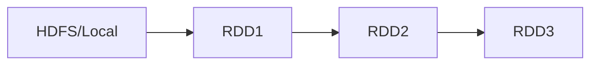

# Spark RDD原理与代码实例讲解

## 1. 背景介绍
### 1.1 大数据处理的挑战
随着数据量的爆炸式增长,传统的数据处理方式已经无法满足实时性、高吞吐量的大数据处理需求。Hadoop MapReduce等批处理框架虽然能够处理海量数据,但是其处理延迟较高,无法满足实时计算的场景。
### 1.2 Spark的诞生
Spark作为内存计算框架应运而生,其以RDD(Resilient Distributed Dataset)为核心,提供了高效、易用的大规模数据处理模型。Spark基于内存计算,避免了不必要的磁盘IO,大大提升了数据处理的实时性能。
### 1.3 RDD的重要性
RDD作为Spark的核心抽象,是Spark数据处理的基础。深入理解RDD的原理和使用,是掌握Spark编程的关键。本文将从RDD的概念入手,结合代码实例深入讲解RDD的原理和使用。

## 2. 核心概念与联系
### 2.1 RDD概念
RDD(Resilient Distributed Dataset)是Spark的基本数据结构,它是一个不可变、可分区、里面的元素可并行计算的集合。RDD具有以下特点:

- Immutable:一旦创建,RDD就不能修改。这保证了RDD的一致性和容错性。
- Partitioned:RDD中的数据被分成多个分区,分布在集群的不同节点上,以实现并行计算。
- Resilient:RDD通过血统(Lineage)记录数据的转换过程,可以容错和恢复。
- In-Memory:RDD支持数据缓存在内存中,加速后续的计算。

### 2.2 RDD五大特性
RDD主要有五大特性:

1. 有一个分区列表
2. 有一个函数计算每个分区
3. 对其他RDD的依赖列表
4. 可选:key-value型RDD是根据哈希来分区
5. 可选:每个分区的优先位置列表(移动数据不如移动计算)

### 2.3 RDD之间的依赖关系
RDD之间的依赖关系分为窄依赖(Narrow Dependency)和宽依赖(Wide Dependency)。

- 窄依赖:每个父RDD的分区只被一个子RDD的分区使用。如map、filter等操作。
- 宽依赖:多个子RDD的分区会依赖同一个父RDD的分区。如groupByKey、reduceByKey等操作。

窄依赖有利于容错和并行计算,而宽依赖则会引入shuffle,影响性能。

### 2.4 RDD的血统(Lineage)
RDD不保存数据,而是记录数据的来源和转换关系,即血统(Lineage)。通过血统,RDD可以重新计算丢失的分区,实现容错。同时,血统也用于生成DAG(有向无环图),Spark通过DAG调度任务。



## 3. 核心算法原理和具体操作步骤
### 3.1 RDD的创建
RDD可以通过两种方式创建:

1. 从外部数据源创建,如HDFS、HBase、Local File等。
2. 对已有RDD进行转换,如map、filter、join等。

示例:从HDFS创建RDD

```scala
val lines = sc.textFile("hdfs://path/to/file")
```

### 3.2 RDD的转换(Transformation)
RDD的转换操作是延迟执行的,即只记录转换逻辑而不立即执行,只有遇到Action操作时才会真正执行。常见的转换操作有:

- map:对RDD中的每个元素都执行一个函数并生成新的RDD。
- filter:对RDD中的每个元素应用一个函数,返回满足条件的元素组成新的RDD。
- flatMap:与map类似,但每个元素输入项都可以生成0到多个输出项。
- groupByKey:对<key,value>型RDD,按key进行分组。
- reduceByKey:对<key,value>型RDD,按key进行聚合。

示例:对RDD进行转换

```scala
val words = lines.flatMap(_.split(" "))
val pairs = words.map(word => (word, 1))
val counts = pairs.reduceByKey(_ + _)
```

### 3.3 RDD的缓存
频繁用到的RDD可以使用persist或cache方法将其缓存在内存中,加速后续的计算。Spark提供了多个存储级别,可以根据需要选择:

- MEMORY_ONLY:只存内存。
- MEMORY_AND_DISK:内存放不下则溢写到磁盘。
- DISK_ONLY:只存磁盘。

示例:缓存RDD

```scala
val cachedCounts = counts.cache()
```

### 3.4 RDD的行动(Action)
RDD的行动操作会触发实际计算,返回结果给Driver程序或写入外部存储系统。常见的行动操作有:

- reduce:对RDD中元素进行聚合。
- collect:将RDD中所有元素返回Driver程序。
- count:返回RDD中元素个数。
- saveAsTextFile:将RDD中元素保存到文本文件。

示例:对RDD执行行动操作

```scala
val sum = rdd.reduce(_ + _)
val array = rdd.collect()
rdd.saveAsTextFile("hdfs://path/to/output")
```

## 4. 数学模型和公式详细讲解举例说明
### 4.1 RDD的数学模型
RDD可以用一个三元组$(D,P,F)$来表示:

- $D$:RDD的数据集合。
- $P$:数据集$D$上的分区集合。每个$p \in P$是$D$的一个子集且$\cup_{p \in P} = D$。
- $F$:计算每个分区的函数。

例如,对于RDD`lines`,其数据集合$D$为所有行的集合,分区$P$为行的子集,函数$F$为读取分区中每一行的操作。

### 4.2 RDD转换的数学表示
RDD的转换可以表示为将一个RDD映射为另一个新的RDD。设原RDD为$(D_1,P_1,F_1)$,经过转换$f$后得到新的RDD $(D_2,P_2,F_2)$。则有:

- $D_2 = \cup_{d \in D_1} f(d)$
- $P_2 = P_1$
- $F_2 = F_1 \circ f$

其中$f$为转换函数,$\circ$表示函数复合。这个数学模型描述了RDD转换前后数据、分区、计算函数之间的关系。

### 4.3 数据倾斜问题
在实际使用中,如果某些key对应的数据量far远大于其他key,就会产生数据倾斜,导致该key所在的任务执行时间far远长于其他任务,影响整体性能。

例如,对于`reduceByKey`操作,某些key的数据量可能far远多于其他key。设$N$为RDD总数据量,$K$为不同key的数量,$N_i$为第$i$个key对应的数据量,则计算复杂度为:

$$
T = O(\max_{1 \leq i \leq K} N_i)
$$

可见,单个key的数据量越大,整个任务的耗时也越长。常见的数据倾斜解决方案有:

- 提前处理:对倾斜key提前进行聚合,减少后续shuffle的数据量。
- 过滤少数导致倾斜的key。
- 自定义partitioner:尽量保证不同key均匀分布在不同partition中。

## 5. 项目实践:代码实例和详细解释说明
下面通过一个实际的词频统计项目,演示RDD的完整使用流程。

### 5.1 读取文本文件创建RDD

```scala
val lines = sc.textFile("hdfs://path/to/file")
```

这里从HDFS读取文本文件创建名为`lines`的RDD,每个元素为文件中的一行。

### 5.2 分词
对每一行文本进行分词,得到单词RDD。

```scala
val words = lines.flatMap(_.split(" "))
```

`flatMap`将行拆分为单词,返回新的单词RDD。

### 5.3 转换为(单词,1)键值对

```scala
val pairs = words.map(word => (word, 1))
```

`map`将每个单词转换为(单词,1)的键值对形式,方便后续按单词聚合。

### 5.4 按单词聚合求和

```scala
val counts = pairs.reduceByKey(_ + _)
```

`reduceByKey`按单词进行分组,对每个单词对应的计数求和,得到每个单词的词频。

### 5.5 缓存RDD

```scala
val cachedCounts = counts.cache()
```

将`counts`RDD缓存到内存,方便后续重复使用。

### 5.6 执行行动操作

```scala
val array = cachedCounts.collect()
array.foreach(println)
cachedCounts.saveAsTextFile("hdfs://path/to/output")
```

`collect`将结果以数组形式返回Driver程序并打印,`saveAsTextFile`将结果写入HDFS文件。这些行动操作会触发实际计算。

## 6. 实际应用场景
RDD在Spark的众多实际应用场景中发挥着核心作用,下面列举几个典型应用:

### 6.1 日志分析
将服务器日志加载为RDD,对日志进行过滤、转换、聚合分析,挖掘用户行为特征、统计PV/UV等关键指标。

### 6.2 用户推荐
基于用户历史行为数据(如浏览、点击、购买等)构建用户画像RDD,对用户和商品进行特征提取,训练推荐模型,在线生成用户个性化推荐。

### 6.3 图计算
将图结构数据加载为RDD,基于RDD实现PageRank、社区发现等图计算算法,应用于社交网络、金融风控等领域。

### 6.4 机器学习
Spark MLlib基于RDD实现了众多常用的机器学习算法,包括分类、回归、聚类、协同过滤等。用户可以方便地加载训练数据为RDD,调用MLlib提供的算法API进行模型训练和预测。

## 7. 工具和资源推荐
### 7.1 编程工具
- Scala:Spark的主要编程语言,函数式编程特性与RDD契合。
- PySpark:Spark的Python版本,适合Python工程师使用。
- IntelliJ IDEA:功能强大的Scala/Spark IDE。

### 7.2 部署工具
- Spark Standalone:Spark自带的资源管理和任务调度框架。
- YARN:Hadoop生态的资源管理系统,Spark可以运行在YARN之上。
- Mesos:跨集群的资源管理系统,支持多种计算框架。

### 7.3 学习资源
- Spark官方文档:权威的Spark使用指南。
- 《Spark大数据处理:技术、应用与性能优化》:深入讲解Spark原理和优化。
- Spark Summit:Spark领域顶级会议,分享最新的应用实践和优化经验。

## 8. 总结:未来发展趋势与挑战
### 8.1 结构化API的兴起
DataFrame、Dataset等结构化API正逐渐成为主流的Spark编程范式。结构化API提供了更高级的抽象和优化,简化了开发并提升了性能。RDD仍是底层的数据抽象,但是更多的应用会基于结构化API来构建。

### 8.2 数据源API的发展
Data Source API允许Spark与外部数据源系统无缝集成。未来将有更多的数据源实现该API,Spark有望成为大数据湖分析的统一平台。

### 8.3 机器学习的进一步集成
Spark已经成为机器学习的重要平台。未来Spark与TensorFlow、PyTorch等深度学习框架的集成将更加紧密,支持更多的算法和模型。

### 8.4 实时流计算的挑战
Structured Streaming基于微批次架构,在吞吐量和延迟之间权衡。未来Spark面临进一步降低延迟,实现真正实时流计算的挑战。

### 8.5 性能优化与自适应
随着数据规模和复杂度的增长,Spark需要更智能的优化和自适应能力。基于成本模型的优化、自动参数调优、数据倾斜检测等,将成为未来的重点研究方向。

RDD作为Spark的核心设计,在可预见的未来仍将发挥重要作用。深入理解和掌握RDD,对于高效使用Spark至关重要。

## 9. 附录:常见问题与解答
### Q1:什么时候使用RDD,什么时候使用DataFrame?
A1:当数据是