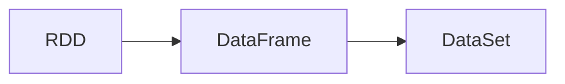
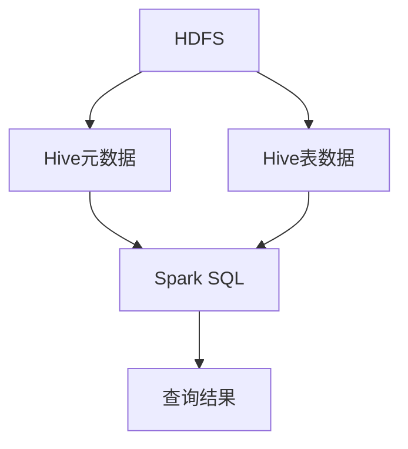

# Spark与Hive在电力数据处理中的应用

## 1.背景介绍
### 1.1 电力行业大数据处理现状
随着智能电网和物联网技术的快速发展,电力系统产生了海量的数据,包括用电量数据、设备状态数据、故障告警数据等。有效地存储、处理和分析这些大数据,对于提高电网运行效率、保障供电可靠性具有重要意义。然而,传统的数据处理架构和技术已经难以满足电力大数据时代的需求。

### 1.2 Spark和Hive的优势
近年来,大数据处理技术飞速发展,Hadoop生态圈中涌现出许多优秀的开源项目。其中,Spark和Hive凭借其出色的性能和易用性,在大数据处理领域占据了重要地位。

Spark是一个快速、通用的大规模数据处理引擎,具有如下优点:

1. 基于内存计算,处理速度快
2. 支持多种数据源和算法库
3. 提供Scala、Java、Python等多语言API
4. 可以与Hadoop无缝集成

Hive是基于Hadoop的一个数据仓库工具,可以将结构化的数据文件映射为一张数据库表,并提供SQL查询功能。Hive的优势包括:

1. 支持SQL,学习成本低
2. 统一的元数据管理
3. 适合用来对一段时间内的数据进行分析查询
4. 支持自定义函数,可以方便地扩展功能

### 1.3 Spark+Hive在电力行业的应用前景
Spark和Hive在电力行业大数据处理中可以发挥各自的优势,形成互补:

- 利用Spark进行实时和准实时的数据处理,如实时告警分析、负荷预测等
- 利用Hive进行离线和批量的数据分析,如用电行为分析、设备健康度评估等
- Spark SQL可以直接操作Hive中的数据,使二者很好地结合起来

因此,Spark+Hive必将在电力大数据处理中扮演越来越重要的角色。

## 2.核心概念与联系
### 2.1 Spark核心概念
#### 2.1.1 RDD
RDD(Resilient Distributed Dataset)是Spark的核心数据结构,表示一个不可变、可分区、里面的元素可并行计算的集合。RDD具有以下特性:

- 一个RDD由一个或多个分区(Partition)组成
- RDD的创建方式包括:加载外部数据集、在驱动器程序中对一个集合进行并行化、由其他RDD转换而来
- RDD支持两种类型的操作:转换(Transformation)和行动(Action)

#### 2.1.2 DataFrame和DataSet
DataFrame是Spark SQL的核心数据结构,与RDD类似,但是带有schema信息,即相当于一张二维表格。DataSet是DataFrame的一个扩展,提供了强类型的支持。它们的关系如下:



DataFrame和DataSet与RDD相比,具有更多的优化机会,如钨丝计划(Tungsten)、基于代价的优化器(Catalyst)等。

### 2.2 Hive核心概念
#### 2.2.1 表(Table)
Hive采用关系型数据库的方式来管理数据,支持对表的创建、查询等操作。Hive中的表可以分为以下几类:

- 托管表(Managed Table):由Hive管理其数据的生命周期
- 外部表(External Table):仅在Hive中存储表的元数据,数据由外部管理
- 分区表(Partitioned Table):在HDFS上根据分区键将数据划分到不同的目录
- 桶表(Bucketed Table):在每个分区内部根据哈希函数将数据划分到不同的文件

#### 2.2.2 HQL
HQL(Hive Query Language)是Hive提供的类SQL语言,用户可以使用HQL进行数据查询和分析。HQL支持的语法包括:

- DDL语句:如CREATE、ALTER
- DML语句:如LOAD、INSERT、SELECT
- 内置函数和用户自定义函数(UDF)
- 复杂数据类型:如ARRAY、MAP、STRUCT

### 2.3 Spark与Hive的关系
Hive可以将Hadoop上的结构化数据映射成表,并提供HQL查询,但其执行引擎是基于MapReduce的,处理效率较低。Spark SQL的出现弥补了这一缺陷。

Spark SQL可以直接加载Hive的元数据并执行HQL,也支持读写Hive表中的数据。同时,Spark SQL也可以单独作为一个分布式SQL引擎使用。二者的关系如下图:



## 3.核心算法原理具体操作步骤
### 3.1 Spark核心算法
#### 3.1.1 RDD的转换和行动算子
RDD支持多种转换算子,如map、filter、groupByKey等,这些算子将旧的RDD转换成新的RDD。同时RDD还支持多种行动算子,如reduce、collect等,行动算子会触发实际的计算。下面是一个使用Scala语言的wordcount的例子:

```scala
val textFile = sc.textFile("hdfs://...")
val counts = textFile.flatMap(line => line.split(" "))
                 .map(word => (word, 1))
                 .reduceByKey(_ + _)
counts.saveAsTextFile("hdfs://...")
```

其中flatMap、map、reduceByKey都是转换算子,saveAsTextFile是行动算子。

#### 3.1.2 Spark SQL的查询优化
Spark SQL使用Catalyst优化器自动优化用户提交的SQL语句。Catalyst由以下几个阶段组成:

1. 解析器(Parser):将SQL语句解析成抽象语法树AST
2. 分析器(Analyzer):对AST进行绑定和类型检查,生成逻辑计划
3. 优化器(Optimizer):对逻辑计划进行等价转换,如谓词下推、列剪裁等
4. 物理计划生成器(Planner):将优化后的逻辑计划转换成物理计划
5. 代码生成器(CodeGen):将物理计划编译成可执行的Java字节码

### 3.2 Hive核心操作
#### 3.2.1 表的创建与数据导入
可以使用HQL的CREATE TABLE语句创建Hive表,并使用LOAD DATA或INSERT INTO语句向表中导入数据。例如:

```sql
CREATE TABLE IF NOT EXISTS employee ( eid int, name String,
    salary String, destination String)
    COMMENT 'Employee details'
    ROW FORMAT DELIMITED
    FIELDS TERMINATED BY '\t'
    LINES TERMINATED BY '\n'
    STORED AS TEXTFILE;

LOAD DATA LOCAL INPATH '/home/employee.txt' OVERWRITE INTO TABLE employee;
```

#### 3.2.2 HQL查询示例
HQL支持多种查询语句,包括SELECT、JOIN、GROUP BY等。下面是一些常见的HQL查询示例:

```sql
-- 选择薪资最高的10位员工
SELECT * FROM employee ORDER BY salary DESC LIMIT 10;

-- 统计各部门员工的平均薪资
SELECT destination, AVG(salary) AS avg_salary FROM employee GROUP BY destination;

-- 与部门表联结查询员工信息
SELECT e.name, d.dept_name
FROM employee e JOIN department d
ON e.destination = d.dept_id;
```

## 4.数学模型和公式详细讲解举例说明
### 4.1 协同过滤算法
协同过滤是常用的推荐算法,它的核心思想是利用用户或物品之间的相似性进行推荐。以基于用户的协同过滤为例,它通过以下步骤计算用户的推荐列表:

1. 计算用户之间的相似度。常见的相似度度量包括:
- 欧几里得距离:
  $d(u,v)=\sqrt{\sum_{i=1}^{n}(x_{u,i}-x_{v,i})^2}$
- 皮尔逊相关系数:
  $s(u,v)=\frac{\sum_{i=1}^{n}(x_{u,i}-\bar{x}_u)(x_{v,i}-\bar{x}_v)}{\sqrt{\sum_{i=1}^{n}(x_{u,i}-\bar{x}_u)^2}\sqrt{\sum_{i=1}^{n}(x_{v,i}-\bar{x}_v)^2}}$

2. 选取与目标用户最相似的K个用户,计算他们对各个物品的加权评分:
$$p(u,i)=\bar{x}_u+\frac{\sum_{v\in S}s(u,v)(x_{v,i}-\bar{x}_v)}{\sum_{v\in S}|s(u,v)|}$$

其中$S$为相似用户集合。

3. 将加权评分高的物品作为推荐结果返回给用户。

### 4.2 逻辑回归模型
逻辑回归是一种常用的分类算法,它使用Sigmoid函数将线性回归的结果映射到(0,1)区间表示概率。其模型为:

$$P(y=1|x)=\frac{1}{1+e^{-wx}}=\sigma(wx)$$

其中$x$为特征向量,$w$为权重系数。逻辑回归的目标是最小化负对数似然函数:

$$\min_{w} \sum_{i=1}^{N}[-y_i\log(\sigma(wx_i))-(1-y_i)\log(1-\sigma(wx_i))]$$

求解该最优化问题的常用方法有梯度下降法和牛顿法。

## 5.项目实践：代码实例和详细解释说明
下面给出一些Spark和Hive的代码实例。

### 5.1 使用Spark进行词频统计
```scala
val conf = new SparkConf().setAppName("WordCount")
val sc = new SparkContext(conf)

val textFile = sc.textFile("hdfs://...")
val counts = textFile.flatMap(line => line.split(" "))
                 .map(word => (word, 1))
                 .reduceByKey(_ + _)

counts.saveAsTextFile("hdfs://...")
```

代码解释:

- 首先创建SparkContext,设置应用名称
- 使用textFile方法从HDFS上读取文本文件
- 对每一行文本进行分词,转换成(word, 1)的形式
- 使用reduceByKey进行单词计数
- 将结果写回HDFS

### 5.2 使用Hive统计员工平均薪资
```sql
CREATE TABLE IF NOT EXISTS employee ( eid int, name String,
    salary float, destination String)
    COMMENT 'Employee details'
    ROW FORMAT DELIMITED
    FIELDS TERMINATED BY '\t'
    LINES TERMINATED BY '\n'
    STORED AS TEXTFILE;

LOAD DATA LOCAL INPATH '/home/employee.txt' OVERWRITE INTO TABLE employee;

SELECT destination, AVG(salary) AS avg_salary
FROM employee
GROUP BY destination;
```

代码解释:

- 首先创建employee表,指定字段名和类型
- 从本地文件导入数据到employee表中
- 使用SELECT语句查询各部门的平均薪资,使用AVG函数和GROUP BY子句

### 5.3 Spark读取Hive表数据进行分析
```scala
val hiveCtx = new HiveContext(sc)

hiveCtx.sql("USE spark_test")
val employeeDF = hiveCtx.sql("SELECT * FROM employee")

val deptSalary = employeeDF.groupBy("destination")
                        .agg(avg("salary").alias("avg_salary"))

deptSalary.show()
```

代码解释:

- 首先创建HiveContext,传入SparkContext
- 使用sql方法切换到spark_test数据库,查询employee表
- 将查询结果注册为DataFrame,使用groupBy和agg方法计算平均薪资
- 调用show方法显示结果

## 6.实际应用场景
Spark和Hive在电力行业的实际应用非常广泛,下面列举几个典型场景。

### 6.1 电力负荷预测
- 将历史负荷数据存储在Hive中,使用Spark读取数据并进行特征工程
- 使用Spark MLlib训练负荷预测模型,如线性回归、随机森林等
- 将训练好的模型应用到实时负荷数据流上,进行短期和超短期预测

### 6.2 用户电费计算
- 将用户用电量、电价等数据存储在Hive表中
- 使用Hive的UDF函数计算每个用户的电费金额
- 使用Spark将电费数据与用户信息数据JOIN,生成账单信息

### 6.3 配电网故障分析
- 将配电网的SCADA、GIS等数据接入到Hive中
- 使用Spark Streaming实时处理故障告警数据流,检测异常
- 使用Spark SQL分析故障原因,如故障类型、故障设备等
- 使用Spark MLlib训练故障预测模型,提前预警

## 7.工具和资源推荐
### 7.1 开