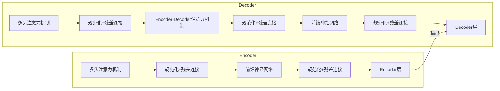

# Transformer大模型实战 BERT 的配置

## 1.背景介绍

### 1.1 自然语言处理的重要性

在当今信息时代,自然语言处理(NLP)已成为人工智能领域中最重要和最具挑战性的研究方向之一。作为人与机器交互的桥梁,NLP技术使计算机能够理解和生成人类语言,从而在诸多应用场景中发挥关键作用,如智能助手、机器翻译、文本摘要、情感分析等。

### 1.2 Transformer模型的崛起

传统的NLP模型如RNN、LSTM等存在着长期依赖问题和并行计算能力差的缺陷。2017年,谷歌大脑团队提出了Transformer模型,该模型完全基于注意力机制,摒弃了RNN的结构,大幅提升了并行计算能力。Transformer模型在机器翻译等任务上取得了突破性的表现,开启了NLP领域的新纪元。

### 1.3 BERT模型的重要意义

2018年,谷歌AI团队发布了BERT(Bidirectional Encoder Representations from Transformers)模型,这是第一个基于Transformer的双向编码器表示模型。BERT在预训练阶段引入了全新的掩蔽语言模型和下一句预测任务,在大规模无标记语料上进行预训练,学习到了深层次的语义表示。BERT在多项NLP任务上取得了state-of-the-art的表现,成为NLP领域最重要的里程碑式模型之一。

## 2.核心概念与联系

### 2.1 Transformer模型架构

Transformer模型由编码器(Encoder)和解码器(Decoder)两个核心模块组成。编码器将输入序列映射为高维度的语义表示,解码器则基于编码器的输出生成目标序列。两者均由多个相同的层组成,每层内部采用多头注意力机制和前馈神经网络。



### 2.2 BERT模型结构

BERT模型由多层Transformer编码器组成,输入为两个句子,通过特殊标记[CLS]和[SEP]进行拼接,并加入位置嵌入和段嵌入。BERT在预训练阶段引入了掩蔽语言模型和下一句预测两个任务,通过自监督方式学习通用语义表示。在下游任务上,BERT采用两种策略:一是直接添加输出层进行微调;二是将BERT的输出作为特征,送入其他模型进行训练。

```mermaid
graph LR
    Input[输入序列] --> Embedding[词嵌入+位置嵌入+段嵌入]
    Embedding --> Encoder1[Transformer编码器层1]
    Encoder1 --> Encoder2[Transformer编码器层2]
    Encoder2 --> ...
    ... --> EncoderN[Transformer编码器层N]
    EncoderN --> PooledOutput[[CLS]输出] --> Classification[分类任务输出层]
    EncoderN --> Sequence[序列输出] --> SequenceLabel[序列标注任务输出层]
```

## 3.核心算法原理具体操作步骤 

### 3.1 注意力机制

注意力机制是Transformer模型的核心,它能够捕捉输入序列中任意两个位置之间的长程依赖关系。具体来说,对于序列中的每个词,注意力机制会计算其与所有其他词的注意力权重,然后将所有词的词嵌入加权求和,作为该词的注意力表示。

$$\begin{aligned}
\text{Attention}(Q, K, V) &= \text{softmax}(\frac{QK^T}{\sqrt{d_k}})V \
\text{MultiHead}(Q, K, V) &= \text{Concat}(head_1, ..., head_h)W^O\
\text{where } head_i &= \text{Attention}(QW_i^Q, KW_i^K, VW_i^V)
\end{aligned}$$

其中$Q$、$K$、$V$分别表示查询(Query)、键(Key)和值(Value)。多头注意力机制将注意力计算过程分成多个并行的"头"进行计算,最后将所有头的结果拼接起来,增强了模型的表达能力。

### 3.2 位置编码

由于Transformer模型没有捕捉序列顺序的机制,因此需要为序列中的每个词添加位置编码,以区分不同位置的词。位置编码是一个与词嵌入同维度的向量,可以通过不同的函数生成,如三角函数等。在计算注意力时,位置编码会被加到词嵌入上。

$$\begin{aligned}
\text{PE}_{(pos, 2i)} &= \sin(pos/10000^{2i/d_{model}}) \
\text{PE}_{(pos, 2i+1)} &= \cos(pos/10000^{2i/d_{model}})
\end{aligned}$$

其中$pos$表示词在序列中的位置,$i$表示维度索引。位置编码能够很好地编码序列的位置信息,是Transformer模型的重要组成部分。

### 3.3 掩蔽语言模型(MLM)

BERT在预训练阶段采用了掩蔽语言模型(MLM)的任务。具体来说,对于输入序列中的某些词(如15%),BERT会用特殊标记[MASK]将它们替换掉,然后让模型去预测这些被掩蔽的词是什么。通过这种方式,BERT能够学习到双向的语义表示。

```python
# 输入序列
text = "The man went to [MASK] store with [MASK] dog"

# 对应的标签
labels = ["the", "his"]
```

在训练过程中,BERT会最大化被掩蔽词的预测概率,从而学习到上下文语义表示。

### 3.4 下一句预测(NSP)

除了MLM外,BERT还引入了下一句预测(NSP)的任务。具体来说,BERT会从语料库中抽取成对的句子,有50%的概率会保留原有顺序,另外50%的概率会颠倒两个句子的顺序。模型需要判断两个句子是否为连续的句子。通过这种方式,BERT能够捕捉句子间的关系和连贯性。

```python
# 输入为连续的两个句子
sentence_a = "The man went to the store."
sentence_b = "He bought a bag of apples." 
label = 1 # 是连续句子

# 输入为无关的两个句子 
sentence_a = "The dog played in the park."
sentence_b = "I love eating pizza."
label = 0 # 不是连续句子
```

NSP任务有助于BERT学习到跨句子级别的表示,对于诸如问答、自然语言推理等任务非常有帮助。

## 4.数学模型和公式详细讲解举例说明

### 4.1 Transformer模型公式推导

我们以Transformer编码器的计算过程为例,详细推导其数学模型。假设输入序列为$X = (x_1, x_2, ..., x_n)$,我们的目标是计算其对应的上下文表示$Z = (z_1, z_2, ..., z_n)$。

1) **词嵌入和位置编码**

首先,我们将输入序列$X$映射为词嵌入矩阵$E^X$,然后加上位置编码矩阵$E^{pos}$:

$$X' = E^X + E^{pos}$$

2) **多头注意力**

接下来,我们对$X'$进行多头注意力计算:

$$\begin{aligned}
\text{head}_i &= \text{Attention}(X'W_i^Q, X'W_i^K, X'W_i^V) \
\text{MultiHead}(X') &= \text{Concat}(\text{head}_1, ..., \text{head}_h)W^O
\end{aligned}$$

其中$W_i^Q$、$W_i^K$、$W_i^V$、$W^O$为可训练的投影矩阵。

3) **前馈神经网络**

然后,我们将多头注意力的输出$\text{MultiHead}(X')$通过前馈神经网络:

$$\text{FFN}(\text{MultiHead}(X')) = \max(0, \text{MultiHead}(X')W_1 + b_1)W_2 + b_2$$

其中$W_1$、$W_2$、$b_1$、$b_2$为可训练参数。

4) **残差连接和层归一化**

最后,我们对前馈神经网络的输出进行残差连接和层归一化:

$$\begin{aligned}
Z' &= \text{LayerNorm}(\text{FFN}(\text{MultiHead}(X')) + X') \
Z &= \text{LayerNorm}(Z' + \text{MultiHead}(Z'))
\end{aligned}$$

其中$Z$即为最终的上下文表示。通过上述步骤,Transformer编码器能够学习到输入序列的深层次语义表示。

### 4.2 BERT模型损失函数

BERT在预训练阶段的损失函数由两部分组成:掩蔽语言模型损失$\mathcal{L}_{\text{MLM}}$和下一句预测损失$\mathcal{L}_{\text{NSP}}$。

1) **掩蔽语言模型损失**

对于每个被掩蔽的词$x_i$,我们计算其在词表$\mathcal{V}$上的预测概率分布$P(x_i|\boldsymbol{h}_i)$,其中$\boldsymbol{h}_i$为该位置的BERT输出表示。MLM损失为:

$$\mathcal{L}_{\text{MLM}} = -\sum_{i \in \text{MaskedLM}} \log P(x_i|\boldsymbol{h}_i)$$

2) **下一句预测损失**

对于每对输入句子,我们将BERT的[CLS]位置输出$\boldsymbol{c}$通过一个分类器,计算其为连续句子的概率$P_{\text{isNext}}$。NSP损失为:

$$\mathcal{L}_{\text{NSP}} = -\log P_{\text{isNext}}$$

3) **总损失**

BERT的总损失为两部分损失的加权和:

$$\mathcal{L} = \mathcal{L}_{\text{MLM}} + \lambda \mathcal{L}_{\text{NSP}}$$

其中$\lambda$为平衡两个损失的超参数。通过最小化总损失,BERT能够在大规模语料上学习到通用的语义表示。

## 5.项目实践:代码实例和详细解释说明

在这一部分,我们将使用Hugging Face的Transformers库,演示如何对BERT模型进行微调和推理。以文本分类任务为例:

```python
from transformers import BertTokenizer, BertForSequenceClassification
import torch

# 加载预训练模型和tokenizer
model = BertForSequenceClassification.from_pretrained('bert-base-uncased')
tokenizer = BertTokenizer.from_pretrained('bert-base-uncased')

# 文本分类示例
text = "This movie is absolutely awesome! I loved it."
encoding = tokenizer.encode_plus(
    text,
    add_special_tokens=True,
    max_length=64,
    return_token_type_ids=False,
    padding='max_length',
    return_attention_mask=True,
    return_tensors='pt',
)

output = model(**encoding)
logits = output.logits
prob = torch.softmax(logits, dim=1).tolist()[0]

print(f"Label probabilties: {prob}")
```

代码解释:

1. 首先,我们从Hugging Face Hub中加载BERT模型和tokenizer。
2. 对输入文本进行tokenization,生成模型所需的输入张量。
3. 将处理后的输入喂给BERT模型,获取最终的logits输出。
4. 对logits进行softmax操作,得到每个类别的概率分布。

通过上述步骤,我们便可以利用预训练的BERT模型进行文本分类等下游任务。当然,在实际应用中,我们还需要对BERT进行微调,以获得更好的性能。

## 6.实际应用场景

BERT作为一种通用的语义表示模型,在自然语言处理的诸多领域都有广泛的应用:

1. **文本分类**: 将文本按主题、情感等分类,在新闻分类、垃圾邮件检测等场景