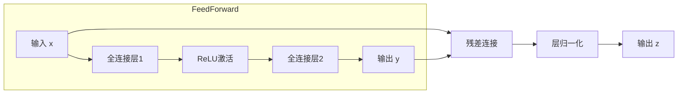

# Transformer大模型实战 前馈网络层

## 1.背景介绍

### 1.1 Transformer模型概述

Transformer是一种革命性的序列到序列(Sequence-to-Sequence)模型,由Google的Vaswani等人在2017年提出,主要应用于自然语言处理(NLP)任务。它完全基于注意力(Attention)机制构建,不再使用循环神经网络(RNN)或卷积神经网络(CNN),从而克服了RNN的长期依赖问题,大大提高了并行计算能力。

Transformer模型的核心组件包括编码器(Encoder)和解码器(Decoder),两者均由多个相同的层组成。每层由多头自注意力(Multi-Head Attention)和前馈网络(Feed-Forward Network)两个子层构成。

### 1.2 前馈网络在Transformer中的作用

前馈网络在Transformer模型中扮演着非常重要的角色。它位于每个编码器/解码器层的多头自注意力子层之后,主要目的是对来自注意力层的输出进行进一步处理和转换,提取更高层次的特征表示。

前馈网络通过两个全连接层对输入进行非线性映射,增强了模型的表达能力。第一个全连接层会将输入映射到一个更高维的空间,激活函数则引入非线性,第二个全连接层再将其映射回输出空间。

## 2.核心概念与联系

### 2.1 前馈网络的结构

前馈网络由两个全连接层组成,中间使用ReLU作为非线性激活函数。具体结构如下:

$$
FFN(x) = max(0, xW_1 + b_1)W_2 + b_2
$$

其中:
- $x$是来自前一子层(多头自注意力层)的输出
- $W_1 \in \mathbb{R}^{d_{model} \times d_{ff}}$和$W_2 \in \mathbb{R}^{d_{ff} \times d_{model}}$分别是两个全连接层的权重矩阵
- $b_1 \in \mathbb{R}^{d_{ff}}$和$b_2 \in \mathbb{R}^{d_{model}}$是相应的偏置向量
- $d_{model}$是模型的隐藏维度大小
- $d_{ff}$是前馈网络的内部维度,通常设置为$d_{model}$的4倍

### 2.2 前馈网络与自注意力的关系

前馈网络与多头自注意力层是互补的关系。自注意力层关注输入序列中不同位置之间的依赖关系,而前馈网络则在每个位置上独立地对向量进行非线性映射变换。

通过自注意力层捕获序列内部的长程依赖关系,前馈网络则对每个位置的表示进行增强,使其包含更丰富的特征信息。两者的结合使得Transformer模型能够同时关注序列内部和单个位置的信息,从而获得更强大的表达能力。

## 3.核心算法原理具体操作步骤

前馈网络的计算过程可以分为以下几个步骤:

1. **输入映射**:将来自前一子层(多头自注意力层)的输出$x \in \mathbb{R}^{d_{model}}$通过第一个全连接层映射到更高维的空间,得到$x_1 = xW_1 + b_1 \in \mathbb{R}^{d_{ff}}$。

2. **非线性激活**:对$x_1$应用ReLU激活函数,引入非线性变换,得到$x_2 = max(0, x_1)$。

3. **输出映射**:将$x_2$通过第二个全连接层映射回输出空间,得到最终输出$y = x_2W_2 + b_2 \in \mathbb{R}^{d_{model}}$。

4. **残差连接与层归一化**:为了更好地传递梯度并防止过拟合,前馈网络的输出$y$会与输入$x$进行残差连接,并接着进行层归一化(Layer Normalization)操作,得到最终输出$z$。



上述步骤可以用如下公式表示:

$$
z = LayerNorm(y + x)
$$

其中$LayerNorm$表示层归一化操作。

通过上述步骤,前馈网络对输入进行了非线性映射变换,提取了更高层次的特征表示,并与原始输入进行了残差连接,最终输出了增强后的特征向量$z$。

## 4.数学模型和公式详细讲解举例说明

### 4.1 前馈网络的数学表示

前馈网络的数学表示如下:

$$
FFN(x) = max(0, xW_1 + b_1)W_2 + b_2
$$

其中:
- $x \in \mathbb{R}^{d_{model}}$是来自前一子层(多头自注意力层)的输出
- $W_1 \in \mathbb{R}^{d_{model} \times d_{ff}}$是第一个全连接层的权重矩阵
- $b_1 \in \mathbb{R}^{d_{ff}}$是第一个全连接层的偏置向量
- $W_2 \in \mathbb{R}^{d_{ff} \times d_{model}}$是第二个全连接层的权重矩阵
- $b_2 \in \mathbb{R}^{d_{model}}$是第二个全连接层的偏置向量
- $d_{model}$是模型的隐藏维度大小
- $d_{ff}$是前馈网络的内部维度,通常设置为$d_{model}$的4倍

### 4.2 残差连接与层归一化

为了更好地传递梯度并防止过拟合,前馈网络的输出会与输入进行残差连接,并接着进行层归一化操作,得到最终输出$z$。

$$
z = LayerNorm(FFN(x) + x)
$$

其中$LayerNorm$表示层归一化操作,具体定义如下:

$$
LayerNorm(x) = \gamma \left(\frac{x - \mu}{\sqrt{\sigma^2 + \epsilon}}\right) + \beta
$$

- $\mu$和$\sigma^2$分别是$x$在最后一个维度上的均值和方差
- $\gamma$和$\beta$是可学习的缩放和平移参数
- $\epsilon$是一个很小的常数,用于保证数值稳定性

层归一化操作可以加快模型收敛速度,并提高模型的泛化能力。

### 4.3 前馈网络参数量

假设输入序列长度为$n$,那么前馈网络的参数量为:

$$
参数量 = n \times (d_{model} \times d_{ff} + d_{ff} \times d_{model} + d_{ff} + d_{model})
$$

其中$n$是序列长度,$d_{model}$是模型隐藏维度大小,$d_{ff}$是前馈网络内部维度。

可以看出,前馈网络的参数量主要来自两个全连接层的权重矩阵,并与序列长度$n$成正比。因此,对于长序列输入,前馈网络会占用较大的内存和计算资源。

## 5.项目实践:代码实例和详细解释说明

下面是使用PyTorch实现前馈网络的示例代码:

```python
import torch
import torch.nn as nn

class FeedForward(nn.Module):
    def __init__(self, d_model, d_ff, dropout=0.1):
        super(FeedForward, self).__init__()
        self.linear1 = nn.Linear(d_model, d_ff)
        self.dropout = nn.Dropout(dropout)
        self.linear2 = nn.Linear(d_ff, d_model)

    def forward(self, x):
        x = self.linear1(x)
        x = torch.relu(x)
        x = self.dropout(x)
        x = self.linear2(x)
        return x
```

代码解释:

1. `FeedForward`类继承自`nn.Module`，是PyTorch中定义神经网络层的基类。
2. `__init__`方法中定义了两个全连接层`self.linear1`和`self.linear2`，分别对应前馈网络中的第一个和第二个全连接层。`d_model`是模型的隐藏维度大小，`d_ff`是前馈网络的内部维度。
3. `forward`方法定义了前馈网络的前向传播过程:
   - 首先将输入`x`通过第一个全连接层`self.linear1`进行线性变换。
   - 然后对线性变换的结果应用ReLU激活函数`torch.relu`。
   - 接着使用`nn.Dropout`层引入dropout正则化,防止过拟合。
   - 最后将dropout后的结果通过第二个全连接层`self.linear2`映射回输出空间。

在Transformer模型中,前馈网络层通常与多头自注意力层、残差连接和层归一化操作结合使用,形成编码器/解码器层的核心结构。下面是一个示例,展示如何在Transformer编码器层中使用前馈网络:

```python
class EncoderLayer(nn.Module):
    def __init__(self, d_model, num_heads, d_ff, dropout=0.1):
        super(EncoderLayer, self).__init__()
        self.attn = nn.MultiheadAttention(d_model, num_heads)
        self.ffn = FeedForward(d_model, d_ff, dropout)
        self.layernorm1 = nn.LayerNorm(d_model)
        self.layernorm2 = nn.LayerNorm(d_model)
        self.dropout1 = nn.Dropout(dropout)
        self.dropout2 = nn.Dropout(dropout)

    def forward(self, x, attn_mask=None):
        # 多头自注意力层
        attn_output, _ = self.attn(x, x, x, attn_mask=attn_mask)
        attn_output = self.dropout1(attn_output)
        out1 = self.layernorm1(x + attn_output)

        # 前馈网络层
        ffn_output = self.ffn(out1)
        ffn_output = self.dropout2(ffn_output)
        out2 = self.layernorm2(out1 + ffn_output)

        return out2
```

在`EncoderLayer`中:

1. 首先使用多头自注意力层`self.attn`计算自注意力输出`attn_output`。
2. 对`attn_output`进行dropout正则化,然后与输入`x`进行残差连接,并使用层归一化`self.layernorm1`得到`out1`。
3. 将`out1`输入到前馈网络层`self.ffn`中进行非线性变换,得到`ffn_output`。
4. 对`ffn_output`进行dropout正则化,然后与`out1`进行残差连接,并使用层归一化`self.layernorm2`得到最终输出`out2`。

通过上述代码示例,你可以看到前馈网络是如何与其他组件(多头自注意力、残差连接和层归一化)结合在一起,构建Transformer编码器/解码器层的核心结构。

## 6.实际应用场景

前馈网络作为Transformer模型的核心组件,在自然语言处理领域有着广泛的应用,包括但不限于:

1. **机器翻译**:Transformer最初就是为机器翻译任务而设计,在多种语言对之间表现出色。谷歌、微软等公司的在线翻译系统都采用了基于Transformer的模型。

2. **文本生成**:Transformer模型可以用于各种文本生成任务,如新闻摘要、对话系统、创作小说等。GPT系列语言模型就是基于Transformer架构。

3. **文本分类**:Transformer可以用于各种文本分类任务,如情感分析、垃圾邮件检测、新闻分类等,在长文本分类任务上表现优异。

4. **关系抽取**:在关系抽取任务中,Transformer模型可以有效捕捉文本中的实体关系,广泛应用于知识图谱构建等领域。

5. **问答系统**:Transformer模型可以用于构建端到端的问答系统,通过对问题和文本的编码来生成答案。

6. **推理任务**:Transformer模型在各种推理任务上也有不错的表现,如自然语言推理、因果推理等。

除了自然语言处理领域,Transformer模型在计算机视觉、语音识别、生物信息学等领域也有广泛的应用。随着模型规模和训练数据的不断增长,Transformer大模型的能力也在不断提升,展现出了强大的泛化能力。

## 7.工具和资源推荐

如果你想进一步学习和使用Transformer模型,以下是一些推荐的工具和资源:

1. **开源框架