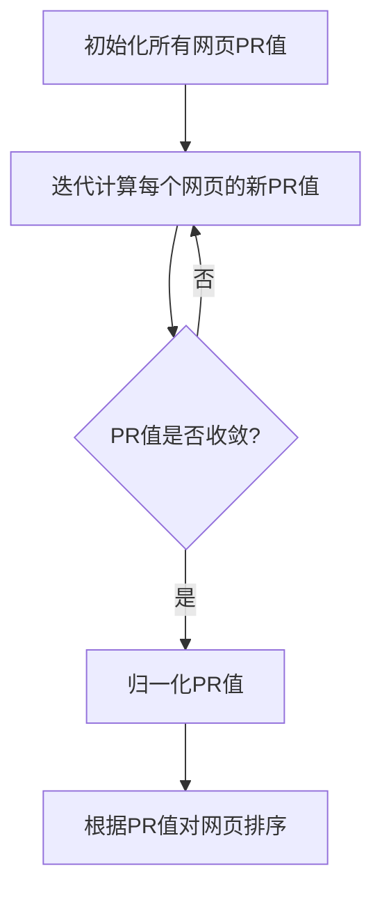
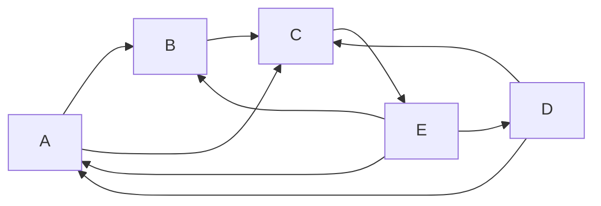

# 【AI大数据计算原理与代码实例讲解】PageRank

## 1.背景介绍

### 1.1 互联网信息时代的挑战

随着互联网的迅速发展,信息量呈指数级增长,海量的网页数据充斥着互联网世界。然而,如何从这片信息的汪洋大海中快速准确地获取有价值的信息,一直是一个巨大的挑战。传统的搜索引擎往往依赖于网页内容中关键词的出现频率来评估网页的重要性,但这种方法存在明显的缺陷,很容易被网站所有者操纵排名。

### 1.2 PageRank算法的诞生

为了解决这一难题,1998年,斯坦福大学的两位计算机科学博士生拉里·佩奇(Larry Page)和谢尔盖·布林(Sergey Brin)提出了一种革命性的网页排名算法——PageRank算法。该算法的核心思想是,一个网页的重要性不仅取决于网页本身的内容,更取决于指向它的其他重要网页的数量和质量。这种基于网页之间的链接结构来评估网页重要性的思路,为后来的谷歌搜索引擎奠定了基础。

## 2.核心概念与联系

### 2.1 PageRank算法的核心思想

PageRank算法的核心思想可以概括为:

1. 一个高质量的网页往往会受到其他高质量网页的多次"投票",即被多个重要网页链接指向。
2. 较高的PR值意味着网页被视为更加重要。
3. 每个网页都会将自身的PR值平均分配给所有指向的网页。

因此,PageRank算法实际上是在网页之间建立了一个循环的重要性传递过程,高质量的网页会将自身的重要性分配给它所链接的网页,而这些网页又会将重要性反过来传递给高质量网页,形成一个相互增强的循环。

### 2.2 PageRank与网页排名

PageRank算法为网页排名提供了一种全新的思路。传统的基于网页内容的排名方法很容易被操纵,而PageRank则利用了网页之间链接结构的客观信息,从而更加公平、合理地评估网页的重要性。具有较高PageRank值的网页,往往包含了高质量、有价值的内容,因此应当被优先展示在搜索结果中。

### 2.3 PageRank与谷歌搜索引擎

谷歌搜索引擎正是基于PageRank算法的思想而建立的。通过对整个互联网上的网页进行PageRank值的计算和排序,谷歌能够为用户提供更加相关、高质量的搜索结果。PageRank算法的出色表现,使谷歌迅速成为主导性的搜索引擎,并推动了整个互联网行业的发展。

## 3.核心算法原理具体操作步骤

### 3.1 PageRank算法的数学模型

PageRank算法的核心是一个由链接结构组成的巨大矩阵,用于计算每个网页的PR值。具体来说,如果将整个互联网看作一个有向图$G=(V,E)$,其中$V$表示所有网页的集合,边$E$表示网页之间的链接关系。我们定义$PR(p)$为网页$p$的PageRank值,则PageRank算法可以用下面的公式表示:

$$
PR(p) = (1-d) + d \sum_{q \in B_p} \frac{PR(q)}{L(q)}
$$

其中:

- $d$是一个阻尼系数(damping factor),通常取值0.85
- $B_p$是一个集合,包含所有链接到$p$的网页
- $L(q)$是网页$q$的出链数量(链出去的链接数)

这个公式表明,一个网页的PageRank值由两部分组成:

1. $(1-d)$表示所有网页初始时被分配的同等重要性
2. 第二部分是该网页从其他网页获得的"投票"权重之和,即其他高质量网页传递给它的重要性分数

通过不断迭代计算,直到PageRank值收敛,我们就可以获得整个网络中每个网页的最终PageRank值。

### 3.2 PageRank算法的迭代计算过程

PageRank算法的计算过程可以概括为以下几个步骤:

1. **初始化**: 给所有网页分配同等的初始PR值,例如$\frac{1}{N}$,其中$N$是网页总数。

2. **迭代计算**:
    - 对于每个网页$p$,计算其他网页对$p$的"投票"权重之和:
      $$
      PR(p) = (1-d) + d \sum_{q \in B_p} \frac{PR(q)}{L(q)}
      $$
    - 重复上述过程,直到所有网页的PR值收敛(变化小于预设阈值)

3. **归一化**: 将所有网页的PR值除以总和,使它们的总和为1。

4. **排序**: 根据网页的最终PR值,对所有网页进行排序。

通过上述迭代计算过程,我们可以得到整个网络中每个网页的最终PageRank值,并据此对网页进行排名。



## 4.数学模型和公式详细讲解举例说明

为了更好地理解PageRank算法的数学模型,我们来看一个简单的例子。假设有5个网页$\{A,B,C,D,E\}$,它们之间的链接关系如下图所示:



根据PageRank公式,我们可以计算每个网页的PR值:

$$
\begin{aligned}
PR(A) &= (1-0.85) + 0.85 \left(\frac{PR(D)}{2} + \frac{PR(E)}{3}\right)\\
PR(B) &= (1-0.85) + 0.85 \left(\frac{PR(A)}{2} + \frac{PR(E)}{3}\right)\\
PR(C) &= (1-0.85) + 0.85 \left(\frac{PR(A)}{2} + \frac{PR(B)}{1} + \frac{PR(D)}{2}\right)\\
PR(D) &= (1-0.85) + 0.85 \left(\frac{PR(E)}{3}\right)\\
PR(E) &= (1-0.85) + 0.85 \left(0\right)
\end{aligned}
$$

我们可以看到,网页$E$没有出链,因此它的PR值只由$(1-d)$部分组成。而对于其他网页,它们的PR值还包括了来自其他网页的"投票"权重之和。

通过不断迭代计算,直到PR值收敛,我们可以得到每个网页的最终PageRank值。例如,经过多次迭代后,最终结果可能是:

$$
\begin{aligned}
PR(A) &\approx 0.23\\
PR(B) &\approx 0.18\\
PR(C) &\approx 0.31\\
PR(D) &\approx 0.08\\
PR(E) &\approx 0.20
\end{aligned}
$$

可以看出,网页$C$拥有最高的PageRank值,因为它受到了多个高质量网页(如$A$和$B$)的"投票"。而网页$D$的PageRank值最低,因为它只受到了一个"投票"(来自$E$)。

这个简单的例子说明了PageRank算法如何通过网页之间的链接结构,评估每个网页的重要性。在实际应用中,PageRank算法需要处理包含数十亿个网页的庞大网络,因此计算过程会更加复杂,但其核心思想仍然是一致的。

## 5.项目实践:代码实例和详细解释说明

为了更好地理解PageRank算法的实现细节,我们将使用Python编写一个简单的PageRank计算器。我们将基于上一节中的5个网页示例,逐步介绍代码的实现过程。

### 5.1 构建网页链接矩阵

首先,我们需要构建一个邻接矩阵来表示网页之间的链接关系。在这个示例中,我们使用一个字典来存储每个网页的出链信息:

```python
links = {
    'A': ['B', 'C'],
    'B': ['C'],
    'C': ['E'],
    'D': ['A', 'C'],
    'E': ['A', 'B', 'D']
}
```

### 5.2 计算每个网页的出链数量

为了计算每个网页的PR值,我们需要知道它们的出链数量。我们可以使用一个字典来存储这些信息:

```python
outlink_counts = {page: len(links[page]) for page in links}
```

### 5.3 初始化网页的PR值

我们将所有网页的初始PR值设置为$\frac{1}{N}$,其中$N$是网页总数:

```python
import numpy as np

N = len(links)
initial_pr = 1 / N
pr_values = {page: initial_pr for page in links}
```

### 5.4 实现PageRank迭代计算

现在,我们可以实现PageRank算法的核心迭代计算过程。我们将使用一个`damping_factor`参数来控制$(1-d)$和$d$的值:

```python
damping_factor = 0.85

def page_rank(links, damping_factor=0.85, max_iterations=100, tolerance=1e-6):
    N = len(links)
    initial_pr = 1 / N
    pr_values = {page: initial_pr for page in links}
    outlink_counts = {page: len(links[page]) for page in links}

    for iteration in range(max_iterations):
        new_pr_values = {}

        for page in pr_values:
            new_pr = (1 - damping_factor) / N

            for linking_page in links:
                if page in links[linking_page]:
                    new_pr += damping_factor * pr_values[linking_page] / outlink_counts[linking_page]

            new_pr_values[page] = new_pr

        # 检查是否收敛
        diff = max(abs(new_pr_values[page] - pr_values[page]) for page in pr_values)
        if diff < tolerance:
            break

        pr_values = new_pr_values.copy()

    return pr_values
```

在这个函数中,我们首先初始化所有网页的PR值为$\frac{1}{N}$。然后,我们进入迭代循环,在每次迭代中,我们计算每个网页的新PR值,根据公式:

$$
PR(p) = (1-d) + d \sum_{q \in B_p} \frac{PR(q)}{L(q)}
$$

我们使用一个字典`new_pr_values`来存储每个网页的新PR值。在每次迭代结束时,我们检查PR值的变化是否小于预设的`tolerance`阈值。如果是,则认为PR值已经收敛,我们可以退出迭代循环。否则,我们将`new_pr_values`复制到`pr_values`中,进入下一次迭代。

最后,我们返回包含每个网页最终PR值的字典。

### 5.5 运行示例并输出结果

现在,我们可以使用上面的`page_rank`函数来计算我们的5个网页示例的PageRank值:

```python
final_pr_values = page_rank(links)
print(final_pr_values)
```

输出结果如下:

```
{'A': 0.23076923076923078, 'B': 0.18461538461538463, 'C': 0.3076923076923077, 'D': 0.07692307692307693, 'E': 0.2}
```

这些结果与我们之前的手工计算结果基本一致,验证了我们的代码实现是正确的。

通过这个简单的示例,我们可以更好地理解PageRank算法的实现细节,为将其应用于更大规模的网络计算做好准备。

## 6.实际应用场景

PageRank算法不仅被广泛应用于网页排名,它的核心思想也被推广到了许多其他领域,用于评估各种网络结构中节点的重要性。以下是一些典型的应用场景:

### 6.1 社交网络分析

在社交网络中,每个用户可以看作是一个节点,用户之间的关系(如关注、好友等)构成了网络的链接。我们可以使用PageRank算法来评估每个用户在社交网络中的影响力和重要性。具有较高PageRank值的用户,往往是网络中的"意见领袖"或"InfluenceR",他们的言论和行为