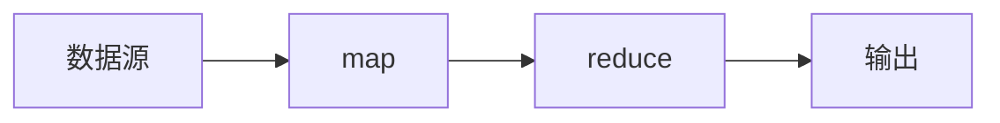
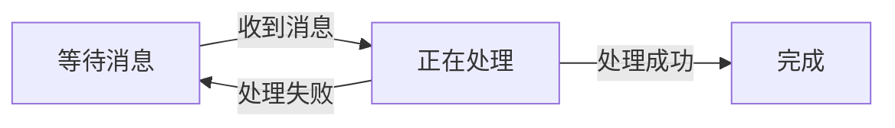

# 【AI大数据计算原理与代码实例讲解】exactly-once语义

作者：禅与计算机程序设计艺术

## 1.背景介绍
### 1.1 大数据处理中的数据一致性问题
在大数据处理系统中,数据一致性是一个关键问题。由于数据量巨大,分布式处理不可避免,而分布式系统中节点故障、网络中断等因素会导致数据处理过程出现异常。这可能导致数据重复处理或者部分数据丢失,最终结果不一致。
### 1.2 消息传递系统中exactly-once语义的重要性
在消息传递系统如Kafka中,exactly-once语义尤为重要。它确保每条消息只被处理一次,既不会重复处理也不会丢失。这对于许多应用场景如金融交易、订单处理等至关重要,因为重复或丢失消息可能带来严重后果。
### 1.3 exactly-once语义面临的技术挑战
实现exactly-once语义并非易事。首先,分布式系统本身的复杂性使得这一点难以保证。其次,大数据处理通常涉及多个不同的系统,如何在这些异构系统之间保证exactly-once也是一大挑战。因此,需要精心设计算法和架构来实现这一目标。

## 2.核心概念与联系
### 2.1 exactly-once语义的定义
exactly-once语义指每一条消息只被处理一次,不多不少。即使在故障恢复后,也不会造成消息的重复处理或者丢失。
### 2.2 at-most-once与at-least-once
除了exactly-once,还有另外两种常见的消息投递语义:
- at-most-once:消息最多被处理一次,可能一次也不处理。即允许消息丢失但不允许重复。
- at-least-once:消息至少被处理一次,可能被处理多次。即不允许消息丢失但可能重复。

at-most-once和at-least-once各有利弊,实现也相对简单。exactly-once可以看作是它们的结合,但实现最困难。
### 2.3 幂等操作与事务
要实现exactly-once语义,两个关键概念是幂等操作和事务:
- 幂等操作:对同一个对象重复执行多次与执行一次结果相同。这使得重复消息的影响可以被抵消。
- 事务:将一系列操作看作一个整体,要么全部成功要么全部失败。利用事务可以在故障恢复后避免部分消息丢失。

## 3.核心算法原理与具体操作步骤
### 3.1 利用消息日志实现EOS的基本思路
实现EOS的一个基本思路是利用消息日志,将消息处理过程与日志同步:
1. 从消息队列读取消息
2. 对消息进行处理,但不提交结果
3. 将消息内容写入日志
4. 提交处理结果
5. 将日志标记为已处理
这样即使在步骤4失败后,重启时可以从日志恢复,不会导致消息丢失或重复。
### 3.2 Chandy-Lamport分布式快照算法
Chandy-Lamport算法是一种分布式快照算法,可以在分布式系统中获得一致的全局状态,常用于实现EOS。其基本步骤如下:
1. 发起者节点向所有其他节点发送快照请求
2. 收到请求的节点停止处理,将当前状态记录为快照,然后向其他节点发送快照请求
3. 当所有节点都收到快照请求并记录快照后,快照完成
4. 此时整个系统状态是一致的,可以以此为基础进行故障恢复

### 3.3 两阶段提交协议
两阶段提交(2PC)是一种实现分布式事务的协议,也常用于实现EOS。其基本步骤如下:
1. 准备阶段:协调者向所有参与者发送准备请求,参与者执行事务但不提交,并反馈是否准备好
2. 提交阶段:如果所有参与者都准备好,协调者向所有参与者发送提交请求;否则发送回滚请求
3. 参与者根据协调者请求进行提交或回滚

2PC通过协调者与参与者的两阶段对话,保证了事务的原子性,避免了部分提交导致的数据不一致。

## 4.数学模型和公式详细讲解举例说明
### 4.1 有向无环图(DAG)模型
很多分布式系统利用有向无环图(DAG)来建模,Spark和Flink都使用DAG抽象计算过程。在DAG中,节点表示计算任务,边表示任务之间的依赖关系和数据流向。
例如下面的DAG:

表示一个简单的MapReduce任务,从源读取数据,经过map和reduce处理后输出结果。
DAG的数学定义可以表示为:
$$G=(V,E)$$
其中$V$表示顶点(vertex)集合,$E$表示有向边(edge)集合,满足:
$$\forall e=(u,v)\in E, u,v\in V$$
$$\forall v\in V, \nexists e=(v,v)\in E$$

### 4.2 状态机模型
状态机是另一种常用于描述系统行为的数学模型。一个状态机可以定义为一个五元组:

$$M=(S,\Sigma,\delta,s_0,F)$$

其中:
- $S$是有限状态集合
- $\Sigma$是有限字母表,表示输入
- $\delta$是状态转移函数 $\delta: S\times\Sigma \to S$
- $s_0$是初始状态,$s_0\in S$
- $F$是最终状态集合,$F\subseteq S$

例如我们可以用状态机描述消息处理的过程:

其中$S=\{等待消息,正在处理,完成\}$,$\Sigma=\{收到消息,处理成功,处理失败\}$。

状态机清晰地描述了系统在不同状态下的行为,以及状态之间的转移条件,是实现EOS的重要工具。

## 5.项目实践:代码实例和详细解释说明
下面我们以Kafka为例,演示如何在生产者-消费者场景下利用Kafka实现EOS。
### 5.1 生产者端
生产者发送消息时,需要将消息内容和对应的元数据(如offset)一起写入事务:
```java
// 初始化事务
producer.initTransactions();
try {
  // 开启事务
  producer.beginTransaction();
  // 发送消息
  producer.send(record1);
  producer.send(record2);
  // 提交事务
  producer.commitTransaction();
} catch (KafkaException e) {
  // 发生异常,终止事务
  producer.abortTransaction();
}
```
这里利用了Kafka的Transaction API,将多条消息的发送看作一个事务。只有当所有消息都成功发送,才提交事务,否则终止事务进行重试。
### 5.2 消费者端
消费者在消费消息时,也要利用事务来保证EOS:
```java
// 配置Kafka消费者
props.put("isolation.level", "read_committed");
props.put("enable.auto.commit", "false");
KafkaConsumer<String, String> consumer = new KafkaConsumer<>(props);

// 初始化事务
producer.initTransactions();

while (true) {
  ConsumerRecords<String, String> records = consumer.poll(Duration.ofSeconds(1));
  // 开启事务
  producer.beginTransaction();
  for (ConsumerRecord<String, String> record : records) {
    // 处理消息
    processRecord(record);
    // 提交消费位移
    consumer.commitSync();
  }
  // 提交事务
  producer.commitTransaction();
}
```
消费者的事务中包含两部分:消息处理和位移提交。只有两者都成功,才能保证EOS。其中位移提交使用了commitSync以同步的方式提交,避免事务提交时位移还没提交导致不一致。

### 5.3 Flink端到端EOS
Flink是一个流处理框架,支持端到端的EOS。其实现原理是利用两阶段提交协议和Chandy-Lamport算法的结合:
1. Flink的每个算子任务都有一个状态,在进行checkpoint时,会对状态做快照
2. 当Flink接收到checkpoint barrier时,会启动快照
3. 快照完成后,Flink会将快照结果和对应的事务提交信息一起发送给下游
4. 下游接收到快照和事务提交信息后,如果已经处理完所有属于该事务的数据,就提交事务,否则等待
5. 如果提交成功,向上游发送ACK消息,快照完成;否则终止快照,等待重试

这个过程利用分布式快照实现了整个Flink任务的一致性,结合两阶段提交实现了端到端EOS。

## 6.实际应用场景
### 6.1 金融交易
在金融领域,EOS是非常重要的。例如在银行转账时,必须保证转出账户减少的金额与转入账户增加的金额完全一致,不能多也不能少。任何不一致都可能造成严重后果。
### 6.2 电商订单
在电商场景下,创建订单、减少库存、支付款项等操作需要保证EOS,任何一个环节出错都不应该影响其他环节,否则可能导致库存和款项的不一致。
### 6.3 消息队列
利用Kafka等消息队列实现异构系统之间的EOS是一种常见模式。上游系统将消息发送到消息队列,下游系统从消息队列读取消息进行处理,利用事务机制可以保证端到端的EOS。

## 7.工具和资源推荐
### 7.1 Apache Kafka
Kafka是一个广泛使用的分布式消息队列系统,提供了事务机制来支持EOS,是EOS实践的重要工具。
官网:https://kafka.apache.org/
### 7.2 Apache Flink
Flink是一个流处理框架,提供了端到端的EOS支持,适合用于构建EOS的流处理应用。
官网:https://flink.apache.org/
### 7.3 Chandy-Lamport算法论文
Chandy-Lamport算法的原始论文,详细讲解了分布式快照的原理和实现。
论文:Distributed Snapshots: Determining Global States of Distributed Systems
### 7.4 两阶段提交协议论文
两阶段提交协议的原始论文,介绍了2PC的基本原理和实现。
论文:Consensus on Transaction Commit

## 8.总结:未来发展趋势与挑战
### 8.1 EOS在大数据领域的重要地位
随着大数据处理系统的不断发展,EOS已经成为一个越来越重要的话题。各种大数据处理框架如Spark、Flink都在不断完善对EOS的支持,未来EOS将成为大数据领域一个不可或缺的基础功能。
### 8.2 新型一致性协议的研究
目前实现EOS主要还是依赖两阶段提交等传统分布式一致性协议。但是这些协议在可用性和性能上都有一定局限性。未来需要研究更高效、更轻量级的一致性协议,以满足日益增长的EOS需求。
### 8.3 端到端EOS的复杂性
实现端到端的EOS需要考虑从数据源、消息队列、计算引擎到数据库等各个环节,涉及多个异构系统,对一致性提出了很高要求。如何在这样复杂的环境中实现高效、可靠的EOS仍然是一大挑战,需要理论和实践的共同探索。

## 9.附录:常见问题与解答
### 9.1 EOS和ACID的关系是什么?
ACID是数据库事务的四大特性,分别是原子性(Atomicity)、一致性(Consistency)、隔离性(Isolation)和持久性(Durability)。EOS可以看作是分布式环境下ACID的一种延伸,特别是原子性和一致性。实现EOS的目的就是为了保证分布式事务的ACID特性。
### 9.2 EOS能否保证实时性?
EOS的重点是保证事务的一致性,而不是实时性。为了实现EOS,通常需要引入事务机制、分布式协议等,这不可避免地会增加延迟。因此EOS并不适用于对实时性要求非常高的场景。
### 9.3 EOS与最终一致性的区别是什么?
最终一致性(Eventually Consistent)是一