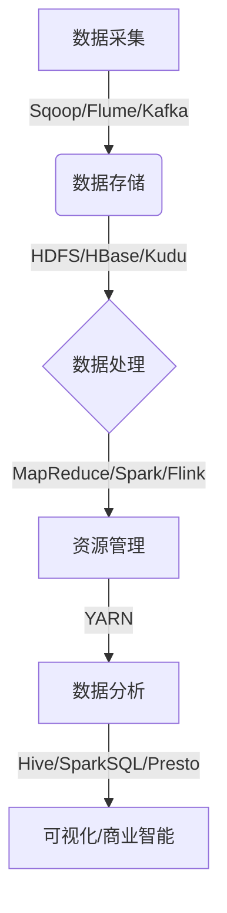
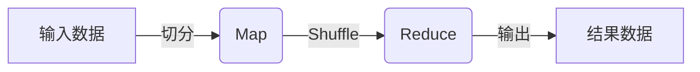

# 【AI大数据计算原理与代码实例讲解】大数据

## 1.背景介绍

### 1.1 大数据时代的到来

随着信息技术的飞速发展,各行各业都产生了大量的数据,这些数据呈现出了海量、多样、快速增长等特点,传统的数据处理方式已经无法满足当前的需求。大数据时代的到来,给企业带来了新的机遇和挑战。

### 1.2 大数据的定义

大数据(Big Data)是指无法在合理的时间范围内用常规软件工具进行捕获、管理和处理的数据集合,需要新处理模式才能有更强的决策力、洞见发现能力和流程优化能力的海量、高增长率和多样化的信息资产。

### 1.3 大数据的特征

大数据具有4V特征:

- 海量(Volume)
- 多样(Variety)
- 高速(Velocity)
- 价值(Value)

## 2.核心概念与联系

### 2.1 大数据生态系统

大数据生态系统主要包括:

- 数据采集(Sqoop、Flume、Kafka)
- 数据存储(HDFS、HBase、Kudu)
- 数据处理(MapReduce、Spark、Flink)
- 资源管理(YARN)
- 数据分析(Hive、Spark SQL、Presto)

这些组件有机结合,共同构建了大数据处理平台。



### 2.2 分布式存储 - HDFS

HDFS(Hadoop分布式文件系统)是大数据生态系统的核心存储系统,具有:

- 高容错性
- 高吞吐量数据访问
- 适合应用于大规模数据集的场景

HDFS采用主从架构,由NameNode(管理元数据)和多个DataNode(存储数据)组成。

### 2.3 分布式计算 - MapReduce

MapReduce是分布式并行编程模型,用于大规模数据集的并行运算。

- Map阶段: 将输入数据拆分,并行处理产生中间数据
- Reduce阶段: 对Map阶段输出的中间数据进行汇总

### 2.4 资源管理 - YARN

YARN(Yet Another Resource Negotiator)是Hadoop的资源管理和调度系统,负责集群资源管理和作业调度。

- ResourceManager: 全局资源管理器
- NodeManager: 每个节点的资源管理器
- ApplicationMaster: 每个应用程序的资源协调者

## 3.核心算法原理具体操作步骤

### 3.1 MapReduce算法原理

MapReduce算法主要包括以下步骤:

1. **输入切分(Input Split)**: 将输入数据切分为多个数据块
2. **Map阶段**:
   - 读取输入数据
   - 对每条记录执行用户编写的Map函数
   - 生成键值对形式的中间结果
3. **Shuffle阶段**:
   - 对Map阶段输出的中间结果进行分组
   - 分发给对应的Reduce节点
4. **Reduce阶段**:
   - 对Shuffle输出的数据,按键进行合并
   - 对每个键值对调用用户编写的Reduce函数
   - 输出最终结果



### 3.2 Spark算法原理

Spark采用了基于内存的计算模型,性能更优。其核心是RDD(Resilient Distributed Dataset)弹性分布式数据集。

1. **创建RDD**
   - 从文件系统、数据库等外部存储创建
   - 对RDD进行转换操作产生新的RDD
2. **RDD转换**
   - 无状态转换(map、filter等)
   - 有状态转换(reduceByKey、join等)
3. **行动操作**
   - 对RDD计算后输出结果或将结果存储

### 3.3 Flink算法原理

Flink是新一代流式处理框架,支持有状态计算。其核心是流(Stream)和状态(State)。

1. **Source**: 获取数据流
2. **Transformation**: 对数据流进行转换操作
   - 无状态转换(map、flatMap等)
   - 有状态转换(window等)
3. **Sink**: 输出计算结果

Flink采用了优雅的窗口模型,并支持事件时间和处理时间语义。

## 4.数学模型和公式详细讲解举例说明

在大数据处理中,常用的数学模型和公式包括:

### 4.1 PageRank算法

PageRank是Google使用的网页排名算法,用于衡量网页重要性。其核心思想是通过网页之间的链接结构来计算一个网页的等级。

设有N个网页,对于第i个网页,其PR值计算公式为:

$$PR(i) = (1-d) + d\sum_{j\in In(i)}\frac{PR(j)}{Out(j)}$$

- $PR(i)$表示第i个网页的PR值
- $In(i)$表示指向第i个网页的所有网页集合
- $Out(j)$表示从第j个网页出链的链接数
- $d$是阻尼系数,通常取值0.85

通过迭代计算,可以得到网页的最终PR值。

### 4.2 TF-IDF

TF-IDF(Term Frequency-Inverse Document Frequency)是文本挖掘中常用的一种统计方法,用于评估一个词对于一个文档集或一个语料库中的其他文档的重要程度。

对于词t和文档d,TF-IDF的计算公式为:

$$tfidf(t,d) = tf(t,d) \times idf(t)$$

其中:

- $tf(t,d)$是词t在文档d中出现的频率
- $idf(t) = \log\frac{N}{df_t}$,N是语料库中文档总数,df是包含t的文档数量

TF-IDF能较好地平衡词在文档中的重要性和在整个语料库中的普遍重要性。

### 4.3 协同过滤算法

协同过滤算法是推荐系统中常用的算法,用于预测用户对某项目的喜好程度。基于用户的协同过滤算法可以用余弦相似度来衡量两个用户的相似程度:

$$sim(u,v) = \cos(u,v) = \frac{u \cdot v}{\|u\|\|v\|}$$

其中u和v是两个用户对项目的评分向量。

基于项目的协同过滤算法可以用调整余弦相似度来衡量两个项目的相似程度:

$$sim(i,j) = \frac{\sum_{u \in U(i) \cap U(j)}(r_{ui} - \overline{r_u})(r_{uj} - \overline{r_u})}{\sqrt{\sum_{u \in U(i)}(r_{ui} - \overline{r_u})^2}\sqrt{\sum_{u \in U(j)}(r_{uj} - \overline{r_u})^2}}$$

其中$r_{ui}$是用户u对项目i的评分,$\overline{r_u}$是用户u的平均评分。

## 5.项目实践:代码实例和详细解释说明

### 5.1 MapReduce单词统计实例

以下是使用MapReduce进行单词统计的Java代码示例:

```java
// Mapper类
public static class TokenizerMapper
       extends Mapper<Object, Text, Text, IntWritable>{

    private final static IntWritable one = new IntWritable(1);
    private Text word = new Text();

    public void map(Object key, Text value, Context context
                    ) throws IOException, InterruptedException {
      StringTokenizer itr = new StringTokenizer(value.toString());
      while (itr.hasMoreTokens()) {
        word.set(itr.nextToken());
        context.write(word, one);
      }
    }
  }

// Reducer类
public static class IntSumReducer
       extends Reducer<Text,IntWritable,Text,IntWritable> {
    private IntWritable result = new IntWritable();

    public void reduce(Text key, Iterable<IntWritable> values,
                       Context context
                       ) throws IOException, InterruptedException {
      int sum = 0;
      for (IntWritable val : values) {
        sum += val.get();
      }
      result.set(sum);
      context.write(key, result);
    }
  }
```

- Mapper将输入文本按单词拆分,输出`<单词,1>`
- Reducer对每个单词收到的值求和,输出`<单词,出现次数>`

### 5.2 Spark单词统计实例

以下是使用Spark进行单词统计的Scala代码示例:

```scala
val textFile = sc.textFile("hdfs://...")
val counts = textFile.flatMap(line => line.split(" "))
                      .map(word => (word, 1))
                      .reduceByKey(_+_)
counts.saveAsTextFile("hdfs://...")
```

- `textFile`从HDFS读取文本文件
- `flatMap`将每行拆分为单词
- `map`将每个单词转换为`(单词,1)`形式
- `reduceByKey`对相同单词的值求和
- `saveAsTextFile`将结果保存到HDFS

### 5.3 Flink单词统计实例

以下是使用Flink进行单词统计的Java代码示例:

```java
StreamExecutionEnvironment env = StreamExecutionEnvironment.getExecutionEnvironment();

DataStream<String> text = env.readTextFile("hdfs://...");

DataStream<Tuple2<String, Integer>> wordCounts = text
    .flatMap(new FlatMapFunction<String, Tuple2<String, Integer>>() {
        @Override
        public void flatMap(String value, Collector<Tuple2<String, Integer>> out) {
            for (String word : value.split(" ")) {
                out.collect(new Tuple2<String, Integer>(word, 1));
            }
        }
    })
    .returns(Types.TUPLE(Types.STRING, Types.INT))
    .keyBy(0)
    .sum(1);

wordCounts.print();
```

- `readTextFile`从HDFS读取文本文件
- `flatMap`将每行拆分为`(单词,1)`形式
- `keyBy`按单词进行分组
- `sum`对每个单词的值求和
- `print`打印结果

## 6.实际应用场景

大数据技术在诸多领域有着广泛的应用,下面列举了一些典型场景:

### 6.1 网络日志分析

通过分析海量网络日志数据,可以发现有价值的模式和趋势,例如:

- 用户行为分析,优化网站设计和广告投放
- 网络攻击检测,提高系统安全性
- 流量分析,优化网络拓扑和带宽分配

### 6.2 电商用户行为分析

电商平台可以利用大数据技术挖掘用户行为数据,例如:

- 购买模式分析,为个性化推荐和营销决策提供支持
- 用户价值分析,精准营销和用户关系管理
- 舞弊检测,保障交易安全

### 6.3 金融风控

银行等金融机构可以通过分析交易数据、身份信息等,进行:

- 反欺诈检测,识别可疑交易活动
- 信用评分,评估客户信用风险
- 洗钱监测,遵守反洗钱法规

### 6.4 智能运维

通过分析服务器日志、网络流量等数据,可以实现:

- 故障预测,提前发现潜在问题
- 性能优化,提高系统稳定性和效率
- 安全加固,提高系统安全性

## 7.工具和资源推荐

### 7.1 Hadoop生态圈

- Hadoop: 分布式存储和计算框架
- Hive: 构建在Hadoop之上的数据仓库
- Pig: 高级数据流语言,简化MapReduce编程
- HBase: 分布式列式数据库
- Oozie: 工作流调度系统
- Sqoop: 用于在Hadoop和关系数据库之间传输数据

### 7.2 Spark生态圈

- Spark Core: 核心计算引擎
- Spark SQL: 结构化数据处理
- Spark Streaming: 实时数据处理
- MLlib: 机器学习算法库
- GraphX: 图形计算

### 7.3 其他工具

- Kafka: 分布式流处理平台
- Flink: 流式数据处理框架
- Presto: 分布式SQL查询引擎
- Kudu: 面向分析的存储系统
- TensorFlow: 机器学习框架

### 7.4 学习资源

- 官方文档和教程
- 在线课程(Coursera、edX等)
- 书籍(如《Hadoop权