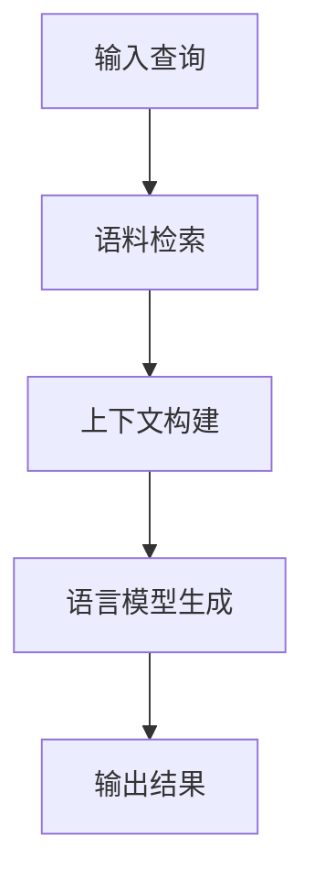

# 【LangChain编程：从入门到实践】LangChain中的RAG组件

## 1. 背景介绍

### 1.1 什么是LangChain?

LangChain是一个用于构建应用程序的框架,旨在通过大型语言模型(LLM)和其他AI组件来增强应用程序的能力。它提供了一个统一的接口,使开发人员能够轻松地将不同的LLM和其他AI组件集成到他们的应用程序中。

LangChain不仅支持文本生成,还支持其他任务,如文本摘要、问答、代码生成等。它的模块化设计使得开发人员可以轻松地组合不同的组件来满足特定的需求。

### 1.2 什么是RAG(Retrieval Augmented Generation)?

RAG(Retrieval Augmented Generation)是LangChain中的一个关键组件,它结合了语料检索(Retrieval)和生成(Generation)两个步骤,使语言模型能够基于检索到的相关信息生成更准确、更丰富的输出。

在传统的语言模型中,生成的输出仅依赖于模型的训练数据和输入提示。而RAG通过将语料检索引入生成过程,使模型能够利用更广泛的知识源,从而产生更准确、更相关的输出。

## 2. 核心概念与联系

### 2.1 RAG的核心概念

RAG的核心概念包括以下几个方面:

1. **语料库(Corpus)**: 指用于检索的知识库或文档集合。语料库可以是本地文件、网页、数据库等多种形式。

2. **检索器(Retriever)**: 负责从语料库中检索与输入查询相关的文档或段落。常用的检索器包括TF-IDF、BM25、DPR等。

3. **语言模型(Language Model)**: 负责根据检索到的相关信息和输入查询生成最终输出。常用的语言模型包括GPT、BERT、T5等。

4. **查询(Query)**: 指用户输入的问题或指令,作为RAG系统的输入。

5. **结果(Result)**: 指RAG系统根据查询和检索到的相关信息生成的最终输出。

### 2.2 RAG与其他LangChain组件的联系

RAG是LangChain中的一个关键组件,它与其他组件密切相关,共同构建了LangChain的整体架构。以下是RAG与其他组件的一些联系:

1. **Agents**: Agents是LangChain中的一个高级抽象,它可以将多个组件(如RAG、其他链等)组合在一起,实现更复杂的任务。

2. **Chains**: Chains是LangChain中的基础组件,它们可以将多个链接在一起,形成更复杂的处理流程。RAG本身就是一种特殊的Chain。

3. **Memory**: Memory组件可以用于存储和检索RAG过程中的中间状态和结果,以支持更复杂的任务。

4. **Prompts**: Prompts是LangChain中用于指导语言模型生成输出的模板。RAG可以使用Prompts来指导生成过程。

5. **Tools**: Tools是LangChain中用于执行特定任务的组件,如Web搜索、数据库查询等。RAG可以与这些Tools集成,以扩展其功能。

## 3. 核心算法原理具体操作步骤

RAG的核心算法原理可以概括为以下几个步骤:

1. **输入查询(Query Input)**: 用户输入一个查询或问题。

2. **语料检索(Document Retrieval)**: 使用检索器从语料库中检索与查询相关的文档或段落。

3. **上下文构建(Context Building)**: 将检索到的相关文档或段落与原始查询组合,构建输入上下文。

4. **语言模型生成(Language Model Generation)**: 将上下文输入到语言模型中,生成最终的输出结果。

5. **输出结果(Result Output)**: 将语言模型生成的输出作为最终结果返回给用户。

下面是RAG算法的具体操作步骤:



1. **输入查询(Query Input)**: 用户输入一个自然语言查询或问题,如"什么是LangChain?"。

2. **语料检索(Document Retrieval)**:
    - 使用检索器(如TF-IDF、BM25等)从语料库中检索与查询相关的文档或段落。
    - 检索器通常会返回一个排序的文档列表,其中包含相关性分数。

3. **上下文构建(Context Building)**:
    - 将检索到的相关文档或段落与原始查询组合,构建输入上下文。
    - 上下文可以是简单的文本拼接,也可以使用更复杂的模板或规则。

4. **语言模型生成(Language Model Generation)**:
    - 将构建好的上下文输入到语言模型(如GPT、BERT等)中。
    - 语言模型会基于上下文和查询,生成相关的输出结果。

5. **输出结果(Result Output)**:
    - 将语言模型生成的输出作为最终结果返回给用户。
    - 输出结果可能是一个简单的文本答复,也可能是一个更复杂的结构化输出。

需要注意的是,RAG算法的具体实现可能会有所不同,例如在检索器的选择、上下文构建的方式、语言模型的选择等方面。但是,上述步骤概括了RAG算法的核心原理和流程。

## 4. 数学模型和公式详细讲解举例说明

在RAG中,常用的数学模型和公式主要集中在语料检索(Document Retrieval)这一步骤。下面将详细介绍两种常用的检索模型:TF-IDF和BM25。

### 4.1 TF-IDF

TF-IDF(Term Frequency-Inverse Document Frequency)是一种常用的文本相似度计算模型,它将文档表示为一个向量,每个维度对应一个词项(term)的权重。TF-IDF由两部分组成:

1. **词频(Term Frequency, TF)**: 表示某个词项在文档中出现的频率。常用的计算公式为:

$$TF(t,d) = \frac{n_{t,d}}{\sum_{t' \in d} n_{t',d}}$$

其中,$ n_{t,d} $表示词项$t$在文档$d$中出现的次数,分母表示文档$d$中所有词项的总数。

2. **逆文档频率(Inverse Document Frequency, IDF)**: 表示某个词项在整个语料库中的普遍程度。常用的计算公式为:

$$IDF(t,D) = \log \frac{|D|}{|\{d \in D: t \in d\}|}$$

其中,$|D|$表示语料库中文档的总数,$|\{d \in D: t \in d\}|$表示包含词项$t$的文档数量。

最终,TF-IDF的计算公式为:

$$\text{TF-IDF}(t,d,D) = TF(t,d) \times IDF(t,D)$$

在RAG中,可以将查询和语料库中的每个文档都表示为TF-IDF向量,然后计算查询向量与每个文档向量之间的相似度(如余弦相似度),从而找到与查询最相关的文档。

### 4.2 BM25

BM25是另一种常用的文本相似度计算模型,它是一种概率模型,基于词项在相关文档和不相关文档中出现的概率来计算相似度。BM25的计算公式为:

$$\text{BM25}(d,q) = \sum_{t \in q} \text{IDF}(t) \cdot \frac{f(t,d) \cdot (k_1 + 1)}{f(t,d) + k_1 \cdot (1 - b + b \cdot \frac{|d|}{avdl})} \cdot \frac{(k_3 + 1) \cdot q(t)}{k_3 + q(t)}$$

其中:

- $f(t,d)$表示词项$t$在文档$d$中出现的次数。
- $|d|$表示文档$d$的长度(词项数)。
- $avdl$表示语料库中所有文档的平均长度。
- $q(t)$表示词项$t$在查询$q$中出现的次数。
- $k_1$、$b$和$k_3$是用于调节模型的超参数。

在RAG中,可以将查询和语料库中的每个文档都使用BM25模型计算得分,然后选择得分最高的文档作为最相关的文档。

通过上述数学模型和公式,RAG可以有效地从语料库中检索与查询相关的文档,从而为语言模型提供更准确、更丰富的上下文信息,生成更高质量的输出结果。

## 5. 项目实践:代码实例和详细解释说明

在本节中,我们将通过一个实际的代码示例,展示如何在LangChain中使用RAG组件。我们将使用Wikipedia作为语料库,并基于用户的查询生成相关的答复。

### 5.1 安装依赖

首先,我们需要安装LangChain和相关的依赖库:

```bash
pip install langchain
pip install wikipedia
pip install unstructured
pip install openai
```

### 5.2 导入必要的模块

```python
from langchain.chains import RetrievalQA
from langchain.llms import OpenAI
from langchain.document_loaders import UnstructuredURLLoader
from langchain.indexes import VectorstoreIndexCreator
```

- `RetrievalQA`: LangChain中的RAG组件,用于从语料库中检索相关文档并生成答复。
- `OpenAI`: OpenAI的语言模型,用于生成最终的答复。
- `UnstructuredURLLoader`: 用于从URL加载文档。
- `VectorstoreIndexCreator`: 用于创建向量存储索引,以加快检索速度。

### 5.3 加载语料库

在这个示例中,我们将使用Wikipedia作为语料库。我们可以使用`UnstructuredURLLoader`从Wikipedia的URL加载文档:

```python
loader = UnstructuredURLLoader("https://en.wikipedia.org/wiki/LangChain")
data = loader.load()
```

### 5.4 创建向量存储索引

为了加快检索速度,我们可以创建一个向量存储索引:

```python
index = VectorstoreIndexCreator().from_loaders([loader])
```

### 5.5 初始化RAG组件

接下来,我们需要初始化RAG组件:

```python
llm = OpenAI(temperature=0)
qa = RetrievalQA.from_chain_type(
    llm=llm,
    chain_type="stuff",
    retriever=index.vectorstore.as_retriever(),
    return_source_documents=True,
)
```

- `llm`: 初始化OpenAI语言模型。
- `RetrievalQA.from_chain_type`: 创建RAG组件实例。
- `chain_type="stuff"`: 指定使用"stuff"模式,即将检索到的相关文档直接附加到查询后面,作为语言模型的输入上下文。
- `retriever=index.vectorstore.as_retriever()`: 使用创建的向量存储索引作为检索器。
- `return_source_documents=True`: 设置为True,以便在输出中包含检索到的相关文档。

### 5.6 使用RAG组件生成答复

现在,我们可以使用RAG组件来生成基于查询的答复了:

```python
query = "What is LangChain?"
result = qa({"query": query})
print(result['result'])
```

输出结果将包含生成的答复以及检索到的相关文档。

### 5.7 完整代码示例

下面是完整的代码示例:

```python
from langchain.chains import RetrievalQA
from langchain.llms import OpenAI
from langchain.document_loaders import UnstructuredURLLoader
from langchain.indexes import VectorstoreIndexCreator

# 加载语料库
loader = UnstructuredURLLoader("https://en.wikipedia.org/wiki/LangChain")
data = loader.load()

# 创建向量存储索引
index = VectorstoreIndexCreator().from_loaders([loader])

# 初始化RAG组件
llm = OpenAI(temperature=0)
qa = RetrievalQA.from_chain_type(
    llm=llm,
    chain_type="stuff",
    retriever=index.vectorstore.as_retriever(),
    return_source_documents=True,
)

# 使用RAG组件生成答复
query = "What is LangChain?"
result = qa({"query": query})
print(result['result'])
```

通过这个示例,你可以了解如何在LangChain中使用RAG组件,从语料库中检索相关文档,并基于这些文档生成高质量的答复。你可以根据需要调整语料库、检索器、语言模型等组件,以满足特定的应用场景。

## 6. 实际应用场景

RAG组件在许多实际应用场景中都可以发挥作用,下面