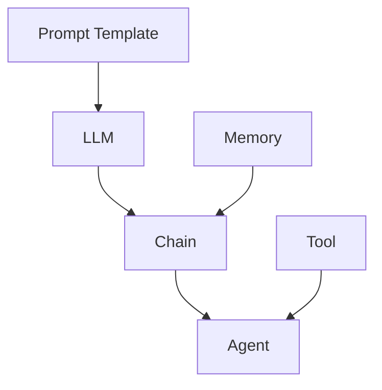

# 【LangChain编程：从入门到实践】链模块

作者：禅与计算机程序设计艺术

## 1.背景介绍

### 1.1 大语言模型的崛起
近年来，随着深度学习技术的飞速发展，大语言模型(Large Language Model, LLM)在自然语言处理领域取得了突破性进展。从GPT-3到ChatGPT，LLM展现出了惊人的语言理解和生成能力，引发了学术界和工业界的广泛关注。

### 1.2 LLM应用开发的痛点
然而，如何有效利用LLM的能力来开发实际应用，仍然面临诸多挑战：

- LLM的输入输出缺乏结构化，难以与其他系统集成
- 缺乏对LLM推理过程的控制和引导机制
- 难以实现多轮对话和上下文感知
- 对领域知识的注入和利用不够灵活

### 1.3 LangChain的诞生
为了解决上述痛点，LangChain应运而生。LangChain是一个基于LLM的应用开发框架，旨在简化LLM与外部数据和系统的集成，并提供灵活的组件化编程模型，帮助开发者快速构建LLM应用。

## 2.核心概念与联系

### 2.1 Prompt模板
Prompt模板用于定义LLM的输入文本格式，包含固定的模板和可变的参数。通过Prompt模板，我们可以方便地控制LLM的输入，引导其进行特定的任务。

### 2.2 LLM
LLM组件封装了底层的语言模型，如GPT-3、ChatGPT等。通过为LLM提供Prompt，我们可以利用其强大的语言理解和生成能力。

### 2.3 Chain
Chain是LangChain的核心组件，它将多个组件（如Prompt模板、LLM、工具等）组合成一个可执行的流程。Chain可以是顺序执行，也可以是条件分支、循环等复杂逻辑。

### 2.4 Agent
Agent是一种特殊的Chain，它可以根据用户输入，自主决策并动态调用其他工具或Chain，实现更加智能化的交互。

### 2.5 Tool
Tool是LangChain中用于执行特定任务的组件，如数据库查询、API调用、网页搜索等。通过将Tool与LLM结合，我们可以让LLM具备调用外部资源的能力。

### 2.6 Memory
Memory用于在多轮对话中维护上下文信息，使得LLM能够根据之前的对话历史进行互动。LangChain提供了多种Memory实现，如Buffer Memory、Summary Memory等。

下图展示了LangChain的核心概念及其关系：



## 3.核心算法原理具体操作步骤

### 3.1 构建Prompt Template
- Step1：定义模板字符串，使用`{variable}`语法指定参数占位符
- Step2：创建`PromptTemplate`实例，传入模板字符串和参数名称列表
- Step3：调用`format`方法，传入具体参数值，生成最终的Prompt文本

### 3.2 集成LLM
- Step1：选择LLM提供商（如OpenAI、Anthropic等），并配置API认证信息
- Step2：创建对应的LLM实例（如`OpenAI`、`ChatOpenAI`等）
- Step3：调用LLM实例的`__call__`方法，传入Prompt文本，获取LLM输出

### 3.3 组合Chain
- Step1：定义Chain的输入输出参数
- Step2：选择合适的Chain类（如`LLMChain`、`SequentialChain`等），并创建实例
- Step3：为Chain的各个组件（如Prompt Template、LLM等）提供必要的配置
- Step4：调用Chain实例的`run`或`apply`方法，传入输入参数，获取Chain的输出结果

### 3.4 创建Agent
- Step1：定义Agent可用的Tool列表，每个Tool需要指定名称、描述和调用函数
- Step2：选择Agent类型（如`ZeroShotAgent`、`ConversationalAgent`等），并提供必要的配置（如LLM、Prompt等）
- Step3：创建Agent实例，传入Tool列表等参数
- Step4：调用Agent实例的`run`方法，传入用户输入，获取Agent的决策和执行结果

### 3.5 配置Memory
- Step1：选择合适的Memory类（如`ConversationBufferMemory`、`ConversationSummaryMemory`等）
- Step2：创建Memory实例，提供必要的配置（如最大记忆长度等）
- Step3：将Memory实例传递给Chain或Agent，以支持多轮对话

## 4.数学模型和公式详细讲解举例说明

### 4.1 语言模型的数学原理
LLM的核心是基于Transformer架构的神经网络语言模型。给定前面的token序列$x_1, x_2, ..., x_t$，语言模型的目标是预测下一个token $x_{t+1}$的概率分布：

$$P(x_{t+1}|x_1, x_2, ..., x_t) = \frac{\exp(h_t^T e(x_{t+1}))}{\sum_{x'} \exp(h_t^T e(x'))}$$

其中，$h_t$是Transformer编码器在位置$t$的输出向量，$e(x)$是token $x$的嵌入向量。

### 4.2 Transformer的自注意力机制
Transformer的核心是自注意力（Self-Attention）机制，它允许模型在处理当前token时关注输入序列中的任意位置。自注意力的计算公式为：

$$\text{Attention}(Q, K, V) = \text{softmax}(\frac{QK^T}{\sqrt{d_k}})V$$

其中，$Q$、$K$、$V$分别是查询、键、值矩阵，$d_k$是键向量的维度。通过自注意力，模型可以学习到输入序列中不同位置之间的依赖关系。

### 4.3 Prompt模板的数学表示
Prompt模板可以用一个函数$f_\theta$来表示，其中$\theta$是模板中的参数：

$$f_\theta(x_1, x_2, ..., x_n) = \text{template}(x_1, x_2, ..., x_n; \theta)$$

其中，$x_1, x_2, ..., x_n$是模板的输入变量，$\text{template}$是包含参数$\theta$的模板字符串。Prompt模板的作用是将结构化的输入转化为LLM可以处理的文本序列。

## 4.项目实践：代码实例和详细解释说明

下面是一个使用LangChain构建问答系统的示例代码：

```python
from langchain.prompts import PromptTemplate
from langchain.llms import OpenAI
from langchain.chains import LLMChain

# 定义Prompt模板
template = """
根据以下背景信息，请回答问题。如果无法从背景信息中得到答案，请说"不知道"。

背景信息：
{context}

问题：{question}

回答：
"""

prompt = PromptTemplate(
    input_variables=["context", "question"],
    template=template,
)

# 创建LLM实例
llm = OpenAI(temperature=0)

# 创建LLMChain
chain = LLMChain(llm=llm, prompt=prompt)

# 运行Chain
context = "北京是中国的首都，位于中国北方，是中国的政治、文化中心。"
question = "北京在中国的什么方向？"
result = chain.run(context=context, question=question)

print(result)
```

代码解释：

1. 首先定义了一个Prompt模板，其中包含两个输入变量`context`和`question`，分别表示背景信息和问题。模板中使用`{variable}`语法指定变量位置。

2. 接着创建了一个`PromptTemplate`实例，传入模板字符串和输入变量列表。

3. 然后创建了一个`OpenAI`的LLM实例，并设置`temperature`参数为0，表示生成结果的随机性较低。

4. 使用`LLMChain`将`PromptTemplate`和`OpenAI`实例组合成一个Chain。

5. 最后，提供背景信息和问题，调用Chain的`run`方法，获取LLM生成的答案。

运行该代码，将得到输出：

```
北京位于中国北方。
```

这个示例展示了如何使用LangChain的Prompt Template、LLM和Chain组件，快速构建一个简单的问答系统。通过更改Prompt模板和提供不同的背景信息，我们可以让LLM回答各种问题。

## 5.实际应用场景

### 5.1 智能客服
利用LangChain构建智能客服系统，根据客户问题自动生成回答。可以将知识库、FAQ等数据注入到Prompt中，让LLM根据背景知识生成恰当的回复。

### 5.2 数据分析助手
利用LangChain连接数据库和BI工具，让LLM理解用户的自然语言查询，自动生成SQL语句或调用数据分析API，并将结果用自然语言解释给用户。

### 5.3 代码生成与解释
利用LangChain集成代码编辑器和LLM，根据用户的自然语言描述自动生成代码片段，或者对现有代码进行解释和文档生成。

### 5.4 智能文档助手
利用LangChain处理非结构化文档数据，如Word、PDF等，让LLM根据用户问题自动在文档中查找相关信息，生成摘要或回答问题。

### 5.5 个性化推荐
利用LangChain结合用户数据，如浏览历史、购买记录等，让LLM生成个性化的商品、内容推荐文本，提升用户体验。

## 6.工具和资源推荐

### 6.1 LangChain官方文档
LangChain的官方文档提供了详尽的教程、API参考和最佳实践指南，是学习和使用LangChain的首选资源。

官方文档地址：https://docs.langchain.com/

### 6.2 LangChain Github仓库
LangChain的Github仓库包含了框架的源代码、示例项目和贡献指南，可以深入了解LangChain的实现原理。

Github仓库地址：https://github.com/hwchase17/langchain

### 6.3 LangChain社区
LangChain社区是一个活跃的开发者交流平台，可以在这里提问、分享经验和找到合作伙伴。

Discord社区：https://discord.gg/6adMQxSpJS

### 6.4 LLM提供商文档
使用LangChain时，还需要了解所集成LLM提供商的文档和最佳实践，如OpenAI、Anthropic等。

OpenAI文档：https://platform.openai.com/docs/
Anthropic文档：https://console.anthropic.com/docs/

## 7.总结：未来发展趋势与挑战

### 7.1 LLM的持续进化
随着LLM技术的不断发展，我们可以期待更大、更强大的语言模型出现，如更多样化的预训练任务、更高效的训练方法等。这将为LangChain等框架带来更多可能性。

### 7.2 多模态交互
未来LLM将不仅局限于文本，还将支持语音、图像、视频等多种模态的输入和输出。LangChain需要扩展其组件和接口，以支持多模态交互。

### 7.3 知识增强
如何将结构化和非结构化的领域知识高效地注入到LLM中，是一个重要的研究方向。LangChain可以探索知识库构建、知识蒸馏等技术，增强LLM的领域适应能力。

### 7.4 安全与伦理
LLM的安全性和伦理问题备受关注，如隐私保护、偏见消除、可解释性等。LangChain需要在框架设计中考虑这些因素，提供相应的工具和最佳实践。

### 7.5 性能优化
随着应用复杂度的增加，LangChain需要不断优化其性能，如减少LLM调用次数、并行化处理、缓存机制等，以提供更好的用户体验。

## 8.附录：常见问题与解答

### 8.1 LangChain支持哪些LLM提供商？
LangChain支持多种主流LLM提供商，如OpenAI、Anthropic、Hugging Face等。通过配置API密钥，可以轻松切换不同的LLM后端。

### 8.2 LangChain是否支持本地部署LLM？
是的，LangChain支持使用本地部署的LLM，如GPT4All、Llama.cpp等。这对数据隐私和成本控制很有帮助。

###