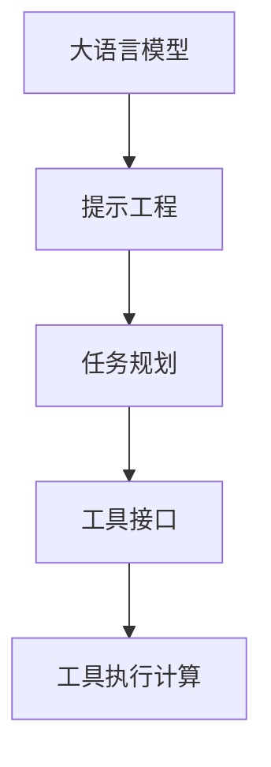

# 【大模型应用开发 动手做AI Agent】第二轮行动：工具执行计算

## 1. 背景介绍
### 1.1 大模型应用开发的兴起
近年来,随着人工智能技术的飞速发展,特别是以GPT-3、PaLM等为代表的大语言模型的出现,AI应用开发进入了一个全新的阶段。这些大模型展现出了惊人的语言理解和生成能力,为构建更加智能化的AI应用提供了强大的基础。

### 1.2 AI Agent的概念与意义
AI Agent是一种基于大模型的智能化应用程序,它能够根据用户的输入,自主完成各种复杂任务。与传统的规则系统不同,AI Agent具备更强的自主学习和推理能力,能够根据上下文动态调整策略,提供更加个性化和智能化的服务。

### 1.3 工具执行计算在AI Agent中的重要性
工具执行计算是AI Agent的一项关键能力。通过调用外部工具或API,AI Agent可以突破自身能力的局限,完成更加复杂多样的任务。例如,AI Agent可以调用搜索引擎检索信息,调用计算器进行数学运算,调用翻译API实现多语言交互等。工具执行计算极大地拓展了AI Agent的应用场景和服务边界。

## 2. 核心概念与联系
### 2.1 大语言模型
大语言模型是指在海量文本语料上训练的深度神经网络模型,如GPT-3、PaLM、BERT等。这些模型能够学习到丰富的语言知识和常识,具备强大的语言理解和生成能力。大语言模型是构建AI Agent的核心基础。

### 2.2 提示工程
提示工程(Prompt Engineering)是指根据具体任务,设计合适的输入文本,以激发大模型的潜力,引导其生成期望的输出。优质的提示不仅包含任务指令,还应该提供必要的背景知识、约束条件、格式要求等,以帮助模型更好地理解任务意图。

### 2.3 工具接口
工具接口是指AI Agent与外部工具或API进行交互的桥梁。通过封装和抽象,将不同工具的调用方式统一为标准化接口,AI Agent可以方便地与之对接,实现灵活调度和组合。常见的工具接口包括RESTful API、命令行接口、SDK等。

### 2.4 任务规划
任务规划是指AI Agent根据用户需求,自主拆解任务,制定执行步骤和策略的过程。这需要Agent具备对任务的理解和推理能力,能够根据任务的复杂度和约束条件,动态调整执行流程。任务规划是实现工具执行计算的重要一环。

### 2.5 概念关系图


## 3. 核心算法原理与具体操作步骤
### 3.1 基于提示的任务规划算法
1. 将用户输入的自然语言指令,转化为结构化的任务描述,提取关键信息如目标、约束条件等。
2. 根据任务描述,从预定义的原子任务集合中,选取可能的候选任务。
3. 使用启发式搜索算法,如A*搜索,在候选任务空间中搜索最优的任务组合和执行顺序。
4. 将搜索得到的任务序列,转化为提示语,输入大语言模型,生成对应的工具调用指令。
5. 执行工具调用,获取结果,并根据需要进行结果解析和整合。
6. 若有必要,根据执行结果和反馈,调整和优化任务规划,进入下一轮迭代。

### 3.2 工具接口的封装与调用
1. 对目标工具或API进行功能分析,明确输入参数、调用方式、返回格式等。
2. 为工具设计统一的接口规范,定义输入输出数据结构。
3. 编写接口适配器,将工具的原生调用方式,转换为统一接口。
4. 在AI Agent中,通过统一接口进行工具的调用和参数传递。
5. 对工具的执行结果进行解析和处理,提取关键信息,转化为结构化数据。
6. 将结果返回给任务规划模块,供下一步决策使用。

### 3.3 基于反馈的连续学习优化
1. 记录每一次任务执行的输入、执行过程、输出结果,构建任务执行日志。
2. 收集用户对执行结果的评价反馈,包括满意度、改进建议等。
3. 使用监督学习算法,如REINFORCE等,根据反馈对任务规划模型进行训练和优化。
4. 不断迭代和改进任务规划策略,提高工具使用的精准度和效率。
5. 引入主动学习机制,对不确定或低置信度的决策主动询问用户,学习新知识。
6. 定期对模型进行评估和调优,保持算法的有效性和鲁棒性。

## 4. 数学模型和公式详细讲解举例说明
### 4.1 任务规划的MDP建模
我们可以将任务规划看作一个马尔可夫决策过程(MDP):
- 状态空间 $S$:表示任务执行的不同阶段和工具的使用状态。
- 动作空间 $A$:表示可供选择的工具调用行为。
- 转移概率 $P(s'|s,a)$:表示在状态 $s$ 下选择动作 $a$ 后,转移到状态 $s'$ 的概率。
- 奖励函数 $R(s,a)$:表示在状态 $s$ 下选择动作 $a$ 获得的即时奖励。

MDP的优化目标是最大化累积期望奖励:
$$\max_{\pi} \mathbb{E}\left[\sum_{t=0}^{\infty} \gamma^t R(s_t,\pi(s_t))\right]$$
其中,$\pi$ 表示任务规划策略,$\gamma$ 为折扣因子。

### 4.2 启发式搜索算法示例
以A*搜索为例,我们定义启发函数 $h(s)$ 来评估状态 $s$ 距离目标状态的代价:
$$f(s) = g(s) + h(s)$$
其中,$g(s)$ 为从初始状态到当前状态的实际代价,$h(s)$ 为当前状态到目标状态的估计代价。

A*搜索的过程如下:
1. 初始化开放列表和关闭列表,将初始状态加入开放列表。
2. 从开放列表中取出 $f$ 值最小的状态 $s$,加入关闭列表。
3. 若 $s$ 为目标状态,则搜索成功,返回路径;否则,继续搜索。
4. 扩展状态 $s$ 的所有后继状态 $s'$,计算其 $f$ 值。
5. 对每个后继状态 $s'$,若其在开放列表中,比较新旧 $f$ 值,取较小者;若其在关闭列表中,则忽略;否则,加入开放列表。
6. 重复步骤2-5,直到开放列表为空或找到目标状态。

### 4.3 策略梯度算法REINFORCE
REINFORCE算法通过梯度上升,直接优化策略的参数 $\theta$,使期望奖励最大化:
$$\nabla_{\theta} J(\theta) = \mathbb{E}_{\pi_{\theta}}\left[\sum_{t=0}^{T} \nabla_{\theta} \log \pi_{\theta}(a_t|s_t) \cdot R_t\right]$$
其中,$J(\theta)$ 为目标函数,$R_t$ 为从时刻 $t$ 到终止状态的累积奖励。

算法流程如下:
1. 随机初始化策略网络参数 $\theta$。
2. 重复以下步骤,直到收敛:
   - 根据当前策略 $\pi_{\theta}$ 采样一条完整的状态-动作轨迹 $\tau$。
   - 对轨迹中的每个状态-动作对 $(s_t,a_t)$,计算累积奖励 $R_t$。
   - 使用梯度上升更新策略网络参数:
     $$\theta \leftarrow \theta + \alpha \sum_{t=0}^{T} \nabla_{\theta} \log \pi_{\theta}(a_t|s_t) \cdot R_t$$
3. 返回优化后的策略网络 $\pi_{\theta}$。

## 5. 项目实践：代码实例和详细解释说明
下面我们以Python为例,简要展示工具执行计算的关键代码:

```python
# 定义统一的工具接口
class ToolInterface:
    def __init__(self, name, func):
        self.name = name
        self.func = func

    def run(self, args):
        return self.func(args)

# 封装计算器工具
def calculator(expr):
    return eval(expr)

calc_tool = ToolInterface("Calculator", calculator)

# 封装搜索引擎工具
def search_engine(query):
    # 调用搜索API,返回结果
    pass

search_tool = ToolInterface("SearchEngine", search_engine)

# 定义任务规划器
class TaskPlanner:
    def __init__(self, tools):
        self.tools = tools

    def plan(self, task):
        # 解析任务,生成提示
        prompt = self.parse_task(task)

        # 调用语言模型,生成工具使用序列
        tool_sequence = self.generate_tool_sequence(prompt)

        # 依次执行工具,获取结果
        result = []
        for tool_name, tool_input in tool_sequence:
            tool = self.get_tool(tool_name)
            output = tool.run(tool_input)
            result.append(output)

        return result

    def parse_task(self, task):
        # 实现任务解析逻辑
        pass

    def generate_tool_sequence(self, prompt):
        # 实现工具序列生成逻辑
        pass

    def get_tool(self, name):
        for tool in self.tools:
            if tool.name == name:
                return tool
        return None

# 创建任务规划器
tools = [calc_tool, search_tool]
planner = TaskPlanner(tools)

# 输入任务,获取执行结果
task = "查找Python的发布时间,计算从那时到现在的天数"
result = planner.plan(task)
print(result)
```

以上代码展示了工具接口的封装、任务解析、工具序列生成和执行等关键环节。实际应用中,还需要更加完善的任务理解和推理能力、更大规模的工具集成、以及面向不同领域的定制优化。

## 6. 实际应用场景
工具执行计算在AI Agent的实际应用中大放异彩,下面列举几个典型场景:

### 6.1 智能办公助手
- 自动整理和分析会议记录,生成纪要和待办事项。
- 根据口头指令,调用日历API安排行程、预订会议室等。
- 接收文件输入,调用OCR和NLP工具,自动提取关键信息。

### 6.2 数据分析与可视化
- 连接数据库,执行SQL查询,返回结果数据。
- 调用统计和机器学习库,进行数据建模和预测分析。
- 使用可视化工具,生成图表、报告,支持自然语言询问。

### 6.3 智能客服与问答
- 接收用户问题,调用知识库和检索工具,匹配最佳答案。
- 根据问题类型,转接人工客服或调用业务API自动处理。
- 记录问答历史,定期学习新知识,不断优化服务质量。

### 6.4 编程助手与代码生成
- 根据自然语言描述,调用代码模板和示例,生成代码片段。
- 连接IDE和代码库,执行语法检查、单元测试、性能分析等。
- 提供编程学习资源,答疑解惑,辅助程序员提升技能。

## 7. 工具和资源推荐
### 7.1 大语言模型
- [GPT-3](https://openai.com/blog/gpt-3-apps/) - OpenAI开发的强大语言模型
- [PaLM](https://ai.googleblog.com/2022/04/pathways-language-model-palm-scaling-to.html) - Google发布的Pathways语言模型
- [BLOOM](https://huggingface.co/bigscience/bloom) - BigScience开源的176B参数语言模型

### 7.2 提示工程资源
- [Prompt Engineering Guide](https://www.promptingguide.ai/) - 提示工程入门指南
- [Awesome Prompts](https://github.com/f/awesome-chatg