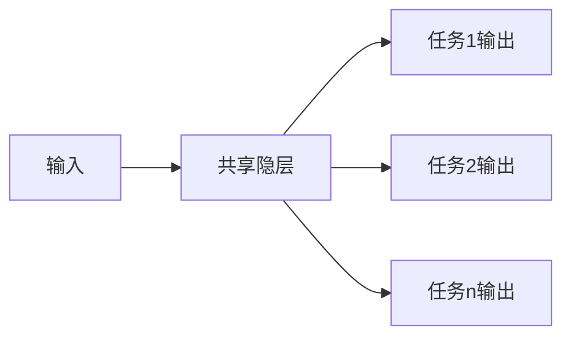
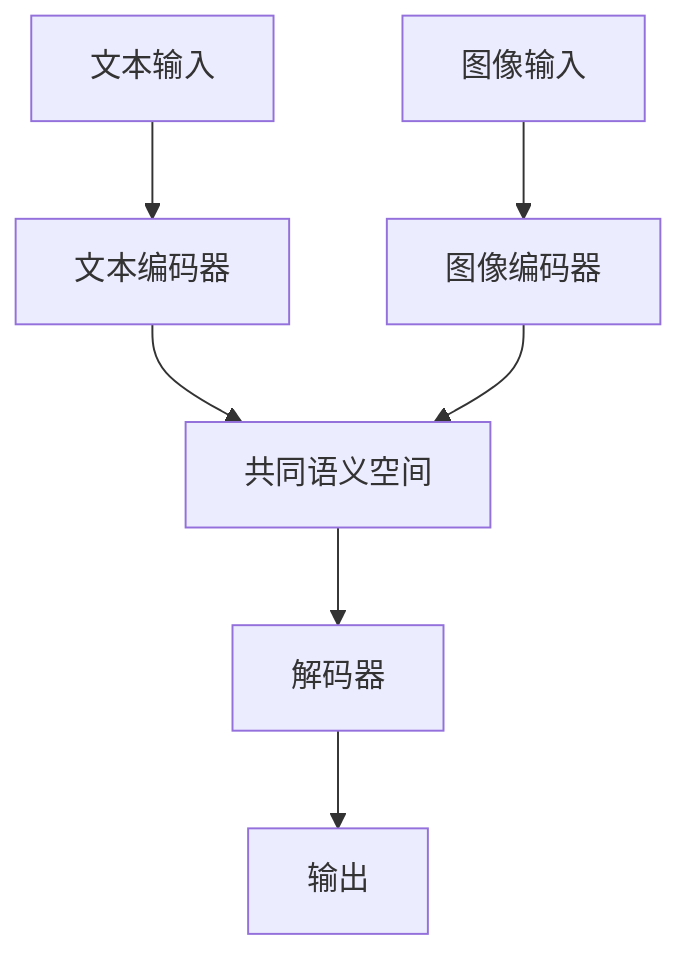

# 一切皆是映射：多任务和多模态学习中的深度学习

## 1. 背景介绍
### 1.1 多任务学习的兴起
### 1.2 多模态学习的发展
### 1.3 深度学习在多任务和多模态学习中的应用

## 2. 核心概念与联系
### 2.1 多任务学习
#### 2.1.1 定义
多任务学习(Multi-task Learning)是指在同一个模型中同时学习多个相关任务,通过利用任务之间的相关性,来提高模型的泛化能力和学习效率。
#### 2.1.2 优势
- 提高模型泛化能力
- 加速模型收敛
- 减少过拟合风险
- 实现知识迁移

### 2.2 多模态学习
#### 2.2.1 定义
多模态学习(Multi-modal Learning)是指利用不同模态(如文本、图像、音频等)的数据,通过学习它们之间的联系和互补信息,来完成预测、生成等任务的机器学习方法。
#### 2.2.2 常见模态
- 文本
- 图像
- 音频
- 视频

### 2.3 深度学习
#### 2.3.1 定义
深度学习(Deep Learning)是一类模仿人脑结构和功能,利用多层神经网络对数据进行表征学习的机器学习方法。
#### 2.3.2 常用模型
- 卷积神经网络(CNN)
- 循环神经网络(RNN)
- 注意力机制(Attention)
- Transformer

### 2.4 映射的概念
映射(Mapping)是指两个集合之间的对应关系。在深度学习中,神经网络实际上学习的就是输入空间到输出空间的映射。多任务和多模态学习的本质,就是学习不同任务、不同模态之间的映射关系。

### 2.5 多任务和多模态学习中的映射
#### 2.5.1 多任务学习中的映射
在多任务学习中,模型学习输入到多个任务输出的映射。不同任务间共享隐层表征,相当于学习了任务间的映射。



#### 2.5.2 多模态学习中的映射
在多模态学习中,模型学习不同模态数据到共同语义空间的映射。在共同语义空间中,不同模态数据可以进行交互和融合。



## 3. 核心算法原理具体操作步骤
### 3.1 多任务学习算法
#### 3.1.1 硬参数共享
所有任务共享同一个主干网络,在网络末端分别接不同任务的输出头。
1. 定义共享的主干网络
2. 定义每个任务特定的输出头
3. 计算所有任务的损失函数,一般为加权求和
4. 联合优化所有任务的损失函数

#### 3.1.2 软参数共享
每个任务有自己独立的网络,但网络间存在参数的正则约束,使不同任务的参数尽可能接近。
1. 定义每个任务独立的网络
2. 定义任务间参数的正则项,如L2范数
3. 计算每个任务的损失函数
4. 将参数正则项加入总的损失函数
5. 联合优化总的损失函数

### 3.2 多模态学习算法
#### 3.2.1 多模态联合嵌入
将不同模态的数据映射到同一个语义空间,使它们在该空间中尽可能接近。
1. 定义不同模态的编码器,将模态数据映射为语义向量
2. 定义模态间的相似度度量,如点积、余弦相似度等
3. 定义损失函数,使相似的跨模态样本尽可能接近,不相似的尽可能远离
4. 优化损失函数,更新编码器参数

#### 3.2.2 多模态注意力融合
利用注意力机制,自适应地融合不同模态的信息。
1. 定义不同模态的编码器
2. 定义注意力机制,计算不同模态特征的权重
3. 将不同模态的加权特征相加,得到融合特征
4. 将融合特征输入后续的预测层
5. 计算损失函数并优化

## 4. 数学模型和公式详细讲解举例说明
### 4.1 多任务学习的数学模型
假设有$T$个任务,每个任务$t$有$N_t$个样本$\{(x_i^t,y_i^t)\}_{i=1}^{N_t}$,其中$x_i^t$为输入,$y_i^t$为对应的标签。多任务学习的目标是学习一个模型$f_\theta$,它由参数$\theta$定义,能够同时完成所有任务。硬参数共享的损失函数定义为:

$$\mathcal{L}(\theta)=\sum_{t=1}^T \lambda_t \frac{1}{N_t}\sum_{i=1}^{N_t}\mathcal{L}_t(f_\theta(x_i^t),y_i^t)$$

其中$\mathcal{L}_t$为任务$t$的损失函数,$\lambda_t$为任务$t$的权重系数。

软参数共享引入正则项$\Omega(\theta)$,使不同任务的参数尽可能接近:

$$\mathcal{L}(\theta)=\sum_{t=1}^T \lambda_t \frac{1}{N_t}\sum_{i=1}^{N_t}\mathcal{L}_t(f_{\theta_t}(x_i^t),y_i^t) + \alpha \Omega(\theta)$$

其中$\theta_t$为任务$t$特定的参数,$\alpha$为正则项的权重系数。$\Omega(\theta)$可以是L2范数:

$$\Omega(\theta)=\sum_{t=1}^T\sum_{k=1}^T\|\theta_t-\theta_k\|_2^2$$

### 4.2 多模态学习的数学模型
假设有$M$种模态,第$m$种模态有$N_m$个样本$\{x_i^m\}_{i=1}^{N_m}$。多模态联合嵌入的目标是学习将每种模态映射为$d$维语义向量的编码器$f_m:x^m \mapsto \mathbf{h}^m \in \mathbb{R}^d$。对于样本对$(x_i^m,x_j^n)$,其相似度定义为语义向量的点积:

$$s(x_i^m,x_j^n)=\langle f_m(x_i^m), f_n(x_j^n) \rangle$$

损失函数鼓励相似样本的相似度高于不相似样本的相似度:

$$\mathcal{L}=\sum_{(i,j)\in \mathcal{P}} \sum_{(i,k)\in \mathcal{N}} \max(0, s(x_i^m,x_k^n)-s(x_i^m,x_j^n)+\delta)$$

其中$\mathcal{P}$为相似样本对集合,$\mathcal{N}$为不相似样本对集合,$\delta$为边界参数。

多模态注意力融合中,注意力权重$\alpha^m$的计算公式为:

$$e^m = \mathbf{v}^\top \tanh(\mathbf{W}\mathbf{h}^m+\mathbf{b})$$
$$\alpha^m = \frac{\exp(e^m)}{\sum_{k=1}^M \exp(e^k)}$$

其中$\mathbf{v},\mathbf{W},\mathbf{b}$为注意力机制的可学习参数。最终的融合特征为:

$$\mathbf{h}_{fused}=\sum_{m=1}^M \alpha^m \mathbf{h}^m$$

## 5. 项目实践：代码实例和详细解释说明
下面以PyTorch为例,给出多任务学习和多模态学习的简单实现。

### 5.1 多任务学习代码实例
```python
import torch
import torch.nn as nn

class SharedBackbone(nn.Module):
    def __init__(self):
        super().__init__()
        self.hidden1 = nn.Linear(100, 128)
        self.hidden2 = nn.Linear(128, 64)

    def forward(self, x):
        h = torch.relu(self.hidden1(x))
        h = torch.relu(self.hidden2(h))
        return h

class TaskHead(nn.Module):
    def __init__(self, input_dim, output_dim):
        super().__init__()
        self.output = nn.Linear(input_dim, output_dim)

    def forward(self, x):
        return self.output(x)

class MultiTaskModel(nn.Module):
    def __init__(self, task_num, task_dims):
        super().__init__()
        self.backbone = SharedBackbone()
        self.heads = nn.ModuleList([TaskHead(64, dim) for dim in task_dims])

    def forward(self, x):
        h = self.backbone(x)
        outputs = [head(h) for head in self.heads]
        return outputs

model = MultiTaskModel(task_num=3, task_dims=[1, 1, 2])
criterion = nn.MSELoss()
optimizer = torch.optim.Adam(model.parameters())

for epoch in range(num_epochs):
    for x, y1, y2, y3 in dataloader:
        outputs = model(x)
        loss1 = criterion(outputs[0], y1)
        loss2 = criterion(outputs[1], y2)
        loss3 = criterion(outputs[2], y3)
        loss = loss1 + loss2 + loss3

        optimizer.zero_grad()
        loss.backward()
        optimizer.step()
```

这个例子实现了一个简单的硬参数共享多任务模型,包含以下几个部分:
- SharedBackbone:所有任务共享的主干网络,将输入映射为隐层特征
- TaskHead:每个任务特定的输出头,将隐层特征映射为任务输出
- MultiTaskModel:多任务模型,包含共享主干和多个任务输出头
- 训练过程:前向传播计算每个任务的损失,将多个损失相加作为总损失,然后反向传播优化

### 5.2 多模态学习代码实例
```python
import torch
import torch.nn as nn

class TextEncoder(nn.Module):
    def __init__(self, vocab_size, embed_dim, hidden_dim):
        super().__init__()
        self.embedding = nn.Embedding(vocab_size, embed_dim)
        self.rnn = nn.LSTM(embed_dim, hidden_dim, batch_first=True)

    def forward(self, x):
        embed = self.embedding(x)
        _, (hidden, _) = self.rnn(embed)
        return hidden[-1]

class ImageEncoder(nn.Module):
    def __init__(self):
        super().__init__()
        self.conv1 = nn.Conv2d(3, 64, 3)
        self.conv2 = nn.Conv2d(64, 128, 3)
        self.fc = nn.Linear(128, 64)

    def forward(self, x):
        h = torch.relu(self.conv1(x))
        h = torch.relu(self.conv2(h))
        h = h.mean(dim=[2,3])
        return self.fc(h)

class MultiModalModel(nn.Module):
    def __init__(self, vocab_size, embed_dim, hidden_dim):
        super().__init__()
        self.text_encoder = TextEncoder(vocab_size, embed_dim, hidden_dim)
        self.image_encoder = ImageEncoder()

    def forward(self, text, image):
        text_feat = self.text_encoder(text)
        image_feat = self.image_encoder(image)
        similarity = torch.cosine_similarity(text_feat, image_feat)
        return similarity

model = MultiModalModel(vocab_size=1000, embed_dim=64, hidden_dim=128)
criterion = nn.CosineEmbeddingLoss()
optimizer = torch.optim.Adam(model.parameters())

for epoch in range(num_epochs):
    for text, image, label in dataloader:
        similarity = model(text, image)
        loss = criterion(similarity, label)

        optimizer.zero_grad()
        loss.backward()
        optimizer.step()
```

这个例子实现了一个简单的多模态联合嵌入模型,包含以下几个部分:
- TextEncoder:文本编码器,使用词嵌入和RNN将文本映射为语义向量
- ImageEncoder:图像编码器,使用CNN将图像映射为语义向量
- MultiModalModel:多模态模型,包含文本编码器和图像编码器,计算两个模态语义向量的相似度
- 训练过程:前向传播计算相似度,使用余弦相似度损失函数计算loss,然后反向传播优化

## 6. 实际应用场景
### 6.1 多任务学习应用
- 自然语言处理:同时进行分词、词性标注、命名实体识别、句法分析等任务
- 计算机视觉:同时