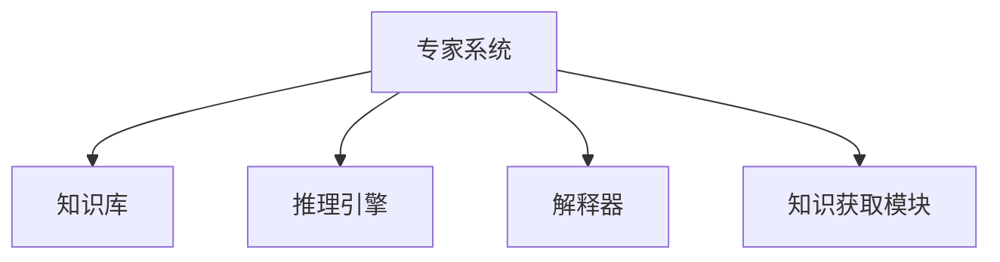

# 专家系统在制造业领域的应用：智能制造与生产优化

## 1.背景介绍

### 1.1 制造业的重要性

制造业是一个国家经济发展的重要支柱,对于促进经济增长、创造就业机会和推动技术创新至关重要。然而,随着全球化竞争的加剧和客户需求的不断变化,制造企业面临着诸多挑战,例如提高生产效率、降低成本、缩短产品上市时间等。为了应对这些挑战,制造企业需要采用先进的技术和方法来优化生产过程,提高产品质量和灵活性。

### 1.2 人工智能在制造业中的作用

人工智能(AI)技术在制造业中扮演着越来越重要的角色。专家系统作为人工智能的一个分支,已经在制造业中得到了广泛应用。专家系统是一种基于知识的系统,它能够模拟人类专家的决策过程,为用户提供智能化的建议和解决方案。

### 1.3 专家系统在制造业中的应用前景

专家系统在制造业中的应用前景广阔,可以用于各种场景,如产品设计、工艺规划、质量控制、故障诊断、预测维护等。通过捕获和利用人类专家的知识和经验,专家系统可以提高生产效率、降低成本、缩短产品上市时间,从而为制造企业带来竞争优势。

## 2.核心概念与联系

### 2.1 专家系统的定义

专家系统是一种基于知识的人工智能系统,它能够模拟人类专家在特定领域内的决策过程和推理能力。专家系统通常由以下几个核心组件组成:

- 知识库:存储专家知识的数据库
- 推理引擎:根据知识库中的规则和事实进行推理
- 解释器:解释推理过程并与用户交互
- 知识获取模块:从人类专家那里获取知识并编码到知识库中



### 2.2 制造业中的专家系统应用

在制造业中,专家系统可以应用于以下几个主要领域:

- 产品设计:帮助设计人员进行产品概念设计、详细设计和优化设计。
- 工艺规划:根据产品设计和制造资源,生成最佳的工艺路线。
- 质量控制:监控生产过程,检测和诊断质量问题。
- 故障诊断:快速识别设备故障原因,提供维修建议。
- 预测维护:根据设备运行数据,预测故障发生概率,制定维护计划。

### 2.3 专家系统与其他技术的集成

为了发挥专家系统的最大潜力,通常需要与其他技术相结合,例如:

- 机器学习:从历史数据中自动获取知识,更新知识库。
- 计算机视觉:通过图像和视频数据,实现自动检测和识别。
- 物联网:收集来自传感器的实时数据,用于监控和决策。
- 大数据分析:处理海量数据,发现隐藏的模式和趋势。

## 3.核心算法原理具体操作步骤

专家系统的核心算法原理主要包括以下几个方面:

### 3.1 知识表示

知识表示是将人类专家的知识以计算机可理解的形式存储在知识库中。常用的知识表示方法包括:

- 规则库系统:使用 IF-THEN 规则来表示知识。
- 框架系统:使用继承层次结构来表示知识。
- 语义网络:使用节点和边来表示概念及其关系。

### 3.2 推理策略

推理策略决定了如何从知识库中推导出新的结论或建议。常见的推理策略包括:

- 前向链推理:从已知事实出发,应用规则推导出新的结论。
- 后向链推理:从目标结论出发,寻找支持该结论的证据。
- 模式匹配:将当前情况与知识库中的模式进行匹配。

### 3.3 不确定性处理

在现实世界中,知识往往是不完整或不精确的。专家系统需要采用特殊的方法来处理不确定性,例如:

- 贝叶斯推理:基于概率论,根据先验知识和观测证据更新后验概率。
- 模糊逻辑:使用模糊集合和模糊规则来表示和推理不精确的知识。
- 证据理论:通过组合多个不完全可靠的证据来得出结论。

### 3.4 知识获取

知识获取是从人类专家那里获取知识,并将其编码到知识库中的过程。常用的知识获取方法包括:

- 结构化访谈:通过预定义的问题,系统地收集专家知识。
- 协议分析:观察和记录专家解决问题的过程。
- 机器学习:从历史数据中自动提取知识模式。

## 4.数学模型和公式详细讲解举例说明

### 4.1 贝叶斯推理

贝叶斯推理是专家系统中常用的不确定性处理方法之一。它基于贝叶斯定理,通过组合先验概率和观测证据,计算后验概率。

贝叶斯定理的数学表达式如下:

$$P(H|E) = \frac{P(E|H)P(H)}{P(E)}$$

其中:

- $P(H|E)$ 表示在观测到证据 $E$ 的情况下,假设 $H$ 为真的后验概率。
- $P(E|H)$ 表示在假设 $H$ 为真的情况下,观测到证据 $E$ 的概率,也称为似然度。
- $P(H)$ 表示假设 $H$ 的先验概率,即在观测到任何证据之前对假设 $H$ 的置信度。
- $P(E)$ 表示证据 $E$ 的边缘概率,是一个归一化常数。

在专家系统中,我们可以使用贝叶斯推理来计算各种假设的后验概率,并选择具有最高后验概率的假设作为最终结论。

例如,在故障诊断领域,我们可以将故障原因视为假设 $H$,观测到的症状作为证据 $E$。通过计算 $P(H|E)$,我们可以确定最可能的故障原因。

### 4.2 模糊逻辑

模糊逻辑是另一种处理不确定性的方法,它使用模糊集合和模糊规则来表示和推理不精确的知识。

在模糊逻辑中,一个元素可以部分地属于一个集合,其程度由一个介于 0 和 1 之间的值表示,称为隶属度。模糊集合 $A$ 在宇集 $X$ 上的数学表达式为:

$$A = \{(x, \mu_A(x)) | x \in X\}$$

其中 $\mu_A(x)$ 是元素 $x$ 对集合 $A$ 的隶属度。

模糊规则采用 IF-THEN 形式,例如:

```
IF 温度是高 AND 湿度是低 THEN 开启空调
```

其中,"高"和"低"是模糊集合,表示不精确的概念。

在推理过程中,我们首先计算前提部分的真值,然后根据模糊规则得出结论部分的真值。这种推理方式能够很好地处理不确定性和模糊性。

例如,在温度控制系统中,我们可以使用模糊逻辑来实现更加精细和平滑的控制,避免了传统控制系统中的振荡和超调问题。

## 5.项目实践:代码实例和详细解释说明

为了更好地理解专家系统的实现,我们将以 Python 语言为例,构建一个简单的故障诊断专家系统。

### 5.1 知识库构建

我们首先定义一个基于规则的知识库,用于存储故障症状和可能原因之间的映射关系。

```python
knowledge_base = {
    '症状1': ['原因A', '原因B'],
    '症状2': ['原因B', '原因C'],
    '症状3': ['原因A', '原因C', '原因D'],
    # ... 其他规则
}
```

### 5.2 推理引擎

接下来,我们实现一个基于前向链推理的推理引擎,根据输入的症状集合推断出可能的故障原因。

```python
def inference_engine(symptoms):
    possible_causes = set()
    for symptom in symptoms:
        if symptom in knowledge_base:
            possible_causes.update(knowledge_base[symptom])
    return possible_causes
```

### 5.3 用户交互

最后,我们构建一个简单的命令行界面,允许用户输入观测到的症状,并显示推理出的可能原因。

```python
def main():
    print("欢迎使用故障诊断专家系统!")
    symptoms = []
    while True:
        symptom = input("请输入观测到的症状(输入 'q' 退出): ")
        if symptom.lower() == 'q':
            break
        symptoms.append(symptom)

    causes = inference_engine(symptoms)
    if not causes:
        print("无法确定故障原因。")
    else:
        print("可能的故障原因有:")
        for cause in causes:
            print(f"- {cause}")

if __name__ == "__main__":
    main()
```

在这个简单的示例中,我们使用了基于规则的知识表示和前向链推理策略。在实际应用中,专家系统通常会采用更加复杂和精细的算法,并结合其他技术(如机器学习、不确定性处理等)来提高性能和准确性。

## 6.实际应用场景

专家系统在制造业中有着广泛的应用场景,可以为企业带来显著的效益。以下是一些典型的应用案例:

### 6.1 产品设计优化

专家系统可以帮助设计人员快速评估不同设计方案的优缺点,并提供优化建议。例如,在汽车设计中,专家系统可以考虑多个因素(如空气动力学、材料强度、制造成本等),并推荐最佳的设计方案。

### 6.2 工艺规划

专家系统可以根据产品设计、制造资源和约束条件,自动生成最佳的工艺路线。这不仅可以提高生产效率,还可以减少人为错误,确保产品质量。

### 6.3 质量控制

在生产过程中,专家系统可以实时监控各种参数,及时发现潜在的质量问题。一旦发现异常,系统可以提供诊断和纠正措施,避免产品缺陷和浪费。

### 6.4 故障诊断与预测维护

专家系统可以分析设备运行数据,快速准确地诊断故障原因,并提供维修建议。此外,通过预测性维护,专家系统可以预测设备故障的发生概率,从而制定有效的维护计划,降低维护成本。

### 6.5 供应链优化

在供应链管理领域,专家系统可以协助决策者制定最优的采购、运输和库存策略,提高供应链的灵活性和响应能力。

## 7.工具和资源推荐

在开发和部署专家系统时,有许多工具和资源可以为您提供帮助。以下是一些推荐:

### 7.1 开发工具

- Expert System Shell: 一种用于构建专家系统的集成开发环境,提供了知识库编辑器、推理引擎和用户界面等功能。
- Python 库:如 experta、pyknow 等,可以用于快速构建基于规则的专家系统。
- MATLAB Fuzzy Logic Toolbox: 用于设计和模拟模糊逻辑系统。

### 7.2 知识获取工具

- Protégé: 一款开源的本体编辑器,可用于构建和维护知识库。
- Mind Mapping 工具:如 XMind、FreeMind 等,可以帮助组织和可视化专家知识。

### 7.3 在线资源

- 专家系统教程和课程:如 Coursera、edX 等在线学习平台上的相关课程。
- 技术论坛和社区:如 Stack Overflow、AI Stack Exchange 等,可以寻求专家建议和解决方案。
- 行业报告和案例研究:了解制造业中专家系统的最新应用和成功案例。

## 8.总结:未来发展趋势与挑战

专家系统在制造业中的应用正在不断扩展,并取得了显著的成果。然而,随