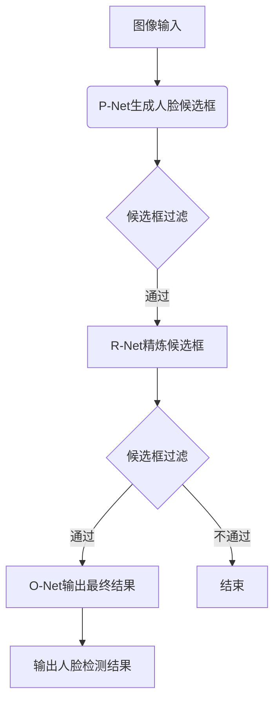

以下是关于"人脸识别在移动设备上的应用"的技术博客文章正文内容：

# 人脸识别在移动设备上的应用

## 1. 背景介绍

### 1.1 人脸识别技术概述

人脸识别是一种生物识别技术,通过分析人脸图像或视频数据来自动识别人脸身份。它广泛应用于安全监控、刷脸支付、人员通行管理等领域。随着移动设备的普及和算力的提升,人脸识别技术逐渐在移动端得到应用和发展。

### 1.2 移动设备人脸识别的重要性

移动设备无处不在,成为人们生活和工作的重要工具。将人脸识别技术应用于移动设备,可实现便捷的身份认证、个性化服务等,提升用户体验。同时,移动端人脸识别也面临着算力、能耗、隐私等诸多挑战。

## 2. 核心概念与联系

### 2.1 人脸检测

人脸检测是人脸识别的前置步骤,旨在从图像或视频流中快速定位并提取人脸区域,为后续的人脸识别过程提供输入。常用的人脸检测算法有Haar级联分类器、HOG+SVM、CNN等。

### 2.2 人脸对齐

由于人脸朝向、光照、表情等因素的影响,检测到的人脸区域可能存在一定畸变。人脸对齐技术通过几何变换等方法,将检测到的人脸图像进行规范化处理,消除畸变,为后续的特征提取和识别奠定基础。

### 2.3 人脸特征提取

人脸特征提取是人脸识别的核心步骤,旨在从对齐后的人脸图像中提取出能够有效描述和区分人脸的特征向量。常用的特征提取算法有HOG、LBP、SIFT等传统方法,以及基于深度学习的卷积神经网络(CNN)等方法。

### 2.4 人脸识别与匹配

人脸识别模型通过机器学习算法,使用训练数据学习人脸特征模式,构建人脸特征空间。在识别阶段,将待识别人脸的特征向量映射到该特征空间,通过相似度计算或分类器判别,实现人脸身份的识别和匹配。

## 3. 核心算法原理具体操作步骤

### 3.1 人脸检测算法

以基于深度学习的MTCNN人脸检测算法为例,其原理和具体步骤如下:

1. 构建Proposal Network (P-Net),快速生成人脸候选框
2. 使用Refine Network (R-Net),进一步过滤和优化候选框
3. 最后使用Output Network (O-Net)输出最终的人脸检测结果
4. 三个网络级联工作,逐步提高检测精度和去除假阳性



### 3.2 人脸对齐算法

常用的人脸对齐算法包括基于形状模型的Active Shape Model (ASM)和Active Appearance Model (AAM)等。以AAM为例,算法步骤如下:

1. 在训练集上标注人脸关键点,训练形状模型和外观模型
2. 对输入人脸图像进行初始化,得到初始形状参数和外观参数
3. 迭代优化形状参数和外观参数,最小化重建误差
4. 根据最终参数对人脸图像进行几何变换,得到对齐后的人脸

### 3.3 人脸特征提取算法

以经典的VGGFace2模型为例,其基于CNN架构,算法步骤如下:

1. 输入对齐后的人脸图像
2. 通过多层卷积层和池化层提取低级特征
3. 利用全连接层融合高级语义特征
4. 输出512维的人脸特征向量

### 3.4 人脸识别与匹配算法

以基于度量学习的人脸识别算法为例,算法步骤如下:

1. 使用人脸特征提取模型得到人脸特征向量
2. 构建基于三元组损失的度量学习模型
3. 使用训练数据学习人脸特征空间
4. 将待识别人脸映射到该特征空间
5. 基于特征向量的余弦相似度或距离度量,进行人脸匹配和识别

## 4. 数学模型和公式详细讲解举例说明

### 4.1 三元组损失函数

三元组损失函数是度量学习中常用的损失函数,用于学习样本间的相对距离关系。设 $x_a$、$x_p$、$x_n$ 分别为同一个人的两张人脸图像和另一个人的人脸图像,则三元组损失函数定义为:

$$L(x_a, x_p, x_n) = \max(0, D(x_a, x_p) - D(x_a, x_n) + \alpha)$$

其中 $D(\cdot)$ 表示特征向量间的距离度量函数,通常使用欧氏距离或余弦距离; $\alpha$ 为超参数,控制学习的收敛速度。

该损失函数的目标是使得同一个人的人脸图像特征距离最小,而不同人的人脸图像特征距离足够大,从而在特征空间中形成良好的聚类结构。

### 4.2 卷积神经网络

卷积神经网络(CNN)是深度学习中常用的网络结构,适用于处理图像等高维数据。以VGGFace2网络为例,其包含多个卷积层、池化层和全连接层,网络结构如下:


在卷积层中,通过滤波器对输入图像进行卷积操作,提取低级特征;池化层则用于降低特征维度,提高模型的泛化能力。全连接层融合了高级语义特征,最终输出人脸特征向量。

卷积神经网络通过反向传播算法和随机梯度下降等优化方法,自动学习网络参数,实现端到端的特征提取和模型训练。

## 5. 项目实践:代码实例和详细解释说明

以Python和PyTorch框架为例,实现一个基于FaceNet的人脸识别系统:

### 5.1 人脸检测与对齐

```python
import cv2
import dlib

# 使用dlib的人脸检测器
detector = dlib.get_frontal_face_detector()

# 使用dlib的人脸关键点检测器
predictor = dlib.shape_predictor('shape_predictor_68_face_landmarks.dat')

def align_face(img):
    # 检测人脸
    dets = detector(img, 1)

    for k, d in enumerate(dets):
        # 获取人脸关键点
        shape = predictor(img, d)

        # 对人脸进行仿射变换对齐
        # ...

    return aligned_face
```

上述代码使用dlib库进行人脸检测和关键点检测,然后基于检测到的关键点对人脸图像进行仿射变换对齐。

### 5.2 人脸特征提取

```python
import torch
import torch.nn as nn
from facenet import InceptionResnetV1

class FaceNet(nn.Module):
    def __init__(self):
        super(FaceNet, self).__init__()
        self.model = InceptionResnetV1(pretrained='vggface2')
        self.model.classify = nn.Linear(512, 10)

    def forward(self, x):
        x = self.model.features(x)
        x = x.view(x.size(0), -1)
        x = self.model.classify(x)
        return x

# 加载预训练模型
model = FaceNet()
model.load_state_dict(torch.load('facenet.pth'))

# 提取人脸特征
face_embedding = model(aligned_face)
```

上述代码定义了一个FaceNet模型,基于PyTorch框架和预训练的InceptionResnetV1模型。在前向传播时,输入对齐后的人脸图像,经过卷积层和全连接层,输出512维的人脸特征向量。

### 5.3 人脸识别与匹配

```python
import numpy as np

# 人脸数据库,存储已知人脸的特征向量
face_database = {}

def recognize(face_embedding, database, threshold=0.5):
    min_dist = 1e9
    identity = None

    # 遍历数据库,计算特征向量间的余弦距离
    for name, db_emb in database.items():
        dist = np.dot(face_embedding, db_emb.T)
        if dist < min_dist:
            min_dist = dist
            identity = name

    if min_dist > threshold:
        identity = 'Unknown'

    return identity

# 识别人脸
name = recognize(face_embedding, face_database)
print(f'识别结果: {name}')
```

上述代码实现了一个简单的人脸识别函数。首先,将已知人脸的特征向量存储在数据库中。在识别时,计算待识别人脸特征向量与数据库中每个人脸特征向量的余弦相似度,取最大相似度对应的身份作为识别结果。如果相似度均小于阈值,则标记为"未知人物"。

以上代码示例展示了如何在Python和PyTorch环境下实现一个基本的人脸识别系统,包括人脸检测、对齐、特征提取和识别等核心步骤。在实际应用中,还需要考虑模型优化、数据增强、实时性能等多方面因素。

## 6. 实际应用场景

移动端人脸识别技术在以下场景中有广泛应用:

### 6.1 移动支付和认证

利用人脸识别实现移动支付、账户登录等身份认证功能,提高安全性和便捷性。例如支付宝、微信支付中的"刷脸支付"。

### 6.2 智能家居和车载系统

通过人脸识别实现智能家居设备的个性化控制,或车载系统的驾驶员身份识别和行为分析。

### 6.3 社交媒体和相机应用

人脸识别可用于社交媒体的人物标记、相机应用的人像模式优化等功能。

### 6.4 安全监控和考勤管理

利用人脸识别技术实现安全监控、门禁控制、考勤管理等功能,提高工作效率和安全性。

### 6.5 游戏和虚拟现实

在游戏和虚拟现实应用中,人脸识别可用于角色创建、表情捕捉、虚拟化身等交互方式。

## 7. 工具和资源推荐

### 7.1 开源库和框架

- Dlib: 功能强大的C++机器学习库,提供人脸检测和对齐算法
- OpenCV: 开源的计算机视觉库,支持多种编程语言
- FaceNet: 谷歌开源的人脸识别模型,基于深度卷积网络
- InsightFace: 由中国科学院计算所开发的人脸识别引擎
- TensorFlow/PyTorch: 深度学习框架,适用于训练和部署人脸识别模型

### 7.2 数据集和预训练模型

- LFW: 标准的人脸识别测试数据集
- VGGFace2: 基于VGG16网络的大规模人脸识别数据集和预训练模型
- WIDER Face: 提供丰富场景和标注的人脸检测数据集
- MTCNN预训练模型: 常用的人脸检测模型

### 7.3 在线服务和API

- 阿里云人脸识别: 提供人脸检测、识别、验证等在线API服务
- 腾讯云人脸识别: 支持静态图片和视频流的人脸识别服务
- Face++: 旷视科技提供的人工智能开放平台,包含人脸识别等服务

## 8. 总结:未来发展趋势与挑战

### 8.1 模型轻量化和优化

为了适应移动设备的算力和能耗限制,未来需要进一步优化人脸识别模型的结构和参数,实现