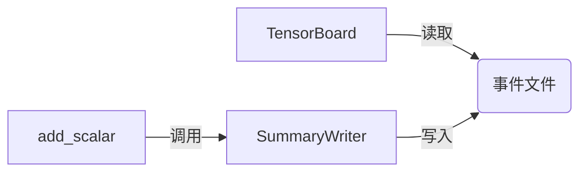

# 从零开始大模型开发与微调：tensorboardX可视化组件的使用

## 1.背景介绍

在深度学习模型的开发与训练过程中,可视化是一个非常重要的环节。通过可视化,我们可以直观地观察模型训练的进展情况,包括损失函数的变化趋势、准确率的提升等关键指标。这对于调试模型、优化超参数、改进算法都有很大帮助。

目前主流的深度学习框架如PyTorch、TensorFlow都提供了可视化工具。而在PyTorch生态中,tensorboardX是一个优秀的可视化组件。它是TensorFlow的TensorBoard的一个Python接口,使得PyTorch用户也能方便地使用TensorBoard进行可视化。

本文将详细介绍tensorboardX的使用方法,并以大模型的开发与微调为例,展示如何利用tensorboardX进行训练过程可视化,提升模型开发效率。

## 2.核心概念与联系

在深入探讨tensorboardX的使用之前,我们先来了解一些核心概念:

### 2.1 TensorBoard

TensorBoard是TensorFlow提供的一套可视化工具,它通过读取TensorFlow的事件文件,生成各种可视化图表,包括标量图、直方图、图像、音频、计算图等。用户可以在浏览器中实时查看这些图表,监控训练进度。

### 2.2 SummaryWriter

SummaryWriter是tensorboardX的核心类,它用于创建事件文件并写入各种类型的数据,如标量、图像、直方图、音频等。每个SummaryWriter对应一个事件文件,可以同时写入多个数据。

### 2.3 add_scalar

add_scalar是SummaryWriter最常用的方法之一,用于记录标量数据,如损失函数值、准确率等。每次调用add_scalar时,它会将当前步数(step)和对应的标量值写入事件文件。

下面是tensorboardX中这些核心概念的联系:



## 3.核心算法原理与具体操作步骤

tensorboardX的使用非常简单,只需要以下几个步骤:

### 3.1 安装tensorboardX

首先需要安装tensorboardX,可以通过pip安装:

```bash
pip install tensorboardX
```

### 3.2 创建SummaryWriter

在代码中创建一个SummaryWriter对象,指定事件文件的存储路径:

```python
from tensorboardX import SummaryWriter

writer = SummaryWriter('./runs')
```

这里的./runs表示事件文件存储在当前目录的runs文件夹下。

### 3.3 写入数据

在训练循环中,通过SummaryWriter的add_scalar等方法写入数据:

```python
for epoch in range(num_epochs):
    for i, (inputs, labels) in enumerate(dataloader):
        # 训练代码
        # ...

        # 写入标量数据
        writer.add_scalar('Loss/train', loss.item(), global_step)
        writer.add_scalar('Accuracy/train', acc, global_step)
        global_step += 1
```

这里每次写入训练损失和准确率,global_step是当前训练的总步数。

### 3.4 启动TensorBoard

训练完成后,在命令行中启动TensorBoard,指定事件文件的路径:

```bash
tensorboard --logdir=runs
```

然后在浏览器中打开 http://localhost:6006 即可查看可视化结果。

## 4.数学模型和公式详细讲解举例说明

在大模型训练中,我们经常需要可视化一些重要的数学指标,如损失函数、准确率、学习率等。下面以交叉熵损失函数为例,介绍如何使用tensorboardX可视化损失函数的变化趋势。

交叉熵损失函数的定义如下:

$$
\mathrm{CE}(p,q)=-\sum_{i=1}^n p(x_i)\log q(x_i)
$$

其中$p(x)$是真实概率分布,$q(x)$是预测概率分布。

在PyTorch中,我们通常使用torch.nn.CrossEntropyLoss计算交叉熵损失:

```python
criterion = torch.nn.CrossEntropyLoss()
loss = criterion(outputs, labels)
```

然后通过SummaryWriter的add_scalar方法记录损失函数的值:

```python
writer.add_scalar('Loss/train', loss.item(), global_step)
```

在TensorBoard中,我们可以看到损失函数随训练步数变化的曲线图:


通过观察损失函数的变化趋势,我们可以判断模型的训练是否正常,是否需要调整学习率等超参数。

## 5.项目实践：代码实例和详细解释说明

下面我们通过一个完整的示例代码,演示如何在大模型微调中使用tensorboardX进行可视化。

```python
import torch
import torch.nn as nn
import torch.optim as optim
from tensorboardX import SummaryWriter

# 定义模型
class MyModel(nn.Module):
    def __init__(self):
        super(MyModel, self).__init__()
        self.fc = nn.Linear(100, 10)

    def forward(self, x):
        return self.fc(x)

# 创建模型、优化器、损失函数
model = MyModel()
optimizer = optim.SGD(model.parameters(), lr=0.01)
criterion = nn.CrossEntropyLoss()

# 创建SummaryWriter
writer = SummaryWriter('./runs')

# 训练循环
global_step = 0
for epoch in range(10):
    for i, (inputs, labels) in enumerate(dataloader):
        optimizer.zero_grad()
        outputs = model(inputs)
        loss = criterion(outputs, labels)
        loss.backward()
        optimizer.step()

        # 计算准确率
        _, preds = torch.max(outputs, 1)
        acc = torch.sum(preds == labels).item() / len(labels)

        # 写入事件文件
        writer.add_scalar('Loss/train', loss.item(), global_step)
        writer.add_scalar('Accuracy/train', acc, global_step)

        global_step += 1

# 关闭SummaryWriter
writer.close()
```

这个例子中,我们定义了一个简单的全连接神经网络MyModel,使用SGD优化器和交叉熵损失函数进行训练。

在训练循环中,每个batch结束后,我们计算当前batch的损失和准确率,并通过SummaryWriter的add_scalar方法写入事件文件。global_step是当前训练的总步数,每个batch加1。

最后,我们调用writer.close()关闭SummaryWriter,确保所有数据都写入事件文件。

在TensorBoard中,我们可以看到损失和准确率随训练步数变化的曲线图:


## 6.实际应用场景

tensorboardX可视化组件在实际的深度学习项目中有广泛的应用,特别是在大模型的开发与优化过程中。下面列举几个常见的应用场景:

### 6.1 模型调试

在模型开发的早期阶段,我们通常需要频繁地调试模型,排查潜在的问题。通过可视化损失函数、准确率等指标,我们可以快速判断模型是否能够正常收敛,是否存在梯度消失/爆炸、过拟合等问题。

### 6.2 超参数优化

大模型训练对超参数非常敏感,如学习率、batch size、正则化系数等。我们可以通过可视化不同超参数设置下模型的表现,来选择最优的超参数组合。

### 6.3 对比实验

在研究过程中,我们经常需要对比不同模型、不同算法的效果。通过在TensorBoard中对比多个实验的可视化结果,我们可以直观地评估不同方法的优劣。

### 6.4 长期监控

对于需要长时间训练的大模型,我们需要持续监控训练进度,及时发现问题。通过TensorBoard,我们可以远程查看可视化结果,随时掌握模型的训练状态。

## 7.工具和资源推荐

除了tensorboardX,还有一些其他优秀的可视化工具和资源,可以帮助我们更好地开发和优化深度学习模型:

- **Weights & Biases**: 一个基于云的机器学习实验跟踪平台,提供了丰富的可视化功能和协作特性。
- **Neptune.ai**: 类似于Weights & Biases,也是一个机器学习实验管理平台,侧重于管理和组织实验结果。
- **Guild AI**: 一个开源的机器学习实验跟踪工具,可以方便地比较不同实验的结果。
- **Visdom**: Facebook开源的一个灵活的可视化工具,支持丰富的图表类型。
- **Netron**: 一个用于可视化神经网络结构的开源工具,支持多种深度学习框架。

## 8.总结：未来发展趋势与挑战

可视化技术在深度学习领域已经得到了广泛应用,特别是在大模型开发与优化中发挥着关键作用。未来,可视化技术还将向以下几个方向发展:

- 智能化: 借助机器学习算法,自动分析可视化结果,提供智能的诊断和优化建议。
- 交互式: 提供更加灵活、交互式的可视化方式,允许用户动态地探索和分析数据。
- 可解释性: 随着深度学习模型变得越来越复杂,可视化技术需要更好地展现模型的内部机制,提高模型的可解释性。

同时,可视化技术也面临着一些挑战:

- 大规模: 如何高效地可视化海量的训练数据和复杂的神经网络结构,是一个巨大的挑战。
- 实时性: 如何实现实时的可视化,特别是在分布式训练的场景下,也是一个难题。
- 标准化: 不同的可视化工具和框架使用不同的数据格式和接口,缺乏统一的标准,给用户带来不便。

相信通过学术界和工业界的共同努力,可视化技术一定能够在未来的深度学习和大模型开发中发挥更大的作用。

## 9.附录：常见问题与解答

### 9.1 为什么要使用tensorboardX而不是直接使用TensorBoard?

tensorboardX提供了一个与PyTorch无缝集成的接口,使用更加简单和直观。而且tensorboardX还提供了一些TensorBoard没有的功能,如支持多个实验的对比等。

### 9.2 在Jupyter Notebook中如何使用tensorboardX?

可以使用%tensorboard魔术命令在Notebook中启动TensorBoard,例如:

```
%load_ext tensorboard
%tensorboard --logdir runs
```

### 9.3 如何在远程服务器上使用TensorBoard?

可以在远程服务器上启动TensorBoard,然后通过ssh隧道在本地浏览器中访问。例如:

```
ssh -L 16006:127.0.0.1:6006 <user>@<host>
```

表示将远程服务器的6006端口映射到本地的16006端口,然后在本地浏览器中访问 http://127.0.0.1:16006 即可。

### 9.4 TensorBoard支持哪些类型的数据?

TensorBoard支持多种类型的数据,包括标量(如损失函数)、图像、音频、直方图、嵌入向量、计算图等。不同类型的数据可以用不同的方式可视化,以提供更全面的信息。

作者：禅与计算机程序设计艺术 / Zen and the Art of Computer Programming