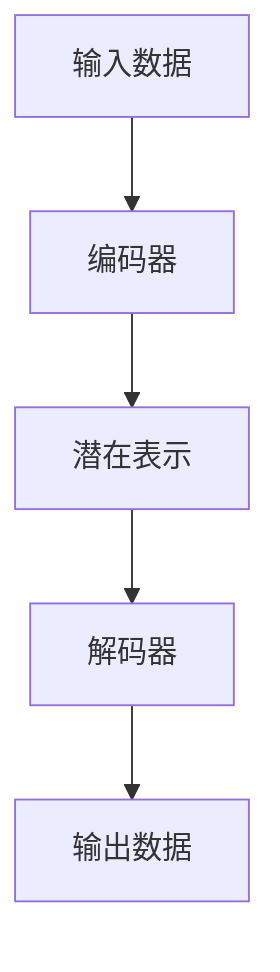

# 从零开始大模型开发与微调：人工智能：思维与实践的融合

## 1. 背景介绍

### 1.1 人工智能的崛起
人工智能(Artificial Intelligence, AI)已经成为当今科技界最炙手可热的话题之一。从语音助手到自动驾驶汽车,从医疗诊断到金融风险评估,AI 技术正在各个领域发挥着越来越重要的作用。而推动这一革命性进展的,正是大型神经网络模型的迅猛发展。

### 1.2 大模型的重要性
大型神经网络模型,通常被称为"大模型"(Large Model),是指具有数十亿甚至数万亿参数的深度学习模型。这些庞大的模型能够从海量数据中学习丰富的知识表示,展现出惊人的泛化能力,在自然语言处理、计算机视觉等领域取得了突破性的成就。

### 1.3 大模型开发的挑战
然而,开发和训练这些大模型并非易事。它需要大量的计算资源、海量的训练数据,以及复杂的模型架构和优化算法。此外,如何有效地微调和应用这些大模型也是一个巨大的挑战。

## 2. 核心概念与联系

### 2.1 深度学习与神经网络
深度学习(Deep Learning)是机器学习的一个子领域,它通过构建多层神经网络来模拟人脑的工作原理,从数据中自动学习特征表示和模式。神经网络由多个层次的节点(神经元)组成,每个节点对输入数据进行加权求和并应用非线性激活函数,最终输出结果。

### 2.2 大模型架构
大模型通常采用变体自编码器(Variational Autoencoder, VAE)或变压器(Transformer)等架构。VAE 能够从数据中学习潜在的连续表示,而变压器则擅长捕捉序列数据中的长期依赖关系。这些架构可以通过堆叠多个编码器和解码器层来构建大型模型。



### 2.3 预训练与微调
为了有效地训练大模型,通常采用两阶段策略:预训练(Pretraining)和微调(Fine-tuning)。在预训练阶段,模型在大量无监督数据上进行自监督学习,学习通用的知识表示。而在微调阶段,模型则在特定任务的标注数据上进行监督学习,对预训练权重进行调整和优化。

## 3. 核心算法原理具体操作步骤

### 3.1 自监督预训练
自监督预训练是指在无需人工标注的大规模数据集上训练模型,让模型自主学习数据的内在结构和模式。常见的自监督预训练任务包括:

#### 3.1.1 掩码语言模型(Masked Language Modeling, MLM)
MLM 任务是在输入序列中随机掩码部分词元,让模型根据上下文预测被掩码的词元。这种方式能够让模型学习到丰富的语义和上下文信息。

#### 3.1.2 下一句预测(Next Sentence Prediction, NSP)
NSP 任务是判断两个输入句子是否相邻出现。这种任务能够帮助模型捕捉更长范围的上下文依赖关系。

#### 3.1.3 对比学习(Contrastive Learning)
对比学习是一种无监督表示学习方法,它通过最大化相似样本之间的相似度,最小化不相似样本之间的相似度,来学习数据的潜在表示。

### 3.2 监督微调
在自监督预训练之后,模型需要在特定任务的标注数据上进行监督微调,以适应具体的应用场景。微调过程包括以下步骤:

1. 准备标注数据集,包括输入数据和对应的标签。
2. 初始化模型权重为预训练得到的权重。
3. 定义适当的损失函数和优化器。
4. 在训练集上进行多轮迭代训练,根据损失函数更新模型权重。
5. 在验证集上评估模型性能,并根据需要调整超参数。
6. 在测试集上评估最终模型性能。

### 3.3 优化技术
训练大模型需要采用一些优化技术来提高效率和性能,例如:

- **梯度剪裁(Gradient Clipping)**: 防止梯度爆炸,保持梯度的数值稳定性。
- **层归一化(Layer Normalization)**: 加速收敛并提高模型性能。
- **梯度累积(Gradient Accumulation)**: 在有限的内存下模拟大批量训练。
- **混合精度训练(Mixed Precision Training)**: 利用低精度计算加速训练过程。

## 4. 数学模型和公式详细讲解举例说明

### 4.1 自编码器
自编码器(Autoencoder)是一种无监督学习模型,它试图将输入数据映射到潜在空间的低维表示,然后再从该表示重构原始输入。自编码器由编码器(Encoder)和解码器(Decoder)两部分组成。

编码器将输入数据 $\boldsymbol{x}$ 映射到潜在表示 $\boldsymbol{z}$:

$$\boldsymbol{z} = f_\theta(\boldsymbol{x})$$

解码器则将潜在表示 $\boldsymbol{z}$ 映射回重构输入 $\boldsymbol{x'}$:

$$\boldsymbol{x'} = g_\phi(\boldsymbol{z})$$

训练目标是最小化重构误差 $\mathcal{L}(\boldsymbol{x}, \boldsymbol{x'})$,例如均方误差:

$$\mathcal{L}(\boldsymbol{x}, \boldsymbol{x'}) = \|\boldsymbol{x} - \boldsymbol{x'}\|_2^2$$

### 4.2 变分自编码器
变分自编码器(Variational Autoencoder, VAE)是自编码器的一种变体,它假设潜在表示 $\boldsymbol{z}$ 服从某种概率分布,例如高斯分布 $\mathcal{N}(\boldsymbol{\mu}, \boldsymbol{\sigma}^2\boldsymbol{I})$。编码器的输出是该分布的均值 $\boldsymbol{\mu}$ 和方差 $\boldsymbol{\sigma}^2$,解码器则从该分布中采样潜在表示 $\boldsymbol{z}$。

VAE 的目标是最大化边际对数似然 $\log p(\boldsymbol{x})$,可以通过最大化证据下界(Evidence Lower Bound, ELBO)来近似优化:

$$\mathcal{L}(\boldsymbol{x}) = \mathbb{E}_{q_\phi(\boldsymbol{z}|\boldsymbol{x})}\big[\log p_\theta(\boldsymbol{x}|\boldsymbol{z})\big] - D_\text{KL}\big(q_\phi(\boldsymbol{z}|\boldsymbol{x}) \| p(\boldsymbol{z})\big)$$

其中第一项是重构项,第二项是KL 散度正则项,用于约束潜在分布接近先验分布。

### 4.3 变压器
变压器(Transformer)是一种基于自注意力机制的序列到序列模型,广泛应用于自然语言处理和计算机视觉等领域。它的核心组件是多头自注意力(Multi-Head Attention)和前馈神经网络(Feed-Forward Network)。

给定查询 $\boldsymbol{Q}$、键 $\boldsymbol{K}$ 和值 $\boldsymbol{V}$ 矩阵,单头自注意力计算如下:

$$\text{Attention}(\boldsymbol{Q}, \boldsymbol{K}, \boldsymbol{V}) = \text{softmax}\left(\frac{\boldsymbol{Q}\boldsymbol{K}^\top}{\sqrt{d_k}}\right)\boldsymbol{V}$$

其中 $d_k$ 是缩放因子,用于避免点积过大导致梯度饱和。多头自注意力则是将多个注意力头的结果拼接:

$$\text{MultiHead}(\boldsymbol{Q}, \boldsymbol{K}, \boldsymbol{V}) = \text{Concat}(\text{head}_1, \dots, \text{head}_h)\boldsymbol{W}^O$$

$$\text{where}\,\text{head}_i = \text{Attention}(\boldsymbol{Q}\boldsymbol{W}_i^Q, \boldsymbol{K}\boldsymbol{W}_i^K, \boldsymbol{V}\boldsymbol{W}_i^V)$$

变压器的编码器和解码器都由多个这样的编码器/解码器层堆叠而成。

## 5. 项目实践:代码实例和详细解释说明

在本节中,我们将通过一个实际的代码示例,演示如何使用 PyTorch 框架开发和微调一个基于 BERT 的文本分类模型。

### 5.1 导入所需库

```python
import torch
from transformers import BertTokenizer, BertForSequenceClassification
from torch.utils.data import TensorDataset, DataLoader
```

我们导入了 PyTorch、Hugging Face Transformers 库,以及一些数据处理相关的模块。

### 5.2 准备数据

```python
# 加载数据
texts = [...] # 文本数据列表
labels = [...] # 对应的标签列表

# 标记化
tokenizer = BertTokenizer.from_pretrained('bert-base-uncased')
input_ids = [tokenizer.encode(text, add_special_tokens=True, max_length=512, truncation=True) for text in texts]

# 创建张量
input_ids = torch.tensor(input_ids, dtype=torch.long)
labels = torch.tensor(labels, dtype=torch.long)

# 创建数据集和数据加载器
dataset = TensorDataset(input_ids, labels)
dataloader = DataLoader(dataset, batch_size=16, shuffle=True)
```

我们首先加载文本数据和对应的标签,然后使用 BERT 分词器将文本标记化为输入 ID 序列。接着,我们创建张量并将它们打包成 PyTorch 的 `TensorDataset`,最后使用 `DataLoader` 加载数据。

### 5.3 加载预训练模型

```python
model = BertForSequenceClassification.from_pretrained('bert-base-uncased', num_labels=2)
```

我们从 Hugging Face 模型库中加载预训练的 BERT 模型,并指定我们的分类任务有两个标签。

### 5.4 训练模型

```python
optimizer = torch.optim.AdamW(model.parameters(), lr=2e-5)
epochs = 3

for epoch in range(epochs):
    model.train()
    for batch in dataloader:
        input_ids, labels = batch
        outputs = model(input_ids, labels=labels)
        loss = outputs.loss
        loss.backward()
        optimizer.step()
        optimizer.zero_grad()
```

我们定义了一个 AdamW 优化器,并在几个 epoch 内对模型进行训练。在每个批次中,我们将输入传入模型,计算损失,反向传播梯度,并更新模型参数。

### 5.5 评估模型

```python
model.eval()
correct = 0
total = 0
with torch.no_grad():
    for batch in dataloader:
        input_ids, labels = batch
        outputs = model(input_ids)
        _, predicted = torch.max(outputs.logits, 1)
        total += labels.size(0)
        correct += (predicted == labels).sum().item()

accuracy = correct / total
print(f'Accuracy: {accuracy:.2f}')
```

在训练结束后,我们切换模型到评估模式,并在测试集上计算分类准确率。我们遍历每个批次的数据,将输入传入模型获取预测结果,然后与真实标签进行比较,最终计算总体准确率。

以上代码展示了如何使用 PyTorch 和 Hugging Face Transformers 库开发和微调一个基于 BERT 的文本分类模型。您可以根据需要对代码进行修改和扩展,以适应不同的任务和模型。

## 6. 实际应用场景

大模型在各个领域都有广泛的应用前景,下面是一些典型的应用场景:

### 6.1 自然语言处理
- 机器翻译: 使用大型语言模型进行高质量的多语种翻译。
- 文本生成: 根据给定的提示或上下文,生成连贯、富有创意的文本内容。
- 问答系统: 基于大模型的深度语义理解,回答复杂的问题。
- 情感分析: 准确识别文本中的情感倾向和情绪。

### 6.2 计算机视觉
- 图像分类: 使用大型卷积神经网络对图像进行精准分类。
- 目标检测: 在复杂场景中准确地检测和定位目标物体。
- 图像生成