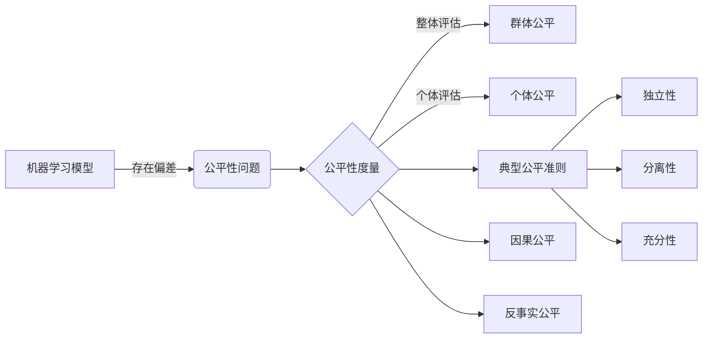

# 公平机器学习 原理与代码实例讲解

## 1.背景介绍

### 1.1 机器学习中的偏差问题

机器学习模型在现实世界中的应用越来越广泛,然而人们逐渐发现,许多模型存在着偏差问题,对不同群体产生了不公平的影响。比如在信贷审批、招聘、司法等领域,模型可能会基于敏感属性如性别、种族产生歧视。这引发了人们对AI公平性的关注。

### 1.2 什么是公平机器学习

公平机器学习(Fair Machine Learning)是一个专门研究如何在机器学习的训练和应用过程中保证其公平性的领域。它旨在识别和消除模型中的偏差,确保不同群体能够被公平对待,不因敏感属性而受到歧视。

### 1.3 公平机器学习的重要性

- 伦理考量:歧视和偏见有悖伦理道德,违背了人类社会的基本价值观。
- 法律合规:许多国家和地区出台了相关法律法规,明确禁止基于特定属性的歧视。
- 社会影响:不公平的模型会加剧社会分化,损害弱势群体利益,引发公众对AI的不信任。
- 模型性能:偏差会降低模型在特定群体上的性能,影响整体效果。

## 2.核心概念与联系

### 2.1 群体公平与个体公平

- 群体公平(Group Fairness):要求模型对不同群体整体预测结果的统计量相近,如同等真正例率等。代表性指标有:人口均等性、机会均等性等。
- 个体公平(Individual Fairness):要求模型对相似个体给出相似预测。即个体的预测结果主要由其自身特征决定,而非敏感属性。

### 2.2 三种典型公平准则

- 独立性(Independence):模型预测结果与敏感属性统计独立。
- 分离性(Separation):给定预测目标Y,模型预测与敏感属性条件独立。
- 充分性(Sufficiency):给定模型预测,真实目标Y与敏感属性条件独立。

### 2.3 因果公平与反事实公平

- 因果公平(Causal Fairness):基于因果模型,通过调整敏感属性到模型预测的因果路径来消除其影响。
- 反事实公平(Counterfactual Fairness):通过反事实推断,假设个体的敏感属性被修改,模型预测是否发生改变,以判断是否存在歧视。

下图展示了这些概念之间的联系:



## 3.核心算法原理具体操作步骤

### 3.1 预处理方法

预处理方法在模型训练前对数据进行转换,消除或减轻敏感属性的影响。主要有:

#### 3.1.1 去除敏感属性

直接从特征中去除敏感属性,防止模型学习到相关信息。但是其他特征与敏感属性相关时,依然存在间接影响。

#### 3.1.2 数据重采样

通过欠采样/过采样等方式,调整数据集在敏感属性取值上的均衡性。常见方法有:

- 随机重采样
- 启发式重采样如SMOTE
- 基于密度的重采样

#### 3.1.3 学习公平表示

通过对抗学习、因果建模等方法,学习一个中间表示,使其难以预测敏感属性,再基于该表示训练下游任务。

### 3.2 训练中方法

训练中方法在模型训练过程中引入公平性约束,使模型满足预设的公平性要求。主要有:

#### 3.2.1 公平性正则化

在损失函数中引入公平性度量作为正则化项,引导模型学习到更公平的结果。例如:

- 基于统计平价的正则化
- 基于公平性度量的正则化
- 基于因果模型的正则化

#### 3.2.2 对抗去偏

引入一个对抗网络,使其难以从模型输出中预测敏感属性。通过最小最大博弈使模型输出与敏感属性无关。

#### 3.2.3 基于因果的方法

显式建模变量间的因果关系,通过调整因果路径来消除敏感属性的影响。常见方法有:

- 基于反事实的方法
- 路径特定效应消除
- 噪声还原

### 3.3 后处理方法

后处理方法在模型训练完成后,对其输出结果进行调整以提升公平性。主要有:

#### 3.3.1 阈值调整

针对不同敏感属性群体,使用不同的决策阈值,以满足事先设定的公平性约束。

#### 3.3.2 结果校准

对模型输出概率进行事后校准,使其在不同敏感属性群体上的分布一致。常见方法有:

- 直方图均衡
- 逻辑回归
- 同态校准

## 4.数学模型和公式详细讲解举例说明

### 4.1 群体公平指标

#### 4.1.1 人口均等性(Demographic Parity)

要求模型对不同敏感属性群体的正例率相等。设 $\hat{Y}$ 为模型预测, $A$ 为敏感属性,则人口均等性要求:

$$P(\hat{Y}=1|A=0) = P(\hat{Y}=1|A=1)$$

例如,在贷款审批中,要求不同性别群体获得贷款的比例相等。

#### 4.1.2 机会均等性(Equalized Odds)

在二分类任务中,要求模型在不同敏感属性群体上的真正例率(TPR)和假正例率(FPR)分别相等。设 $Y$ 为真实标签,则机会均等性要求:

$$P(\hat{Y}=1|A=0,Y=y) = P(\hat{Y}=1|A=1,Y=y), y\in\{0,1\}$$

例如,在病情预测中,要求不同种族患者中,真实患病和未患病的被预测为阳性的比例各自相等。

### 4.2 个体公平度量

#### 4.2.1 个体公平度量

个体公平度量评估模型对相似个体的预测是否一致。常用的度量是:

$$d(\hat{y}_i, \hat{y}_j) \leq L \cdot d(x_i, x_j), \forall i,j$$

其中 $d(\cdot,\cdot)$ 为距离度量, $L$ 为李普希茨常数。该公式表示两个个体的预测差异应该被其特征差异所限制。

例如,在简历筛选时,如果两份简历的关键技能和经历高度相似,模型给出的录用概率应该接近。

### 4.3 因果公平准则

#### 4.3.1 反事实公平(Counterfactual Fairness)

反事实公平判断个体的预测结果是否受到了敏感属性的影响。形式化地,反事实公平要求:

$$P(\hat{Y}_{A\leftarrow a}(U)=y|X=x,A=a) = P(\hat{Y}_{A\leftarrow a'}(U)=y|X=x,A=a), \forall y,a,a'$$

其中 $U$ 为所有潜在变量, $\hat{Y}_{A\leftarrow a}(U)$ 表示将敏感属性 $A$ 设为 $a$ 时, $U$ 通过因果模型得到的 $\hat{Y}$ 值。

直观地,反事实公平要求,假设一个体的敏感属性被修改为另一个值,其预测结果不应发生改变。

## 5.项目实践：代码实例和详细解释说明

下面以一个简单的二分类任务为例,展示如何使用AIF360工具包实现几种典型的公平性约束。

### 5.1 数据准备

首先导入所需的库并加载数据集:

```python
from aif360.datasets import AdultDataset
from aif360.algorithms.preprocessing import Reweighing
from aif360.algorithms.inprocessing import AdversarialDebiasing
from aif360.algorithms.postprocessing import RejectOptionClassification
from aif360.metrics import BinaryLabelDatasetMetric

dataset_orig = AdultDataset(protected_attribute_names=['sex'],
                            privileged_classes=[['Male']],
                            features_to_drop=['age'])
```

这里使用Adult数据集,预测一个人的收入是否超过50K美元。敏感属性为性别,有利群体设为男性。

### 5.2 预处理方法: Reweighing

Reweighing通过对不同群体赋予不同权重来平衡数据集,使训练样本满足人口均等性。

```python
RW = Reweighing(unprivileged_groups=[{'sex': 0}], privileged_groups=[{'sex': 1}])
dataset_transf = RW.fit_transform(dataset_orig)

print(BinaryLabelDatasetMetric(dataset_orig).demographic_parity_difference(),
      BinaryLabelDatasetMetric(dataset_transf).demographic_parity_difference())
```

Reweighing明显减小了人口均等性差异。

### 5.3 训练中方法: AdversarialDebiasing

AdversarialDebiasing通过对抗学习使模型输出与敏感属性无关。

```python
sess = tf.Session()
debiased_model = AdversarialDebiasing(privileged_groups=[{'sex': 1}],
                                      unprivileged_groups=[{'sex': 0}],
                                      scope_name='debiased_classifier',
                                      debias=True, sess=sess)
debiased_model.fit(dataset_orig)

print(BinaryLabelDatasetMetric(dataset_orig, debiased_model).equal_opportunity_difference(),
      BinaryLabelDatasetMetric(dataset_orig, debiased_model).average_odds_difference())
```

对抗训练有效降低了机会均等性差异。

### 5.4 后处理方法: RejectOptionClassification

RejectOptionClassification通过对不同群体设置不同的决策阈值来满足公平性约束。

```python
ROC = RejectOptionClassification(unprivileged_groups=[{'sex': 0}],
                                 privileged_groups=[{'sex': 1}],
                                 low_class_thresh=0.01, high_class_thresh=0.99,
                                  num_class_thresh=100, num_ROC_margin=50,
                                  metric_name="Statistical parity difference",
                                  metric_ub=0.05, metric_lb=-0.05)
ROC = ROC.fit(dataset_orig, debiased_model)

print(BinaryLabelDatasetMetric(dataset_orig, ROC).demographic_parity_difference())
```

阈值调整使人口均等性差异被限制在了0.05以内。

## 6.实际应用场景

公平机器学习在许多关键领域有着广泛应用,例如:

### 6.1 金融领域

- 信用评分:防止模型基于性别、种族等因素产生歧视性结果。
- 贷款审批:确保不同群体获得贷款的机会均等。

### 6.2 司法领域

- 量刑预测:防止模型因被告的敏感属性而给出更重或更轻的量刑建议。
- 再犯风险评估:确保风险评分在不同人口统计群体中的分布一致。

### 6.3 就业领域

- 简历筛选:确保模型对不同性别、年龄的求职者一视同仁。
- 绩效评估:防止评估结果受到员工敏感属性的影响。

### 6.4 医疗领域

- 疾病诊断:确保诊断模型在不同人口群体上的准确率均衡。
- 治疗推荐:保证治疗方案推荐不受患者的敏感属性影响。

### 6.5 教育领域

- 录取预测:确保录取模型给予不同背景学生同等的机会。
- 课程推荐:保证推荐算法没有基于学生群体的偏见。

## 7.工具和资源推荐

- AIF360: IBM开源的用于检测和消除机器学习模型偏差的Python库。
- Fairlearn: Microsoft开源的Python库,支持多种公平性评估和约束方法。
- FairML: 用于审核机器学习模型公平性的Python工具箱。
- Aequitas: 一个开源审计工具包,用于评估机器学习模型的偏差和公平性。
- Themis: 一个评估和加强软件系统公平性的Python库。
- Fairness Measures: 一个Python库,提供多种公平性度量和可视化工具