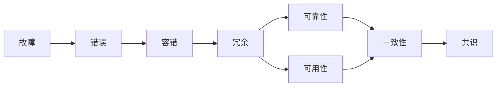

# 分布式系统和容错机制的研究

## 1.背景介绍

随着互联网技术的飞速发展,分布式系统已经成为了当今计算机领域的一个重要研究方向。分布式系统由多台计算机组成,通过网络进行通信和协调,共同完成复杂的计算任务。与传统的集中式系统相比,分布式系统具有更好的可扩展性、可靠性和容错能力。然而,由于分布式系统中的节点可能出现故障,如何保证系统的正确性和可用性成为了一个关键问题。因此,容错机制在分布式系统中扮演着至关重要的角色。

本文将深入探讨分布式系统和容错机制的研究现状和发展趋势。我们将从分布式系统的核心概念出发,分析其面临的挑战,并重点介绍几种常见的容错机制,如复制、检查点和恢复、拜占庭容错等。同时,我们还将结合实际案例,讨论容错机制在分布式系统中的应用,并对未来的研究方向进行展望。

### 1.1 分布式系统的定义与特点
#### 1.1.1 定义
#### 1.1.2 特点
##### 1.1.2.1 地理分布性
##### 1.1.2.2 并发性
##### 1.1.2.3 缺乏全局时钟
##### 1.1.2.4 故障独立性

### 1.2 分布式系统面临的挑战
#### 1.2.1 通信延迟与不可靠
#### 1.2.2 节点故障
#### 1.2.3 数据一致性
#### 1.2.4 安全性

### 1.3 容错机制的重要性
#### 1.3.1 保证系统可用性
#### 1.3.2 提高系统可靠性
#### 1.3.3 降低故障影响

## 2.核心概念与联系

在分布式系统中,容错机制涉及多个核心概念,它们相互关联,共同构成了一个完整的容错体系。本节将重点介绍这些核心概念,并分析它们之间的联系。

### 2.1 故障与错误
#### 2.1.1 故障的定义与分类
##### 2.1.1.1 崩溃故障
##### 2.1.1.2 拜占庭故障
##### 2.1.1.3 通信故障
#### 2.1.2 错误的定义与分类
##### 2.1.2.1 数值错误
##### 2.1.2.2 状态错误
##### 2.1.2.3 时序错误

### 2.2 容错与冗余
#### 2.2.1 容错的定义
#### 2.2.2 冗余的类型
##### 2.2.2.1 信息冗余
##### 2.2.2.2 时间冗余
##### 2.2.2.3 物理冗余

### 2.3 可靠性与可用性
#### 2.3.1 可靠性的定义与度量
#### 2.3.2 可用性的定义与度量
#### 2.3.3 可靠性与可用性的关系

### 2.4 一致性与共识
#### 2.4.1 一致性的定义与分类
##### 2.4.1.1 强一致性
##### 2.4.1.2 弱一致性
##### 2.4.1.3 最终一致性
#### 2.4.2 共识问题
##### 2.4.2.1 定义
##### 2.4.2.2 常见算法

### 2.5 核心概念之间的联系



## 3.核心算法原理具体操作步骤

本节将详细介绍几种常见的容错算法的原理和具体操作步骤,包括复制、检查点和恢复、拜占庭容错等。

### 3.1 复制算法
#### 3.1.1 主动复制
##### 3.1.1.1 原理
##### 3.1.1.2 操作步骤
#### 3.1.2 被动复制
##### 3.1.2.1 原理
##### 3.1.2.2 操作步骤
#### 3.1.3 半主动复制
##### 3.1.3.1 原理
##### 3.1.3.2 操作步骤

### 3.2 检查点和恢复算法
#### 3.2.1 协调检查点
##### 3.2.1.1 原理
##### 3.2.1.2 操作步骤
#### 3.2.2 通信诱发检查点
##### 3.2.2.1 原理
##### 3.2.2.2 操作步骤
#### 3.2.3 日志恢复
##### 3.2.3.1 原理
##### 3.2.3.2 操作步骤

### 3.3 拜占庭容错算法
#### 3.3.1 PBFT
##### 3.3.1.1 原理
##### 3.3.1.2 操作步骤
#### 3.3.2 RBFT
##### 3.3.2.1 原理
##### 3.3.2.2 操作步骤
#### 3.3.3 Zyzzyva
##### 3.3.3.1 原理
##### 3.3.3.2 操作步骤

## 4.数学模型和公式详细讲解举例说明

为了更好地理解容错机制的原理,本节将介绍几个常用的数学模型和公式,并通过具体的例子进行讲解。

### 4.1 故障模型
#### 4.1.1 崩溃故障模型
假设系统中有 $n$ 个节点,其中最多有 $f$ 个节点可能发生崩溃故障。崩溃故障模型可以用以下公式表示:

$$ n \geq 2f + 1 $$

例如,如果系统中有5个节点,最多允许2个节点发生崩溃故障。

#### 4.1.2 拜占庭故障模型
在拜占庭故障模型中,假设系统中有 $n$ 个节点,其中最多有 $f$ 个节点可能发生任意类型的故障。拜占庭故障模型可以用以下公式表示:

$$ n \geq 3f + 1 $$

例如,如果系统中有7个节点,最多允许2个节点发生拜占庭故障。

### 4.2 CAP 定理
CAP 定理指出,在分布式系统中,一致性(Consistency)、可用性(Availability)和分区容错性(Partition Tolerance)三者不可兼得,最多只能同时满足其中两个。

$$
\begin{aligned}
C + A + P &\leq 2 \
C + A &\leq 1 \
C + P &\leq 1 \
A + P &\leq 1
\end{aligned}
$$

例如,如果系统要保证强一致性和分区容错性,那么必须牺牲可用性。

### 4.3 Paxos 算法
Paxos 算法是一种常用的分布式共识算法,用于在不可靠的分布式系统中达成一致。Paxos 算法包含三个角色:Proposer、Acceptor 和 Learner。

假设有 $n$ 个 Acceptor,Paxos 算法需要满足以下条件:

$$
\begin{aligned}
n &\geq 2f + 1 \
\text{Quorum} &= \lfloor \frac{n+1}{2} \rfloor
\end{aligned}
$$

其中,$f$ 表示最大容错数量,Quorum 表示达成共识所需的最小 Acceptor 数量。

例如,如果系统中有5个 Acceptor,最多允许2个 Acceptor 发生故障,达成共识需要至少3个 Acceptor 的同意。

## 5.项目实践:代码实例和详细解释说明

为了更好地理解容错机制在实际项目中的应用,本节将通过几个具体的代码实例,详细解释如何实现复制、检查点和恢复等容错机制。

### 5.1 主动复制实例
以下是一个简单的主动复制实例,使用 Python 实现:

```python
import threading

class ActiveReplication:
    def __init__(self, replicas):
        self.replicas = replicas
        self.lock = threading.Lock()

    def execute(self, command):
        threads = []
        for replica in self.replicas:
            t = threading.Thread(target=replica.execute, args=(command,))
            threads.append(t)
            t.start()

        for t in threads:
            t.join()

class Replica:
    def __init__(self, name):
        self.name = name

    def execute(self, command):
        print(f"Replica {self.name} executes: {command}")

if __name__ == "__main__":
    replicas = [Replica("A"), Replica("B"), Replica("C")]
    ar = ActiveReplication(replicas)

    ar.execute("Command 1")
    ar.execute("Command 2")
```

在这个例子中,我们定义了 `ActiveReplication` 类,它维护了一组 `Replica` 对象。当调用 `execute` 方法时,`ActiveReplication` 会为每个 `Replica` 创建一个线程,并发执行命令。通过这种方式,我们实现了主动复制,提高了系统的可用性和容错能力。

### 5.2 检查点实例
以下是一个简单的检查点实例,使用 Python 实现:

```python
import pickle

class Checkpoint:
    def __init__(self, state):
        self.state = state

    def save(self, filename):
        with open(filename, 'wb') as f:
            pickle.dump(self.state, f)

    @staticmethod
    def load(filename):
        with open(filename, 'rb') as f:
            state = pickle.load(f)
            return Checkpoint(state)

class Application:
    def __init__(self):
        self.data = {}

    def run(self):
        self.data['key1'] = 'value1'
        checkpoint = Checkpoint(self.data)
        checkpoint.save('checkpoint.pkl')

        self.data['key2'] = 'value2'

    def recover(self):
        checkpoint = Checkpoint.load('checkpoint.pkl')
        self.data = checkpoint.state

if __name__ == "__main__":
    app = Application()
    app.run()
    print("Before recovery:", app.data)

    app.recover()
    print("After recovery:", app.data)
```

在这个例子中,我们定义了 `Checkpoint` 类,用于保存和加载应用程序的状态。`Application` 类表示一个简单的应用程序,它在运行过程中修改了内部状态 `data`。通过在适当的时候创建检查点,我们可以在发生故障时恢复应用程序的状态,提高系统的可靠性。

### 5.3 拜占庭容错实例
以下是一个简单的拜占庭容错实例,基于 PBFT 算法,使用 Python 实现:

```python
class Node:
    def __init__(self, name):
        self.name = name
        self.state = None

    def receive_request(self, request):
        self.state = request

    def broadcast_state(self, nodes):
        for node in nodes:
            node.receive_state(self.state)

    def receive_state(self, state):
        if self.state is None:
            self.state = state

class ByzantineFaultTolerance:
    def __init__(self, nodes):
        self.nodes = nodes

    def execute(self, request):
        primary = self.nodes[0]
        primary.receive_request(request)
        primary.broadcast_state(self.nodes[1:])

        for node in self.nodes[1:]:
            node.broadcast_state(self.nodes)

        states = [node.state for node in self.nodes]
        return max(set(states), key=states.count)

if __name__ == "__main__":
    nodes = [Node(f"Node{i}") for i in range(4)]
    bft = ByzantineFaultTolerance(nodes)

    result = bft.execute("Request")
    print("Final result:", result)
```

在这个例子中,我们模拟了一个简化版的 PBFT 算法。`Node` 类表示系统中的节点,它们可以接收请求并广播自己的状态。`ByzantineFaultTolerance` 类负责协调节点之间的通信,并确定最终的结果。通过这种方式,即使系统中存在拜占庭故障,我们仍然可以达成共识,保证系统的正确性。

## 6.实际应用场景

容错机制在许多实际应用场景中都发挥着重要作用。本节将介绍几个典型的应用场景,并分析容错机制如何提高系统的可靠性和可用性。

### 6.1 分布式数据库
在分布式数据库中,数据被分散存储在多个节点上。为了保证数据的一致性和可用性,需要采用复制和分区等容错机制。常见的容错技术包括:

- 主从复制:将数据复制到多个节点,其中一个节点作为主节点,负责处理写请求,其他节点作为从节点,负责处理读请求。
- 多主复制:允许多个节点同时处理写请求,通过冲突检测和解决机制保证数