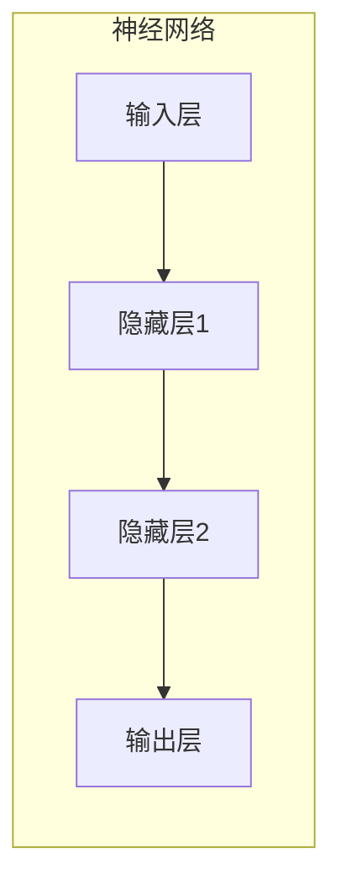
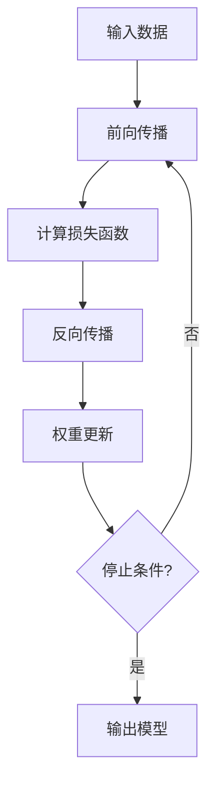

# 反向传播算法的学习资源推荐：书籍、课程与网站

## 1.背景介绍

### 1.1 什么是反向传播算法？
反向传播算法(Backpropagation Algorithm)是一种用于训练人工神经网络的监督学习算法。它通过计算损失函数关于网络权重的梯度,然后沿着梯度的反方向更新权重,从而最小化损失函数的值,实现网络参数的优化。

反向传播算法是训练深度学习模型的核心算法之一,被广泛应用于计算机视觉、自然语言处理、语音识别等领域。掌握反向传播算法对于深入理解和实现深度学习模型至关重要。

### 1.2 反向传播算法的重要性
反向传播算法的出现是深度学习发展的关键推动力。在反向传播算法被提出之前,神经网络的训练存在瓶颈,无法有效训练多层网络。反向传播算法的发明使得多层神经网络的训练成为可能,从而催生了深度学习的兴起和发展。

深度学习在计算机视觉、自然语言处理、语音识别等领域取得了突破性进展,这都离不开反向传播算法的支持。因此,反向传播算法是深度学习的基石,理解和掌握反向传播算法对于深入学习深度学习理论和实践至关重要。

## 2.核心概念与联系

### 2.1 神经网络
神经网络是一种受生物神经系统启发而设计的计算模型,由多个相互连接的节点(神经元)组成。每个神经元接收来自其他神经元的输入,经过加权求和和激活函数的计算,产生输出。

神经网络通过训练调整连接权重,从而学习输入与输出之间的映射关系。反向传播算法就是训练神经网络的核心算法之一。



### 2.2 损失函数
损失函数(Loss Function)是用于衡量模型预测输出与真实标签之间差异的函数。常见的损失函数包括均方误差(MSE)、交叉熵损失(Cross-Entropy Loss)等。

在反向传播算法中,我们需要计算损失函数关于网络权重的梯度,并沿着梯度的反方向更新权重,从而最小化损失函数的值。

### 2.3 梯度下降
梯度下降(Gradient Descent)是一种优化算法,用于找到函数的最小值。在反向传播算法中,我们使用梯度下降算法来更新神经网络的权重,从而最小化损失函数。

梯度下降算法的基本思想是沿着函数梯度的反方向移动,直到找到函数的最小值。在每一步迭代中,权重会根据梯度和学习率进行更新。

## 3.核心算法原理具体操作步骤

反向传播算法的核心思想是利用链式法则计算损失函数关于每个权重的偏导数(梯度),然后沿着梯度的反方向更新权重。具体步骤如下:

1. **前向传播(Forward Propagation)**
   - 输入数据传递到输入层
   - 依次计算每一层的输出,直到输出层
   - 计算输出层的损失函数值

2. **反向传播(Backpropagation)**
   - 计算输出层损失函数关于输出的偏导数
   - 利用链式法则,计算每一层的损失函数关于权重的偏导数(梯度)
   - 从输出层开始,依次向前计算每一层的梯度

3. **权重更新(Weight Update)**
   - 使用梯度下降算法,沿着梯度的反方向更新每一层的权重
   - 权重更新公式: $w_{new} = w_{old} - \eta \frac{\partial L}{\partial w}$
     - $w$: 权重
     - $\eta$: 学习率
     - $\frac{\partial L}{\partial w}$: 损失函数关于权重的梯度

4. **重复迭代**
   - 重复执行前向传播、反向传播和权重更新,直到达到停止条件(如最大迭代次数或损失函数收敛)



## 4.数学模型和公式详细讲解举例说明

### 4.1 前向传播
假设我们有一个单层神经网络,输入为$x$,权重为$w$,偏置为$b$,激活函数为$\sigma$,则前向传播的计算过程为:

$$
y = \sigma(w^Tx + b)
$$

其中$w^Tx$表示输入$x$与权重$w$的点积。

### 4.2 损失函数
常见的损失函数包括均方误差(MSE)和交叉熵损失(Cross-Entropy Loss)。

**均方误差(MSE)**:
$$
L(y, \hat{y}) = \frac{1}{2}(y - \hat{y})^2
$$

其中$y$是真实标签,$\hat{y}$是模型预测输出。

**交叉熵损失(Cross-Entropy Loss)**:
$$
L(y, \hat{y}) = -[y\log(\hat{y}) + (1-y)\log(1-\hat{y})]
$$

交叉熵损失常用于分类问题。

### 4.3 反向传播
假设我们的损失函数为$L$,权重为$w$,偏置为$b$,激活函数为$\sigma$,则反向传播的计算过程为:

1. 计算输出层的梯度:
   $$
   \frac{\partial L}{\partial y} = \frac{\partial L}{\partial \hat{y}} \cdot \frac{\partial \hat{y}}{\partial y}
   $$

2. 计算隐藏层的梯度:
   $$
   \frac{\partial L}{\partial z} = \frac{\partial L}{\partial y} \cdot \frac{\partial y}{\partial z}
   $$
   其中$z$是隐藏层的输入。

3. 计算权重和偏置的梯度:
   $$
   \frac{\partial L}{\partial w} = \frac{\partial L}{\partial z} \cdot \frac{\partial z}{\partial w} \
   \frac{\partial L}{\partial b} = \frac{\partial L}{\partial z} \cdot \frac{\partial z}{\partial b}
   $$

### 4.4 权重更新
使用梯度下降算法更新权重和偏置:

$$
w_{new} = w_{old} - \eta \frac{\partial L}{\partial w} \
b_{new} = b_{old} - \eta \frac{\partial L}{\partial b}
$$

其中$\eta$是学习率,控制梯度下降的步长。

## 5.项目实践：代码实例和详细解释说明

以下是一个使用Python和PyTorch实现反向传播算法的简单示例:

```python
import torch
import torch.nn as nn

# 定义神经网络模型
class SimpleNet(nn.Module):
    def __init__(self, input_size, hidden_size, output_size):
        super(SimpleNet, self).__init__()
        self.fc1 = nn.Linear(input_size, hidden_size)
        self.relu = nn.ReLU()
        self.fc2 = nn.Linear(hidden_size, output_size)

    def forward(self, x):
        out = self.fc1(x)
        out = self.relu(out)
        out = self.fc2(out)
        return out

# 创建模型实例
model = SimpleNet(input_size=10, hidden_size=5, output_size=1)

# 定义损失函数和优化器
criterion = nn.MSELoss()
optimizer = torch.optim.SGD(model.parameters(), lr=0.01)

# 训练循环
for epoch in range(100):
    # 前向传播
    inputs = torch.randn(1, 10)  # 随机输入数据
    targets = torch.randn(1, 1)  # 随机目标数据
    outputs = model(inputs)
    loss = criterion(outputs, targets)

    # 反向传播
    optimizer.zero_grad()
    loss.backward()
    optimizer.step()

    # 打印损失
    if (epoch + 1) % 10 == 0:
        print(f'Epoch [{epoch+1}/100], Loss: {loss.item():.4f}')
```

在这个示例中,我们定义了一个简单的全连接神经网络`SimpleNet`。它包含一个隐藏层,使用ReLU作为激活函数。

我们使用均方误差(MSE)作为损失函数,并使用随机梯度下降(SGD)作为优化器。在训练循环中,我们执行以下步骤:

1. 生成随机输入数据和目标数据
2. 执行前向传播,计算模型输出和损失
3. 调用`loss.backward()`执行反向传播,计算梯度
4. 调用`optimizer.step()`更新权重和偏置

每10个epoch,我们打印当前的损失值。通过多次迭代,模型将逐步优化权重和偏置,使损失函数最小化。

## 6.实际应用场景

反向传播算法在以下领域有广泛的应用:

1. **计算机视觉**: 图像分类、目标检测、语义分割等任务
2. **自然语言处理**: 机器翻译、文本生成、情感分析等任务
3. **语音识别**: 自动语音识别、语音合成等任务
4. **推荐系统**: 个性化推荐、协同过滤等任务
5. **金融**: 风险管理、欺诈检测、股票预测等任务
6. **医疗**: 疾病诊断、药物发现、医学图像分析等任务

反向传播算法是深度学习模型训练的核心算法,支撑了深度学习在各个领域的应用和发展。

## 7.工具和资源推荐

### 7.1 深度学习框架
- **PyTorch**: 由Facebook开发的深度学习框架,具有动态计算图和良好的Python集成性。
- **TensorFlow**: 由Google开发的深度学习框架,具有静态计算图和丰富的生态系统。
- **Keras**: 基于TensorFlow或Theano的高级深度学习库,提供简洁的API。

### 7.2 在线课程
- **深度学习专项课程(吴恩达,Coursera)**: 由吴恩达教授开设的经典深度学习课程,涵盖了反向传播算法和深度学习的核心概念。
- **深度学习纳米学位(Udacity)**: Udacity提供的深度学习纳米学位课程,包含反向传播算法和实践项目。
- **深度学习(fast.ai)**: fast.ai提供的实践性深度学习课程,包括反向传播算法的应用。

### 7.3 书籍
- **深度学习(Ian Goodfellow等著)**: 深度学习领域的经典教材,详细介绍了反向传播算法和深度学习理论。
- **神经网络与深度学习(Michael Nielsen著)**: 通过在线书籍形式,从基础到高级逐步介绍反向传播算法和深度学习概念。
- **深度学习入门(Jeremy Howard等著)**: 以实践为导向,介绍了反向传播算法和深度学习模型的实现。

### 7.4 在线资源
- **神经网络和深度学习(Michael Nielsen)**: 在线书籍,免费提供反向传播算法和深度学习的详细介绍。
- **深度学习.ai**: 吴恩达教授的深度学习网站,提供课程、教程和资源。
- **Papers With Code**: 收集了许多深度学习论文和代码实现,包括反向传播算法的应用。

## 8.总结:未来发展趋势与挑战

### 8.1 未来发展趋势
- **模型压缩和加速**: 通过模型压缩、量化和硬件加速等技术,提高深度学习模型的效率和部署能力。
- **少样本学习**: 通过元学习、迁移学习等技术,实现在少量数据下有效训练深度学习模型。
- **可解释性**: 提高深度学习模型的可解释性,使模型决策更加透明和可信。
- **多模态学习**: 融合视觉、语音、文本等多种模态数据,实现更强大的人工智能系统。
- **自监督学习**: 利用大量未标注数据进行自监督学习,减少对标注数据的依赖。

### 8.2 挑战
- **计算资源需求**: 训练大型深度学习模型需要大量计算资源,如何提高计算效率是一个挑战。
- **数据质量和隐私**: 确保训练数据的质量和