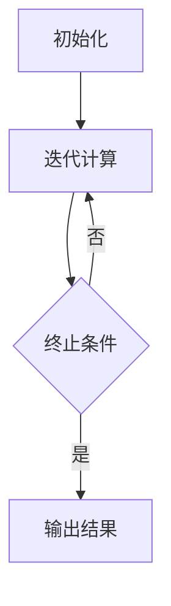

# 图形处理的未来:Pregel之后的新趋势

## 1.背景介绍

### 1.1 图形处理的重要性

在当今的数据密集型世界中,图形处理已经成为一个不可或缺的工具。从社交网络到生物信息学,从网络安全到交通规划,图形数据无处不在。高效处理大规模图形数据对于发现隐藏的模式、揭示复杂关系以及优化决策过程至关重要。

### 1.2 Pregel的里程碑意义

2010年,Google提出了Pregel,这是一种基于大规模并行处理的图形处理系统。Pregel的出现标志着图形处理领域的一个里程碑,它为处理大规模图形数据提供了一种高效、可扩展的解决方案。Pregel采用"顺次迭代"的计算模型,通过并行执行顶点程序来实现图形算法。

### 1.3 Pregel的局限性

尽管Pregel在图形处理领域取得了巨大成功,但它也存在一些局限性。例如,它主要针对静态图形数据,无法高效处理动态变化的图形。此外,Pregel的编程模型相对较为低级,开发复杂的图形算法可能会比较困难。

## 2.核心概念与联系

### 2.1 图形处理系统的关键概念

理解图形处理系统的核心概念对于评估新兴趋势至关重要。以下是一些关键概念:

- **数据模型**: 图形数据通常由顶点(节点)和边(关系)组成。不同系统对数据模型的支持也不尽相同,如属性图、知识图谱等。
- **计算模型**: 图形处理系统通常采用特定的计算模型,如Pregel的"顺次迭代"、GAS(Gather-Apply-Scatter)等。
- **容错与一致性**: 在分布式环境下,图形处理系统需要具备容错和一致性保证的能力。
- **查询语言**: 高级查询语言可以简化图形分析和处理的过程。

### 2.2 新兴趋势与Pregel的关联

虽然Pregel在图形处理领域占据重要地位,但新兴趋势也在不断涌现,试图解决Pregel的局限性并提供更强大的功能。这些新趋势与Pregel存在一些联系,但也有显著的差异。

## 3.核心算法原理具体操作步骤

### 3.1 Pregel的"顺次迭代"计算模型

Pregel采用"顺次迭代"的计算模型,其核心算法原理如下:

1. **初始化**: 每个顶点都会执行一个用户定义的初始化函数,用于设置初始值。
2. **迭代计算**:
   - 每个顶点并行执行用户定义的顶点程序。
   - 顶点程序可以读取当前顶点的值和邻居的值,并根据算法逻辑更新自身的值。
   - 顶点程序还可以向邻居发送消息,这些消息将在下一次迭代时被处理。
3. **终止条件**:当所有顶点的值都不再发生变化时,迭代计算结束。

以PageRank算法为例,其具体操作步骤如下:



1. 初始化每个网页的PageRank值为1/N(N为网页总数)。
2. 迭代计算:
   - 每个网页并行执行顶点程序。
   - 顶点程序根据邻居的PageRank值和出边数,计算当前网页的新PageRank值。
   - 顶点程序将新计算的PageRank值发送给邻居。
3. 当所有网页的PageRank值不再发生变化时,迭代结束,输出最终结果。

### 3.2 GAS计算模型

除了"顺次迭代"模型,一些新兴系统采用了GAS(Gather-Apply-Scatter)计算模型。GAS模型将计算过程分为三个阶段:

1. **Gather阶段**: 每个顶点从邻居收集数据。
2. **Apply阶段**: 每个顶点并行执行用户定义的函数,根据收集的数据更新自身的值。
3. **Scatter阶段**: 每个顶点将更新后的值发送给邻居。

GAS模型提供了更细粒度的控制,可以更好地支持异构计算和动态图形处理。

## 4.数学模型和公式详细讲解举例说明

### 4.1 PageRank算法

PageRank是一种著名的链接分析算法,用于评估网页的重要性。它的核心思想是:一个网页的重要性不仅取决于它被多少其他网页链接,还取决于链接它的网页的重要性。

PageRank算法的数学模型如下:

$$PR(p) = (1-d) + d \sum_{q \in M(p)} \frac{PR(q)}{L(q)}$$

其中:

- $PR(p)$表示网页$p$的PageRank值
- $M(p)$是链接到$p$的网页集合
- $L(q)$是网页$q$的出链接数
- $d$是一个阻尼系数,通常取值0.85

该公式表示,一个网页的PageRank值是由两部分组成:

1. $(1-d)$,代表随机浏览者可能直接访问该网页的概率。
2. $d \sum_{q \in M(p)} \frac{PR(q)}{L(q)}$,代表从链接到该网页的其他网页过渡而来的概率。

通过迭代计算,PageRank值会收敛到一个稳定的值,反映了网页的重要性排名。

### 4.2 图形卷积神经网络(GCN)

图形卷积神经网络(GCN)是一种应用于图形数据的深度学习模型。它的核心思想是在图形结构上进行卷积操作,捕捉顶点的局部邻域信息。

GCN的数学模型如下:

$$H^{(l+1)} = \sigma\left(\tilde{D}^{-\frac{1}{2}}\tilde{A}\tilde{D}^{-\frac{1}{2}}H^{(l)}W^{(l)}\right)$$

其中:

- $H^{(l)}$是第$l$层的特征矩阵,每一行对应一个顶点的特征向量
- $\tilde{A} = A + I_N$是图形的邻接矩阵加上恒等矩阵(以保留自身特征)
- $\tilde{D}_{ii} = \sum_j \tilde{A}_{ij}$是度矩阵
- $W^{(l)}$是第$l$层的权重矩阵
- $\sigma$是非线性激活函数,如ReLU

该公式表示,每个顶点的新特征向量是通过对其邻居特征向量进行加权求和,并与当前层的权重矩阵相乘得到。通过堆叠多层GCN,可以捕捉到更大范围的邻域信息。

GCN已被广泛应用于节点分类、链接预测等图形任务中,展现出优异的性能。

## 5.项目实践:代码实例和详细解释说明

为了更好地理解图形处理算法,我们将通过实际代码示例来演示PageRank算法在Pregel中的实现。

```python
from pregel import Pregel, Combiner

class PageRankVertex(Vertex):
    def __init__(self):
        self.pr = 1.0  # 初始PageRank值
        self.outbound = []  # 出边列表

    def compute(self, messages):
        if superstep() == 0:
            # 初始化阶段,将自身PageRank值发送给邻居
            for nbr in outbound:
                send_message(nbr, self.pr / len(outbound))
        else:
            # 迭代计算阶段
            sum_pr = sum(messages.values())
            new_pr = 0.15 + 0.85 * sum_pr
            if abs(new_pr - self.pr) > 0.0001:
                self.pr = new_pr
                for nbr in outbound:
                    send_message(nbr, self.pr / len(outbound))
            else:
                # 收敛,停止计算
                vote_to_halt()

# 初始化Pregel作业
job = Pregel("PageRank", PageRankVertex, Combiner("sum"))

# 加载图形数据
job.load_graph(...)

# 执行PageRank算法
job.start()

# 输出结果
for vertex in job.get_vertices():
    print(f"Vertex {vertex.id}: PageRank = {vertex.pr}")
```

在这个示例中,我们定义了一个`PageRankVertex`类,用于实现PageRank算法的顶点程序。

1. 在初始化阶段(superstep=0),每个顶点将自身的初始PageRank值平均分配给所有邻居。
2. 在迭代计算阶段,每个顶点根据收到的邻居消息计算新的PageRank值。如果新值与旧值的差异超过阈值,则更新自身的PageRank值并将新值发送给邻居;否则,投票终止计算。
3. 最后,我们输出每个顶点的最终PageRank值。

通过这个示例,我们可以看到Pregel的"顺次迭代"计算模型是如何实现PageRank算法的。虽然代码相对简单,但是在大规模图形数据上执行时,由于并行计算的优势,Pregel可以提供出色的性能和可扩展性。

## 6.实际应用场景

图形处理技术在许多领域都有广泛的应用,下面是一些典型的应用场景:

### 6.1 社交网络分析

社交网络可以被自然地表示为图形结构,其中用户是顶点,友谊关系是边。图形处理技术可以用于:

- 社区发现:识别具有紧密连接的用户群体。
- 影响力分析:确定具有高影响力的用户。
- 链接预测:预测潜在的新连接。

### 6.2 推荐系统

推荐系统通常会构建一个巨大的用户-物品关联图,并基于该图形进行协同过滤推荐。图形处理技术可以用于:

- 计算相似度:找到相似兴趣的用户或相似属性的物品。
- 路径分析:发现用户之间的关联路径,用于推荐。

### 6.3 网络安全

在网络安全领域,图形处理技术可以用于:

- 入侵检测:通过分析网络流量图发现异常模式。
- 恶意软件分析:构建恶意软件样本之间的关联图,发现新的威胁。

### 6.4 生物信息学

生物信息学中的许多问题都可以用图形表示,如蛋白质互作网络、代谢网络等。图形处理技术可以用于:

- 功能预测:根据蛋白质互作关系预测其功能。
- 模块发现:识别具有特定功能的蛋白质模块。

### 6.5 交通规划

交通网络可以被建模为一个巨大的图形,其中路口是顶点,道路是边。图形处理技术可以用于:

- 路径规划:计算最短路径或考虑交通状况的最优路径。
- 交通流量分析:识别拥堵区域并优化交通流量。

## 7.工具和资源推荐

为了方便开发人员利用图形处理技术,已经出现了许多优秀的工具和资源。以下是一些值得推荐的选择:

### 7.1 图形处理系统

- **Apache Giraph**: 一个基于Pregel模型的开源图形处理系统,可以在Hadoop集群上运行。
- **Apache Spark GraphX**: Spark的图形处理模块,支持图形并行计算和图形算法库。
- **Neo4j**: 一个高性能的本地图形数据库,提供声明式图形查询语言Cypher。
- **TigerGraph**: 一个分布式本地图形数据库,专注于实时深度链路分析。

### 7.2 图形算法库

- **NetworkX**: Python中流行的图形算法库,提供了丰富的图形分析功能。
- **igraph**: 一个高性能的图形算法库,支持Python、R和C等多种语言。
- **GraphBLAS**: 一种基于线性代数的图形计算标准,提供了高效的图形操作接口。

### 7.3 数据集和基准测试

- **Stanford Large Network Dataset Collection**: 包含了许多真实世界的大型网络数据集。
- **Graph500**: 一个用于评估图形处理系统性能的基准测试套件。
- **LDBC Graphalytics**: 一个旨在评估图形分析系统的基准测试框架。

### 7.4 教育资源