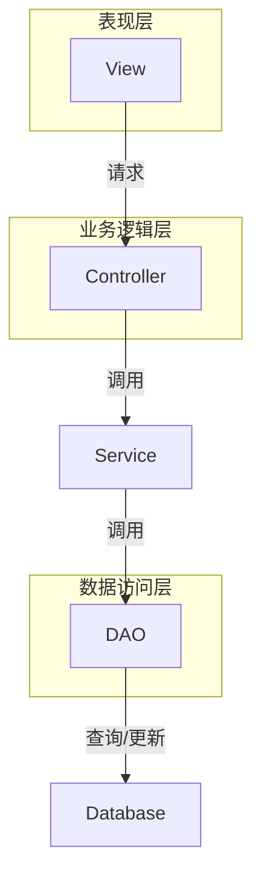
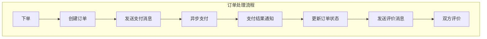

# 基于SSM的公寓出租管理系统

## 1.背景介绍

### 1.1 公寓出租行业现状

随着城市化进程的不断推进,越来越多的人口涌入大城市,公寓出租市场呈现出了旺盛的需求。公寓出租行业作为一种新兴的住宿模式,为城市新移民提供了经济实惠且便利的居住选择。然而,传统的公寓出租管理方式存在诸多弊端,例如信息不对称、流程繁琐、缺乏透明度等,导致租客和房东双方的利益无法得到充分保障。

### 1.2 公寓出租管理系统的需求

为了解决上述问题,构建一个高效、透明、安全的公寓出租管理系统势在必行。该系统需要实现以下核心功能:

- 房源信息管理:房东可以方便地发布和维护房源信息,租客可以快速查找符合需求的房源。
- 订单管理:租客可以在线预订房源,系统自动处理订单流程,提高效率。
- 支付管理:集成多种支付方式,为租客和房东提供安全可靠的支付渠道。
- 评价体系:租客和房东可以互相评价,建立信任机制,提高交易质量。
- 数据分析:系统可以基于历史数据进行分析,为决策提供支持。

### 1.3 技术选型

为了实现上述需求,我们选择了基于SSM(Spring、SpringMVC、MyBatis)框架的技术架构,并采用了以下关键技术:

- Spring:提供依赖注入、面向切面编程等核心功能,简化开发。
- SpringMVC:实现请求映射、数据绑定、视图渲染等Web层功能。
- MyBatis:对象关系映射(ORM)框架,简化数据库操作。
- MySQL:关系型数据库,存储系统数据。
- Redis:分布式缓存,提高系统性能。
- Elasticsearch:分布式搜索引擎,实现高效搜索。
- RabbitMQ:消息队列,实现异步通信和任务分发。

## 2.核心概念与联系

### 2.1 系统架构概览

基于SSM的公寓出租管理系统采用了经典的三层架构,包括表现层(View)、业务逻辑层(Controller)和数据访问层(DAO),如下图所示:



其中:

- 表现层(View):负责与用户交互,接收请求并渲染视图。
- 业务逻辑层(Controller):处理业务逻辑,调用Service层完成具体操作。
- 数据访问层(DAO):与数据库进行交互,执行数据查询、插入、更新和删除操作。

### 2.2 核心模块

系统的核心模块包括:

- 房源模块:管理房源信息,包括发布、编辑、删除和搜索功能。
- 订单模块:处理租房订单,包括下单、支付、评价等流程。
- 用户模块:管理用户信息,包括注册、登录、个人中心等功能。
- 支付模块:集成第三方支付平台,为租客和房东提供安全可靠的支付渠道。
- 消息模块:实现系统内部的异步通信,如订单通知、评价提醒等。

这些模块相互协作,共同构建了一个完整的公寓出租管理系统。

## 3.核心算法原理具体操作步骤

### 3.1 房源搜索算法

房源搜索是系统的核心功能之一,我们采用了基于Elasticsearch的搜索引擎实现。具体操作步骤如下:

1. 数据同步:系统会定期将MySQL中的房源数据同步到Elasticsearch索引中。
2. 查询解析:当用户发起搜索请求时,系统会解析查询条件,构建Elasticsearch查询对象。
3. 关键词匹配:Elasticsearch会基于关键词(如地址、价格范围等)匹配相关文档。
4. 相关性排序:Elasticsearch内置的相关性算法会对匹配结果进行排序,将最相关的结果排在前面。
5. 分页返回:系统会对排序后的结果进行分页,返回给前端展示。

### 3.2 订单处理流程

订单处理是系统的另一核心流程,涉及多个模块的协作,具体步骤如下:



1. 下单:租客在前端选择房源并提交订单。
2. 创建订单:系统创建订单记录,状态为"未支付"。
3. 发送支付消息:系统向RabbitMQ发送支付消息。
4. 异步支付:支付消费者从RabbitMQ获取消息,调用第三方支付平台完成支付。
5. 支付结果通知:支付平台通知系统支付结果。
6. 更新订单状态:系统根据支付结果更新订单状态。
7. 发送评价消息:系统向RabbitMQ发送评价消息。
8. 双方评价:评价消费者从RabbitMQ获取消息,通知双方进行评价。

这种基于消息队列的异步处理模式,可以有效提高系统的吞吐量和可靠性。

## 4.数学模型和公式详细讲解举例说明

### 4.1 相关性算法

在房源搜索中,Elasticsearch采用了基于向量空间模型(VSM)的相关性算法BM25,用于计算文档与查询的相关程度。BM25算法的公式如下:

$$
\mathrm{score}(D,Q) = \sum_{i=1}^{n} \mathrm{IDF}(q_i) \cdot \frac{f(q_i,D) \cdot (k_1+1)}{f(q_i,D) + k_1\cdot\left(1-b+b\cdot\frac{|D|}{\mathrm{avgdl}}\right)}
$$

其中:

- $D$是文档,
- $Q$是查询,
- $q_i$是查询中的第$i$个词项,
- $n$是查询中词项的总数,
- $f(q_i,D)$是词项$q_i$在文档$D$中出现的频率,
- $|D|$是文档$D$的长度(词项数),
- $\mathrm{avgdl}$是文档集合的平均长度,
- $k_1$和$b$是调节因子,用于控制词频和文档长度对相关性的影响。

IDF(Inverse Document Frequency,逆文档频率)反映了词项的重要程度,计算公式如下:

$$
\mathrm{IDF}(q_i) = \log\frac{N-n(q_i)+0.5}{n(q_i)+0.5}
$$

其中:

- $N$是文档集合的总数,
- $n(q_i)$是包含词项$q_i$的文档数。

通过将词频、文档长度和词项重要性综合考虑,BM25算法可以较准确地评估文档与查询的相关程度,从而提高搜索质量。

### 4.2 协同过滤推荐算法

为了向用户推荐感兴趣的房源,我们采用了基于用户的协同过滤算法。该算法的核心思想是:如果两个用户对某些房源的评价相似,那么他们对其他房源的评价也可能相似。

具体来说,我们首先计算任意两个用户$u$和$v$的相似度$\mathrm{sim}(u,v)$,常用的相似度计算方法有:

- 欧几里得距离:
  $$\mathrm{sim}(u,v) = \frac{1}{1+\sqrt{\sum_{i\in I}(r_{ui}-r_{vi})^2}}$$
- 皮尔逊相关系数:
  $$\mathrm{sim}(u,v) = \frac{\sum_{i\in I}(r_{ui}-\overline{r_u})(r_{vi}-\overline{r_v})}{\sqrt{\sum_{i\in I}(r_{ui}-\overline{r_u})^2}\sqrt{\sum_{i\in I}(r_{vi}-\overline{r_v})^2}}$$

其中,$I$是两个用户都评价过的房源集合,$r_{ui}$和$r_{vi}$分别表示用户$u$和$v$对房源$i$的评分,$\overline{r_u}$和$\overline{r_v}$是用户$u$和$v$的平均评分。

接下来,对于目标用户$u$,我们可以基于其他用户的评分,预测$u$对未评价房源$j$的兴趣程度:

$$
p_{uj} = \overline{r_u} + \frac{\sum_{v\in V}(r_{vj}-\overline{r_v})\cdot\mathrm{sim}(u,v)}{\sum_{v\in V}\mathrm{sim}(u,v)}
$$

其中,$V$是与用户$u$有相似评价记录的用户集合。

根据预测的兴趣程度$p_{uj}$,我们可以为目标用户$u$推荐感兴趣的房源。

## 5.项目实践:代码实例和详细解释说明

### 5.1 房源发布

房东可以通过发布房源信息将房屋租赁出去,下面是发布房源的核心代码:

```java
// HouseController.java
@PostMapping("/publish")
public String publishHouse(@Valid HouseForm form, Errors errors, HttpSession session) {
    if (errors.hasErrors()) {
        // 表单验证失败,返回错误信息
        return "house/publish";
    }

    User user = (User) session.getAttribute("user");
    House house = new House();
    BeanUtils.copyProperties(form, house);
    house.setUserId(user.getId());

    houseService.publishHouse(house);
    return "redirect:/house/my";
}
```

```java
// HouseService.java
@Transactional
public void publishHouse(House house) {
    houseMapper.insert(house);

    // 同步到Elasticsearch
    HouseDoc doc = new HouseDoc(house);
    elasticsearchService.saveHouse(doc);
}
```

在发布房源时,我们首先对表单数据进行验证,然后将数据保存到MySQL数据库中。同时,我们将房源数据同步到Elasticsearch索引中,以支持高效搜索。

### 5.2 房源搜索

用户可以根据地址、价格范围等条件搜索感兴趣的房源,下面是搜索的核心代码:

```java
// HouseSearchController.java
@GetMapping("/search")
public String search(SearchForm form, Model model) {
    SearchResult<HouseDoc> searchResult = elasticsearchService.search(form);
    model.addAttribute("searchResult", searchResult);
    return "house/search";
}
```

```java
// ElasticsearchService.java
public SearchResult<HouseDoc> search(SearchForm form) {
    BoolQueryBuilder boolQuery = QueryBuilders.boolQuery();

    // 添加地址查询条件
    if (StringUtils.isNotBlank(form.getAddress())) {
        boolQuery.must(QueryBuilders.matchQuery("address", form.getAddress()));
    }

    // 添加价格范围查询条件
    if (form.getPriceMin() != null && form.getPriceMax() != null) {
        boolQuery.must(QueryBuilders.rangeQuery("price").gte(form.getPriceMin()).lte(form.getPriceMax()));
    }

    // 执行搜索
    SearchRequest request = new SearchRequest("house").source(new SearchSourceBuilder().query(boolQuery));
    SearchResponse response = client.search(request, RequestOptions.DEFAULT);

    // 处理搜索结果
    SearchHits hits = response.getHits();
    SearchResult<HouseDoc> result = new SearchResult<>();
    result.setTotal(hits.getTotalHits().value);
    result.setResults(Arrays.stream(hits.getHits())
            .map(SearchHit::getSourceAsString)
            .map(HouseDoc::new)
            .collect(Collectors.toList()));
    return result;
}
```

在搜索时,我们首先根据用户输入的条件构建Elasticsearch查询对象,然后执行搜索并处理结果。最后,我们将搜索结果返回给前端进行展示。

## 6.实际应用场景

基于SSM的公寓出租管理系统可以广泛应用于以下场景:

### 6.1 长租公寓

长租公寓是该系统的主要应用场景。租客可以在系统中方便地查找符合需求的房源,并在线完成预订和支付;房东可以高效管理房源信息和订单,提高运营效率。

### 6.2 短租