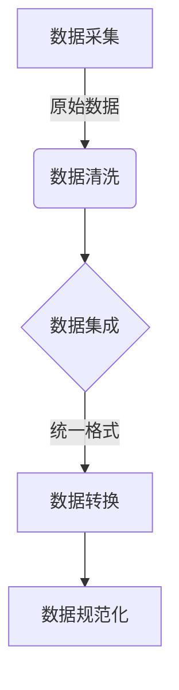
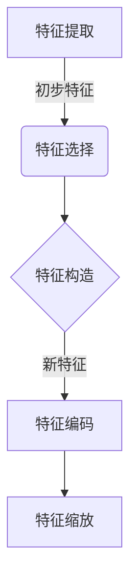
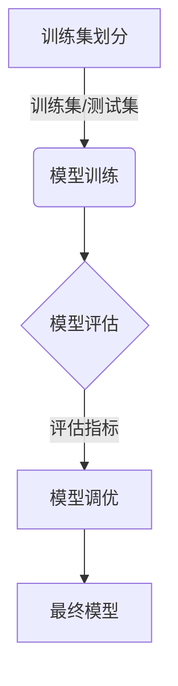

# 大数据下个人用户信用行为的等级评估及应用研究

## 1. 背景介绍

### 1.1 信用评估的重要性

在当今的数字时代,个人信用评估已经成为金融、电子商务等诸多领域的关键环节。良好的信用记录不仅能够提高个人的融资能力,还能为用户获取更多优质服务创造机会。然而,传统的信用评估方式存在一些缺陷,例如数据来源单一、评估维度有限等,难以全面反映用户的信用状况。

### 1.2 大数据带来的机遇

大数据时代的到来为信用评估带来了全新的发展契机。海量的用户行为数据、交易记录等可以作为信用评估的重要数据源,使评估结果更加全面和准确。同时,大数据分析技术的不断进步也为信用评估提供了有力的技术支持。

### 1.3 研究目的和意义

本研究旨在探索如何利用大数据技术,建立一套全面、高效的个人用户信用行为等级评估体系,并将其应用于实际场景中。该研究不仅有助于完善现有的信用评估机制,还可以为金融机构、电商平台等提供更加准确的用户信用画像,从而优化风险管理和决策流程。

## 2. 核心概念与联系

### 2.1 信用评估

信用评估是指通过收集和分析个人或企业的相关信息,对其偿还债务的能力和意愿进行综合评价的过程。良好的信用评估有助于降低交易风险,促进资源的合理配置。

### 2.2 大数据

大数据指无法使用传统数据库软件工具进行捕获、管理和处理的海量、高增长率和多样化的信息资产。大数据技术可以高效地存储、处理和分析这些数据,从中发现隐藏的价值。

### 2.3 用户行为数据

用户行为数据是指记录用户在特定场景下的各种行为轨迹和活动信息的数据。这些数据包括浏览记录、购买历史、社交互动等,可以反映用户的偏好、习惯和潜在需求。

### 2.4 数据挖掘与机器学习

数据挖掘是从大量的数据中发现隐藏信息的过程,而机器学习则是使计算机具备学习和预测的能力。这两种技术在信用评估中扮演着重要角色,可以从海量数据中提取有价值的模式和规律,并基于此进行准确的预测和决策。

## 3. 核心算法原理具体操作步骤

### 3.1 数据采集与预处理



1. **数据采集**：从多个异构数据源收集用户的行为数据、交易记录、社交媒体信息等,包括结构化数据和非结构化数据。
2. **数据清洗**：处理缺失值、异常值和重复数据等,提高数据质量。
3. **数据集成**：将来自不同源的数据整合到同一个数据存储系统中,实现数据的统一管理。
4. **数据转换**：将数据转换为统一的格式,以便后续的分析和处理。
5. **数据规范化**：通过特征缩放等方法,将数据转换到统一的数值范围内,避免某些特征对模型产生过大影响。

### 3.2 特征工程



1. **特征提取**：从原始数据中提取与用户信用相关的特征,例如年龄、收入、教育程度、消费习惯等。
2. **特征选择**：评估各个特征对目标变量(信用评分)的相关性,剔除无关或冗余的特征。
3. **特征构造**：基于现有特征,构造新的更具表现力的特征,例如交叉特征、多项式特征等。
4. **特征编码**：将类别型特征转换为数值型,以便机器学习模型处理,常用的编码方式包括One-Hot编码、标签编码等。
5. **特征缩放**：将特征值缩放到统一的数值范围,防止某些特征对模型产生过大影响。

### 3.3 模型训练与评估



1. **训练集划分**：将数据集划分为训练集和测试集,用于模型训练和评估。
2. **模型训练**：基于训练数据,使用监督学习算法(如逻辑回归、决策树、神经网络等)训练信用评分模型。
3. **模型评估**：在测试集上评估模型的性能,常用指标包括准确率、精确率、召回率、ROC曲线下面积等。
4. **模型调优**：根据评估结果,通过调整模型参数、特征选择等方式优化模型性能。
5. **最终模型**：选择性能最优的模型作为最终的信用评分模型,用于实际应用场景。

## 4. 数学模型和公式详细讲解举例说明

在信用评估中,常用的数学模型和算法包括逻辑回归、决策树、随机森林、梯度提升树等。以下将详细介绍逻辑回归模型的原理和公式。

### 4.1 逻辑回归模型

逻辑回归是一种广泛应用于分类问题的监督学习算法。在信用评估场景中,可以将用户划分为"良好信用"和"不良信用"两类,逻辑回归模型可以基于用户的特征数据预测其属于每个类别的概率。

假设我们有 $n$ 个训练样本 $(x_i, y_i)$,其中 $x_i = (x_{i1}, x_{i2}, \dots, x_{ip})$ 表示第 $i$ 个样本的 $p$ 维特征向量, $y_i \in \{0, 1\}$ 表示该样本的二元类别标签。逻辑回归模型的目标是找到一个函数 $h(x)$,使得对于给定的输入 $x$,可以预测其属于正类(即 $y=1$)的概率 $P(y=1|x)$。

在逻辑回归中,我们假设 $P(y=1|x)$ 服从以下形式:

$$P(y=1|x) = h_\theta(x) = \frac{1}{1 + e^{-\theta^Tx}}$$

其中, $\theta = (\theta_0, \theta_1, \dots, \theta_p)$ 是模型的参数向量。上式也被称为 Sigmoid 函数或逻辑函数。

为了求解最优参数 $\theta$,我们需要定义一个代价函数(Cost Function),通常使用以下对数似然函数:

$$J(\theta) = -\frac{1}{n}\sum_{i=1}^n[y_i\log h_\theta(x_i) + (1-y_i)\log(1-h_\theta(x_i))]$$

我们的目标是找到能够最小化代价函数 $J(\theta)$ 的参数值 $\theta$,这可以通过梯度下降法等优化算法来实现。

在预测新样本时,我们可以计算 $h_\theta(x)$ 的值,如果该值大于某个阈值(通常取 0.5),则将样本预测为正类,否则预测为负类。

### 4.2 模型评估指标

常用的二分类模型评估指标包括:

- **准确率(Accuracy)**:正确预测的样本数占总样本数的比例。
- **精确率(Precision)**:被预测为正类的样本中,真正为正类的比例。
- **召回率(Recall)**:真正为正类的样本中,被正确预测为正类的比例。
- **F1分数**:精确率和召回率的调和平均值,综合考虑了两者。
- **ROC曲线和AUC**:ROC曲线显示了不同阈值下的真正例率和假正例率,AUC表示ROC曲线下的面积,值越大模型性能越好。

在信用评估中,我们通常更关注精确率和召回率,因为错误地将不良信用用户评估为良好信用会带来较大的风险和损失。

## 5. 项目实践:代码实例和详细解释说明

以下是一个使用Python和scikit-learn库实现逻辑回归信用评分模型的示例代码,并对关键步骤进行了详细注释说明。

```python
# 导入所需库
import pandas as pd
from sklearn.linear_model import LogisticRegression
from sklearn.model_selection import train_test_split
from sklearn.metrics import accuracy_score, precision_score, recall_score, f1_score, roc_auc_score

# 加载数据
data = pd.read_csv('credit_data.csv')
X = data.drop('credit_score', axis=1)  # 特征数据
y = data['credit_score']  # 目标变量

# 划分训练集和测试集
X_train, X_test, y_train, y_test = train_test_split(X, y, test_size=0.2, random_state=42)

# 创建并训练逻辑回归模型
model = LogisticRegression()
model.fit(X_train, y_train)

# 在测试集上评估模型性能
y_pred = model.predict(X_test)
accuracy = accuracy_score(y_test, y_pred)
precision = precision_score(y_test, y_pred)
recall = recall_score(y_test, y_pred)
f1 = f1_score(y_test, y_pred)
auc = roc_auc_score(y_test, model.predict_proba(X_test)[:, 1])

print(f'Accuracy: {accuracy:.4f}')
print(f'Precision: {precision:.4f}')
print(f'Recall: {recall:.4f}')
print(f'F1-score: {f1:.4f}')
print(f'AUC: {auc:.4f}')

# 对新样本进行预测
new_data = pd.DataFrame({'age': [35], 'income': [60000], ...})
prediction = model.predict(new_data)
print(f'Predicted credit score: {prediction[0]}')
```

代码解释:

1. 导入所需的Python库,包括pandas用于数据处理,scikit-learn用于机器学习建模和评估。
2. 加载包含用户特征数据和信用评分标签的数据集。
3. 将数据集划分为训练集和测试集,用于模型训练和评估。
4. 创建逻辑回归模型实例,并使用训练数据进行模型训练。
5. 在测试集上评估模型的性能,包括准确率、精确率、召回率、F1分数和AUC值。
6. 打印模型评估指标的值。
7. 对新的样本数据进行信用评分预测。

通过上述代码示例,我们可以清楚地了解如何使用Python和scikit-learn库构建和评估逻辑回归信用评分模型。在实际应用中,您可以根据具体需求调整模型参数、特征工程等,以获得更优的模型性能。

## 6. 实际应用场景

个人用户信用行为等级评估在多个领域都有广泛的应用前景,包括但不限于:

### 6.1 金融借贷

银行和其他金融机构可以利用信用评估系统,更准确地评估个人贷款申请人的还款能力和风险水平,从而做出合理的贷款决策,降低不良贷款率。

### 6.2 电子商务

电商平台可以根据用户的信用评级,为其提供差异化的支付和物流服务,同时也能更好地识别和防范潜在的欺诈行为。

### 6.3 保险业

保险公司可以将信用评估结果纳入风险定价模型,为客户提供个性化的保费和保障方案,提高业务的精细化运营水平。

### 6.4 房地产租赁

房东可以参考租客的信用评级,更好地评估其按时支付租金的能力,降低违约风险。

### 6.5 社区治理

社区管理者可以根据居民的信用等级,实施差异化的奖惩机制,促进社区和谐有序发展。

## 7. 工具和资源推荐

在实现个人用户信用行为等级评估系统的过程中,可以利用以下工具和资源:

### 7.1 大数据处理工具

- Apache Hadoop