# 大规模语言模型从理论到实践 分布式训练概述

## 1. 背景介绍

### 1.1 语言模型的重要性

语言模型在自然语言处理领域扮演着关键角色,广泛应用于机器翻译、问答系统、文本生成等任务。随着深度学习技术的快速发展,大规模语言模型的性能不断提升,展现出令人惊叹的语言理解和生成能力。

### 1.2 大规模语言模型的挑战

训练大规模语言模型面临着巨大的计算和存储资源需求,例如 GPT-3 模型包含 1750 亿个参数。单机无法满足如此庞大模型的训练需求,因此分布式训练成为必然选择。

### 1.3 分布式训练的重要性

通过将训练任务分散到多个计算节点,分布式训练可以显著提高训练效率和可扩展性。然而,实现高效的大规模分布式训练并非易事,需要解决诸多技术挑战。

## 2. 核心概念与联系

### 2.1 数据并行与模型并行

数据并行是指将训练数据划分为多个小批量,并在不同的计算节点上并行处理。模型并行则是将模型的参数划分到不同的节点,每个节点只需要处理模型的一部分。


### 2.2 通信架构

通信架构决定了节点之间如何交换数据和梯度信息。常见的架构包括环状拓扑、二叉树拓扑和参数服务器架构。


### 2.3 混合并行

混合并行结合了数据并行和模型并行的优势,可以更好地利用计算资源,提高训练效率。


## 3. 核心算法原理具体操作步骤

### 3.1 数据并行算法

1. 将训练数据划分为多个小批量
2. 在每个节点上加载一个完整的模型副本
3. 每个节点计算本地小批量的梯度
4. 使用All-reduce算法或参数服务器架构进行梯度同步
5. 使用同步的梯度更新模型参数


### 3.2 模型并行算法

1. 将模型划分为多个子模块
2. 将子模块分配到不同的节点
3. 在每个节点上执行子模块的前向和反向传播
4. 使用All-gather算法或参数服务器架构进行梯度同步
5. 使用同步的梯度更新模型参数



```mermaid
graph TD
    A[模型划分] --> B[子模块1]
    A --> C[子模块2]
    A --> D[子模块3]
    B --> E[前向传播]
    C --> F[前向传播]
    D --> G[前向传播]
    E --> H[反向传播]
    F --> I[反向传播]
    G --> J[反向传播]
    H --> K[梯度同步]
    I --> K
    J --> K
    K --> L[参数更新]
```

### 3.3 混合并行算法

1. 将训练数据划分为多个小批量
2. 将模型划分为多个子模块
3. 在每个节点上加载一个模型子模块副本
4. 每个节点计算本地小批量和子模块的梯度
5. 使用All-reduce和All-gather算法进行梯度同步
6. 使用同步的梯度更新模型参数


## 4. 数学模型和公式详细讲解举例说明

### 4.1 All-reduce算法

All-reduce算法用于在数据并行中同步梯度,它将所有节点的梯度求和,然后将结果分发回每个节点。

设有 $N$ 个节点,每个节点的梯度为 $g_i$,则All-reduce算法可以表示为:

$$
g = \sum_{i=1}^{N} g_i
$$

每个节点最终获得相同的 $g$ 值,用于更新模型参数。

### 4.2 All-gather算法

All-gather算法用于在模型并行中同步梯度,它将每个节点的梯度收集到所有节点。

设有 $N$ 个节点,每个节点的梯度为 $g_i$,则All-gather算法可以表示为:

$$
\begin{aligned}
g_1 &= [g_{1,1}, g_{1,2}, \ldots, g_{1,N}] \
g_2 &= [g_{2,1}, g_{2,2}, \ldots, g_{2,N}] \
&\vdots \
g_N &= [g_{N,1}, g_{N,2}, \ldots, g_{N,N}]
\end{aligned}
$$

其中 $g_{i,j}$ 表示第 $i$ 个节点的第 $j$ 个梯度分量。每个节点最终获得完整的梯度向量,用于更新模型参数。

### 4.3 通信开销模型

通信开销是影响分布式训练效率的关键因素之一。我们可以使用以下模型来估计通信开销:

$$
T_{\text{comm}} = \alpha + \beta \times S
$$

其中 $\alpha$ 是启动通信的固定开销, $\beta$ 是每字节的传输时间, $S$ 是需要传输的数据大小。

对于数据并行,通信开销主要取决于模型参数的大小和节点数量。对于模型并行,通信开销还取决于输入数据的大小和模型划分的粒度。

## 5. 项目实践:代码实例和详细解释说明

以下是使用PyTorch实现数据并行和模型并行的示例代码:

### 5.1 数据并行示例

```python
import torch
import torch.nn as nn
import torch.optim as optim
from torch.nn.parallel import DistributedDataParallel as DDP

# 定义模型
model = nn.Sequential(
    nn.Linear(10, 20),
    nn.ReLU(),
    nn.Linear(20, 1)
)

# 初始化分布式环境
torch.distributed.init_process_group(backend='nccl')
local_rank = torch.distributed.get_rank()
torch.cuda.set_device(local_rank)
model.cuda(local_rank)

# 封装模型为DDP模型
ddp_model = DDP(model, device_ids=[local_rank])

# 定义损失函数和优化器
criterion = nn.MSELoss()
optimizer = optim.SGD(ddp_model.parameters(), lr=0.001)

# 训练循环
for epoch in range(10):
    for data, target in train_loader:
        data = data.cuda(non_blocking=True)
        target = target.cuda(non_blocking=True)
        
        output = ddp_model(data)
        loss = criterion(output, target)
        
        optimizer.zero_grad()
        loss.backward()
        optimizer.step()
```

在这个示例中,我们使用PyTorch的`DistributedDataParallel`模块将模型封装为DDP模型。在训练循环中,每个节点会加载一个完整的模型副本,并计算本地小批量的梯度。PyTorch会自动使用All-reduce算法进行梯度同步,然后使用同步的梯度更新模型参数。

### 5.2 模型并行示例

```python
import torch
import torch.nn as nn
from torch.nn.parallel import DistributedDataParallel as DDP

# 定义模型
class MyModel(nn.Module):
    def __init__(self):
        super().__init__()
        self.linear1 = nn.Linear(10, 20)
        self.relu = nn.ReLU()
        self.linear2 = nn.Linear(20, 1)

    def forward(self, x):
        x = self.linear1(x)
        x = self.relu(x)
        x = self.linear2(x)
        return x

# 初始化分布式环境
torch.distributed.init_process_group(backend='nccl')
local_rank = torch.distributed.get_rank()
torch.cuda.set_device(local_rank)

# 创建模型副本
model = MyModel().cuda(local_rank)
ddp_model = DDP(model, device_ids=[local_rank])

# 训练循环
for epoch in range(10):
    for data, target in train_loader:
        data = data.cuda(non_blocking=True)
        target = target.cuda(non_blocking=True)
        
        output = ddp_model(data)
        loss = criterion(output, target)
        
        optimizer.zero_grad()
        loss.backward()
        optimizer.step()
```

在这个示例中,我们定义了一个简单的模型,包含两个线性层和一个ReLU激活函数。在初始化分布式环境后,每个节点会加载一个完整的模型副本。PyTorch会自动使用All-gather算法进行梯度同步,然后使用同步的梯度更新模型参数。

需要注意的是,对于大规模模型,我们可能需要手动实现模型并行,将模型划分为多个子模块,并在不同的节点上执行前向和反向传播。

## 6. 实际应用场景

分布式训练技术在以下场景中发挥着重要作用:

1. **大规模语言模型训练**: 像 GPT-3、PanGu-Alpha 这样的大规模语言模型需要海量的计算资源进行训练,分布式训练是唯一可行的方式。

2. **推理服务**: 在线服务中,我们可以使用模型并行来加速推理过程,提高响应速度和吞吐量。

3. **科研领域**: 分布式训练技术使研究人员能够在有限的计算资源下训练更大更复杂的模型,推进人工智能的发展。

4. **工业应用**: 在自动驾驶、机器人、金融等领域,分布式训练可以加速模型的开发和部署,提高产品的性能和可靠性。

## 7. 工具和资源推荐

以下是一些流行的分布式训练框架和资源:

1. **PyTorch DDP**: PyTorch内置的分布式数据并行模块,支持多种通信后端。

2. **TensorFlow 分布式策略**: TensorFlow提供了多种分布式策略,包括数据并行、模型并行和参数服务器。

3. **DeepSpeed**: Microsoft开源的深度学习优化库,专注于大规模模型训练和推理加速。

4. **Horovod**: Uber开源的分布式训练框架,支持TensorFlow、PyTorch和Apache MXNet。

5. **Ray**: 一个分布式计算框架,可用于构建分布式训练系统。

6. **NVIDIA Collective Communications Library (NCCL)**: NVIDIA开发的高性能通信库,广泛应用于深度学习框架中。

7. **Dask**: 一个用于并行计算的Python库,可用于构建分布式数据处理管道。

## 8. 总结:未来发展趋势与挑战

### 8.1 未来发展趋势

1. **硬件加速**: 专门设计的AI加速器和互连网络将进一步提高分布式训练的效率。

2. **自动化和优化**: 自动化的模型并行