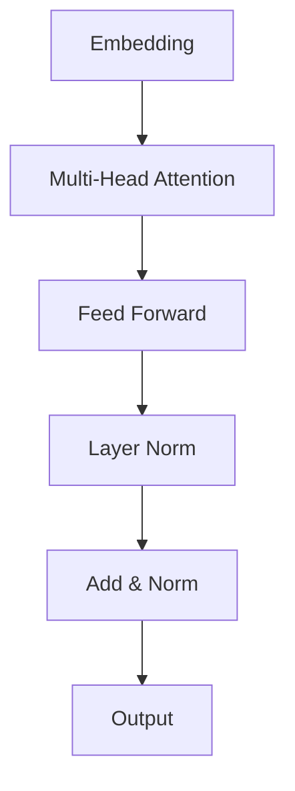

# 大规模语言模型从理论到实践：大语言模型的结构

## 1. 背景介绍

### 1.1 语言模型的兴起

语言模型是自然语言处理领域的核心技术之一。近年来,随着深度学习技术的快速发展,基于神经网络的语言模型取得了令人瞩目的成就,在机器翻译、问答系统、文本生成等多个领域展现出了强大的能力。

### 1.2 大规模语言模型的重要性

传统的语言模型通常基于有限的语料库训练,其表现能力受到了严重限制。而大规模语言模型则利用海量的文本数据进行预训练,能够学习到丰富的语言知识和上下文信息,从而在下游任务中发挥出卓越的性能。

### 1.3 大规模语言模型的挑战

尽管大规模语言模型取得了巨大成功,但它们也面临着一些挑战,例如:

- 训练成本高昂
- 推理效率低下
- 存在偏见和不当内容
- 缺乏解释性和可解释性

## 2. 核心概念与联系

### 2.1 自注意力机制 (Self-Attention)

$$\mathrm{Attention}(Q, K, V) = \mathrm{softmax}\left(\frac{QK^T}{\sqrt{d_k}}\right)V$$

自注意力机制是大规模语言模型的核心组件之一,它能够捕捉序列中任意两个位置之间的依赖关系,从而更好地建模长距离依赖。

### 2.2 transformer 架构

Transformer 架构是第一个完全基于自注意力机制的序列到序列模型,它彻底摒弃了传统的 RNN 和 CNN 结构,展现出了卓越的性能。大多数现代大规模语言模型都是基于 Transformer 架构构建的。



### 2.3 预训练与微调 (Pre-training & Fine-tuning)

大规模语言模型通常采用两阶段训练策略:

1. **预训练 (Pre-training)**: 在海量无标注文本数据上进行自监督训练,学习通用的语言表示。
2. **微调 (Fine-tuning)**: 在特定的下游任务上进行有监督训练,将预训练模型转移到目标任务。

### 2.4 模型压缩

由于大规模语言模型通常包含数十亿甚至上百亿参数,因此存在巨大的计算和存储开销。模型压缩技术如量化、知识蒸馏和模型剪枝等可以显著减小模型的footprint,提高推理效率。

## 3. 核心算法原理具体操作步骤

### 3.1 Transformer 编码器 (Encoder)

Transformer 编码器的核心步骤如下:

1. **输入embedding**: 将输入序列映射为向量表示。
2. **位置编码 (Positional Encoding)**: 注入序列位置信息。
3. **多头自注意力 (Multi-Head Self-Attention)**: 捕捉输入序列中元素之间的依赖关系。
4. **前馈神经网络 (Feed-Forward Neural Network)**: 对注意力输出进行非线性变换。
5. **层归一化 (Layer Normalization)**: 加速训练收敛并缓解梯度消失/爆炸问题。
6. **残差连接 (Residual Connection)**: 促进梯度传播,缓解梯度消失问题。

### 3.2 Transformer 解码器 (Decoder)

Transformer 解码器在编码器的基础上,增加了"编码器-解码器注意力"机制,用于关注输入序列中的相关信息。解码器的核心步骤如下:

1. **遮挡自注意力 (Masked Self-Attention)**: 防止注意力机制关注未来位置的信息。
2. **多头编码器-解码器注意力 (Multi-Head Encoder-Decoder Attention)**: 将解码器状态与编码器输出相关联。
3. **前馈神经网络、层归一化和残差连接**: 与编码器相同。

### 3.3 BERT 预训练

BERT(Bidirectional Encoder Representations from Transformers)采用了两种无监督预训练任务:

1. **遮蔽语言模型 (Masked Language Modeling, MLM)**: 随机遮蔽部分输入tokens,模型需要基于上下文预测遮蔽位置的tokens。
2. **下一句预测 (Next Sentence Prediction, NSP)**: 判断两个句子是否相邻。

### 3.4 GPT 预训练

GPT(Generative Pre-trained Transformer)采用标准的语言模型预训练目标:给定前面的tokens,预测下一个token。GPT仅利用左侧上下文进行预测,属于单向语言模型。

## 4. 数学模型和公式详细讲解举例说明

### 4.1 自注意力机制 (Self-Attention)

自注意力机制是 Transformer 的核心组件,它能够捕捉序列中任意两个位置之间的依赖关系。给定查询 $Q$、键 $K$ 和值 $V$,自注意力的计算过程如下:

$$\begin{aligned}
\mathrm{Attention}(Q, K, V) &= \mathrm{softmax}\left(\frac{QK^T}{\sqrt{d_k}}\right)V \
\mathrm{head}_i &= \mathrm{Attention}(QW_i^Q, KW_i^K, VW_i^V) \
\mathrm{MultiHead}(Q, K, V) &= \mathrm{Concat}(\mathrm{head}_1, \dots, \mathrm{head}_h)W^O
\end{aligned}$$

其中 $d_k$ 是缩放因子,用于防止点积过大导致的梯度饱和。多头注意力机制通过将 $Q$、$K$、$V$ 线性投影到不同的子空间,从而捕捉不同的依赖关系。

### 4.2 位置编码 (Positional Encoding)

由于 Transformer 完全摒弃了 RNN 和 CNN 结构,因此需要一种显式的方法来注入序列位置信息。位置编码的计算公式如下:

$$\begin{aligned}
\mathrm{PE}_{(pos, 2i)} &= \sin\left(pos / 10000^{2i / d_{\mathrm{model}}}\right) \
\mathrm{PE}_{(pos, 2i+1)} &= \cos\left(pos / 10000^{2i / d_{\mathrm{model}}}\right)
\end{aligned}$$

其中 $pos$ 是token的位置索引, $i$ 是维度索引, $d_{\mathrm{model}}$ 是embedding的维度。位置编码与输入embedding相加,从而注入位置信息。

### 4.3 层归一化 (Layer Normalization)

层归一化是一种加速训练收敛和缓解梯度消失/爆炸问题的技术。对于输入 $x = (x_1, \dots, x_n)$,层归一化的计算过程如下:

$$\begin{aligned}
\mu &= \frac{1}{n}\sum_{i=1}^n x_i \
\sigma^2 &= \frac{1}{n}\sum_{i=1}^n (x_i - \mu)^2 \
\hat{x}_i &= \frac{x_i - \mu}{\sqrt{\sigma^2 + \epsilon}} \
\mathrm{LayerNorm}(x) &= \gamma \odot \hat{x} + \beta
\end{aligned}$$

其中 $\gamma$ 和 $\beta$ 是可学习的缩放和偏移参数, $\epsilon$ 是一个很小的常数,用于避免除以零。

## 5. 项目实践: 代码实例和详细解释说明

以下是使用 PyTorch 实现 Transformer 编码器的简化代码示例:

```python
import torch
import torch.nn as nn
import math

class TransformerEncoderLayer(nn.Module):
    def __init__(self, d_model, nhead, dim_feedforward, dropout):
        super().__init__()
        self.self_attn = nn.MultiheadAttention(d_model, nhead, dropout=dropout)
        self.linear1 = nn.Linear(d_model, dim_feedforward)
        self.dropout = nn.Dropout(dropout)
        self.linear2 = nn.Linear(dim_feedforward, d_model)

        self.norm1 = nn.LayerNorm(d_model)
        self.norm2 = nn.LayerNorm(d_model)
        self.dropout1 = nn.Dropout(dropout)
        self.dropout2 = nn.Dropout(dropout)

        self.activation = nn.ReLU()

    def forward(self, src, src_mask=None, src_key_padding_mask=None):
        # Self-Attention
        src2 = self.self_attn(src, src, src, attn_mask=src_mask,
                              key_padding_mask=src_key_padding_mask)[0]
        src = src + self.dropout1(src2)
        src = self.norm1(src)

        # Feed-Forward
        src2 = self.linear2(self.dropout(self.activation(self.linear1(src))))
        src = src + self.dropout2(src2)
        src = self.norm2(src)

        return src

class TransformerEncoder(nn.Module):
    def __init__(self, encoder_layer, num_layers):
        super().__init__()
        self.layers = nn.ModuleList([encoder_layer for _ in range(num_layers)])
        self.num_layers = num_layers

    def forward(self, src, mask=None, src_key_padding_mask=None):
        output = src
        for layer in self.layers:
            output = layer(output, src_mask=mask, src_key_padding_mask=src_key_padding_mask)
        return output
```

这段代码实现了 Transformer 编码器的核心组件,包括多头自注意力、前馈神经网络、层归一化和残差连接。

- `TransformerEncoderLayer` 类实现了单个编码器层,包含自注意力子层和前馈神经网络子层。
- `TransformerEncoder` 类通过堆叠多个 `TransformerEncoderLayer` 构建完整的编码器。

在实际应用中,我们还需要实现位置编码、embedding层等其他组件,并对整个模型进行预训练和微调。

## 6. 实际应用场景

大规模语言模型在自然语言处理领域有着广泛的应用,包括但不限于:

### 6.1 机器翻译

大规模语言模型可以作为机器翻译系统的核心组件,通过学习源语言和目标语言的联合表示,实现高质量的翻译。

### 6.2 问答系统

通过预训练和微调,大规模语言模型可以学习到丰富的知识,从而能够回答各种复杂的问题。

### 6.3 文本生成

大规模语言模型擅长捕捉语言的结构和语义信息,因此可以用于生成高质量的文本内容,如新闻报道、小说、诗歌等。

### 6.4 文本摘要

基于大规模语言模型,我们可以训练出能够准确捕捉文本主旨的摘要模型,为海量文本数据提供高效的浏览和检索。

### 6.5 情感分析

通过对大规模语言模型进行微调,我们可以构建出能够准确识别文本情感倾向的分类模型。

## 7. 工具和资源推荐

### 7.1 开源模型

- **BERT**: 谷歌发布的基于 Transformer 的双向编码器语言模型,在多个下游任务上表现出色。
- **GPT-2/3**: OpenAI 发布的基于 Transformer 的单向解码器语言模型,擅长生成高质量文本。
- **XLNet**: 由卡内基梅隆大学与谷歌合作开发的通用自回归预训练语言模型。
- **T5**: 由谷歌发布的统一的 Transformer 模型,可用于多种自然语言处理任务。

### 7.2 开源库

- **Hugging Face Transformers**: 提供了多种预训练语言模型的代码实现和预训练权重,支持PyTorch和TensorFlow。
- **AllenNLP**: 由 AI2 开发的开源 NLP 研究库,提供了多种语言模型的实现。
- **Fairseq**: 由 Facebook AI Research 开发的序列到序列学习工具包,支持多种语言模型。

### 7.3 云服务

- **AWS SageMaker**: 亚马逊提供的机器学习服务,支持部署和管理语言模型。
- **Google Cloud AI Platform**: 谷歌提供的机器学习平台,可以访问谷歌的语言模型服务。
- **Azure Cognitive Services**: 微软提供的认知服务,包括基于语言模型的自然语言处理功能。

## 8. 总结: 未来发展趋势与挑战

### 8.1 模型效率

虽然大规模语言模型展现出了强大的性能,但它们也带来了巨大的计算和存储开销