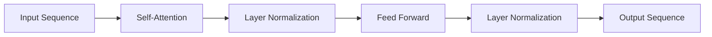

# 大规模语言模型从理论到实践 实践思考

## 1.背景介绍
### 1.1 大规模语言模型的兴起
近年来,随着深度学习技术的快速发展,大规模语言模型(Large Language Models,LLMs)受到了学术界和工业界的广泛关注。从2018年的BERT,到2019年的GPT-2,再到2020年的GPT-3,大规模语言模型在自然语言处理(NLP)领域取得了一系列突破性进展,展现出了强大的语言理解和生成能力。

### 1.2 大规模语言模型的应用前景
大规模语言模型具有广阔的应用前景,可以应用于机器翻译、智能问答、文本摘要、对话系统等多个NLP任务。特别是随着模型规模的不断扩大,大规模语言模型表现出了令人惊叹的few-shot和zero-shot学习能力,无需大量标注数据即可快速适应新任务。这为构建更加智能、高效的NLP系统带来了新的机遇。

### 1.3 大规模语言模型面临的挑战
尽管大规模语言模型取得了显著成果,但在实践应用中仍然面临诸多挑战:
- 计算资源需求大:训练大规模语言模型需要海量计算资源,对硬件和能源提出了很高要求。
- 模型可解释性差:大规模语言模型是一种"黑盒"模型,其内部工作机制难以解释,给实际应用带来困难。
- 数据隐私和安全问题:大规模语言模型在训练过程中可能会记忆部分敏感数据,存在隐私泄露风险。
- 模型偏见和伦理问题:语言模型从训练数据中学习,可能继承数据中的偏见,产生有失偏颇的输出。

本文将围绕大规模语言模型的核心概念、原理、实践和应用等方面展开深入探讨,梳理该领域的最新进展,分享实践经验和思考,为读者提供全面、系统的认识。

## 2.核心概念与联系
### 2.1 大规模语言模型的定义
大规模语言模型是指参数量达到亿级、十亿级甚至更大规模的深度学习语言模型。它通过在大规模文本语料上进行预训练,学习语言的统计规律和语义知识,具备强大的语言理解和生成能力。典型的大规模语言模型包括BERT、GPT-2、GPT-3、T5、Switch Transformer等。

### 2.2 预训练和微调
大规模语言模型的训练通常分为两个阶段:预训练和微调。

预训练阶段在大规模无标注语料上进行自监督学习,通过掩码语言建模(Masked Language Modeling,MLM)、自回归语言建模(Autoregressive Language Modeling)等任务,让模型学习通用的语言表示。预训练使模型掌握了丰富的语言知识,具备了语言理解的基础能力。

微调阶段在特定任务的标注数据上进行监督学习,通过调整模型参数,使其适应具体任务。微调可显著提升模型在下游任务上的表现,实现快速迁移学习。

### 2.3 自注意力机制和Transformer结构
大规模语言模型的核心是自注意力机制(Self-Attention)和Transformer结构。

自注意力机制能够建模输入序列中任意两个位置之间的长距离依赖关系,克服了RNN等模型的长程依赖问题。通过计算序列中每个位置与其他位置的注意力权重,自注意力机制可以动态地聚焦于不同的上下文信息。

Transformer是一种完全基于自注意力的神经网络结构,包含编码器和解码器两部分。编码器通过自注意力和前馈神经网络对输入序列进行特征提取,解码器根据编码器的输出和之前的预测结果生成输出序列。Transformer结构强大的建模能力为大规模语言模型的成功奠定了基础。

下图展示了自注意力机制和Transformer结构的关键组件和计算流程:



## 3.核心算法原理与步骤
### 3.1 预训练算法
大规模语言模型的预训练通常采用以下两种主流算法:

#### 3.1.1 掩码语言建模(MLM)
MLM的核心思想是随机掩盖输入序列中的部分token,让模型根据上下文预测被掩盖的token。具体步骤如下:
1. 随机选择输入序列中15%的token进行掩码处理
2. 将选中的token替换为特殊的[MASK]符号
3. 将处理后的序列输入模型,让模型预测被掩盖位置的原始token
4. 计算预测结果与真实token的交叉熵损失,并进行梯度反向传播和参数更新

通过MLM预训练,模型学会了根据上下文推断缺失信息,掌握了语言的语法和语义知识。

#### 3.1.2 自回归语言建模(ALM)
ALM的核心思想是根据前面的token预测下一个token,从左到右依次生成整个序列。具体步骤如下:
1. 将输入序列进行向右偏移,构造输入-输出样本对
2. 将偏移后的序列输入模型,让模型预测下一个token的概率分布
3. 计算预测概率与真实token的交叉熵损失,并进行梯度反向传播和参数更新
4. 将预测的token附加到输入序列末尾,重复步骤2-4,直到生成完整序列

通过ALM预训练,模型学会了根据上文生成连贯、流畅的语言,掌握了语言的生成能力。

### 3.2 微调算法
大规模语言模型在下游任务上的微调通常采用有监督的学习方式,根据任务的输入和标签数据对模型进行训练。以文本分类任务为例,微调的具体步骤如下:
1. 在预训练模型的顶部添加一个线性分类层,输出维度等于类别数
2. 将任务的输入文本和对应标签构造成训练样本
3. 将输入文本编码为向量表示,输入到微调模型中
4. 计算模型的输出与真实标签的交叉熵损失,并进行梯度反向传播和参数更新
5. 重复步骤3-4,直到模型在验证集上的性能指标收敛

通过微调,大规模语言模型可以充分利用预训练阶段学习到的通用语言知识,快速适应具体任务,实现更好的性能表现。

## 4.数学模型和公式详解
### 4.1 自注意力机制
自注意力机制是大规模语言模型的核心组件之一,用于计算序列中不同位置之间的依赖关系。给定一个长度为$n$的输入序列$X=(x_1,x_2,...,x_n)$,自注意力的计算过程如下:

1. 将输入序列$X$通过三个线性变换得到查询矩阵$Q$、键矩阵$K$和值矩阵$V$:

$$
\begin{aligned}
Q &= XW_Q \\
K &= XW_K \\
V &= XW_V
\end{aligned}
$$

其中,$W_Q$、$W_K$、$W_V$为可学习的权重矩阵。

2. 计算查询矩阵$Q$与键矩阵$K$的点积注意力分数:

$$
A = \text{softmax}(\frac{QK^T}{\sqrt{d_k}})
$$

其中,$d_k$为键向量的维度,用于缩放点积结果。$\text{softmax}$函数对注意力分数进行归一化。

3. 将注意力分数$A$与值矩阵$V$相乘,得到加权求和的输出表示:

$$
\text{Attention}(Q,K,V) = AV
$$

通过自注意力机制,模型可以动态地关注输入序列中的不同位置,捕捉长距离依赖关系,从而更好地理解和生成语言。

### 4.2 Transformer结构
Transformer是大规模语言模型的主要架构,由编码器和解码器组成。编码器和解码器都由多个相同的子层堆叠而成,每个子层包括自注意力机制和前馈神经网络两个部分。

编码器的计算过程如下:
1. 将输入序列$X$经过词嵌入和位置编码,得到输入表示$H^{(0)}$。
2. 对$H^{(0)}$进行$L$层的编码器子层计算,得到最终的编码器输出$H^{(L)}$:

$$
\begin{aligned}
H^{(l)} &= \text{LayerNorm}(H^{(l-1)} + \text{SelfAttention}(H^{(l-1)})) \\
H^{(l)} &= \text{LayerNorm}(H^{(l)} + \text{FFN}(H^{(l)}))
\end{aligned}
$$

其中,$\text{LayerNorm}$为层归一化操作,$\text{FFN}$为前馈神经网络。

解码器的计算过程与编码器类似,但在自注意力机制之后多了一个编码-解码注意力机制,用于关联编码器的输出。解码器根据编码器的输出和之前的预测结果,逐步生成输出序列。

Transformer结构通过自注意力机制和前馈神经网络的堆叠,构建了强大的语言理解和生成模型,为大规模语言模型的成功应用奠定了基础。

## 5.项目实践:代码实例和详解
下面以PyTorch为例,展示如何使用Hugging Face的Transformers库实现基于BERT的文本分类任务。

```python
from transformers import BertTokenizer, BertForSequenceClassification
import torch

# 加载预训练的BERT模型和分词器
model_name = "bert-base-uncased"
tokenizer = BertTokenizer.from_pretrained(model_name)
model = BertForSequenceClassification.from_pretrained(model_name, num_labels=2)

# 准备输入数据
texts = ["This movie is great!", "The plot is terrible."]
labels = [1, 0]  # 1表示正面情感,0表示负面情感

# 将文本转换为模型输入格式
inputs = tokenizer(texts, padding=True, truncation=True, return_tensors="pt")

# 微调模型
optimizer = torch.optim.AdamW(model.parameters(), lr=1e-5)
criterion = torch.nn.CrossEntropyLoss()

model.train()
for epoch in range(3):
    optimizer.zero_grad()
    outputs = model(**inputs, labels=torch.tensor(labels))
    loss = outputs.loss
    loss.backward()
    optimizer.step()
    print(f"Epoch {epoch+1}, Loss: {loss.item():.4f}")

# 使用微调后的模型进行预测
model.eval()
with torch.no_grad():
    outputs = model(**inputs)
    predictions = torch.argmax(outputs.logits, dim=1)
    print("Predictions:", predictions)
```

代码解释:
1. 首先加载预训练的BERT模型和对应的分词器。这里使用了"bert-base-uncased"模型,可以根据需要选择其他BERT变体。
2. 准备输入数据,包括待分类的文本和对应的标签。这里使用了两个示例文本和二分类标签。
3. 使用分词器将文本转换为模型可接受的输入格式,包括对文本进行分词、填充、截断等预处理操作。
4. 定义优化器和损失函数,用于模型的微调训练。这里使用了AdamW优化器和交叉熵损失函数。
5. 对模型进行微调训练,通过多个epoch的迭代优化模型参数。每个epoch中,将输入数据传入模型,计算损失并进行反向传播和参数更新。
6. 使用微调后的模型对新的文本进行预测。将模型设置为评估模式,关闭梯度计算,将输入数据传入模型,获取预测结果。

通过以上步骤,我们可以利用预训练的BERT模型,快速实现文本分类任务。Transformers库提供了丰富的预训练模型和便捷的API,使得大规模语言模型的应用变得更加简单高效。

## 6.实际应用场景
大规模语言模型在各个领域都有广泛的应用,下面列举几个典型场景:

### 6.1 智能客服
大规模语言模型可以用于构建智能客服系统,自动回答用户的常见问题。通过在大量客服对话数据上进行预训练和微调,模