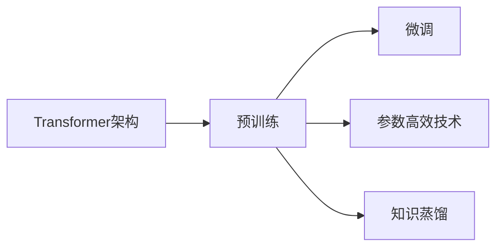

# 大语言模型原理与工程实践：手把手教你训练 7B 大语言模型 主要模块介绍

## 1. 背景介绍

近年来,随着计算能力的提升和训练数据的增长,大语言模型(Large Language Model,LLM)取得了突破性的进展。从 GPT-3 到 PaLM,再到最新的 GPT-4 和 LLaMA,LLM 展现出了惊人的自然语言理解和生成能力,在问答、对话、写作等多个领域达到甚至超越了人类的水平。LLM 正在深刻影响和改变着我们的生活和工作方式。

但是,训练一个高质量的大语言模型并非易事。以 GPT-3 为例,它使用了 1750 亿个参数,在 45TB 高质量文本数据上训练,耗资数百万美元。对于绝大多数企业和研究者来说,从 0 到 1 训练一个产品级的大模型是一件非常具有挑战的事情。

本文将全面剖析大语言模型训练的原理和工程实践,手把手教你如何训练一个 70 亿参数的大语言模型。我们会详细介绍大模型训练的核心概念、关键算法、数学原理、工程实现、应用场景等,让你对 LLM 的原理和实践有一个系统性的认知。

## 2. 核心概念与联系

在深入探讨大语言模型之前,我们先来了解几个核心概念:

### 2.1 Transformer 架构

Transformer 是大语言模型的核心架构。它由 Encoder 和 Decoder 两部分组成,分别用于理解输入序列和生成输出序列。Transformer 的核心创新是 self-attention 机制,让模型能够捕捉输入序列中任意两个位置之间的关联。

### 2.2 预训练和微调

预训练(pre-training)是在大规模无标注语料上进行自监督学习,让模型学习到语言的基本规律和知识。微调(fine-tuning)是在下游任务的标注数据上进一步训练模型,让模型适应特定任务。预训练+微调是训练大语言模型的基本范式。

### 2.3 参数高效技术

随着模型参数量的增长,训练和推理的计算开销也急剧增加。参数高效技术如 LoRA、Prefix Tuning、Prompt Tuning 等通过只训练一小部分参数,在降低资源开销的同时保持模型性能。

### 2.4 知识蒸馏

知识蒸馏是用一个体积小、速度快的学生模型去学习一个体积大、性能好的教师模型,从而在降低模型尺寸的同时保持较好的性能。在实际应用中,我们通常训练一个超大教师模型,再蒸馏到一系列不同尺寸的学生模型以适应不同的场景。

这些概念之间环环相扣,共同构成了大语言模型的技术体系:



## 3. 核心算法原理具体操作步骤

接下来,我们详细介绍大语言模型训练的核心算法和具体步骤。以训练一个 70 亿参数的 GPT 模型为例:

### 3.1 数据准备

1. 收集高质量的无标注文本语料,如书籍、新闻、百科等,总量在 1TB 以上
2. 对语料进行清洗,去除噪音、重复、错误等
3. 对语料进行 tokenization,转换为模型可以理解的数字序列
4. 将语料划分为训练集、验证集和测试集

### 3.2 模型配置

1. 定义 GPT 模型结构,包括层数、隐层大小、注意力头数等
2. 初始化模型参数
3. 定义损失函数,如交叉熵损失
4. 定义优化器,如 Adam
5. 定义学习率调度策略,如 cosine 衰减

### 3.3 预训练

1. 以语言模型任务(预测下一个 token)在无标注语料上训练模型
2. 采用梯度累积以支持更大的 batch size
3. 采用混合精度训练以加速计算和节省显存
4. 采用分布式数据并行和模型并行以支持更大的模型
5. 监控 loss、ppl 等指标,根据验证集性能保存最优模型

### 3.4 微调

1. 根据下游任务的特点,设计输入输出 schema
2. 在下游任务的标注数据上微调预训练模型
3. 尝试 prompt engineering 以提升模型性能
4. 尝试参数高效微调技术以降低计算开销
5. 在验证集上评估模型性能,保存最优模型

### 3.5 推理优化

1. 采用知识蒸馏压缩模型尺寸
2. 采用量化、剪枝等加速推理
3. 采用 FasterTransformer 等高性能推理库
4. 采用模型并行、Tensor Parallelism 等支持超大模型推理

## 4. 数学模型和公式详细讲解举例说明

大语言模型的核心是 Transformer 架构和自注意力机制,涉及大量的数学公式和原理。这里我们对其中的关键公式进行讲解。

### 4.1 自注意力计算

自注意力分三步计算:

1. 计算 query、key、value 向量:

$$
\begin{aligned}
Q &= X W^Q \\
K &= X W^K \\
V &= X W^V
\end{aligned}
$$

其中 $X$ 是输入序列,$W^Q$、$W^K$、$W^V$ 是可学习的参数矩阵。

2. 计算 query 和 key 的相似度,并归一化:

$$
\text{Attention}(Q, K, V) = \text{softmax}(\frac{QK^T}{\sqrt{d_k}})V
$$

其中 $d_k$ 是 key 向量的维度。

3. 将多头注意力的结果拼接并线性变换:

$$
\begin{aligned}
\text{MultiHead}(X) &= \text{Concat}(\text{head}_1, \ldots, \text{head}_h) W^O \\
\text{head}_i &= \text{Attention}(XW_i^Q, XW_i^K, XW_i^V)
\end{aligned}
$$

其中 $h$ 是注意力头数,$W^O$ 和 $W_i^Q$、$W_i^K$、$W_i^V$ 是可学习的参数矩阵。

### 4.2 残差连接和层归一化

为了利于优化和泛化,Transformer 在每个子层之后都会加入残差连接和层归一化:

$$
\begin{aligned}
\tilde{X} &= \text{SubLayer}(X) \\
X &= \text{LayerNorm}(X + \tilde{X})
\end{aligned}
$$

其中 SubLayer 可以是自注意力层、前馈层等,LayerNorm 是层归一化:

$$
\text{LayerNorm}(x) = \frac{x - \text{E}[x]}{\sqrt{\text{Var}[x] + \epsilon}} * \gamma + \beta
$$

$\gamma$ 和 $\beta$ 是可学习的缩放和偏移参数。

### 4.3 位置编码

为了引入位置信息,Transformer 在输入 token 的 embedding 上叠加位置编码:

$$
\begin{aligned}
PE_{(pos, 2i)} &= \sin(pos / 10000^{2i/d_{\text{model}}}) \\
PE_{(pos, 2i+1)} &= \cos(pos / 10000^{2i/d_{\text{model}}})
\end{aligned}
$$

其中 $pos$ 是位置索引,$i$ 是维度索引,$d_{\text{model}}$ 是 embedding 维度。

## 5. 项目实践：代码实例和详细解释说明

下面我们通过代码实践,演示如何使用 PyTorch 训练 GPT 模型。

### 5.1 定义 GPT 模型

```python
class GPT(nn.Module):
    def __init__(self, vocab_size, d_model, nhead, num_layers, dropout=0.1):
        super().__init__()
        self.embed = nn.Embedding(vocab_size, d_model)
        self.pos_embed = PositionalEncoding(d_model, dropout)
        encoder_layer = nn.TransformerEncoderLayer(d_model, nhead, dim_feedforward, dropout, activation)
        self.transformer = nn.TransformerEncoder(encoder_layer, num_layers)
        self.fc = nn.Linear(d_model, vocab_size)

    def forward(self, src, src_mask):
        src = self.embed(src) * math.sqrt(d_model)
        src = self.pos_embed(src)
        output = self.transformer(src, src_mask)
        output = self.fc(output)
        return output
```

- vocab_size:词表大小
- d_model:隐层维度
- nhead:注意力头数
- num_layers:编码器层数
- PositionalEncoding:位置编码模块
- TransformerEncoderLayer:Transformer 编码器层
- TransformerEncoder:Transformer 编码器
- fc:最后的线性输出层

### 5.2 定义训练循环

```python
model = GPT(vocab_size, d_model, nhead, num_layers).to(device)
criterion = nn.CrossEntropyLoss()
optimizer = torch.optim.AdamW(model.parameters(), lr=learning_rate)
scheduler = torch.optim.lr_scheduler.CosineAnnealingLR(optimizer, T_max=num_epochs)

for epoch in range(num_epochs):
    model.train()
    for batch in train_dataloader:
        optimizer.zero_grad()
        input_ids = batch['input_ids'].to(device)
        labels = batch['labels'].to(device)
        mask = batch['attention_mask'].to(device)
        outputs = model(input_ids, mask)
        loss = criterion(outputs.view(-1, vocab_size), labels.view(-1))
        loss.backward()
        optimizer.step()

    model.eval()
    with torch.no_grad():
        for batch in val_dataloader:
            input_ids = batch['input_ids'].to(device)
            labels = batch['labels'].to(device)
            mask = batch['attention_mask'].to(device)
            outputs = model(input_ids, mask)
            loss = criterion(outputs.view(-1, vocab_size), labels.view(-1))
            ppl = math.exp(loss.item())

    scheduler.step()
    print(f'Epoch: {epoch}, Val Loss: {loss.item():.4f}, Val PPL: {ppl:.4f}')
```

- 定义模型、损失函数、优化器和学习率调度器
- 对每个 epoch:
    - 训练:前向传播,计算损失,反向传播,更新参数
    - 验证:前向传播,计算困惑度 PPL
    - 打印当前 epoch 的验证集 loss 和 PPL

### 5.3 推理示例

```python
model.eval()
input_ids = tokenizer.encode('The meaning of life is', return_tensors='pt').to(device)
with torch.no_grad():
    outputs = model.generate(input_ids, max_length=100, num_return_sequences=1)
print(tokenizer.decode(outputs[0], skip_special_tokens=True))
```

- 输入 prompt "The meaning of life is"
- 使用 model.generate 生成后续文本
- 解码并打印生成结果

## 6. 实际应用场景

大语言模型可以应用于多种场景:

### 6.1 问答系统

将知识库、文档等信息作为上下文,用大模型生成针对用户问题的回答。

### 6.2 对话系统

用大模型扮演对话助手的角色,根据用户的输入生成自然、流畅、有逻辑的回复。

### 6.3 内容创作

用大模型辅助或自动生成文章、小说、剧本、广告文案等内容。

### 6.4 代码生成

用大模型根据自然语言描述生成对应的代码实现。

### 6.5 知识图谱构建

用大模型从非结构化文本中抽取实体、关系,辅助构建知识图谱。

## 7. 工具和资源推荐

- 大模型训练
    - Megatron-LM:NVIDIA 开源的大规模语言模型训练工具包
    - DeepSpeed:微软开源的深度学习优化库,支持更大规模的训练
    - Colossal-AI:一站式的大模型训练开源框架
- 模型和数据
    - GPT-3 175B:OpenAI 发布的 1750 亿参数 GPT-3 模型
    - OPT 175B:Meta 开源的 1750 亿参数 GPT 模型
    - The Pile:一个 800GB 的开源大规模英文语料库
- 部署工具
    - FasterTransformer:NVIDIA 开源的高性能 Transformer 推理引擎
    - TensorRT:NVIDIA 的深度学习推理加速引擎
    - ONNX Runtime:跨平台的高性能推理引擎