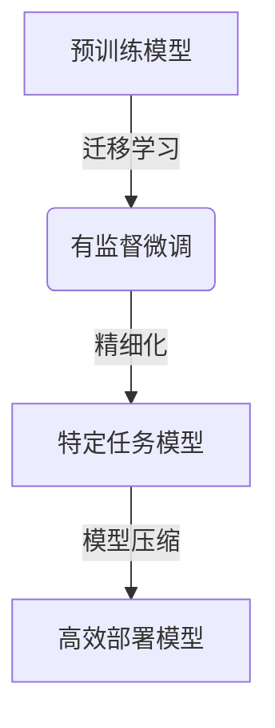
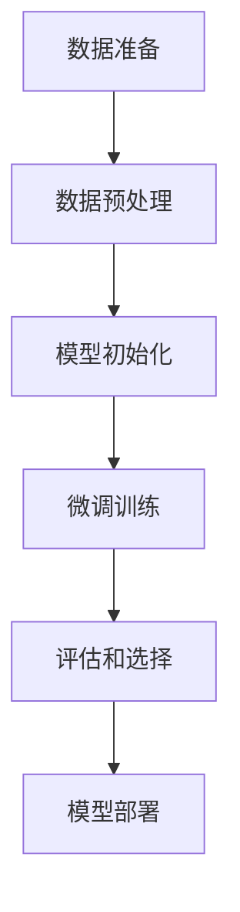

# 大语言模型原理与工程实践：揭开有监督微调的面纱

## 1. 背景介绍

### 1.1 人工智能的崛起

人工智能(Artificial Intelligence, AI)作为一个跨学科领域,已经成为当代科技发展的核心驱动力。近年来,AI技术取得了长足进步,尤其是在自然语言处理(Natural Language Processing, NLP)领域,大型语言模型的出现彻底改变了游戏规则。

### 1.2 大语言模型的兴起

大型语言模型(Large Language Models, LLMs)是一种基于海量文本数据训练的神经网络模型,能够捕捉文本中丰富的语义和语法信息。这些模型通过自监督学习方式预训练,展现出惊人的泛化能力,可以应用于多种自然语言处理任务。

代表性的大语言模型包括GPT(Generative Pre-trained Transformer)、BERT(Bidirectional Encoder Representations from Transformers)、XLNet等。其中,GPT系列模型由OpenAI公司开发,尤其是GPT-3凭借高达1750亿个参数的规模,在自然语言生成、问答、文本摘要等任务上取得了突破性的成绩。

### 1.3 有监督微调的重要性

尽管大语言模型在预训练阶段展现出了强大的语言理解和生成能力,但要将其应用于特定的下游任务,仍需要进行有监督微调(Supervised Fine-tuning)。这一过程通过使用标注数据对预训练模型进行进一步的专门化训练,使模型更好地适应目标任务。

有监督微调的重要性不言而喻,它是实现大语言模型在实际应用中发挥最大潜力的关键。本文将深入探讨有监督微调的原理和工程实践,为读者揭开这一技术的神秘面纱。

## 2. 核心概念与联系

### 2.1 迁移学习

有监督微调的核心思想源自迁移学习(Transfer Learning)。迁移学习是一种将在源域(Source Domain)学习到的知识迁移到目标域(Target Domain)的机器学习范式。

在大语言模型的背景下,预训练阶段可视为在通用语料库(源域)上学习通用的语言表示,而微调阶段则是将这些表示迁移到特定任务(目标域)上进行专门化学习。

### 2.2 模型精细化

微调过程实际上是对预训练模型进行精细化(Fine-tuning)的过程。精细化通过在目标任务的标注数据上继续训练预训练模型,使其参数逐步适应新的任务,从而提高模型在该任务上的性能。

值得注意的是,精细化并不是从头开始训练一个全新的模型,而是在预训练模型的基础上进行增量学习。这种方式可以有效利用预训练模型中蕴含的丰富语言知识,大幅减少所需的计算资源和训练时间。

### 2.3 模型压缩

由于大语言模型通常包含数十亿甚至上千亿个参数,在实际应用中可能会面临计算资源和部署限制。为了解决这一问题,模型压缩(Model Compression)技术应运而生。

模型压缩旨在缩小模型的尺寸,降低其计算和存储开销,同时尽可能保留模型的性能。常见的压缩方法包括量化(Quantization)、知识蒸馏(Knowledge Distillation)、剪枝(Pruning)等。压缩后的模型可以更高效地部署在边缘设备或云端服务器上,满足实际应用的需求。

### 2.4 Mermaid流程图

以下是有监督微调的核心概念及其关系的Mermaid流程图:



该流程图清晰地展示了从预训练模型出发,通过有监督微调(迁移学习+精细化)得到特定任务模型,最后可选地进行模型压缩以实现高效部署。

## 3. 核心算法原理具体操作步骤

有监督微调的核心算法原理可以概括为以下几个关键步骤:

### 3.1 数据准备

首先需要准备用于微调的标注数据集。数据集应该与目标任务相关,并且包含足够的样本以确保模型的泛化能力。常见的数据格式包括文本分类、序列标注、问答对等。

### 3.2 数据预处理

对于大语言模型,通常需要对输入数据进行预处理,例如分词(Tokenization)、填充(Padding)、掩码(Masking)等操作。这些预处理步骤将原始文本转换为模型可以理解的张量表示。

### 3.3 模型初始化

接下来,需要初始化预训练模型的参数。这通常通过从预训练模型的权重文件中加载参数来实现。初始化后的模型将作为微调过程的起点。

### 3.4 微调训练

微调训练是整个过程的核心部分。在这一步骤中,我们将使用标注数据对预训练模型进行进一步的专门化训练。常见的优化算法包括Adam、AdamW等。

训练过程中,模型会根据目标任务的损失函数(如交叉熵损失)不断调整参数,以最小化损失并提高模型在该任务上的性能。

### 3.5 评估和选择

在每个训练epoch结束时,通常会在验证集上评估模型的性能。根据评估指标(如准确率、F1分数等),选择性能最佳的模型作为最终的微调模型。

### 3.6 模型部署

最后,可以选择对微调后的模型进行压缩,以满足实际应用场景的计算和存储限制。压缩后的模型可以部署到云端服务器或边缘设备上,为用户提供高效的服务。

以下是有监督微调的算法流程图:



## 4. 数学模型和公式详细讲解举例说明

在有监督微调的过程中,涉及到一些重要的数学模型和公式。本节将对其进行详细讲解和举例说明。

### 4.1 交叉熵损失函数

交叉熵损失函数(Cross-Entropy Loss)是有监督微调中常用的损失函数之一。它用于衡量模型预测与真实标签之间的差异。

对于一个样本 $x$ 和其对应的标签 $y$,交叉熵损失函数可以表示为:

$$\mathcal{L}(x, y) = -\sum_{i=1}^{C} y_i \log(p_i)$$

其中,

- $C$ 是类别数量
- $y_i$ 是真实标签的一热编码表示,如果样本属于第 $i$ 类,则 $y_i=1$,否则 $y_i=0$
- $p_i$ 是模型预测该样本属于第 $i$ 类的概率

在训练过程中,我们希望最小化交叉熵损失函数,从而使模型的预测尽可能接近真实标签。

### 4.2 Adam优化算法

Adam(Adaptive Moment Estimation)是一种常用的优化算法,在有监督微调中广泛应用。它通过自适应地调整每个参数的学习率,加速模型收敛并提高训练效率。

Adam算法的核心公式如下:

$$
\begin{aligned}
m_t &= \beta_1 m_{t-1} + (1 - \beta_1) g_t \
v_t &= \beta_2 v_{t-1} + (1 - \beta_2) g_t^2 \
\hat{m}_t &= \frac{m_t}{1 - \beta_1^t} \
\hat{v}_t &= \frac{v_t}{1 - \beta_2^t} \
\theta_t &= \theta_{t-1} - \frac{\eta}{\sqrt{\hat{v}_t} + \epsilon} \hat{m}_t
\end{aligned}
$$

其中,

- $m_t$ 和 $v_t$ 分别是一阶矩估计和二阶矩估计
- $g_t$ 是当前时刻的梯度
- $\beta_1$ 和 $\beta_2$ 是指数衰减率
- $\hat{m}_t$ 和 $\hat{v}_t$ 是偏差修正后的矩估计
- $\eta$ 是学习率
- $\epsilon$ 是一个很小的常数,用于避免除以零

通过动态调整每个参数的学习率,Adam算法可以加快收敛速度并提高模型性能。

### 4.3 示例:文本分类任务

假设我们有一个文本分类任务,需要将新闻文章分为"政治"、"体育"和"科技"三类。我们可以使用预训练的BERT模型,并在标注数据集上进行有监督微调。

在微调过程中,我们将使用交叉熵损失函数作为优化目标,并采用Adam优化算法来更新模型参数。

假设一个样本的真实标签为"政治",BERT模型预测该样本属于三个类别的概率分别为 $[0.6, 0.2, 0.2]$。根据交叉熵损失函数公式,我们可以计算该样本的损失为:

$$\mathcal{L}(x, y) = -(1 \times \log(0.6) + 0 \times \log(0.2) + 0 \times \log(0.2)) = -\log(0.6) \approx 0.51$$

在整个训练集上,我们将计算所有样本的平均损失,并使用Adam算法不断调整BERT模型的参数,以最小化总体损失。

通过这种方式,BERT模型将逐步适应文本分类任务,提高在该任务上的性能。

## 5. 项目实践:代码实例和详细解释说明

为了更好地理解有监督微调的实践,本节将提供一个基于Hugging Face Transformers库的代码示例,并对关键步骤进行详细解释。

### 5.1 环境配置

首先,我们需要安装必要的Python包,包括Transformers库和PyTorch深度学习框架。

```bash
pip install transformers torch
```

### 5.2 导入依赖

```python
import torch
from transformers import BertTokenizer, BertForSequenceClassification
from transformers import TrainingArguments, Trainer
from datasets import load_dataset
```

我们导入了Transformers库中的相关模块,包括BERT模型、标记器(Tokenizer)和Trainer类。同时,也导入了PyTorch和Datasets库,用于加载和处理数据集。

### 5.3 加载数据集

```python
dataset = load_dataset("glue", "sst2")
```

我们使用Datasets库加载GLUE基准测试中的SST-2数据集,这是一个二分类情感分析任务。

### 5.4 数据预处理

```python
tokenizer = BertTokenizer.from_pretrained("bert-base-uncased")

def preprocess_function(examples):
    return tokenizer(examples["sentence"], truncation=True)

tokenized_datasets = dataset.map(preprocess_function, batched=True)
```

我们实例化一个BERT标记器,并定义一个预处理函数,用于将原始文本转换为BERT可以理解的张量表示。然后,使用`map`方法对整个数据集进行预处理。

### 5.5 微调训练

```python
model = BertForSequenceClassification.from_pretrained("bert-base-uncased")

training_args = TrainingArguments(
    output_dir="./results",
    evaluation_strategy="epoch",
    learning_rate=2e-5,
    per_device_train_batch_size=16,
    per_device_eval_batch_size=16,
    num_train_epochs=3,
    weight_decay=0.01,
)

trainer = Trainer(
    model=model,
    args=training_args,
    train_dataset=tokenized_datasets["train"],
    eval_dataset=tokenized_datasets["validation"],
    tokenizer=tokenizer,
)

trainer.train()
```

我们从预训练的BERT模型实例化一个`BertForSequenceClassification`对象,用于文本分类任务。接着,设置训练参数,包括学习率、批次大小、训练epoch数等。

然后,使用Trainer类初始化一个训练器对象,并调用`train`方法开始微调训练。训练器会自动处理数据加载、模型训练、评估和模型保存等步骤。

### 5.6 模型评估

```python
eval_result = trainer.evaluate(tokenized_datasets["test"])
print(f"Evaluation result: {eval_result}")
```

在训练结束后,我们可以在测试集上评估