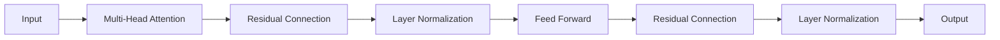

# 大语言模型应用指南：Transformer层

## 1. 背景介绍

近年来,自然语言处理(NLP)领域取得了突破性的进展,其中Transformer模型功不可没。Transformer最初由Google在2017年提出,旨在解决传统循环神经网络(RNN)在处理长序列时存在的梯度消失和梯度爆炸问题。Transformer通过引入自注意力机制(Self-Attention)和位置编码(Positional Encoding),实现了并行计算,大大提高了训练效率。

Transformer模型已经成为大语言模型(Large Language Model, LLM)的核心组件。像GPT、BERT、XLNet等著名的预训练语言模型都是基于Transformer构建的。这些模型在机器翻译、文本摘要、问答系统、情感分析等NLP任务上取得了state-of-the-art的表现。可以说,Transformer开启了NLP领域的新纪元。

本文将重点介绍Transformer模型中的关键组件——Transformer层(Transformer Layer),深入剖析其内部结构和工作原理,帮助读者更好地理解和应用这一强大的神经网络模块。

## 2. 核心概念与联系

要理解Transformer层,首先需要掌握以下几个核心概念:

### 2.1 注意力机制(Attention Mechanism)

注意力机制源自人类视觉系统,其核心思想是:在观察某个对象时,人们会更加关注与当前任务相关的区域。在NLP中,注意力机制被用来计算输入序列中不同位置之间的相关性,从而捕捉长距离依赖关系。

### 2.2 自注意力机制(Self-Attention)

自注意力是一种特殊的注意力机制,它不需要引入额外的信息,而是通过计算序列内部不同位置之间的相关性来更新表示。具体而言,自注意力通过将输入序列X映射为三个矩阵:Query矩阵Q、Key矩阵K和Value矩阵V,然后计算Q与K的点积得到注意力权重,再将权重应用于V得到输出。

### 2.3 多头注意力(Multi-Head Attention)

多头注意力是自注意力的扩展,它将输入序列投影到多个不同的子空间,分别进行自注意力计算,然后将结果拼接起来。这种机制允许模型在不同的表示子空间中捕捉不同的语义信息,提高了模型的表达能力。

### 2.4 残差连接(Residual Connection)

残差连接最早由何凯明(Kaiming He)等人在ResNet中提出,用于解决深层神经网络训练困难的问题。它将输入信息直接传递到输出,与主分支的输出相加,使得梯度可以直接回传到浅层,缓解了梯度消失问题。在Transformer中,残差连接被广泛应用于各个子层之间。

### 2.5 层归一化(Layer Normalization)

层归一化是一种自适应的归一化方法,与批量归一化(Batch Normalization)类似,但它是在每一层的神经元上进行归一化,而不是在每个批次上。层归一化可以加速模型收敛,提高训练稳定性。在Transformer中,层归一化通常紧跟在残差连接之后。

下图展示了这些核心概念在Transformer层中的联系:



## 3. 核心算法原理具体操作步骤

下面我们详细介绍Transformer层的核心算法——自注意力机制和前馈神经网络的具体操作步骤。

### 3.1 自注意力机制

1. 将输入序列X通过三个线性变换得到Q、K、V矩阵:

$$ Q = XW^Q, K = XW^K, V = XW^V $$

其中,$W^Q, W^K, W^V$是可学习的参数矩阵。

2. 计算Q与K的点积,得到注意力得分(attention scores):

$$ \text{Attention}(Q, K, V) = \text{softmax}(\frac{QK^T}{\sqrt{d_k}})V $$

其中,$d_k$是K的维度,用于缩放点积结果,避免softmax函数的梯度过小。

3. 将注意力得分应用于V,得到输出:

$$ \text{Output} = \text{Attention}(Q, K, V) $$

### 3.2 多头注意力

1. 将Q、K、V通过线性变换投影到h个不同的子空间:

$$ Q_i = XW_i^Q, K_i = XW_i^K, V_i = XW_i^V, i \in [1, h] $$

2. 在每个子空间内并行执行自注意力,得到h个输出:

$$ \text{head}_i = \text{Attention}(Q_i, K_i, V_i), i \in [1, h] $$

3. 将所有输出拼接起来,再通过一个线性变换得到最终输出:

$$ \text{MultiHead}(Q, K, V) = \text{Concat}(\text{head}_1, ..., \text{head}_h)W^O $$

其中,$W^O$是可学习的参数矩阵。

### 3.3 前馈神经网络

1. 将多头注意力的输出通过两个全连接层,中间使用ReLU激活函数:

$$ \text{FFN}(x) = \text{ReLU}(xW_1 + b_1)W_2 + b_2 $$

其中,$W_1, b_1, W_2, b_2$是可学习的参数。

2. 将FFN的输出与输入相加,再经过层归一化得到最终输出:

$$ \text{Output} = \text{LayerNorm}(x + \text{FFN}(x)) $$

## 4. 数学模型和公式详细讲解举例说明

为了更好地理解Transformer层中的数学原理,下面我们以一个简单的例子来说明。

假设有一个输入序列$X = [x_1, x_2, x_3]$,其中每个$x_i$是一个d维向量。我们希望通过自注意力机制来更新$x_1$的表示。

首先,将X通过三个线性变换得到Q、K、V矩阵:

$$ Q = XW^Q = [q_1, q_2, q_3] $$
$$ K = XW^K = [k_1, k_2, k_3] $$
$$ V = XW^V = [v_1, v_2, v_3] $$

然后,计算$q_1$与所有k的点积,得到注意力得分:

$$ \text{score}_{1i} = \frac{q_1 \cdot k_i}{\sqrt{d_k}}, i \in [1, 3] $$

接着,对得分进行softmax归一化:

$$ \alpha_{1i} = \frac{\exp(\text{score}_{1i})}{\sum_{j=1}^3 \exp(\text{score}_{1j})}, i \in [1, 3] $$

最后,将归一化后的得分与V相乘,得到$x_1$的更新表示:

$$ \hat{x}_1 = \sum_{i=1}^3 \alpha_{1i}v_i $$

这个过程可以并行地应用于$x_2$和$x_3$,得到整个序列的更新表示。

在多头注意力中,上述过程被重复h次,每次使用不同的参数矩阵$W^Q, W^K, W^V$,得到h个输出$\hat{x}_1^1, \hat{x}_1^2, ..., \hat{x}_1^h$,然后将它们拼接起来,再通过一个线性变换得到最终的更新表示:

$$ \tilde{x}_1 = [\hat{x}_1^1; \hat{x}_1^2; ...; \hat{x}_1^h]W^O $$

其中$[;]$表示拼接操作。

## 5. 项目实践：代码实例和详细解释说明

下面我们使用PyTorch实现一个简单的Transformer层,包括多头注意力和前馈神经网络。

```python
import torch
import torch.nn as nn

class MultiHeadAttention(nn.Module):
    def __init__(self, d_model, num_heads):
        super().__init__()
        self.d_model = d_model
        self.num_heads = num_heads
        self.head_dim = d_model // num_heads

        self.q_linear = nn.Linear(d_model, d_model)
        self.k_linear = nn.Linear(d_model, d_model)
        self.v_linear = nn.Linear(d_model, d_model)
        self.out_linear = nn.Linear(d_model, d_model)

    def forward(self, query, key, value, mask=None):
        batch_size = query.size(0)

        # 线性变换
        Q = self.q_linear(query)
        K = self.k_linear(key)
        V = self.v_linear(value)

        # 分头
        Q = Q.view(batch_size, -1, self.num_heads, self.head_dim).transpose(1, 2)
        K = K.view(batch_size, -1, self.num_heads, self.head_dim).transpose(1, 2)
        V = V.view(batch_size, -1, self.num_heads, self.head_dim).transpose(1, 2)

        # 计算注意力得分
        scores = torch.matmul(Q, K.transpose(-2, -1)) / (self.head_dim ** 0.5)
        if mask is not None:
            scores = scores.masked_fill(mask == 0, -1e9)
        attn_weights = nn.functional.softmax(scores, dim=-1)

        # 加权求和
        attn_output = torch.matmul(attn_weights, V)

        # 合并头
        attn_output = attn_output.transpose(1, 2).contiguous().view(batch_size, -1, self.d_model)

        # 线性输出
        output = self.out_linear(attn_output)

        return output

class PositionWiseFeedForward(nn.Module):
    def __init__(self, d_model, d_ff):
        super().__init__()
        self.fc1 = nn.Linear(d_model, d_ff)
        self.fc2 = nn.Linear(d_ff, d_model)

    def forward(self, x):
        x = self.fc1(x)
        x = nn.functional.relu(x)
        x = self.fc2(x)
        return x

class TransformerLayer(nn.Module):
    def __init__(self, d_model, num_heads, d_ff, dropout=0.1):
        super().__init__()
        self.attn = MultiHeadAttention(d_model, num_heads)
        self.ffn = PositionWiseFeedForward(d_model, d_ff)
        self.norm1 = nn.LayerNorm(d_model)
        self.norm2 = nn.LayerNorm(d_model)
        self.dropout1 = nn.Dropout(dropout)
        self.dropout2 = nn.Dropout(dropout)

    def forward(self, x, mask=None):
        # 多头注意力
        attn_output = self.attn(x, x, x, mask)
        attn_output = self.dropout1(attn_output)

        # 残差连接和层归一化
        x = self.norm1(x + attn_output)

        # 前馈神经网络
        ffn_output = self.ffn(x)
        ffn_output = self.dropout2(ffn_output)

        # 残差连接和层归一化
        x = self.norm2(x + ffn_output)

        return x
```

在上面的代码中,我们定义了三个类:

- MultiHeadAttention: 实现多头注意力机制,将输入序列投影到不同的子空间,并行计算自注意力,然后合并结果。
- PositionWiseFeedForward: 实现前馈神经网络,包括两个全连接层和ReLU激活函数。
- TransformerLayer: 组合多头注意力和前馈神经网络,并在它们之间插入残差连接和层归一化。

在TransformerLayer的forward方法中,我们首先通过多头注意力更新输入表示,然后通过残差连接和层归一化得到中间结果;接着通过前馈神经网络进一步更新表示,再次使用残差连接和层归一化得到最终输出。

这个实现只是一个简化版本,实际应用中还需要考虑更多细节,如位置编码、Mask机制等。但它展示了Transformer层的核心思想和基本结构。

## 6. 实际应用场景

Transformer层是大语言模型的基础构建块,在各种NLP任务中都有广泛应用,例如:

- 机器翻译:将源语言序列编码为隐向量,然后通过Transformer层解码生成目标语言序列。
- 文本摘要:将输入文档编码为隐向量,然后通过Transformer层解码生成摘要。
- 对话系统:将对话历史编码为隐向量,然后通过Transformer层生成回复。
- 命名实体识别:将输入序列编码为隐向量,然后通过Transformer层预测