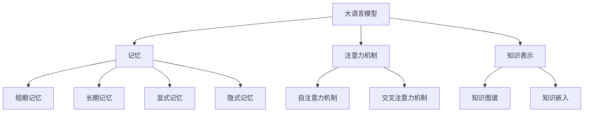

# 大语言模型应用指南：什么是记忆

## 1. 背景介绍
### 1.1 大语言模型的发展历程
#### 1.1.1 早期的语言模型
#### 1.1.2 Transformer模型的诞生
#### 1.1.3 预训练语言模型的崛起

### 1.2 记忆在大语言模型中的重要性
#### 1.2.1 记忆与语言理解的关系
#### 1.2.2 记忆对于大语言模型应用的意义
#### 1.2.3 记忆增强技术的研究现状

## 2. 核心概念与联系
### 2.1 大语言模型中的记忆
#### 2.1.1 短期记忆与长期记忆
#### 2.1.2 显式记忆与隐式记忆
#### 2.1.3 语义记忆与情景记忆

### 2.2 记忆与注意力机制
#### 2.2.1 注意力机制的基本原理
#### 2.2.2 自注意力机制与记忆
#### 2.2.3 交叉注意力机制与记忆

### 2.3 记忆与知识表示
#### 2.3.1 知识图谱与记忆
#### 2.3.2 知识嵌入与记忆
#### 2.3.3 知识增强的语言模型



## 3. 核心算法原理具体操作步骤
### 3.1 基于注意力的记忆机制
#### 3.1.1 注意力权重的计算
#### 3.1.2 注意力值的更新
#### 3.1.3 注意力机制的变体

### 3.2 基于外部存储的记忆机制
#### 3.2.1 键值存储结构
#### 3.2.2 读写操作的实现
#### 3.2.3 存储容量的优化

### 3.3 基于动态更新的记忆机制
#### 3.3.1 记忆单元的设计
#### 3.3.2 门控机制的应用
#### 3.3.3 遗忘机制的引入

## 4. 数学模型和公式详细讲解举例说明
### 4.1 注意力机制的数学表示
注意力机制可以用下面的公式来表示：

$Attention(Q,K,V) = softmax(\frac{QK^T}{\sqrt{d_k}})V$

其中，$Q$表示查询向量，$K$表示键向量，$V$表示值向量，$d_k$表示向量的维度。这个公式的含义是，首先计算查询向量$Q$与所有键向量$K$的相似度，然后通过softmax函数将相似度转化为注意力权重，最后用注意力权重对值向量$V$进行加权求和。

### 4.2 外部存储的数学表示
外部存储可以用一个键值对$(k_i, v_i)$的集合来表示，其中$k_i$表示第$i$个键，$v_i$表示第$i$个值。对存储的读操作可以表示为：

$r_t = \sum_{i=1}^N a_i^t v_i$

其中，$a_i^t$表示在时间步$t$对第$i$个存储单元的注意力权重，$N$表示存储单元的数量。写操作可以表示为：

$\tilde{v}_i^t = v_i^{t-1} + a_i^t \Delta v_t$

其中，$\Delta v_t$表示在时间步$t$需要写入的值的变化量。

### 4.3 动态更新的数学表示
动态更新的记忆单元可以用一个隐藏状态向量$h_t$来表示，其更新公式为：

$h_t = f_t \odot h_{t-1} + i_t \odot \tilde{h}_t$

其中，$f_t$表示遗忘门，控制上一时间步的隐藏状态有多少被遗忘；$i_t$表示输入门，控制当前时间步的候选隐藏状态$\tilde{h}_t$有多少被写入；$\odot$表示按元素相乘。候选隐藏状态$\tilde{h}_t$的计算公式为：

$\tilde{h}_t = tanh(W_h [h_{t-1}, x_t] + b_h)$

其中，$x_t$表示当前时间步的输入，$W_h$和$b_h$为可学习的参数矩阵和偏置项。

## 5. 项目实践：代码实例和详细解释说明
下面是一个基于PyTorch实现的简单的注意力机制的代码示例：

```python
import torch
import torch.nn as nn

class AttentionLayer(nn.Module):
    def __init__(self, hidden_size):
        super(AttentionLayer, self).__init__()
        self.hidden_size = hidden_size
        self.attn = nn.Linear(self.hidden_size * 2, hidden_size)
        self.v = nn.Parameter(torch.rand(hidden_size))
        stdv = 1. / math.sqrt(self.v.size(0))
        self.v.data.uniform_(-stdv, stdv)

    def forward(self, hidden, encoder_outputs):
        timestep = encoder_outputs.size(0)
        h = hidden.repeat(timestep, 1, 1).transpose(0, 1)
        encoder_outputs = encoder_outputs.transpose(0, 1)
        attn_energies = self.score(h, encoder_outputs)
        return F.softmax(attn_energies, dim=1).unsqueeze(1)

    def score(self, hidden, encoder_outputs):
        energy = torch.tanh(self.attn(torch.cat([hidden, encoder_outputs], 2)))
        energy = energy.transpose(1, 2)
        v = self.v.repeat(encoder_outputs.size(0), 1).unsqueeze(1)
        energy = torch.bmm(v, energy)
        return energy.squeeze(1)
```

这个注意力层的输入是当前的隐藏状态`hidden`和编码器的输出序列`encoder_outputs`，输出是注意力权重。其中，`score`函数用于计算当前隐藏状态与编码器输出序列中每个元素的注意力得分，具体做法是将它们拼接后通过一个线性层和tanh激活函数，然后与一个可学习的向量$v$做点积。最后，将注意力得分通过softmax函数转化为注意力权重。

在实际应用中，我们可以将这个注意力层插入到序列到序列模型的解码器中，在每个解码步骤中根据当前的隐藏状态和编码器输出序列动态地计算注意力权重，然后用注意力权重对编码器输出进行加权求和，得到当前时间步的上下文向量，再将其与解码器的隐藏状态拼接起来，作为解码器的输入。

## 6. 实际应用场景
### 6.1 机器翻译中的记忆机制应用
在神经机器翻译中，引入记忆机制可以帮助模型更好地捕捉长距离依赖关系，生成更加连贯和语义一致的译文。比如，我们可以在编码器中加入一个外部存储模块，用于存储输入序列中的重要信息；在解码器中加入一个注意力机制，用于在翻译过程中动态地从存储中读取相关信息。

### 6.2 阅读理解中的记忆机制应用
在阅读理解任务中，记忆机制可以帮助模型更好地理解文章内容，回答相关问题。比如，我们可以将文章分成若干个片段，然后用一个显式记忆模块来存储每个片段的表示；在回答问题时，用注意力机制来选择与问题最相关的片段，并从中提取答案所需的信息。

### 6.3 对话系统中的记忆机制应用
在对话系统中，记忆机制可以帮助模型更好地理解对话历史，生成更加自然和连贯的回复。比如，我们可以用一个外部存储模块来存储对话历史中的重要信息，如用户提到的实体、用户的意图等；在生成回复时，用注意力机制来动态地从存储中读取相关信息，并将其融入到回复的生成过程中。

## 7. 工具和资源推荐
### 7.1 开源工具包
- [Hugging Face Transformers](https://github.com/huggingface/transformers)：包含了多种预训练语言模型和下游任务的实现，支持快速微调和推理。
- [Fairseq](https://github.com/pytorch/fairseq)：由Facebook开源的序列到序列建模工具包，支持多种记忆增强技术。
- [OpenNMT](https://github.com/OpenNMT/OpenNMT-py)：由哈佛大学和Systran联合开发的神经机器翻译工具包，支持注意力机制和记忆网络等技术。

### 7.2 相关论文
- Attention Is All You Need：Transformer模型的原始论文，提出了自注意力机制。
- End-To-End Memory Networks：端到端记忆网络的开山之作，在问答和对话任务上取得了很好的效果。
- Augmenting Neural Networks with External Memory：在神经网络中引入外部存储，增强其记忆和推理能力。

### 7.3 学习资源
- [深度学习自然语言处理](https://www.coursera.org/learn/nlp-sequence-models)：吴恩达在Coursera上开设的NLP课程，包含了注意力机制和记忆网络等内容。
- [动手学深度学习](https://zh.d2l.ai/)：李沐等人编写的深度学习教程，有详细的代码实现和讲解。
- [NLP Progress](http://nlpprogress.com/)：跟踪NLP各个任务的最新进展，包括相关论文、代码实现和排行榜。

## 8. 总结：未来发展趋势与挑战
### 8.1 记忆机制与知识的结合
当前的记忆增强技术主要关注短期记忆，如何将长期知识有效地融入到语言模型中，是一个值得探索的方向。一些研究尝试将知识图谱、知识库等外部知识与语言模型相结合，取得了初步成果。未来，如何更好地将结构化和非结构化知识与记忆机制相结合，将是一个重要的研究课题。

### 8.2 记忆机制的可解释性
尽管记忆增强技术在多个NLP任务上取得了不错的效果，但其内部工作机制仍然难以解释。模型究竟记住了什么，如何利用这些记忆进行推理，目前并不十分清楚。未来，提高记忆机制的可解释性，有助于我们更好地理解模型的行为，并针对性地改进模型结构。

### 8.3 记忆机制的高效性
目前的许多记忆增强技术在训练和推理时的计算开销都比较大，这限制了它们在实际应用中的使用。如何在保证模型效果的同时，提高记忆机制的存储和计算效率，是一个亟待解决的问题。一些研究尝试通过知识蒸馏、模型剪枝等技术来压缩模型，取得了一定的成果。未来，设计更加高效的记忆架构和训练方法，将是重要的发展方向。

### 8.4 记忆机制与持续学习
当前的大多数语言模型采用一次性训练的方式，难以适应不断变化的数据环境。如何让模型具备持续学习的能力，在不忘记旧知识的同时，不断吸收新知识，是一个富有挑战性的问题。记忆机制为解决这一问题提供了新的思路。通过引入外部存储，我们可以让模型将新知识存入记忆中，并在需要时进行检索和利用。未来，探索记忆机制在持续学习中的应用，将是一个值得关注的研究方向。

## 9. 附录：常见问题与解答
### 9.1 记忆机制与注意力机制有什么区别？
注意力机制主要用于在不同时间步或位置之间建立联系，帮助模型更好地捕捉长距离依赖关系。而记忆机制更侧重于显式地存储和检索信息，增强模型的记忆能力。二者的目的有所不同，但在实现上也有一些相通之处，比如都用到了键值对的结构。在实际应用中，注意力机制和记忆机制常常是结合使用的。

### 9.2 记忆网络和RNN有什么区别？
RNN通过隐藏状态来隐式地存储历史