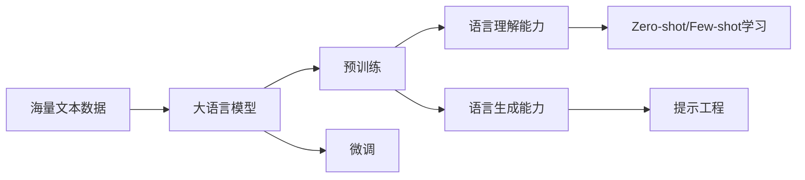

# 大语言模型应用指南：大语言模型的局限性

## 1. 背景介绍
### 1.1 大语言模型的崛起
近年来,随着深度学习技术的飞速发展,大语言模型(Large Language Model,LLM)成为自然语言处理(NLP)领域的研究热点。从GPT-3到ChatGPT,大语言模型展现出了惊人的语言理解和生成能力,在问答、对话、文本生成等任务上取得了瞩目的成绩。

### 1.2 大语言模型的应用前景
大语言模型有望在智能客服、教育培训、金融分析、医疗诊断等领域发挥重要作用,极大提升人机交互体验和工作效率。但同时我们也要清醒地认识到,大语言模型并非万能,它存在着一些固有的局限性,在实际应用中需要加以克服和规避。

### 1.3 探讨大语言模型局限性的意义
系统全面地分析大语言模型的局限性,有助于我们客观认识其能力边界,在实践中避免过度依赖和滥用;同时也为未来大语言模型的改进和突破指明了方向。本文将从六个方面深入剖析大语言模型的局限性,并给出相应的应对建议。

## 2. 核心概念与联系
### 2.1 大语言模型
大语言模型是基于海量文本数据,利用深度神经网络训练得到的语言模型。它能够学习到丰富的语言知识和模式,具备强大的语言理解和生成能力。代表模型有GPT系列、BERT、T5等。

### 2.2 预训练与微调
大语言模型通常采用预训练-微调(pre-training & fine-tuning)的学习范式。预训练阶段在大规模通用语料上进行无监督学习,掌握语言的基本规律;微调阶段在特定任务的小样本数据上进行有监督学习,使模型适应具体应用。

### 2.3 Zero-shot/Few-shot学习
得益于强大的语言理解能力,大语言模型无需或仅需少量样本就能在全新任务上取得不错的效果,这种无样本(zero-shot)或少样本(few-shot)学习能力是其显著优势之一。

### 2.4 提示工程
为了充分发挥大语言模型的能力,需要精心设计输入的提示(prompt),引导模型进行推理和生成。提示工程(prompt engineering)是大语言模型应用的关键环节。

### 核心概念关系图


## 3. 核心算法原理具体操作步骤
大语言模型的核心算法主要包括Transformer结构和自回归生成。

### 3.1 Transformer结构
1. 输入文本序列通过Embedding层转换为词向量表示
2. 词向量序列通过多头自注意力机制(Multi-head Self-Attention)提取上下文信息
3. 自注意力的输出通过前馈神经网络(Feed Forward Network)进一步提取特征
4. 重复步骤2-3多次(即Transformer的多个编码器层),得到最终的上下文表示

### 3.2 自回归生成
1. 输入提示词序列,通过Transformer的多层编码器提取其上下文表示
2. 根据上下文表示和之前生成的词,预测下一个词的概率分布
3. 从概率分布中采样生成下一个词
4. 重复步骤2-3,直到生成结束符或达到最大长度,得到完整的生成结果

## 4. 数学模型和公式详细讲解举例说明
### 4.1 Transformer的自注意力机制
对于输入序列 $X=(x_1,\cdots,x_n)$,自注意力机制可表示为:

$$
\begin{aligned}
Q &= XW^Q \
K &= XW^K \
V &= XW^V \
Attention(Q,K,V) &= softmax(\frac{QK^T}{\sqrt{d_k}})V
\end{aligned}
$$

其中,$Q$,$K$,$V$ 分别为查询、键、值矩阵,$W^Q$,$W^K$,$W^V$ 为对应的权重矩阵。自注意力通过查询和键的相似度来确定值的权重,从而实现上下文信息的聚合。

### 4.2 Transformer的前馈神经网络
前馈神经网络可表示为:

$$FFN(x)=max(0, xW_1 + b_1)W_2 + b_2$$

其中,$W_1$,$W_2$为权重矩阵,$b_1$,$b_2$为偏置项。前馈神经网络用于对自注意力的输出进行非线性变换,提取高层特征。

### 4.3 自回归生成的概率预测
假设已生成的词序列为 $y_1,\cdots,y_{t-1}$,则下一个词 $y_t$ 的条件概率为:

$$P(y_t|y_1,\cdots,y_{t-1})=softmax(Wy_{t-1}+b)$$

其中,$W$,$b$为权重矩阵和偏置项。模型根据之前生成的词预测下一个词的概率分布,再从中采样得到生成结果。

## 5. 项目实践：代码实例和详细解释说明

下面是使用PyTorch实现Transformer编码器层的示例代码:

```python
import torch
import torch.nn as nn

class TransformerEncoderLayer(nn.Module):
    def __init__(self, d_model, nhead, dim_feedforward, dropout=0.1):
        super(TransformerEncoderLayer, self).__init__()
        self.self_attn = nn.MultiheadAttention(d_model, nhead, dropout=dropout)
        self.linear1 = nn.Linear(d_model, dim_feedforward)
        self.linear2 = nn.Linear(dim_feedforward, d_model)
        self.dropout = nn.Dropout(dropout)
        self.norm1 = nn.LayerNorm(d_model)
        self.norm2 = nn.LayerNorm(d_model)
        
    def forward(self, src, src_mask=None, src_key_padding_mask=None):
        src2 = self.self_attn(src, src, src, attn_mask=src_mask,
                              key_padding_mask=src_key_padding_mask)[0]
        src = src + self.dropout(src2)
        src = self.norm1(src)
        src2 = self.linear2(self.dropout(torch.relu(self.linear1(src))))
        src = src + self.dropout(src2)
        src = self.norm2(src)
        return src
```

代码解释:
- `TransformerEncoderLayer`类定义了Transformer的编码器层,包括多头自注意力、前馈神经网络、残差连接和层归一化等组件。
- `self_attn`使用`nn.MultiheadAttention`实现多头自注意力机制。
- `linear1`和`linear2`实现前馈神经网络,中间使用ReLU激活函数。
- `dropout`用于随机丢弃一部分神经元,防止过拟合。
- `norm1`和`norm2`实现层归一化,稳定训练过程。
- 在`forward`函数中,输入`src`经过自注意力、残差连接、前馈网络等一系列变换,得到编码器层的输出。

以上代码展示了如何使用PyTorch搭建Transformer编码器层。在实际的大语言模型中,还需要多个编码器层的堆叠,以及嵌入层、位置编码等其他组件,共同组成完整的Transformer结构。

## 6. 大语言模型的局限性与应对策略

尽管大语言模型在许多NLP任务上表现出色,但它们仍然存在一些局限性,主要体现在以下几个方面:

### 6.1 常识推理能力有限
- 局限性:大语言模型主要从文本数据中学习知识,对于一些常识性的推理(如因果、时序、空间等关系)掌握不足,容易产生逻辑错误或自相矛盾的结果。
- 应对策略:引入知识图谱等结构化知识,增强模型的常识推理能力;设计更有效的评估方式,检测并纠正模型生成的逻辑错误。

### 6.2 泛化能力不足
- 局限性:大语言模型在面对训练数据分布以外的新领域或任务时,泛化能力往往不够理想,需要大量的领域内数据进行微调,适应成本较高。
- 应对策略:探索更高效的跨领域迁移学习方法,提高模型的泛化能力;针对目标领域构建更精准的训练数据,减少微调的需求。

### 6.3 鲁棒性和可控性不强
- 局限性:大语言模型对输入的扰动(如拼写错误、同义改写等)比较敏感,容易产生错误或不可控的输出,带来安全隐患。
- 应对策略:在训练数据中加入扰动,提高模型的鲁棒性;引入更细粒度的生成控制机制,增强输出的可控性和可解释性。

### 6.4 公平性和伦理风险
- 局限性:大语言模型从海量网络数据中学习,难免会继承数据中的偏见和歧视,产生不公平或有悖伦理的输出。
- 应对策略:对训练数据进行去偏和净化处理,消除潜在的偏见;在生成过程中嵌入伦理规范和价值判断,防止产生不当内容。

### 6.5 计算和存储开销大
- 局限性:大语言模型动辄数百亿、上千亿参数,训练和推理的计算开销巨大,对硬件要求极高,难以在资源受限的场景下部署应用。
- 应对策略:开发模型压缩和加速技术,在保持性能的同时降低模型复杂度;利用云计算等基础设施,提供灵活高效的计算资源。

### 6.6 可解释性不足
- 局限性:大语言模型是一种"黑盒"模型,其内部工作机制难以解释,输出结果缺乏可信的解释,不利于用户理解和信任。
- 应对策略:研究可解释性的神经网络结构和注意力机制,提高模型的透明度;开发交互式的可视化工具,帮助用户解读模型的推理过程。

## 7. 实际应用场景

大语言模型在许多领域都有广阔的应用前景,但需要针对具体场景进行适配和优化,并辅以人工审核和干预。一些有前景的应用方向包括:

### 7.1 智能客服
利用大语言模型构建智能客服系统,自动解答用户咨询,提供个性化服务。需要加强领域知识的融合,提高应答的专业性和准确性。

### 7.2 教育培训
应用大语言模型开发智能教学助手,为学生提供个性化的学习指导和问题解答。要重点关注教学内容的可靠性和适宜性,避免误导学生。

### 7.3 金融分析
结合大语言模型和金融领域知识,开发智能金融分析工具,协助投资者进行市场研判和决策支持。须严格遵守金融合规要求,控制风险。

### 7.4 医疗健康
利用大语言模型处理医疗文本数据,辅助临床决策和药物研发。必须确保生成内容的医学专业性和伦理合规性,保障患者安全。

### 7.5 法律服务
应用大语言模型分析法律文书,提供智能检索和初步建议。需要严格遵守法律法规,避免错误引导或越权行为。

## 8. 工具和资源推荐

为了方便研究者和开发者探索大语言模型,这里推荐一些常用的工具和资源:

### 8.1 开源模型库
- Hugging Face Transformers:包含众多主流NLP模型的开源库,API简单易用。
- FairSeq:由Facebook开源的序列建模工具包,支持多种任务和模型。
- Google BERT:谷歌官方的BERT模型实现,包含预训练模型和微调代码。

### 8.2 数据集
- Wikipedia:维基百科是常用的预训练语料来源,涵盖多个语言和领域。
- Common Crawl:网络爬取的海量文本数据,可用于增强模型的语言理解能力。
- GLUE/SuperGLUE:NLP通用评估基准数据集,涵盖分类、蕴含、问答等任务。

### 8.3 开发框架
- PyTorch:动态计算