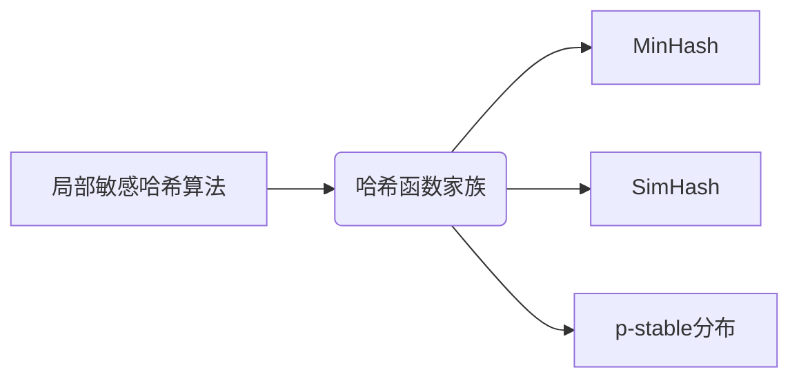
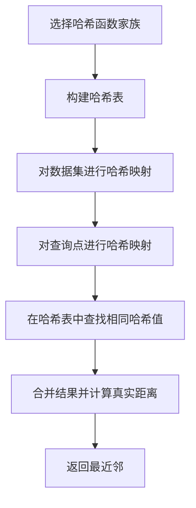

# 局部敏感哈希：快速找到近邻

## 1.背景介绍

### 1.1 数据爆炸时代的挑战

在当今的数字时代,海量数据的产生和存储已经成为一个巨大的挑战。无论是社交媒体平台上的图像和视频,还是物联网设备收集的传感器数据,都需要高效的方式进行处理和分析。在这种背景下,寻找相似数据或近邻数据成为了一个重要的任务。

### 1.2 传统方法的局限性

传统的近邻搜索算法,如暴力搜索和树形索引,在处理高维数据时会遇到"维数灾难"(Curse of Dimensionality)问题,导致性能下降。此外,对于大规模数据集,这些算法的计算和存储开销也会成为瓶颈。

### 1.3 局部敏感哈希的优势

局部敏感哈希(Locality Sensitive Hashing, LSH)作为一种概率算法,可以高效地近似求解最近邻问题。它通过将高维数据映射到低维哈希值,从而大大减少了计算和存储的开销,同时保持了相似数据具有相似哈希值的特性。

## 2.核心概念与联系

### 2.1 局部敏感性

局部敏感性是LSH算法的核心概念。它要求相似的数据点在哈希空间中具有较高的概率被映射到相同的哈希值,而不相似的数据点则被映射到不同的哈希值。这种性质使得LSH能够有效地近似最近邻搜索。

### 2.2 哈希函数家族

LSH算法依赖于一组特殊的哈希函数家族,这些函数满足局部敏感性。常见的哈希函数家族包括MinHash、SimHash和p-stable分布等。不同的函数家族适用于不同的数据类型和相似性度量。



### 2.3 哈希表和倾斜窗口

LSH算法通过构建多个哈希表来存储数据点的哈希值。每个哈希表使用不同的哈希函数组合,从而增加了发现近邻的概率。此外,LSH还引入了倾斜窗口(Sliding Window)的概念,将相邻的哈希值组合起来,进一步提高了近邻搜索的精度。

## 3.核心算法原理具体操作步骤

### 3.1 LSH算法流程

LSH算法的主要流程如下:

1. 选择合适的哈希函数家族
2. 构建多个哈希表
3. 对数据集进行哈希映射,并将哈希值存储在对应的哈希表中
4. 对查询点进行哈希映射,并在每个哈希表中查找相同哈希值的数据点
5. 合并查找结果,并根据原始数据计算真实距离,返回最近邻



### 3.2 哈希函数设计

哈希函数的设计是LSH算法的关键。一个好的哈希函数应该满足以下条件:

1. 局部敏感性:相似的数据点应该具有较高的概率被映射到相同的哈希值
2. 均匀分布:哈希值在整个哈希空间中均匀分布
3. 高效计算:哈希函数的计算应该高效,以减少计算开销

常见的哈希函数设计方法包括随机投影、位采样和核函数等。

### 3.3 哈希表优化

为了提高LSH算法的性能,可以对哈希表进行优化,包括:

1. 倾斜窗口:将相邻的哈希值组合起来,提高近邻搜索的精度
2. 多探测查询:在多个哈希表中进行查询,增加发现近邻的概率
3. 动态索引:根据数据分布动态调整哈希表的大小和数量

## 4.数学模型和公式详细讲解举例说明

### 4.1 相似性度量

LSH算法需要定义相似性度量,以量化数据点之间的相似程度。常见的相似性度量包括欧几里得距离、余弦相似度和Jaccard相似系数等。

对于欧几里得距离,两个数据点 $\vec{x}$ 和 $\vec{y}$ 之间的距离定义为:

$$d(\vec{x}, \vec{y}) = \sqrt{\sum_{i=1}^{d}(x_i - y_i)^2}$$

其中 $d$ 是数据的维度。

对于余弦相似度,两个向量 $\vec{x}$ 和 $\vec{y}$ 之间的相似度定义为:

$$sim(\vec{x}, \vec{y}) = \frac{\vec{x} \cdot \vec{y}}{||\vec{x}|| \cdot ||\vec{y}||}$$

### 4.2 局部敏感哈希函数

LSH算法需要设计满足局部敏感性的哈希函数。以下是一个基于随机投影的哈希函数示例:

$$h(\vec{x}) = \begin{cases}
1, & \text{if } \vec{r} \cdot \vec{x} \geq 0\
0, & \text{otherwise}
\end{cases}$$

其中 $\vec{r}$ 是一个随机向量,用于将高维数据投影到一个标量值上。

### 4.3 近邻概率估计

LSH算法的核心思想是,相似的数据点在哈希空间中具有较高的概率被映射到相同的哈希值。对于一对数据点 $\vec{x}$ 和 $\vec{y}$,它们被映射到相同哈希值的概率可以估计为:

$$P(h(\vec{x}) = h(\vec{y})) = 1 - \frac{\theta(\vec{x}, \vec{y})}{\pi}$$

其中 $\theta(\vec{x}, \vec{y})$ 是 $\vec{x}$ 和 $\vec{y}$ 之间的夹角。

## 5.项目实践:代码实例和详细解释说明

以下是一个基于Python和NumPy库实现的LSH示例代码:

```python
import numpy as np

class LSH:
    def __init__(self, num_hash_functions, num_tables):
        self.num_hash_functions = num_hash_functions
        self.num_tables = num_tables
        self.hash_tables = [dict() for _ in range(num_tables)]
        self.hash_vectors = np.random.randn(num_hash_functions, num_tables, 128)

    def hash(self, vector):
        hashes = np.dot(self.hash_vectors, vector.reshape(-1, 1)).flatten() >= 0
        return [tuple(hashes[i::self.num_hash_functions]) for i in range(self.num_hash_functions)]

    def index(self, vectors):
        for vector in vectors:
            hashes = self.hash(vector)
            for table_idx, table in enumerate(self.hash_tables):
                table_hash = hashes[table_idx]
                if table_hash in table:
                    table[table_hash].append(vector)
                else:
                    table[table_hash] = [vector]

    def query(self, vector, num_results=10):
        candidates = set()
        hashes = self.hash(vector)
        for table_idx, table in enumerate(self.hash_tables):
            table_hash = hashes[table_idx]
            if table_hash in table:
                candidates.update(table[table_hash])

        distances = [(np.linalg.norm(vector - candidate), candidate) for candidate in candidates]
        distances.sort(key=lambda x: x[0])
        return [dist[1] for dist in distances[:num_results]]
```

这个示例代码实现了一个简单的LSH算法,包括以下主要功能:

1. `__init__`方法初始化LSH对象,包括设置哈希函数数量、哈希表数量和随机投影向量。
2. `hash`方法计算给定向量的哈希值,使用随机投影作为哈希函数。
3. `index`方法将数据集中的向量插入到多个哈希表中。
4. `query`方法对给定的查询向量进行近邻搜索,首先在哈希表中找到候选向量,然后计算真实距离并返回最近邻。

使用示例:

```python
# 创建LSH对象
lsh = LSH(num_hash_functions=10, num_tables=5)

# 插入数据集
dataset = np.random.randn(1000, 128)
lsh.index(dataset)

# 查询近邻
query_vector = np.random.randn(128)
neighbors = lsh.query(query_vector, num_results=5)
```

## 6.实际应用场景

LSH算法在许多领域都有广泛的应用,包括:

1. **近似最近邻搜索**:在计算机视觉、自然语言处理和推荐系统等领域,LSH可以快速找到相似的图像、文本或用户偏好。
2. **数据去重**:LSH可用于识别重复或近似重复的数据,从而实现数据去重和压缩。
3. **聚类分析**:通过将相似的数据点聚集在一起,LSH可以用于聚类分析和异常检测。
4. **基因组学**:在基因组学中,LSH可用于快速比对和查找相似的基因序列。
5. **信号处理**:LSH可用于快速检测相似的音频或视频信号,应用于版权保护和内容识别等领域。

## 7.工具和资源推荐

以下是一些有用的LSH工具和资源:

1. **Python库**:scikit-learn、Datasketch和FALCONN等库提供了LSH的实现。
2. **C++库**:FLANN、PANNS和NMSLIB等库提供了高性能的LSH实现。
3. **在线课程**:Coursera和edX上有关于近似算法和LSH的优质课程。
4. **论文和书籍**:Andrei Z. Broder等人的论文"Min-wise Independent Permutations"和Anand Rajaraman等人的书籍"Mining of Massive Datasets"都是不错的资源。
5. **开源项目**:Apache Lucene和Elasticsearch等开源项目中都使用了LSH算法。

## 8.总结:未来发展趋势与挑战

LSH算法为高效的近邻搜索提供了一种有前景的解决方案。然而,它也面临一些挑战和发展方向:

1. **动态数据处理**:如何高效地处理动态更新的数据集,而不需要重建整个索引?
2. **高维数据处理**:如何在高维数据上提高LSH的性能和精度?
3. **异构数据处理**:如何将LSH应用于异构数据,如图像、文本和其他结构化数据?
4. **硬件加速**:如何利用GPU和专用硬件来加速LSH的计算?
5. **隐私保护**:如何在保护数据隐私的同时,实现高效的近邻搜索?

未来,LSH算法将继续在理论和实践层面得到发展,以满足不断增长的数据处理需求。

## 9.附录:常见问题与解答

### 9.1 LSH和传统索引方法(如树形索引)相比有什么优缺点?

优点:

- 适用于高维数据,避免"维数灾难"问题
- 计算和存储开销较低,可以处理大规模数据集
- 具有理论保证,可以近似求解最近邻问题

缺点:

- 只能近似求解,无法保证找到真正的最近邻
- 需要构建多个哈希表,存储开销较大
- 性能取决于数据分布和参数设置

### 9.2 如何选择合适的哈希函数家族?

选择哈希函数家族时,需要考虑以下因素:

1. 数据类型:不同的数据类型(如向量、集合、字符串等)需要使用不同的哈希函数家族。
2. 相似性度量:哈希函数家族应该与所选择的相似性度量相匹配。
3. 计算效率:哈希函数的计算应该高效,以减少计算开销。
4. 局部敏感性:哈希函数应该满足局部敏感性,以保证LSH算法的性能。

常见的选择包括MinHash(用于集合数据)、SimHash(用于文本数据)和p-stable分布(用于向量数据)等。

### 9.3 如何确定哈希表的数量和哈希函数的数量?

哈希表的数量和哈希函数的数量会影响LSH算法的性能和精度。一般来说,增加哈希表的数量可以提高近邻