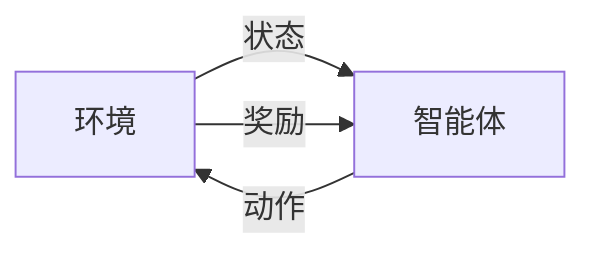
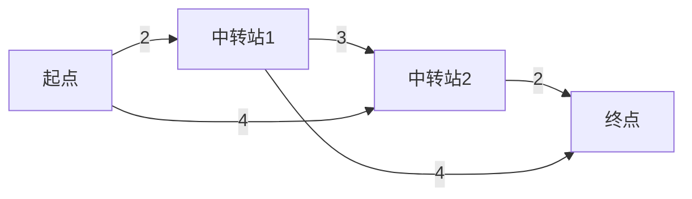

# 强化学习：在快递派送中的应用

## 1.背景介绍

### 1.1 快递行业的挑战

随着电子商务的蓬勃发展,快递行业已经成为现代物流体系的重要组成部分。然而,快递公司面临着许多挑战,例如:

- 动态路线规划
- 车队管理
- 时效性要求
- 成本控制

传统的路径规划和调度方法通常依赖于人工经验或简单的启发式算法,难以满足复杂动态环境下的实时优化需求。

### 1.2 强化学习的优势

强化学习(Reinforcement Learning)是一种基于对环境的反馈来学习最优策略的机器学习范式。它具有以下优势:

- 无需人工标注数据
- 可处理连续状态和动作空间
- 具有探索和利用的平衡能力
- 能够适应动态环境

因此,将强化学习应用于快递派送领域,有望提高路线规划和车队调度的效率和灵活性。

## 2.核心概念与联系

### 2.1 强化学习基本概念

强化学习系统由以下几个核心要素组成:

- **环境(Environment)**: 系统所处的外部世界,包括状态和奖励信号。
- **状态(State)**: 描述环境当前情况的数据集合。
- **动作(Action)**: 智能体可以在当前状态下采取的操作。
- **奖励(Reward)**: 环境对智能体当前行为的反馈评价。
- **策略(Policy)**: 智能体在每个状态下选择动作的策略函数。

智能体与环境进行交互,根据当前状态选择动作,环境返回新的状态和奖励信号,智能体不断优化策略以获取最大化的累积奖励。



### 2.2 强化学习在快递派送中的应用

在快递派送场景中:

- **环境**: 包括路网、车辆位置、订单等动态信息。
- **状态**: 描述车辆当前位置、剩余订单等状态数据。
- **动作**: 车辆可选择的下一步行驶路径。
- **奖励**: 根据送达时效、行驶距离等设计奖惩函数。
- **策略**: 输出车辆下一步的最优路径选择。

通过与环境不断交互,强化学习算法可以学习到一个优化的派送策略,最大化订单的按时送达率,并最小化行车路程。

## 3.核心算法原理具体操作步骤

强化学习算法通常分为基于价值函数(Value-based)和基于策略(Policy-based)两大类。以Q-Learning为代表的基于价值函数算法步骤如下:

```mermaid
graph TD
    A[初始化Q函数] --> B[观测当前状态s]
    B --> C[根据策略选择动作a]
    C --> D[执行动作a,获得奖励r和新状态s']
    D --> E[更新Q(s,a)]
    E --> F[更新状态s=s']
    F --> B
```

1. **初始化Q函数**: 初始化状态-动作值函数Q(s,a)。
2. **观测当前状态**: 获取环境当前状态s。
3. **选择动作**: 根据当前Q函数值,选择在状态s下执行的动作a。
4. **执行动作**: 执行动作a,获得环境反馈的即时奖励r和新状态s'。
5. **更新Q函数**: 根据获得的r和s',更新Q(s,a)的估计值。
6. **更新状态**: 将s'作为新的当前状态。
7. **重复上述过程**,直至收敛或达到停止条件。

通过不断更新Q函数,算法可以逐步学习到最优的状态-动作值函数,从而得到最优的派送策略。

## 4.数学模型和公式详细讲解举例说明

### 4.1 Q-Learning算法

Q-Learning是一种基于时间差分(Temporal Difference)的无模型强化学习算法,其核心是通过不断更新Q函数的估计值,来逼近真实的Q函数。更新公式如下:

$$Q(s_t, a_t) \leftarrow Q(s_t, a_t) + \alpha \left[ r_{t+1} + \gamma \max_{a}Q(s_{t+1}, a) - Q(s_t, a_t) \right]$$

其中:

- $Q(s_t, a_t)$是当前状态-动作对的Q值估计
- $\alpha$是学习率,控制学习的速度
- $r_{t+1}$是执行动作$a_t$后获得的即时奖励
- $\gamma$是折现因子,控制未来奖励的权重
- $\max_{a}Q(s_{t+1}, a)$是在新状态$s_{t+1}$下可获得的最大Q值估计

通过不断应用上述更新规则,Q函数会逐渐收敛到最优值函数$Q^*(s, a)$,从而可以得到最优策略$\pi^*(s) = \arg\max_a Q^*(s, a)$。

### 4.2 示例:简单路网派送问题

考虑一个简单的路网派送问题,如下图所示:



其中,数字表示两点之间的距离。假设车辆从起点A出发,需要先后经过中转站B和C,最终抵达终点D。我们的目标是找到一条最短的路径。

我们可以将问题建模为一个强化学习环境:

- 状态s:车辆当前所在位置(A/B/C/D)
- 动作a:车辆下一步可选择的路径
- 奖励r:根据路径距离设置负奖励,-dist(s,s')
- 策略$\pi$:输出在状态s下选择动作a的概率$\pi(a|s)$

通过Q-Learning算法训练,最终可以得到最优路径A->C->D,总距离为4。

该示例虽然简单,但展示了强化学习在路径规划中的应用潜力。对于更复杂的快递派送场景,强化学习也可以借助神经网络等技术来扩展解决。

## 5.项目实践:代码实例和详细解释说明

以下是一个使用Python和OpenAI Gym实现的简单Q-Learning示例,用于解决网格世界(GridWorld)导航问题。

### 5.1 导入需要的库

```python
import gym
import numpy as np
```

### 5.2 定义Q-Learning函数

```python
def q_learning(env, num_episodes, discount_factor=1.0, alpha=0.6, epsilon=0.1):
    """
    Q-Learning算法,用于求解离散有限马尔可夫决策过程

    参数:
    env: OpenAI Gym环境对象
    num_episodes: 训练的最大回合数
    discount_factor: 折现因子
    alpha: 学习率
    epsilon: 探索概率
    """
    # 初始化Q表格
    state_size = env.observation_space.n
    action_size = env.action_space.n
    qtable = np.zeros((state_size, action_size))

    # 训练
    for episode in range(num_episodes):
        state = env.reset()

        while True:
            # 探索与利用
            if np.random.uniform() < epsilon:
                action = env.action_space.sample()
            else:
                action = np.argmax(qtable[state])

            next_state, reward, done, _ = env.step(action)

            # 更新Q表格
            qtable[state, action] = qtable[state, action] + alpha * (
                reward + discount_factor * np.max(qtable[next_state]) - qtable[state, action])

            state = next_state

            if done:
                break

    return qtable
```

该函数实现了基本的Q-Learning算法流程:

1. 初始化Q表格
2. 对于每个回合:
   - 根据当前状态选择动作(探索或利用)
   - 执行动作,获得新状态和奖励
   - 更新Q表格
   - 转移到新状态
3. 返回最终的Q表格

### 5.3 测试

```python
# 创建环境
env = gym.make("FrozenLake-v1")

# 训练
qtable = q_learning(env, num_episodes=10000)

# 测试
state = env.reset()
print(f"Initial State: {state}")

while True:
    env.render()
    action = np.argmax(qtable[state])
    state, _, done, _ = env.step(action)

    if done:
        break

print("Goal reached!")
env.close()
```

该代码创建了一个"FrozenLake-v1"环境(一个8x8的网格世界,需要找到从起点到终点的安全路径)。然后使用Q-Learning算法训练10000回合,获得最终的Q表格。最后,使用该Q表格在环境中测试,输出每一步的状态,直到到达终点。

通过这个简单的示例,我们可以直观地理解Q-Learning算法的工作原理。在实际的快递派送场景中,我们需要设计更复杂的状态、动作和奖励函数,并结合其他技术(如深度神经网络)来提高算法的性能和泛化能力。

## 6.实际应用场景

强化学习在快递派送领域有着广阔的应用前景,主要包括以下几个方面:

### 6.1 动态路径规划

传统的路径规划算法通常基于静态的路网信息,难以适应实际路况的动态变化。而强化学习可以根据实时交通状况、天气等因素,动态调整车辆的行驶路线,提高送达时效。

### 6.2 车队调度优化

对于大型快递公司,如何高效调度庞大的车队是一个巨大的挑战。强化学习可以综合考虑车辆位置、订单分布等多种因素,自动生成最优的车辆调度方案,提高运营效率。

### 6.3 无人驾驶配送

未来,无人驾驶技术有望在城市配送领域广泛应用。强化学习可以作为无人驾驶决策系统的核心模块,根据实时环境感知,输出安全、高效的行驶策略。

### 6.4 智能仓储管理

在仓储环节,强化学习可用于优化货物的存储布局、拣选路线等,提高仓储作业的效率。同时,也可应用于库存管理,实现精细化的供应链优化。

### 6.5 智能装载优化

合理的装载方案可以提高运输车辆的装载率,降低能耗。强化学习可以根据货物的形状、重量等特征,自动生成最优的三维装载布局。

## 7.工具和资源推荐

### 7.1 开源框架

- OpenAI Gym: 提供了多种经典强化学习环境
- TensorFlow/PyTorch: 支持强化学习算法的深度学习框架
- RLlib: 基于Ray的分布式强化学习库
- Stable-Baselines: 基于PyTorch的强化学习库

### 7.2 教程和资源

- 《强化学习导论》(Richard S. Sutton)
- Deep Reinforcement Learning Course (Udacity)
- 强化学习纸牌课程 (David Silver)
- OpenAI Spinning Up资源

### 7.3 竞赛和数据集

- Kits神经回路挑战赛
- VizDoom AI竞赛
- DeepMind Control Suite
- AI城市交通控制挑战赛

通过参与竞赛和使用公开数据集,可以在实践中学习和提高强化学习技能。

## 8.总结:未来发展趋势与挑战

### 8.1 发展趋势

- **多智能体强化学习**: 支持多个智能体之间的协作与竞争
- **元强化学习**: 提高算法的泛化能力和样本效率
- **离线强化学习**: 从固定数据集中学习,避免与环境交互
- **安全强化学习**: 确保算法在部署时的安全性和稳定性
- **解释性强化学习**: 提高算法决策的可解释性和透明度

### 8.2 挑战

- **样本效率**: 提高算法的样本利用效率,减少与环境交互的次数
- **连续控制**: 处理复杂的连续状态和动作空间
- **奖励设计**: 合理设计奖励函数,引导智能体学习所需的行为
- **探索与利用权衡**: 在探索新策略和利用已知策略之间寻求平衡
- **可解释性**: 提高算法决策过程的透明度和可解释性
- **安全