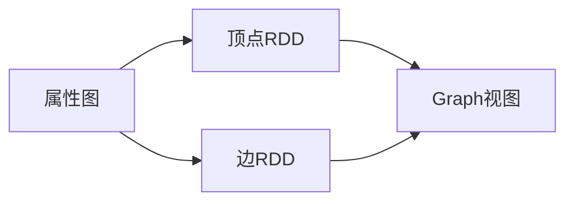

# 手把手教你搭建GraphX开发环境

## 1.背景介绍

### 1.1 什么是GraphX?

GraphX是Apache Spark中用于图形数据处理的API和库。它提供了一种高效、可扩展的方式来执行图形并行计算。GraphX扩展了Spark的RDD(Resilient Distributed Dataset)抽象,引入了一种新的分布式数据结构:Resilient Distributed Property Graph(弹性分布式属性图)。

### 1.2 GraphX的应用场景

GraphX可以应用于各种涉及图形数据处理的领域,例如:

- 社交网络分析
- 网页链接分析
- 欺诈检测
- 计算机网络拓扑分析
- 生物信息学中的蛋白质互作分析

### 1.3 GraphX的优势

相比于传统的图形处理系统,GraphX具有以下优势:

- 高度容错和可伸缩性
- 内存和磁盘数据存储的统一视图
- 基于数据并行模型的高效图形运算
- 与Spark生态系统的无缝集成

## 2.核心概念与联系

### 2.1 属性图(Property Graph)

GraphX中的核心数据结构是属性图,它由以下三个组件组成:

- 顶点(Vertex):代表图中的节点实体
- 边(Edge):连接两个顶点的关系
- 属性(Properties):与顶点或边相关联的元数据

### 2.2 顶点RDD和边RDD

属性图由两个RDD组成:顶点RDD和边RDD。

- 顶点RDD: `RDD[(VertexId, VD)]`
  - VertexId: 顶点的唯一标识符
  - VD: 与顶点关联的属性数据
- 边RDD: `RDD[Edge[ED]]`
  - Edge: 表示源顶点和目标顶点之间的连接
  - ED: 与边关联的属性数据

### 2.3 图视图(Graph View)

GraphX提供了一个Graph视图,作为对底层顶点RDD和边RDD的抽象。它支持各种图形运算和转换操作。



## 3.核心算法原理具体操作步骤

### 3.1 创建属性图

可以通过以下两种方式创建属性图:

1. **从集合创建**

```scala
import org.apache.spark.graphx._

// 创建顶点集合
val vertexArray = Array(
  (1L, ("Alice", 28)),
  (2L, ("Bob", 27)),
  (3L, ("Charlie", 65)),
  (4L, ("David", 42))
)
val vertexRDD = sc.parallelize(vertexArray)

// 创建边集合
val edgeArray = Array(
  Edge(1L, 2L, 7),
  Edge(2L, 3L, 5),
  Edge(3L, 4L, 9),
  Edge(1L, 4L, 3)
)
val edgeRDD = sc.parallelize(edgeArray)

// 创建属性图
val graph = Graph(vertexRDD, edgeRDD)
```

2. **从文件创建**

```scala
// 从文件创建顶点RDD
val vertexRDD = sc.textFile("vertices.txt").map { line =>
  val fields = line.split(",")
  (fields(0).trim.toLong, fields(1).trim)
}

// 从文件创建边RDD
val edgeRDD = sc.textFile("edges.txt").map { line =>
  val fields = line.split(",")
  Edge(fields(0).trim.toLong, fields(1).trim.toLong, fields(2).trim.toDouble)
}

// 创建属性图
val graph = Graph(vertexRDD, edgeRDD)
```

### 3.2 图形运算

GraphX提供了丰富的图形运算和转换操作,例如:

- **图形聚合操作**: `aggregateMessages`、`ops.sum`、`ops.min`等
- **图形转换操作**: `subgraph`、`mapVertices`、`mapEdges`等
- **图形属性操作**: `outerJoinVertices`、`innerJoinVertices`等
- **图形统计操作**: `degrees`、`triangleCount`、`pageRank`等

以PageRank算法为例:

```scala
val pageRanks = graph.staticPageRank(0.001).vertices

// 查看结果
pageRanks.foreach(println)
```

### 3.3 图形持久化

可以将GraphX的图形数据持久化到文件或其他存储系统中,以便后续使用。

```scala
// 保存顶点RDD到文件
vertexRDD.saveAsTextFile("output/vertices")

// 保存边RDD到文件
edgeRDD.saveAsTextFile("output/edges")
```

## 4.数学模型和公式详细讲解举例说明

### 4.1 PageRank算法

PageRank是一种用于计算网页重要性的算法,它基于网页之间的链接结构进行评分。PageRank算法的核心思想是:一个网页的重要性不仅取决于它被多少其他网页链接,还取决于链接它的网页的重要性。

PageRank算法的数学模型如下:

$$PR(u) = \frac{1-d}{N} + d \sum_{v \in Bu} \frac{PR(v)}{L(v)}$$

其中:

- $PR(u)$表示网页u的PageRank值
- $Bu$是所有链接到网页u的网页集合
- $L(v)$是网页v的出链接数量
- $d$是一个阻尼系数,通常取值0.85
- $N$是网页总数

PageRank算法通过迭代计算直至收敛,得到每个网页的最终PageRank值。

### 4.2 三角形计数

三角形计数是图论中一种常见的操作,用于计算图中存在的三角形数量。在社交网络分析中,三角形计数可以用于发现紧密联系的小群体。

三角形计数的数学模型如下:

设$G=(V,E)$是一个无向图,其中$V$是顶点集合,$E$是边集合。

对于每个顶点$v \in V$,定义$\Gamma(v)$为与$v$相邻的顶点集合。

则图$G$中的三角形数量$\Delta$可以计算为:

$$\Delta = \frac{1}{3}\sum_{v \in V} |\{(u,w) \in E | u,w \in \Gamma(v)\}|$$

直观地说,对于每个顶点$v$,我们计算$\Gamma(v)$中相互连接的边的数量,然后除以3(因为每个三角形会被三次重复计算)。

GraphX提供了`TriangleCount`操作符来高效计算图中的三角形数量。

## 5.项目实践:代码实例和详细解释说明

### 5.1 创建Spark会话

```scala
import org.apache.spark.sql.SparkSession

val spark = SparkSession.builder()
  .appName("GraphXExample")
  .master("local[*]")
  .getOrCreate()

val sc = spark.sparkContext
```

### 5.2 创建属性图

```scala
import org.apache.spark.graphx._

// 创建顶点RDD
val vertexArray = Array(
  (1L, ("Alice", 28)),
  (2L, ("Bob", 27)),
  (3L, ("Charlie", 65)),
  (4L, ("David", 42))
)
val vertexRDD = sc.parallelize(vertexArray)

// 创建边RDD
val edgeArray = Array(
  Edge(1L, 2L, 7),
  Edge(2L, 3L, 5),
  Edge(3L, 4L, 9),
  Edge(1L, 4L, 3)
)
val edgeRDD = sc.parallelize(edgeArray)

// 创建属性图
val graph = Graph(vertexRDD, edgeRDD)
```

### 5.3 图形运算示例

#### 5.3.1 PageRank

```scala
// 计算PageRank
val pageRanks = graph.staticPageRank(0.001).vertices

// 查看结果
pageRanks.foreach(println)
```

#### 5.3.2 三角形计数

```scala
// 计算三角形数量
val triangleCount = graph.triangleCount().vertices

// 查看结果
triangleCount.foreach(println)
```

#### 5.3.3 连通分量

```scala
// 计算连通分量
val connectedComponents = graph.connectedComponents().vertices

// 查看结果
connectedComponents.foreach(println)
```

### 5.4 图形持久化

```scala
// 保存顶点RDD到文件
vertexRDD.saveAsTextFile("output/vertices")

// 保存边RDD到文件
edgeRDD.saveAsTextFile("output/edges")
```

## 6.实际应用场景

GraphX可以应用于各种涉及图形数据处理的领域,以下是一些典型的应用场景:

### 6.1 社交网络分析

在社交网络中,用户可以被表示为顶点,用户之间的关系(如好友关系)可以表示为边。GraphX可以用于分析社交网络中的各种属性,如:

- 中心性分析:识别网络中的影响力用户
- 社区发现:发现网络中的紧密联系的用户群体
- 链接预测:预测未来可能形成的新链接

### 6.2 网页链接分析

互联网可以被视为一个巨大的网页链接图。GraphX可以用于分析网页链接结构,以改进搜索引擎的排名算法、检测网页垃圾邮件等。

### 6.3 欺诈检测

在金融、电信等领域,欺诈行为通常表现为异常的交易模式或通信模式。将交易或通信数据建模为图形,并使用GraphX进行异常检测,可以有效发现潜在的欺诈行为。

### 6.4 计算机网络拓扑分析

计算机网络可以被表示为一个图形,其中路由器、交换机等设备为顶点,链路为边。GraphX可以用于分析网络拓扑结构、识别关键节点、优化网络流量等。

### 6.5 生物信息学

在生物信息学领域,蛋白质互作网络、基因调控网络等可以被建模为图形。GraphX可以用于分析这些生物网络的结构和功能,从而揭示潜在的生物学机理。

## 7.工具和资源推荐

### 7.1 Apache Spark

Apache Spark是一个开源的大数据处理框架,GraphX是Spark的一个核心组件。学习和使用GraphX需要对Spark有一定的了解。以下是一些有用的Spark学习资源:

- Apache Spark官方文档: https://spark.apache.org/docs/latest/
- Spark编程指南(Programming Guides): https://spark.apache.org/docs/latest/programming-guides.html
- Spark视频教程: https://www.edureka.co/apache-spark-scala-certification-training

### 7.2 Scala

GraphX是基于Scala语言开发的,因此学习Scala对于使用GraphX非常有帮助。以下是一些学习Scala的资源:

- Scala官方网站: https://www.scala-lang.org/
- Scala编程语言导论: https://www.artima.com/pins1ed/
- Scala视频教程: https://www.coursera.org/learn/progfun1

### 7.3 GraphX文档和示例

Apache Spark官方网站提供了GraphX的文档和示例代码,是学习GraphX的重要资源:

- GraphX编程指南: https://spark.apache.org/docs/latest/graphx-programming-guide.html
- GraphX示例代码: https://github.com/apache/spark/tree/master/examples/src/main/scala/org/apache/spark/examples/graphx

### 7.4 图形数据集

为了测试和实践GraphX,需要一些真实的图形数据集。以下是一些常用的图形数据集:

- Stanford大型网络数据集集合: https://snap.stanford.edu/data/
- AWS公共数据集: https://registry.opendata.aws/
- Google Web图形: https://snap.stanford.edu/data/web-Google.html

### 7.5 图形可视化工具

在图形分析过程中,可视化工具可以帮助更好地理解和呈现数据。以下是一些流行的图形可视化工具:

- Gephi: https://gephi.org/
- Cytoscape: https://cytoscape.org/
- D3.js: https://d3js.org/

## 8.总结:未来发展趋势与挑战

### 8.1 图形计算的未来趋势

随着大数据时代的到来,图形计算在各个领域的应用将越来越广泛。未来,图形计算可能会呈现以下趋势:

- 实时图形计算:支持对动态变化的图形数据进行实时分析和更新。
- 图形深度学习:将深度学习技术应用于图形数据,解决更加复杂的问题。
- 图形可视化:更加直观、交互式的图形可视化工具,帮助理解和呈现分析结果。

### 8.2 图形计算的挑战

尽管图形计算有着广阔的应用前景,但它也面临一些挑战:

- 大规模图形处理:如何高效地处理海量的图形数据