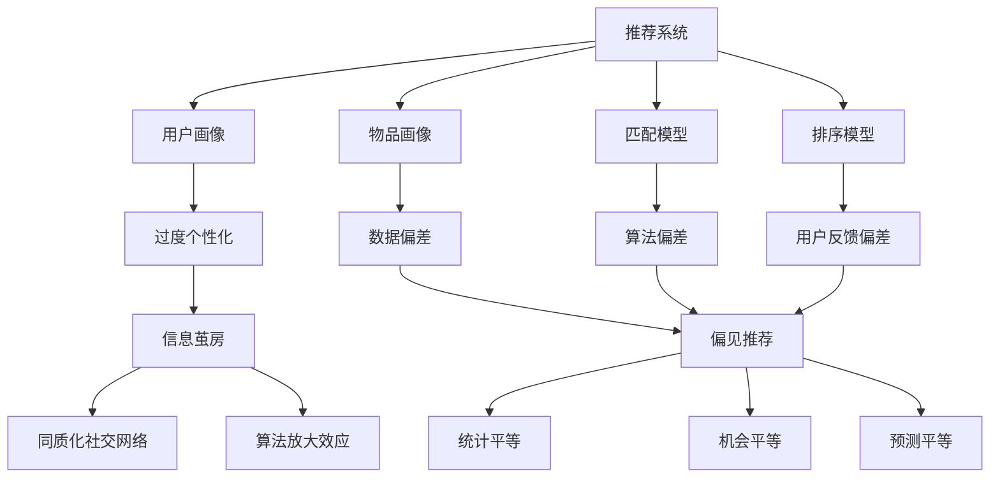

# 推荐系统中的公平性：避免信息茧房和偏见推荐

## 1. 背景介绍
### 1.1 推荐系统的普及与影响
推荐系统已经广泛应用于各个领域,如电商、社交媒体、新闻资讯等。它通过分析用户的历史行为和偏好,为用户推荐感兴趣的内容或商品,提高用户体验和满意度。然而,推荐系统也可能带来一些负面影响,如信息茧房和偏见推荐。

### 1.2 信息茧房与偏见推荐的定义
- 信息茧房(Filter Bubble):由于推荐系统过度个性化,用户长期处于自己的信息圈,接触不到多元化的观点和内容,形成认知偏差。
- 偏见推荐(Biased Recommendation):推荐系统可能存在数据偏差、算法偏差等,导致推荐结果不公平,如性别歧视、种族歧视等。

### 1.3 公平性的重要性
推荐系统中的公平性至关重要,它关系到用户的知情权、平等权,以及社会的多元化发展。我们需要研究如何在保证推荐效果的同时,兼顾推荐的公平性,避免信息茧房和偏见推荐的负面影响。

## 2. 核心概念与联系
### 2.1 推荐系统的基本架构
推荐系统通常由以下几个模块组成:
- 用户画像:通过收集用户的历史行为、偏好等数据,构建用户特征向量。
- 物品画像:对推荐的物品(如商品、文章等)进行特征提取和表示。
- 匹配模型:通过机器学习算法,学习用户-物品的匹配关系,生成推荐列表。
- 排序模型:对推荐列表进行排序,将最相关的物品排在前面。

### 2.2 信息茧房的形成机制
- 过度个性化:推荐系统为了提高用户满意度,会根据用户的历史行为不断强化其已有偏好,导致推荐内容趋于同质化。
- 同质化社交网络:用户更倾向于与志趣相投的人交流,形成同质化的社交圈,加剧了信息茧房效应。
- 算法放大效应:推荐算法会放大用户原有的偏好,使其更加极端化。

### 2.3 偏见推荐的来源
- 数据偏差:训练数据中可能存在人为偏见,如性别、种族等方面的不平衡。
- 算法偏差:模型优化目标的选择、特征工程等环节,都可能引入算法偏差。
- 用户反馈偏差:用户对推荐结果的反馈(如点击、评分)也可能存在偏差。

### 2.4 公平性评估指标
- 统计平等(Statistical Parity):不同群体的推荐比例应该相同。
- 机会平等(Equal Opportunity):对于同等条件的个体,推荐的真阳性率应该相同。
- 预测平等(Predictive Equality):对于同等条件的个体,推荐的假阳性率应该相同。

下图展示了推荐系统中公平性问题的关键概念及其联系:



## 3. 核心算法原理具体操作步骤
### 3.1 数据去偏
- 数据采样:对不同群体的数据进行平衡采样,确保数据的代表性。
- 数据增强:通过数据增强技术,生成少数群体的合成数据,缓解数据不平衡问题。
- 特征选择:去除可能引入偏见的敏感特征,如性别、种族等。

### 3.2 公平性约束优化
在推荐模型的优化目标中引入公平性约束,使模型在提高推荐效果的同时,兼顾不同群体的公平性。以下是一些常见的公平性约束优化方法:

- 正则化方法:在损失函数中加入公平性正则项,惩罚模型的不公平性。例如,可以使用统计平等差异(Statistical Parity Difference, SPD)作为正则项:

$$
L = L_{rec} + \lambda \cdot SPD
$$

其中,$L_{rec}$为推荐任务的损失函数,$\lambda$为平衡因子,SPD为统计平等差异。

- 对抗学习方法:引入对抗网络,使推荐模型生成的结果在不同群体上的分布尽可能相似。例如,可以使用Wasserstein距离作为对抗损失:

$$
L = L_{rec} + \lambda \cdot W(P_1, P_2)
$$

其中,$P_1$和$P_2$分别为不同群体的推荐结果分布,W为Wasserstein距离。

- 多任务学习方法:将公平性指标作为另一个任务,与推荐任务联合优化。例如,可以将统计平等作为另一个二分类任务:

$$
L = L_{rec} + \lambda \cdot L_{fair}
$$

其中,$L_{fair}$为统计平等任务的损失函数。

### 3.3 后处理方法
在推荐结果生成后,通过后处理步骤提高推荐的公平性。常见的后处理方法包括:

- 重排序:根据公平性指标对推荐列表进行重新排序,使其满足公平性要求。
- 重新校准:对不同群体的推荐结果进行校准,使其在公平性指标上尽可能一致。

## 4. 数学模型和公式详细讲解举例说明
### 4.1 统计平等差异(SPD)
SPD衡量了不同群体的推荐比例之差,其公式为:

$$
SPD = |P(R=1|A=0) - P(R=1|A=1)|
$$

其中,R表示推荐结果(1为推荐,0为不推荐),A表示敏感属性(如性别,0为男性,1为女性)。SPD的值越接近于0,表示推荐结果在不同群体上的分布越均衡,公平性越高。

举例说明:假设在一个电影推荐系统中,男性用户的推荐比例为60%,女性用户的推荐比例为40%,则SPD为:

$$
SPD = |60% - 40%| = 20%
$$

这表明该推荐系统存在性别偏见,需要进行公平性优化。

### 4.2 Wasserstein距离
Wasserstein距离是衡量两个概率分布之间差异的度量,常用于对抗学习中。其公式为:

$$
W(P_1, P_2) = \inf_{\gamma \in \Gamma(P_1, P_2)} \mathbb{E}_{(x,y) \sim \gamma}[||x-y||]
$$

其中,$\Gamma(P_1, P_2)$表示$P_1$和$P_2$的所有联合分布,$\mathbb{E}$表示期望。直观上,Wasserstein距离可以理解为将一个分布转化为另一个分布所需的最小代价。

在公平性优化中,我们希望不同群体的推荐结果分布尽可能相似,即Wasserstein距离尽可能小。通过引入Wasserstein距离作为对抗损失,可以促使模型生成更加公平的推荐结果。

## 5. 项目实践：代码实例和详细解释说明
下面以一个简单的电影推荐系统为例,演示如何在PyTorch中实现公平性约束优化。

```python
import torch
import torch.nn as nn
import torch.optim as optim

# 定义推荐模型
class RecModel(nn.Module):
    def __init__(self, num_users, num_items, embedding_dim):
        super(RecModel, self).__init__()
        self.user_embedding = nn.Embedding(num_users, embedding_dim)
        self.item_embedding = nn.Embedding(num_items, embedding_dim)
        self.fc = nn.Linear(embedding_dim*2, 1)

    def forward(self, user, item):
        user_emb = self.user_embedding(user)
        item_emb = self.item_embedding(item)
        concat = torch.cat([user_emb, item_emb], dim=1)
        pred = self.fc(concat)
        return pred.squeeze()

# 定义公平性损失
def fairness_loss(pred, sensitive_attr):
    male_pred = pred[sensitive_attr==0]
    female_pred = pred[sensitive_attr==1]
    spd = torch.abs(male_pred.mean() - female_pred.mean())
    return spd

# 训练模型
def train(model, data_loader, optimizer, criterion, sensitive_attr, lambda_fair):
    model.train()
    for user, item, label in data_loader:
        optimizer.zero_grad()
        pred = model(user, item)
        rec_loss = criterion(pred, label)
        fair_loss = fairness_loss(pred, sensitive_attr)
        loss = rec_loss + lambda_fair * fair_loss
        loss.backward()
        optimizer.step()

# 初始化模型和优化器
model = RecModel(num_users, num_items, embedding_dim)
optimizer = optim.Adam(model.parameters(), lr=0.001)
criterion = nn.BCEWithLogitsLoss()

# 训练模型
for epoch in range(num_epochs):
    train(model, data_loader, optimizer, criterion, sensitive_attr, lambda_fair)
```

在上述代码中,我们定义了一个简单的推荐模型`RecModel`,使用用户和物品的嵌入向量进行特征表示,并通过全连接层生成推荐预测分数。

在训练过程中,我们定义了公平性损失函数`fairness_loss`,使用统计平等差异(SPD)来衡量不同性别群体的推荐比例差异。在总损失函数中,我们将推荐任务损失和公平性损失进行加权求和,通过调节`lambda_fair`参数来平衡推荐效果和公平性。

通过引入公平性损失,模型在优化推荐效果的同时,也会尽量缩小不同群体之间的推荐比例差异,生成更加公平的推荐结果。

## 6. 实际应用场景
推荐系统中的公平性问题在许多实际应用场景中都有重要意义,例如:

- 求职平台:避免推荐算法基于性别、种族等因素产生歧视,为不同群体提供平等的就业机会。
- 新闻推荐:确保用户接收到多元化的新闻资讯,避免信息茧房效应,促进社会的理性讨论。
- 教育资源推荐:为不同背景的学生提供公平的教育资源,缩小数字鸿沟,促进教育公平。
- 金融服务推荐:避免算法偏见导致的信贷歧视,为不同群体提供平等的金融服务。

## 7. 工具和资源推荐
以下是一些用于推荐系统公平性研究的常用工具和资源:

- AI Fairness 360:IBM开源的工具包,提供了多种公平性度量和算法。
- Fairlearn:Microsoft开源的Python包,用于评估和改善机器学习模型的公平性。
- FairML:一个用于研究机器学习公平性的Python工具包。
- Amazon SageMaker Clarify:亚马逊云服务提供的工具,用于检测和缓解机器学习模型中的偏见。
- Google What-If Tool:谷歌开源的交互式工具,用于探索机器学习模型的公平性和可解释性。

## 8. 总结：未来发展趋势与挑战
推荐系统公平性问题的研究还处于起步阶段,未来仍有许多发展机遇和挑战:

- 个性化与公平性的平衡:如何在保证推荐效果的同时,兼顾推荐结果的公平性,是一个需要不断探索的问题。
- 公平性评估标准的完善:现有的公平性评估指标仍有局限性,未来需要研究更加全面、细粒度的评估体系。
- 公平性与其他目标的权衡:推荐系统还需要考虑多样性、新颖性等其他目标,如何权衡这些目标与公平性之间的关系,是未来的研究方向。
- 人文社科知识的融合:推荐系统的公平性问题涉及伦理学、社会学等多个学科,未来需要加强跨学科合作,融合人文社科知识,全面理解和解决这一问题。

## 9.