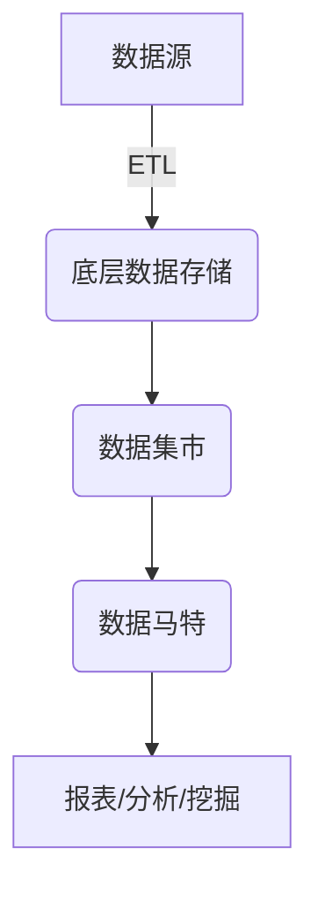
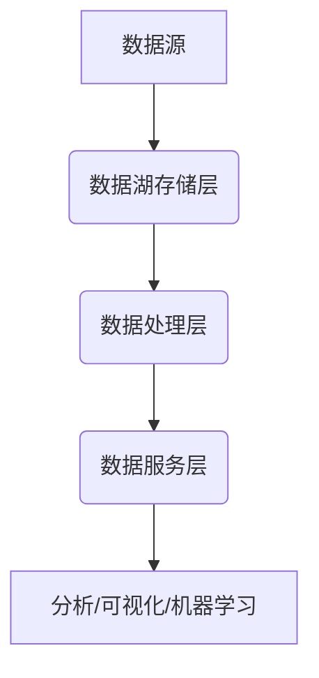
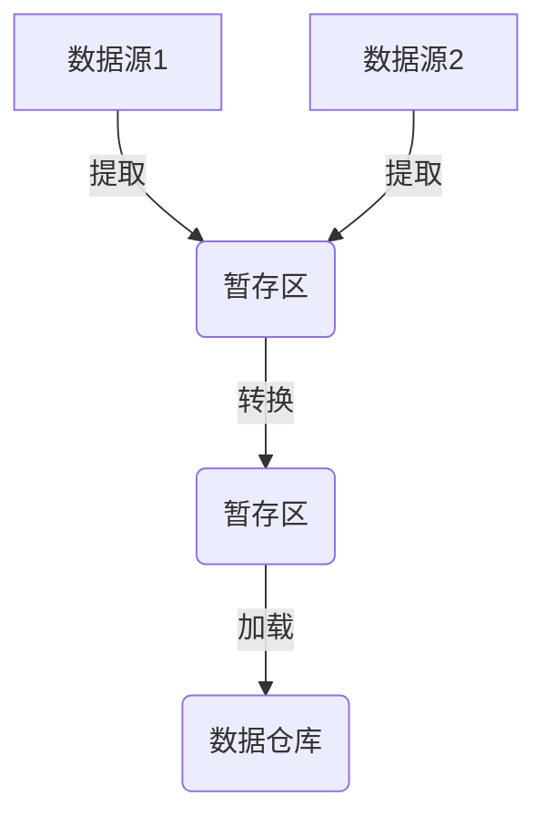
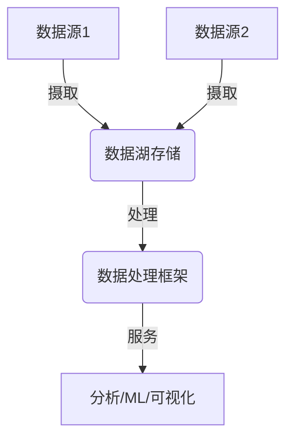

# 数据仓库与数据湖原理与代码实战案例讲解

## 1. 背景介绍

### 1.1 数据的重要性

在当今的数字时代,数据被视为新的"燃料",推动着各行各业的创新和发展。无论是电子商务、金融服务、制造业还是医疗保健,海量的数据不断产生和累积。有效地管理和利用这些数据对于组织的成功至关重要。

### 1.2 数据管理挑战

随着数据量的快速增长和多样化,传统的数据管理系统面临着诸多挑战:

- 数据存储和处理能力有限
- 数据格式多样,难以集成
- 数据质量和一致性问题
- 数据安全和隐私保护

### 1.3 数据仓库和数据湖的兴起

为了应对这些挑战,数据仓库和数据湖作为两种主要的数据管理解决方案应运而生。它们提供了高效的数据存储、处理和分析能力,帮助组织从海量数据中提取洞见和价值。

## 2. 核心概念与联系

### 2.1 数据仓库

数据仓库(Data Warehouse)是一种面向主题的、集成的、非volatile的、历史性的数据集合,用于支持管理决策过程。它通过从多个异构数据源提取、转换和加载(ETL)数据,构建一个统一的数据存储库。

#### 2.1.1 数据仓库的特点

- 面向主题(Subject-Oriented)
- 集成(Integrated)
- 非volatile(Non-Volatile)
- 历史性(Time-Variant)

#### 2.1.2 数据仓库架构

数据仓库通常采用三层架构:

1. **底层(底层数据存储)**
2. **中层(数据集市)**
3. **上层(数据马特)**



### 2.2 数据湖

数据湖(Data Lake)是一种存储各种结构化、半结构化和非结构化数据的集中存储库。它允许组织以原始格式存储数据,而无需事先对其进行结构化。数据湖提供了一种灵活、可扩展的方式来存储和处理大数据。

#### 2.2.1 数据湖的特点

- 存储各种数据格式
- schema-on-read
- 低成本存储
- 高度可扩展性

#### 2.2.2 数据湖架构

数据湖通常采用以下架构:

1. **数据源层**
2. **数据湖存储层**
3. **数据处理层**
4. **数据服务层**



### 2.3 数据仓库与数据湖的关系

数据仓库和数据湖并非互斥的概念,它们可以协同工作,形成一个综合的数据管理解决方案。

- 数据湖可以作为数据仓库的数据源
- 数据仓库可以从数据湖中提取、转换和加载数据
- 数据湖可以存储数据仓库的历史数据和原始数据

## 3. 核心算法原理具体操作步骤

### 3.1 数据仓库的ETL过程

ETL(Extract, Transform, Load)是数据仓库构建的核心过程,包括以下步骤:

#### 3.1.1 提取(Extract)

从各种异构数据源(如关系数据库、文件、NoSQL数据库等)提取所需数据。

#### 3.1.2 转换(Transform)

对提取的数据进行清洗、转换、合并等操作,以满足数据仓库的需求。常见的转换操作包括:

- 数据类型转换
- 数据格式转换
- 数据清洗(去重、填充缺失值等)
- 数据合并
- 数据加密/脱敏

#### 3.1.3 加载(Load)

将转换后的数据加载到数据仓库的目标存储区域(如关系数据库、Hadoop等)。



### 3.2 数据湖的数据处理流程

数据湖的数据处理流程通常包括以下步骤:

#### 3.2.1 数据摄取(Data Ingestion)

从各种数据源(如日志文件、传感器数据、社交媒体数据等)收集原始数据,并存储到数据湖中。

#### 3.2.2 数据存储(Data Storage)

数据湖通常使用分布式文件系统(如HDFS、对象存储等)存储原始数据,支持各种格式(如CSV、JSON、Parquet等)。

#### 3.2.3 数据处理(Data Processing)

根据需求,使用大数据处理框架(如Apache Spark、Apache Flink等)对数据进行批处理或流处理。常见的处理操作包括:

- 数据转换
- 数据清洗
- 数据聚合
- 机器学习模型训练

#### 3.2.4 数据服务(Data Service)

将处理后的数据提供给下游应用程序,如数据分析、机器学习、可视化等。



## 4. 数学模型和公式详细讲解举例说明

在数据仓库和数据湖中,常见的数学模型和公式包括:

### 4.1 数据压缩算法

为了节省存储空间和提高数据传输效率,常使用各种数据压缩算法。常见的压缩算法包括:

#### 4.1.1 熵编码

熵编码是一种无损压缩算法,它根据数据的统计特性对数据进行编码。常见的熵编码算法包括:

- 霍夫曼编码(Huffman Coding)
- 算术编码(Arithmetic Coding)

**霍夫曼编码**

霍夫曼编码是一种基于前缀码的熵编码算法。它将出现频率高的符号编码为较短的码字,出现频率低的符号编码为较长的码字,从而达到压缩的目的。

设$X$为待编码的符号集合,符号$x_i$的出现概率为$p(x_i)$,则霍夫曼编码的平均码长为:

$$\bar{l} = \sum_{i} p(x_i) l(x_i)$$

其中$l(x_i)$为符号$x_i$的码长。

#### 4.1.2 字典编码

字典编码是另一种常见的无损压缩算法,它将重复出现的数据模式替换为较短的码字。常见的字典编码算法包括:

- LZW(Lempel-Ziv-Welch)
- DEFLATE(组合了LZ77和霍夫曼编码)

**LZW算法**

LZW算法是一种自适应字典编码算法。它维护一个字典,初始时只包含单个字符。在编码过程中,如果当前字符串已经存在于字典中,则输出其码字;否则将其加入字典,并输出前缀字符串的码字和单个字符。

设$D$为字典大小,则LZW编码的最坏情况下的压缩率为:

$$\text{Compression Ratio} = \frac{n \log_2 D}{n \log_2 |A| + D \log_2 D}$$

其中$n$为输入数据长度,$|A|$为字符集大小。

### 4.2 数据分区算法

在分布式系统中,常需要将数据分区以实现并行处理。常见的数据分区算法包括:

#### 4.2.1 哈希分区

哈希分区根据数据的哈希值将其分配到不同的分区中。它通常用于实现数据的均匀分布,从而提高并行处理的效率。

设$N$为分区数量,$h(k)$为键$k$的哈希函数,则哈希分区的分区编号为:

$$\text{Partition ID} = h(k) \bmod N$$

#### 4.2.2 范围分区

范围分区根据数据的值范围将其分配到不同的分区中。它通常用于处理有序数据,例如时间序列数据。

设$[a_i, b_i)$为第$i$个分区的范围,则范围分区的分区编号为:

$$\text{Partition ID} = \begin{cases}
0, & \text{if } k < a_0\
i, & \text{if } a_i \leq k < b_i\
N-1, & \text{if } k \geq b_{N-1}
\end{cases}$$

## 5. 项目实践: 代码实例和详细解释说明

### 5.1 数据仓库构建示例

以下是使用Apache Airflow构建数据仓库的示例代码:

```python
from airflow import DAG
from airflow.operators.python_operator import PythonOperator
from datetime import datetime

# 定义ETL函数
def extract():
    # 从数据源提取数据
    pass

def transform(data):
    # 对数据进行转换
    pass

def load(transformed_data):
    # 加载数据到数据仓库
    pass

# 定义DAG
with DAG('data_warehouse_etl', start_date=datetime(2023, 1, 1), schedule_interval=None) as dag:
    extract_task = PythonOperator(
        task_id='extract',
        python_callable=extract
    )

    transform_task = PythonOperator(
        task_id='transform',
        python_callable=transform
    )

    load_task = PythonOperator(
        task_id='load',
        python_callable=load
    )

    extract_task >> transform_task >> load_task
```

在这个示例中,我们使用Apache Airflow定义了一个ETL工作流,包括提取、转换和加载三个任务。每个任务由一个Python函数实现,函数的具体实现需要根据实际情况进行编写。

### 5.2 数据湖构建示例

以下是使用Apache Spark构建数据湖的示例代码:

```python
from pyspark.sql import SparkSession

# 创建SparkSession
spark = SparkSession.builder.appName("DataLake").getOrCreate()

# 读取数据
data = spark.read.json("path/to/data/*.json")

# 数据转换和清洗
cleaned_data = data.dropDuplicates().na.fill(0)

# 数据处理和聚合
aggregated_data = cleaned_data.groupBy("category").sum("value")

# 将结果保存到数据湖
aggregated_data.write.parquet("path/to/datalake/output")
```

在这个示例中,我们使用Apache Spark读取JSON格式的数据,对数据进行转换和清洗(去重和填充缺失值),然后进行聚合计算。最后,将聚合后的数据以Parquet格式保存到数据湖中。

## 6. 实际应用场景

数据仓库和数据湖在各个行业都有广泛的应用场景,例如:

### 6.1 电子商务

- 构建数据仓库,集中存储客户、订单、产品等数据,支持业务智能和分析
- 构建数据湖,存储网站日志、社交媒体数据等,用于个性化推荐和用户行为分析

### 6.2 金融服务

- 构建数据仓库,集中存储交易、账户、风险等数据,支持风险管理和合规报告
- 构建数据湖,存储金融新闻、社交媒体数据等,用于实时交易决策和市场情绪分析

### 6.3 制造业

- 构建数据仓库,集中存储生产、库存、供应链等数据,支持运营优化和预测性维护
- 构建数据湖,存储传感器数据、视频数据等,用于质量控制和设备监控

### 6.4 医疗保健

- 构建数据仓库,集中存储患者记录、医疗成像等数据,支持临床决策和疾病研究
- 构建数据湖,存储基因组数据、可穿戴设备数据等,用于个性化医疗和健康管理

## 7. 工具和资源推荐

### 7.1 数据仓库工具

- **Hadoop** : 开源的大数据处理框架,提供分布式存储(HDFS)和计算(MapReduce)能力
- **Apache Hive** : 基于Hadoop的数据仓库工具,支持SQL查询
- **Apache Impala** : 实