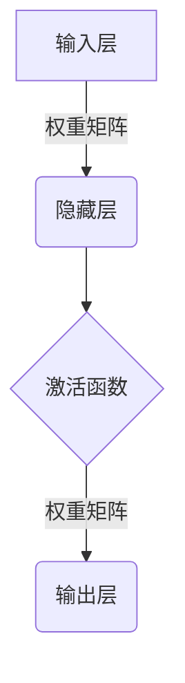
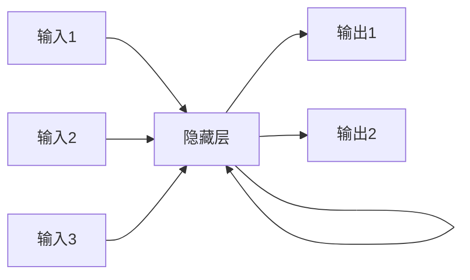

# 深度学习 原理与代码实例讲解

## 1. 背景介绍

### 1.1 什么是深度学习?
深度学习(Deep Learning)是机器学习的一个新兴热门领域,是一种基于对数据进行表示学习的算法。它模仿人脑神经网络结构和机制,通过构建神经网络模型对输入数据进行特征提取和转换,捕捉数据的深层次抽象特征,从而实现对复杂问题的分析和处理。

深度学习突破了传统机器学习算法依赖人工设计特征的瓶颈,能够自主学习数据内在的特征表示,在计算机视觉、自然语言处理、语音识别等领域取得了突破性进展。

### 1.2 深度学习发展历程
深度学习的理论基础可以追溯到20世纪80年代提出的神经网络模型,但由于当时计算能力和训练数据的限制,神经网络模型一直未能得到有效解决。21世纪初,由于大数据时代的到来、GPU并行计算能力的飞速提升,为深度神经网络模型的训练提供了有力支持,使得深度学习算法在各个领域逐步展现出强大的能力。

2006年,加拿大学者兼小说家Hinton及其学生提出了深度信念网络(Deep Belief Network),并将反向传播算法成功应用于深度神经网络的训练,开启了深度学习的新纪元。2012年,Hinton的学生AlexKrizhevsky在ImageNet大赛中,利用深度卷积神经网络(CNN)大幅度超越传统计算机视觉方法,从此深度学习在计算机视觉领域占据主导地位。

## 2. 核心概念与联系

### 2.1 神经网络模型
神经网络是深度学习的核心模型,它的基本思想是模仿生物神经元的工作原理,构建由大量互连的节点组成的网络结构。每个节点接收来自其他节点的输入信号,经过加权求和、激活函数等运算后,产生输出信号传递给下一层节点。

神经网络通过对大量训练数据的学习,自动获取数据的内在特征表示,从而对新的输入数据进行分类或预测。常见的神经网络结构包括前馈神经网络、卷积神经网络、递归神经网络等。



### 2.2 深度学习与传统机器学习的区别
传统的机器学习算法需要人工设计特征,而深度学习则能够自动从原始数据中学习数据的特征表示。深度学习模型通过构建深层次的神经网络,能够从低层次的原始特征映射到高层次的抽象特征,从而更好地表示复杂数据的内在结构。

此外,深度学习模型具有端到端的优势,能够直接从原始数据中学习到最终的目标,而无需人工分解任务。这种自动化的特征学习能力使得深度学习能够在许多领域展现出超人的性能表现。

## 3. 核心算法原理具体操作步骤

### 3.1 前馈神经网络
前馈神经网络(Feedforward Neural Network)是深度学习中最基础和常见的网络结构,信息从输入层通过隐藏层单向传递到输出层,每层节点之间是全连接的。前馈神经网络的训练过程主要包括以下步骤:

1. **网络初始化**: 对网络的权重矩阵和偏置项进行随机初始化。
2. **前向传播**: 输入数据通过网络层层传递,每个节点根据上层输入和权重进行加权求和,再通过激活函数得到输出。
3. **计算损失函数**: 将输出层的输出与真实标签计算损失函数,如均方误差、交叉熵等。
4. **反向传播**: 根据损失函数对网络的权重参数进行梯度计算,利用优化算法(如梯度下降)更新网络权重。
5. **迭代训练**: 重复上述过程,不断优化网络权重,直至损失函数收敛或达到预期精度。


### 3.2 卷积神经网络
卷积神经网络(Convolutional Neural Network, CNN)是一种专门用于处理网格结构数据(如图像、序列等)的神经网络,具有局部连接、权重共享等特点,能够有效地捕捉数据的局部模式和空间/时间相关性。CNN的核心操作包括卷积(Convolution)和池化(Pooling)。

1. **卷积层**: 通过滑动卷积核在输入数据上进行卷积操作,提取局部特征。
2. **池化层**: 对卷积层的输出进行下采样,降低数据维度,提高模型的泛化能力。
3. **全连接层**: 将卷积层和池化层的高级特征映射到样本标记空间。


### 3.3 递归神经网络
递归神经网络(Recurrent Neural Network, RNN)是一种适用于处理序列数据(如文本、语音等)的神经网络模型。与前馈神经网络不同,RNN在隐藏层之间引入了循环连接,能够捕捉序列数据中的长期依赖关系。

1. **展开计算**: 将序列数据一个时间步一个时间步地输入到RNN中,每个时间步的隐藏状态都由当前输入和上一时间步的隐藏状态共同决定。
2. **反向传播训练**: 通过反向传播算法计算每个时间步的误差梯度,并沿着时间反向传播,更新网络权重。

长短期记忆网络(LSTM)是RNN的一种改进变体,通过引入门控机制来解决长期依赖问题,在自然语言处理等领域表现出色。



## 4. 数学模型和公式详细讲解举例说明

### 4.1 神经网络模型数学表示
神经网络模型的核心是通过权重矩阵和激活函数对输入数据进行特征映射和非线性变换。设输入向量为$\mathbf{x}$,权重矩阵为$\mathbf{W}$,偏置向量为$\mathbf{b}$,激活函数为$f(\cdot)$,则神经网络的前向传播过程可以表示为:

$$\mathbf{y} = f(\mathbf{W}\mathbf{x} + \mathbf{b})$$

其中$\mathbf{y}$为输出向量。对于多层神经网络,输出层的输入为上一隐藏层的输出,即:

$$\mathbf{y}^{(l)} = f(\mathbf{W}^{(l)}\mathbf{y}^{(l-1)} + \mathbf{b}^{(l)})$$

常用的激活函数包括Sigmoid函数、ReLU函数等,它们引入了非线性,使神经网络能够拟合复杂的非线性映射。

### 4.2 损失函数和优化
为了使神经网络能够学习到最优的权重参数,需要定义一个损失函数(Loss Function)来衡量模型的预测输出与真实标签之间的差异。常用的损失函数包括均方误差损失函数和交叉熵损失函数。

对于回归问题,均方误差损失函数定义为:

$$L(\mathbf{y}, \hat{\mathbf{y}}) = \frac{1}{2}\sum_{i=1}^{n}(y_i - \hat{y}_i)^2$$

其中$\mathbf{y}$为真实标签向量,$\hat{\mathbf{y}}$为模型预测输出向量。

对于分类问题,交叉熵损失函数定义为:

$$L(\mathbf{y}, \hat{\mathbf{y}}) = -\sum_{i=1}^{n}y_i\log(\hat{y}_i)$$

通过反向传播算法计算损失函数相对于权重的梯度,然后采用优化算法(如梯度下降)迭代更新网络权重,使损失函数最小化。

### 4.3 正则化
为了防止神经网络过拟合,常采用正则化(Regularization)技术,在损失函数中引入惩罚项,约束模型的复杂度。常用的正则化方法包括L1正则化(Lasso)和L2正则化(Ridge)。

L1正则化:

$$L_{reg} = L + \lambda\sum_{i,j}|w_{ij}|$$

L2正则化:

$$L_{reg} = L + \frac{\lambda}{2}\sum_{i,j}w_{ij}^2$$

其中$\lambda$为正则化系数,用于控制正则化强度。L1正则化倾向于产生稀疏权重,而L2正则化则倾向于使权重值较小。

## 5. 项目实践:代码实例和详细解释说明

以下是使用Python和TensorFlow框架实现一个简单的前馈神经网络进行手写数字识别的代码示例:

```python
import tensorflow as tf
from tensorflow.examples.tutorials.mnist import input_data

# 载入MNIST数据集
mnist = input_data.read_data_sets("MNIST_data/", one_hot=True)

# 定义占位符
x = tf.placeholder(tf.float32, [None, 784])  # 输入图像数据
y_ = tf.placeholder(tf.float32, [None, 10])  # 真实标签

# 定义神经网络模型
W1 = tf.Variable(tf.truncated_normal([784, 500], stddev=0.1))
b1 = tf.Variable(tf.constant(0.1, shape=[500]))
h1 = tf.nn.relu(tf.matmul(x, W1) + b1)

W2 = tf.Variable(tf.truncated_normal([500, 10], stddev=0.1))
b2 = tf.Variable(tf.constant(0.1, shape=[10]))
y = tf.nn.softmax(tf.matmul(h1, W2) + b2)

# 定义损失函数和优化器
cross_entropy = tf.reduce_mean(-tf.reduce_sum(y_ * tf.log(y), reduction_indices=[1]))
train_step = tf.train.GradientDescentOptimizer(0.5).minimize(cross_entropy)

# 训练模型
sess = tf.InteractiveSession()
tf.global_variables_initializer().run()

for i in range(1000):
    batch_xs, batch_ys = mnist.train.next_batch(100)
    sess.run(train_step, feed_dict={x: batch_xs, y_: batch_ys})

# 评估模型
correct_prediction = tf.equal(tf.argmax(y, 1), tf.argmax(y_, 1))
accuracy = tf.reduce_mean(tf.cast(correct_prediction, tf.float32))
print("Accuracy:", accuracy.eval({x: mnist.test.images, y_: mnist.test.labels}))
```

代码解释:

1. 首先导入MNIST手写数字数据集,每个图像大小为28x28像素,总共包含60,000个训练样本和10,000个测试样本。
2. 定义输入数据和标签的占位符,用于在训练时喂入数据。
3. 构建一个包含两个隐藏层的前馈神经网络模型,第一隐藏层有500个节点,使用ReLU激活函数;输出层使用Softmax函数输出10个类别的概率分布。
4. 定义交叉熵损失函数和梯度下降优化器,用于训练模型。
5. 在会话中初始化变量,并进行1000次迭代训练,每次使用100个样本的小批量数据。
6. 在测试集上评估模型的准确率。

通过这个简单的示例,你可以了解到如何使用TensorFlow构建和训练一个基本的神经网络模型。在实际应用中,你可以根据具体问题和数据,设计更加复杂和强大的深度学习模型。

## 6. 实际应用场景

深度学习在诸多领域展现出了卓越的性能,下面列举一些典型的应用场景:

### 6.1 计算机视觉
- **图像分类**: 利用卷积神经网络对图像进行分类,如识别图像中的物体