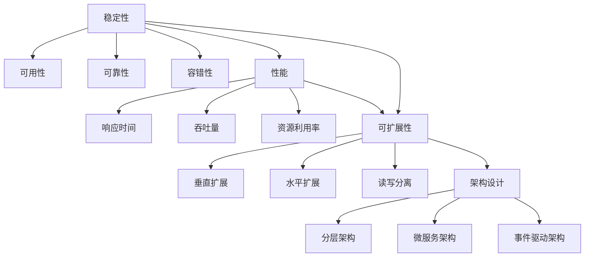

# 电商系统稳定性优化与重构：50篇深度技术博客

## 1. 背景介绍

随着电子商务的蓬勃发展,电商系统的稳定性和可扩展性面临着巨大的挑战。海量的用户访问、高并发的交易请求、不断增长的数据量,都对电商系统提出了更高的要求。如何保证电商系统7x24小时的稳定运行,如何应对业务高速增长带来的系统压力,如何在不中断业务的情况下对系统进行优化和重构,已经成为每一个电商公司技术团队必须思考和解决的问题。

本系列博客将深入探讨电商系统稳定性优化与重构的各个方面,分享业界最佳实践和技术方案,帮助技术人员更好地理解和掌握电商系统架构设计、性能优化、高可用保障等关键技术,从而构建一个高度稳定、高性能、可扩展的电商系统。

### 1.1 电商系统面临的挑战
#### 1.1.1 海量用户和高并发访问
#### 1.1.2 业务复杂度不断提升
#### 1.1.3 数据量爆炸式增长

### 1.2 稳定性优化与重构的意义
#### 1.2.1 保障系统7x24小时稳定运行
#### 1.2.2 提升系统性能和用户体验
#### 1.2.3 降低运维成本,提高开发效率

## 2. 核心概念与联系

要对电商系统进行稳定性优化和重构,首先需要理解一些核心概念,并明确它们之间的联系。

### 2.1 稳定性
#### 2.1.1 可用性
#### 2.1.2 可靠性
#### 2.1.3 容错性

### 2.2 性能
#### 2.2.1 响应时间
#### 2.2.2 吞吐量
#### 2.2.3 资源利用率

### 2.3 可扩展性
#### 2.3.1 垂直扩展
#### 2.3.2 水平扩展
#### 2.3.3 读写分离

### 2.4 架构设计
#### 2.4.1 分层架构
#### 2.4.2 微服务架构
#### 2.4.3 事件驱动架构

下图展示了这些核心概念之间的联系:



可以看出,稳定性、性能、可扩展性、架构设计是相辅相成的。合理的架构设计是实现高可用、高性能、高扩展的基础,而不断优化性能和扩展能力又可以进一步提升系统的稳定性。

## 3. 核心算法原理与具体操作步骤

要提升电商系统的稳定性和性能,还需要用到一些核心算法,下面以缓存、限流、降级这三个常用的手段为例,介绍其原理和操作步骤。

### 3.1 缓存
#### 3.1.1 缓存穿透
- 原理:查询一个不存在的数据,缓存未命中,请求直接打到数据库。
- 解决:布隆过滤器、缓存空对象。
#### 3.1.2 缓存击穿
- 原理:热点key在缓存过期瞬间,大量请求直接打到数据库。
- 解决:互斥锁、永不过期。
#### 3.1.3 缓存雪崩
- 原理:大量key同时过期,请求全部打到数据库。
- 解决:过期时间随机、缓存预热、多级缓存。

### 3.2 限流
#### 3.2.1 固定窗口计数器
- 原理:维护一个计数器,时间窗口内累加请求数,超过阈值则拒绝。
- 缺陷:临界问题,窗口切换时可能超过限流阈值。
#### 3.2.2 滑动窗口计数器
- 原理:维护多个子窗口,每个子窗口一个计数器,滑动窗口内请求数之和不超过阈值。
- 优点:平滑处理流量,限流粒度更细。
#### 3.2.3 漏桶算法
- 原理:固定容量的漏桶,请求先进入漏桶,然后以固定速率流出,流入大于流出则溢出。
- 特点:整流作用,流出速率恒定。
#### 3.2.4 令牌桶算法
- 原理:以固定速率生成令牌放入桶中,请求需要拿到令牌才能通过,否则等待或丢弃。
- 特点:允许一定程度的突发流量。

### 3.3 降级
#### 3.3.1 主动降级
- 原理:紧急情况下,主动关闭部分功能,释放资源。
- 手段:开关、黑白名单。
#### 3.3.2 被动降级
- 原理:请求超时或异常,自动降级。
- 手段:熔断、限流、负载保护。

## 4. 数学模型和公式详细讲解举例说明

在性能优化和容量评估时,常常需要借助数学建模和公式计算。下面以Little's Law和Amdahl's Law为例进行讲解。

### 4.1 Little's Law
Little's Law描述了一个稳定系统中,长期平均队列长度、到达率和平均响应时间之间的关系:
$$L = \lambda W$$
其中,$L$表示队列长度,$\lambda$表示请求到达率,$W$表示平均响应时间。这个公式可以用于估算系统的最佳性能。

举例:假设一个系统平均每秒有50个请求,平均响应时间为0.2秒,则队列长度为:
$$L = 50 \times 0.2 = 10$$
即平均有10个请求在等待或处理中。

### 4.2 Amdahl's Law
Amdahl's Law描述了系统性能提升的理论上限,公式为:
$$Speedup \leq \frac{1}{(1-p)+\frac{p}{n}}$$
其中,$Speedup$表示性能提升比,$p$表示可以并行的部分所占比例,$n$表示并行度。

举例:假设一个程序60%的代码可以并行,在4核CPU上运行,则理论加速比为:
$$Speedup \leq \frac{1}{0.4+\frac{0.6}{4}} = 1.82$$
即最多可以提升1.82倍的性能。

## 5. 项目实践：代码实例和详细解释说明

下面通过几个简单的代码实例,演示如何用Java语言实现缓存、限流、熔断等功能。

### 5.1 基于Guava Cache的缓存
```java
public class CacheDemo {
    private static final Cache<String, String> CACHE = CacheBuilder.newBuilder()
            .maximumSize(1000)
            .expireAfterWrite(10, TimeUnit.MINUTES)
            .build();

    public static void main(String[] args) {
        String key = "key";
        String value = CACHE.getIfPresent(key);
        if (value == null) {
            value = getFromDatabase(key);
            CACHE.put(key, value);
        }
        System.out.println(value);
    }

    private static String getFromDatabase(String key) {
        System.out.println("query from database");
        return key + ": value";
    }
}
```
这个例子中,使用了Guava Cache来实现一个简单的缓存。首先定义了一个最大容量为1000,写后10分钟过期的缓存。然后在获取值时,先从缓存中获取,如果没有再从数据库中查询并写入缓存。

### 5.2 基于令牌桶算法的限流
```java
public class RateLimiterDemo {
    private static final RateLimiter RATE_LIMITER = RateLimiter.create(100);

    public static void main(String[] args) {
        for (int i = 0; i < 10; i++) {
            new Thread(() -> {
                if (RATE_LIMITER.tryAcquire()) {
                    handle();
                } else {
                    System.out.println("Refused");
                }
            }).start();
        }
    }

    private static void handle() {
        System.out.println("Passed");
    }
}
```
这个例子中,使用了Guava RateLimiter来实现令牌桶限流。首先创建一个每秒生成100个令牌的RateLimiter。然后启动10个线程并发请求,尝试获取令牌,获取到则执行业务逻辑,否则直接拒绝。

### 5.3 基于Hystrix的熔断
```java
public class HystrixDemo extends HystrixCommand<String> {
    private final String name;

    protected HystrixDemo(String name) {
        super(HystrixCommandGroupKey.Factory.asKey("Demo"));
        this.name = name;
    }

    @Override
    protected String run() {
        return "Hello " + name;
    }

    @Override
    protected String getFallback() {
        return "Fallback";
    }

    public static void main(String[] args) {
        System.out.println(new HystrixDemo("World").execute());
    }
}
```
这个例子中,使用了Hystrix来实现一个简单的熔断。首先创建了一个继承自HystrixCommand的命令,指定了分组名和执行逻辑。然后重写了getFallback方法,定义了降级逻辑。最后在main方法中执行该命令,可以看到返回了正常结果。如果将run方法中抛出异常,则会执行getFallback,返回降级结果。

## 6. 实际应用场景

稳定性优化在各种类型的电商系统中都有广泛的应用,下面列举几个常见的场景。

### 6.1 秒杀系统
秒杀系统是典型的高并发场景,瞬时流量可能是平时的数百倍。常用的优化手段有:
- 限流:如上例所示,使用令牌桶等算法对请求进行限流,超出部分快速失败。
- 缓存:将商品库存等数据缓存在Redis等内存数据库中,减少数据库压力。
- 异步:将订单、消息等写入操作异步处理,快速响应用户请求。
- 降级:必要时关闭一些非核心功能,如商品评论、推荐等。

### 6.2 推荐系统
推荐系统一般算法复杂度高,容易成为性能瓶颈。常用的优化手段有:
- 预计算:离线预先计算好推荐结果,在线直接查询。
- 多级缓存:使用多级缓存(如Nginx本地缓存+分布式缓存),提高缓存命中率。
- 流量分摊:将流量分摊到多个推荐服务节点,减少单点压力。

### 6.3 搜索系统
搜索系统对实时性要求较高,需要在毫秒级返回结果。常用的优化手段有:
- 索引优化:对索引进行分词、过滤等优化,提高索引速度和精准度。
- 查询优化:对用户输入进行纠错、同义词扩展、拼写检查等优化,提高查全率。
- 数据同步:增量同步商品数据,保证数据的实时性。

## 7. 工具和资源推荐

### 7.1 性能测试工具
- Apache Bench (ab)
- Apache JMeter
- Gatling

### 7.2 监控工具
- Prometheus
- Grafana
- Zabbix
- ELK

### 7.3 调优工具
- JVM监控:JConsole、VisualVM、Arthas
- MySQL调优:explain、show profile、performance_schema

### 7.4 开源项目
- Hystrix:熔断降级
- Sentinel:流量控制
- Guava:Google工具集
- Redisson:Redis客户端
- Spring Cloud:微服务框架

## 8. 总结：未来发展趋势与挑战

随着电商业务的不断发展,对系统稳定性的要求也会越来越高。未来的电商系统需要具备以下特点:
- 云原生:充分利用云平台的弹性扩容和容错能力,实现高可用。
- 智能运维:通过AIOps等技术,实现故障自愈、容量自动扩缩容。
- 实时计算:通过流计算等技术,实现数据的实时处理和决策优化。
- 极致性能:通过算法优化、硬件加速等手段,实现极致的性能。

同时,电商系统也面临着一些新